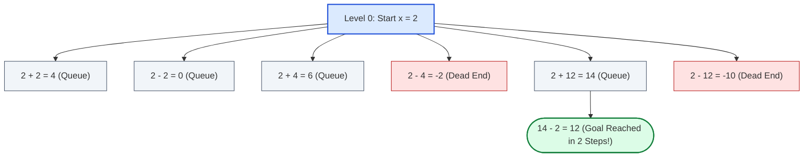

# Guided Example: Minimum Operations to Convert Number

We trace the step-by-step breadth-first state exploration and range-bounded operation transitions on a representative instance:

- **Input:** $\text{nums} = [2, 4, 12]$, $\text{start} = 2$, $\text{goal} = 12$
- **Expected Output:** $2$

---

## 1. Problem Overview & Representative Instance

We are given an array of distinct integers $\text{nums}$, an initial integer $\text{start} \in [0, 1000]$, and a target integer $\text{goal}$. In each operation, from current value $x$, we choose any number $\text{num} \in \text{nums}$ and replace $x$ with one of:
1. $x + \text{num}$
2. $x - \text{num}$
3. $x \oplus \text{num}$ (bitwise XOR)

### Boundary Rules
- Operations may **only** be performed while $x$ lies within the inclusive range $[0, 1000]$.
- An operation can produce an intermediate value outside $[0, 1000]$. If that value equals $\text{goal}$, the conversion is complete. However, if that out-of-range value does not equal $\text{goal}$, no subsequent operations may be initiated from it (it becomes a terminal dead end).

The objective is to find the **minimum number of operations** to convert $\text{start}$ to $\text{goal}$, or return $-1$ if $\text{goal}$ is unreachable.

In this representative instance:
- Level $0$: We start at $x = 2$.
- In $1$ step, we can generate values $\{4, 0, 6, -2, 14, -10\}$. None of these equals $\text{goal} = 12$.
- State $14$ is valid and within $[0, 1000]$.
- From $14$, choosing $\text{num} = 2$ and subtraction yields $14 - 2 = 12 = \text{goal}$ in exactly $2$ operations.

---

## 2. Theoretical Invariants & Implicit State Graph

The problem defines an implicit directed graph where:
1. **Expandable Vertex Set:**
   Only integers in $V = \{0, 1, \dots, 1000\}$ possess outgoing edges. There are exactly $1001$ expandable vertices.
2. **Terminal / Target Vertices:**
   Any integer $nx \notin [0, 1000]$ has an in-degree but strictly zero out-degree.
3. **Edge Weights:**
   Every transition corresponds to exactly one operation (unweighted graph with uniform edge weight $1$).

### BFS Shortest-Path Invariant
In an unweighted graph, Breadth-First Search (BFS) explores vertices in non-decreasing order of distance from the source:
$$\text{dist}(u) \le \text{dist}(v) \quad \text{if } u \text{ is dequeued before } v$$
Therefore:
- The very first time any generated value $nx$ equals $\text{goal}$, the corresponding path length $\text{step} + 1$ is guaranteed to be minimal.
- Memoizing visited states within $[0, 1000]$ using a boolean array of size $1001$ ensures each valid integer is enqueued at most once.

---

## 3. Step-by-Step State Execution Trace

### Phase 1: Expanding Level 0 ($x = 2$, Step $0$)
From $x = 2$, we apply all three operators with each of the three operands $\{2, 4, 12\}$:

| Operand | Operator | Formula | Result $nx$ | Equals `goal` ($12$)? | In Range $[0, 1000]$? | Action / State Update |
|---|---|---|---|---|---|---|
| $2$ | $+$ | $2 + 2$ | $4$ | No | Yes ($4 \in [0, 1000]$) | Enqueue $(4, 1)$, Mark visited |
| $2$ | $-$ | $2 - 2$ | $0$ | No | Yes ($0 \in [0, 1000]$) | Enqueue $(0, 1)$, Mark visited |
| $2$ | $\oplus$ | $2 \oplus 2$ | $0$ | No | Yes | Already visited, skip |
| $4$ | $+$ | $2 + 4$ | $6$ | No | Yes ($6 \in [0, 1000]$) | Enqueue $(6, 1)$, Mark visited |
| $4$ | $-$ | $2 - 4$ | $-2$ | No | No ($-2 < 0$) | Dead end: discard |
| $4$ | $\oplus$ | $2 \oplus 4$ | $6$ | No | Yes | Already visited, skip |
| $12$ | $+$ | $2 + 12$ | $14$ | No | Yes ($14 \in [0, 1000]$) | Enqueue $(14, 1)$, Mark visited |
| $12$ | $-$ | $2 - 12$ | $-10$ | No | No ($-10 < 0$) | Dead end: discard |
| $12$ | $\oplus$ | $2 \oplus 12$ | $14$ | No | Yes | Already visited, skip |

Frontier at distance $1$: Queue contains $[4, 0, 6, 14]$.

---

## 4. Phase 2: Expanding Level 1 Frontier to Reach Target

We process level 1 states until target discovery:

| Dequeued State $(x, \text{step})$ | Tested Operand | Operator | Next Value $nx$ | Equality Check $nx = \text{goal}$ ($12$) | Outcome |
|---|---|---|---|---|---|
| $(4, 1)$ | $2, 4, 12$ | $+,-,\oplus$ | Various $\ne 12$ | False | Add new valid states to queue |
| $(0, 1)$ | $2, 4, 12$ | $+,-,\oplus$ | Various $\ne 12$ | False | Add new valid states to queue |
| $(6, 1)$ | $2, 4, 12$ | $+,-,\oplus$ | Various $\ne 12$ | False | Add new valid states to queue |
| $(14, 1)$ | $2$ | $-$ | $14 - 2 = 12$ | **$12 = 12 \implies \text{True}$** | **Target Reached! Return $\text{step} + 1 = 2$** |

The search successfully terminates and outputs $2$.

---

## 5. Algorithmic Correctness & Soundness

1. **Shortest-Path Guarantee:**
   Because all operations cost exactly $1$, BFS processes all states at distance $d$ before any state at distance $d + 1$. Thus, the first time $\text{goal}$ is matched, no sequence of length $\le d$ could have reached it.
2. **Terminal Checking Precedence:**
   Testing $nx == \text{goal}$ **before** evaluating $0 \le nx \le 1000$ ensures that out-of-range targets (such as $\text{goal} = -4$ or $\text{goal} = 2000$) are correctly recognized as valid solutions upon arrival.
3. **Finite Search Space:**
   Only states in the finite range $[0, 1000]$ can be added to the queue. Because a visited array prevents re-enqueuing, the queue will process at most $1001$ unique states. If the queue empties without encountering $\text{goal}$, it is mathematically impossible to reach $\text{goal}$, and returning $-1$ is correct.

---

## 6. Edge Cases, Pitfalls & Structural Traps

- **Negative or Large Target Goals:**
  The input constraint states $\text{goal} \in [-10^9, 10^9]$. If an implementation checks $0 \le nx \le 1000$ before checking $nx == \text{goal}$, targets like $-4$ are discarded as invalid instead of being accepted.
- **Visited Array Sizing:**
  States outside $[0, 1000]$ must not be written to a fixed-size `visited` array (e.g. `vis[nx]`) without bounds checking, which would cause an index out-of-bounds error. Only valid intermediate states in $[0, 1000]$ are marked.
- **Bitwise XOR vs Arithmetic Precedence:**
  In many programming languages, arithmetic operators have higher precedence than bitwise XOR ($+$ before $\oplus$). Evaluating expressions explicitly or using parenthesized operations prevents precedence bugs.

---

## 7. Complexity Analysis

- **Time Complexity:** $\mathcal{O}(M \cdot |\text{nums}|)$ where $M = 1001$ is the size of the valid state range $[0, 1000]$ and $|\text{nums}| \le 1000$ is the number of available operands.
  Each state $x \in [0, 1000]$ is dequeued at most once. From each state, $3 \cdot |\text{nums}|$ transitions are evaluated in $\mathcal{O}(1)$ time. In the worst case, the algorithm performs at most $1001 \times 3000 \approx 3 \times 10^6$ operations, executing in well under 50 milliseconds.
- **Space Complexity:** $\mathcal{O}(M)$ where $M = 1001$.
  The boolean `visited` array and the BFS queue store at most $1001$ integer states simultaneously.
