# Guided Example: Check if an Original String Exists Given Two Encoded Strings

We trace the step-by-step state memoization, multi-digit parsing ambiguity, and balance-offset synchronization on a representative string decoding instance:

- **Input:** $s_1 = \text{"l123e"}$, $s_2 = \text{"44"}$
- **Expected Output:** $\text{true}$
- **Counter-Instance:** $s_1 = \text{"a5b"}$, $s_2 = \text{"c5b"}$ (Yields $\text{false}$ due to conflicting anchor characters)

---

## 1. Problem Overview & Representative Instance

An original lowercase English string can be encoded by deleting some non-empty substrings and replacing each deleted substring of length $k$ with the decimal digits of $k$.
Adjacent deleted substrings can produce concatenated runs of digits. For example, deleting a substring of length $1$, then length $2$, then length $3$ produces the string `"123"`. However, `"123"` could also represent a single deleted substring of length $123$, or lengths $12$ and $3$, or lengths $1$ and $23$.

Given two encoded strings $s_1$ and $s_2$, we must determine whether there exists **at least one common original string** that could have produced both encodings.

```mermaid
flowchart TD
    accTitle: Dual Encoding Alignment and Balance State
    accDescr: Alignment diagram comparing encodings s1 and s2 showing how wildcard lengths resolve to leetcode.
    subgraph S1["Encoding s1 = 'l123e'"]
        direction LR
        A1["'l' (1 char)"] --- A2["'1' (1 char)"] --- A3["'2' (2 chars)"] --- A4["'3' (3 chars)"] --- A5["'e' (1 char)"]
    end
    subgraph Common["Common Original String: 'leetcode' (Length 8)"]
        direction LR
        C1["l"] --- C2["e"] --- C3["e"] --- C4["t"] --- C5["c"] --- C6["o"] --- C7["d"] --- C8["e"]
    end
    subgraph S2["Encoding s2 = '44'"]
        direction LR
        B1["'4' (4 wildcard chars: 'leet')"] --- B2["'4' (4 wildcard chars: 'code')"]
    end

    classDef enc fill:#dbeafe,stroke:#1d4ed8,stroke-width:2px;
    classDef orig fill:#dcfce7,stroke:#15803d,stroke-width:2px;
    class A1,A2,A3,A4,A5,B1,B2 enc;
    class C1,C2,C3,C4,C5,C6,C7,C8 orig;
```

In the target pair $s_1 = \text{"l123e"}$ and $s_2 = \text{"44"}$:
- Both can represent the $8$-character string `"leetcode"`:
  - $s_1$: Literal `'l'` ($1$) + deleted `'e'` ($1$) + deleted `'et'` ($2$) + deleted `'cod'` ($3$) + literal `'e'` ($1$) $= 1 + 1 + 2 + 3 + 1 = 8$ chars.
  - $s_2$: Deleted `"leet"` ($4$) + deleted `"code"` ($4$) $= 4 + 4 = 8$ chars.
- Since both validly decode to `"leetcode"`, the output is $\text{true}$.

---

## 2. Theoretical Invariants & Balance State Formulation

Because wildcard digit lengths allow arbitrary characters, two characters need only match if both encodings explicitly specify a literal character at the exact same position. Otherwise, a wildcard segment from one encoding can absorb any literal character from the other.

### The Balance Parameter $\Delta$
We formulate the matching process as a dynamic programming state $(i, j, \Delta)$:
- $i \in [0, |s_1|]$: Current cursor index in $s_1$.
- $j \in [0, |s_2|]$: Current cursor index in $s_2$.
- $\Delta$: The **net length balance** of characters expanded by $s_1$ minus $s_2$.
  - $\Delta > 0$: $s_1$ has expanded by $\Delta$ more wildcard characters than $s_2$.
  - $\Delta < 0$: $s_2$ has expanded by $|\Delta|$ more wildcard characters than $s_1$.
  - $\Delta = 0$: Both encodings are currently aligned in length.

### State Transition Rules
1. **Digit Expansion in $s_1$:**
   If $s_1[i]$ is a digit, parse $1, 2,$ or $3$ consecutive digits into integer value $v$.
   Transition: $(i + \text{len}, j, \Delta + v)$.
2. **Digit Expansion in $s_2$:**
   If $s_2[j]$ is a digit, parse $1, 2,$ or $3$ consecutive digits into integer value $v$.
   Transition: $(i, j + \text{len}, \Delta - v)$.
3. **Literal Absorption by Wildcard:**
   - If $\Delta > 0$ and $s_2[j]$ is a letter: $s_1$'s excess wildcard covers $s_2[j]$.
     Transition: $(i, j + 1, \Delta - 1)$.
   - If $\Delta < 0$ and $s_1[i]$ is a letter: $s_2$'s excess wildcard covers $s_1[i]$.
     Transition: $(i + 1, j, \Delta + 1)$.
4. **Literal Comparison at Balance Zero ($\Delta = 0$):**
   If both $s_1[i]$ and $s_2[j]$ are letters:
   - If $s_1[i] \ne s_2[j]$, this branch fails immediately.
   - If $s_1[i] = s_2[j]$, both advance: $(i + 1, j + 1, 0)$.
5. **Termination & Acceptance:**
   The search succeeds when $i = |s_1|$, $j = |s_2|$, and $\Delta = 0$.

---

## 3. Ambiguous Digit Run Parsing

A contiguous digit sequence can be partitioned into multiple integers. For `"123"` in $s_1$:

| Partition Choice | Substring Tokens | Numerical Values | Total Wildcard Length Added to $\Delta$ |
|---|---|---|---|
| Single 3-digit number | `"123"` | $123$ | $+123$ |
| 1-digit + 2-digit number | `"1"`, `"23"` | $1, 23$ | $+1 + 23 = +24$ |
| 2-digit + 1-digit number | `"12"`, `"3"` | $12, 3$ | $+12 + 3 = +15$ |
| Three 1-digit numbers | `"1"`, `"2"`, `"3"` | $1, 2, 3$ | $+1 + 2 + 3 = +6$ |

The branching search systematically explores each candidate token length ($1, 2$, or $3$ digits) from index $i$.

---

## 4. Step-by-Step State Execution Trace

We trace the successful execution path for $s_1 = \text{"l123e"}$ and $s_2 = \text{"44"}$:

| Step | State $(i, j, \Delta)$ | Inspected $s_1[i]$ | Inspected $s_2[j]$ | Transition Action | Next State |
|---|---|---|---|---|---|
| 0 | $(0, 0, 0)$ | `'l'` | `'4'` | $s_2[0]$ is digit: parse value $4$ | $(0, 1, 0 - 4 = -4)$ |
| 1 | $(0, 1, -4)$ | `'l'` | `'4'` | $\Delta < 0$ and $s_1[0]$ is letter `'l'`: absorb `'l'` | $(1, 1, -4 + 1 = -3)$ |
| 2 | $(1, 1, -3)$ | `'1'` (digit) | `'4'` | $s_1[1]$ is digit: parse `'1'` (val $1$) | $(2, 1, -3 + 1 = -2)$ |
| 3 | $(2, 1, -2)$ | `'2'` (digit) | `'4'` | $s_1[2]$ is digit: parse `'2'` (val $2$) | $(3, 1, -2 + 2 = 0)$ |
| 4 | $(3, 1, 0)$ | `'3'` (digit) | `'4'` | $s_2[1]$ is digit: parse value $4$ | $(3, 2, 0 - 4 = -4)$ |
| 5 | $(3, 2, -4)$ | `'3'` (digit) | End of $s_2$ | $s_1[3]$ is digit: parse value $3$ | $(4, 2, -4 + 3 = -1)$ |
| 6 | $(4, 2, -1)$ | `'e'` | End of $s_2$ | $\Delta < 0$ and $s_1[4]$ is letter `'e'`: absorb `'e'` | $(5, 2, -1 + 1 = 0)$ |
| 7 | $(5, 2, 0)$ | End of $s_1$ | End of $s_2$ | $i = 5 = \lvert s_1 \rvert$, $j = 2 = \lvert s_2 \rvert$, $\Delta = 0$ | **Success! Return $\text{true}$** |

Every character and wildcard block aligns with net balance zero, confirming compatibility.

---

## 5. Algorithmic Correctness & Soundness

1. **Equivalence to String Existence:**
   Any valid original string corresponds to a common sequence of literal characters and wildcard gaps. Since wildcards can match arbitrary characters, two encodings are compatible if and only if their literal characters align whenever they overlap at the exact same index ($\Delta = 0$). The dynamic programming state $(i, j, \Delta)$ captures all necessary and sufficient information.
2. **Exhaustive Digit Partitioning:**
   Because consecutive digit runs never exceed $3$ characters, testing all prefixes of length $1, 2,$ and $3$ at each digit position explores every possible numerical decomposition without omission.
3. **Finite Bounded State Space:**
   Because string lengths are at most $40$ and numerical values parsed in one step are strictly below $1000$, $|\Delta| < 1000$. The total number of reachable states $(i, j, \Delta)$ is bounded by $40 \times 40 \times 2000 \approx 3.2 \times 10^6$. With memoization, each state is visited at most once, guaranteeing polynomial termination.

---

## 6. Edge Cases, Pitfalls & Structural Traps

- **Mismatched Literal Anchors:**
  In $s_1 = \text{"a5b"}$ and $s_2 = \text{"c5b"}$, at state $(0, 0, 0)$ both $s_1[0]$ and $s_2[0]$ are literal letters. Since $\Delta = 0$ and `'a' \ne 'c'`, the branch returns $\text{false}$ immediately.
- **Non-Zero Terminal Balance:**
  Reaching the ends of both strings ($i = |s_1|$ and $j = |s_2|$) is not sufficient if $\Delta \ne 0$. For example, if $s_1 = \text{"5"}$ and $s_2 = \text{"4"}$, $i = 1, j = 1$, but $\Delta = 1 \ne 0$, so they represent strings of different total lengths.
- **Greedy Digit Parsing:**
  Parsing `"123"` greedily as $123$ fails when the actual partition is $1 + 2 + 3$ or $12 + 3$. All digit substring lengths $\in \{1, 2, 3\}$ must be branched.

---

## 7. Complexity Analysis

- **Time Complexity:** $\mathcal{O}(|s_1| \cdot |s_2| \cdot \Delta_{\max})$.
  With $|s_1|, |s_2| \le 40$ and $\Delta_{\max} \le 1000$, the memoization table contains at most $\mathcal{O}(|s_1| \cdot |s_2| \cdot \Delta_{\max})$ distinct states. From each state, at most $3$ digit choices or $1$ character step are evaluated in $\mathcal{O}(1)$ time. In practice, only a tiny fraction of states are reachable, executing in under 100 milliseconds.
- **Space Complexity:** $\mathcal{O}(|s_1| \cdot |s_2| \cdot \Delta_{\max})$.
  The memoization cache stores boolean results for visited state triples $(i, j, \Delta)$, using bounded auxiliary memory.
