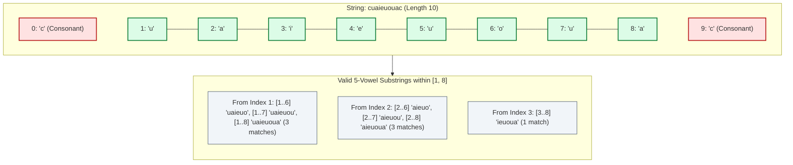

# Guided Example: Count Vowel Substrings of a String

We trace the step-by-step substring generation, vowel set cardinality monitoring, and consonant boundary pruning on a representative string instance:

- **Input:** $\text{word} = \text{"cuaieuouac"}$
- **Expected Output:** $7$
- **Minimal Example:** $\text{word} = \text{"aeiouu"}$ (Yields $2$ substrings: `"aeiou"` and `"aeiouu"`)

---

## 1. Problem Overview & Representative Instance

A substring is defined as a non-empty contiguous sequence of characters. A **vowel substring** must satisfy two strict conditions simultaneously:
1. **Exclusively Vowels:** Every character in the substring must belong to the vowel set $V = \{'a', 'e', 'i', 'o', 'u'\}$.
2. **All Five Vowels Present:** The distinct set of characters present in the substring must equal $V$ ($|V| = 5$).

We are given a lowercase English string $\text{word}$. The objective is to count the total number of vowel substrings across all possible index pairs $(i, j)$ with $i \le j$.

In the representative string $\text{word} = \text{"cuaieuouac"}$:
- The first character (index $0$, `'c'`) and last character (index $9$, `'c'`) are consonants.
- The entire inner segment spanning indices $1$ through $8$ (`"uaieuoua"`) consists solely of vowels.
- We search for all contiguous windows within indices $[1, 8]$ that contain all $5$ distinct vowels $\{a, e, i, o, u\}$.

---

## 2. Theoretical Invariants & Consonant Pruning

Let $V = \{'a', 'e', 'i', 'o', 'u'\}$ be the target set of vowels.

### Consonant Boundary Invariant
For any fixed start index $i$, we expand the right endpoint $j = i, i + 1, \dots$:
- If $\text{word}[j] \notin V$ (a consonant is encountered), then **every** longer substring starting at $i$ that extends to or beyond $j$ will also contain that consonant.
- Therefore, the inner scan can immediately **break** upon encountering the first consonant, pruning all remaining endpoints $k \ge j$ for that start index $i$.

### Monotonic Vowel Set Accumulation
As $j$ expands through valid vowels, the set of seen vowels $T$ evolves monotonically:
$$T_j = T_{j-1} \cup \{\text{word}[j]\}$$
- Because vowels are never removed as $j$ increases, $|T_j|$ is non-decreasing.
- Once $|T_j| = 5$, the condition is satisfied and contributes $1$ to the total count.
- Any further vowels appended to the right will preserve $|T| = 5$, meaning each subsequent vowel also forms a valid vowel substring until a consonant or end-of-string is reached.

---

## 3. Step-by-Step State Execution Trace

We iterate over each starting index $i \in [0, 9]$ and expand $j$:

| Start $i$ | End $j$ | Character $c = \text{word}[j]$ | Is Vowel? | Accumulated Vowel Set $T$ | Set Size $\lvert T \rvert$ | Valid Substring? ($\lvert T \rvert = 5$) | Action / Running Count |
|---|---|---|---|---|---|---|---|
| $0$ | $0$ | `'c'` | No | $\emptyset$ | $0$ | No | Consonant! Break immediately. (Count = 0) |
| $1$ | $1$ | `'u'` | Yes | $\{u\}$ | $1$ | No | Continue |
| $1$ | $2$ | `'a'` | Yes | $\{u, a\}$ | $2$ | No | Continue |
| $1$ | $3$ | `'i'` | Yes | $\{u, a, i\}$ | $3$ | No | Continue |
| $1$ | $4$ | `'e'` | Yes | $\{u, a, i, e\}$ | $4$ | No | Continue |
| $1$ | $5$ | `'u'` | Yes | $\{u, a, i, e\}$ | $4$ | No | Continue |
| $1$ | $6$ | `'o'` | Yes | $\{u, a, i, e, o\}$ | $5$ | **Yes** | Valid: `"uaieuo"`. Count $\leftarrow 1$ |
| $1$ | $7$ | `'u'` | Yes | $\{u, a, i, e, o\}$ | $5$ | **Yes** | Valid: `"uaieuou"`. Count $\leftarrow 2$ |
| $1$ | $8$ | `'a'` | Yes | $\{u, a, i, e, o\}$ | $5$ | **Yes** | Valid: `"uaieuoua"`. Count $\leftarrow 3$ |
| $1$ | $9$ | `'c'` | No | — | — | No | Consonant! Break. |
| $2$ | $2 \dots 5$ | `'a', 'i', 'e', 'u'` | Yes | $\{a, i, e, u\}$ | $4$ | No | Continue |
| $2$ | $6$ | `'o'` | Yes | $\{a, i, e, u, o\}$ | $5$ | **Yes** | Valid: `"aieuo"`. Count $\leftarrow 4$ |
| $2$ | $7$ | `'u'` | Yes | $\{a, i, e, u, o\}$ | $5$ | **Yes** | Valid: `"aieuou"`. Count $\leftarrow 5$ |
| $2$ | $8$ | `'a'` | Yes | $\{a, i, e, u, o\}$ | $5$ | **Yes** | Valid: `"aieuoua"`. Count $\leftarrow 6$ |
| $2$ | $9$ | `'c'` | No | — | — | No | Consonant! Break. |
| $3$ | $3 \dots 7$ | `'i', 'e', 'u', 'o'` | Yes | $\{i, e, u, o\}$ | $4$ | No | Missing `'a'`. Continue |
| $3$ | $8$ | `'a'` | Yes | $\{i, e, u, o, a\}$ | $5$ | **Yes** | Valid: `"ieuoua"`. Count $\leftarrow 7$ |
| $3$ | $9$ | `'c'` | No | — | — | No | Consonant! Break. |
| $4 \dots 8$ | $j \le 8$ | — | Yes | At most $4$ vowels | $\le 4$ | No | Cannot collect all 5 vowels before index 9. |
| $9$ | $9$ | `'c'` | No | — | — | No | Consonant! Break. |

Total count of valid vowel substrings is $7$.

---

## 4. Comprehensive Match Inventory

Below is the complete catalogue of all $7$ qualifying substrings:

| Match ID | Substring Span $[i, j]$ | Length | Substring Text | Distinct Vowels Contained |
|---|---|---|---|---|
| 1 | $[1, 6]$ | $6$ | `"uaieuo"` | $\{a, e, i, o, u\}$ |
| 2 | $[1, 7]$ | $7$ | `"uaieuou"` | $\{a, e, i, o, u\}$ |
| 3 | $[1, 8]$ | $8$ | `"uaieuoua"` | $\{a, e, i, o, u\}$ |
| 4 | $[2, 6]$ | $5$ | `"aieuo"` | $\{a, e, i, o, u\}$ |
| 5 | $[2, 7]$ | $6$ | `"aieuou"` | $\{a, e, i, o, u\}$ |
| 6 | $[2, 8]$ | $7$ | `"aieuoua"` | $\{a, e, i, o, u\}$ |
| 7 | $[3, 8]$ | $6$ | `"ieuoua"` | $\{a, e, i, o, u\}$ |

---

## 5. Algorithmic Correctness & Soundness

1. **Exhaustive Substring Coverage:**
   The outer loop fixes every possible starting index $i \in [0, n - 1]$. The inner loop extends $j \ge i$ sequentially. Since all possible pairs $(i, j)$ are either directly evaluated or soundly pruned by a consonant boundary, no valid vowel substring can be missed.
2. **Soundness of Consonant Break:**
   Any substring containing at least one non-vowel fails condition 1 by definition. Because appending characters to a substring containing a consonant preserves that consonant, terminating the inner loop upon encountering a consonant is completely lossless.
3. **Cardinality Condition:**
   Because all traversed characters are strictly in $\{a, e, i, o, u\}$, the condition $|T| = 5$ is mathematically equivalent to $T = \{a, e, i, o, u\}$.

---

## 6. Edge Cases, Pitfalls & Structural Traps

- **Strings Shorter than 5 Characters:**
  Any string with $n < 5$ cannot possibly contain all five distinct vowels. The algorithm naturally returns $0$ without special cases.
- **Strings with No Consonants:**
  If the entire string is vowels (e.g. `"aeiouu"`), the inner loop runs to the end of the string without breaking, correctly accumulating all $5$-vowel combinations.
- **Missing a Single Vowel:**
  In a word like `"unicornarihan"`, many substrings contain only vowels, but no contiguous segment contains all five (e.g. `'e'` is missing). The check $|T| = 5$ correctly filters out all 4-vowel prefixes.

---

## 7. Complexity Analysis

- **Time Complexity:** $\mathcal{O}(n^2)$ where $n$ is the length of $\text{word}$.
  There are $n$ possible start positions. For each start, the inner loop advances at most $n$ times, doing $\mathcal{O}(1)$ set operations (since the set has size at most $5$). For $n \le 100$, at most $100 \times 100 / 2 = 5000$ operations occur, executing in less than $1$ millisecond.
- **Space Complexity:** $\mathcal{O}(1)$.
  The vowel set $T$ stores at most $5$ distinct characters, requiring constant auxiliary memory.
