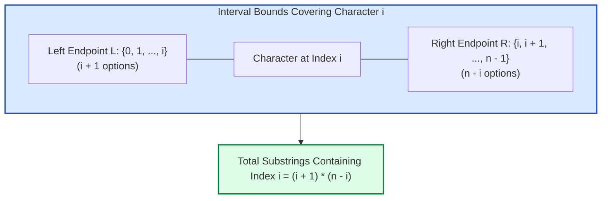

# Guided Example: Vowels of All Substrings

We trace the step-by-step combinatorial contribution counting and index-multiplication summation on a representative string instance:

- **Input:** $\text{word} = \text{"aba"}$
- **Expected Output:** $6$

---

## 1. Problem Overview & Representative Instance

Given a lowercase English string $\text{word}$ of length $n$, we are asked to find the total number of vowels (`'a'`, `'e'`, `'i'`, `'o'`, and `'u'`) appearing across **all** possible non-empty contiguous substrings of $\text{word}$. If a specific vowel character appears inside multiple distinct substrings, it contributes $1$ to each such substring.

In the string $\text{word} = \text{"aba"}$ with length $n = 3$:
- There are $\frac{3 \times 4}{2} = 6$ non-empty substrings:
  - `"a"` (index $[0, 0]$): contains $1$ vowel (`'a'`).
  - `"ab"` (index $[0, 1]$): contains $1$ vowel (`'a'`).
  - `"aba"` (index $[0, 2]$): contains $2$ vowels (`'a'`, `'a'`).
  - `"b"` (index $[1, 1]$): contains $0$ vowels.
  - `"ba"` (index $[1, 2]$): contains $1$ vowel (`'a'`).
  - `"a"` (index $[2, 2]$): contains $1$ vowel (`'a'`).
- Summing vowel counts: $1 + 1 + 2 + 0 + 1 + 1 = 6$.

---

## 2. Theoretical Invariants & The Contribution Principle

Enumerating all $\frac{n(n+1)}{2}$ substrings explicitly requires $\mathcal{O}(n^2)$ time, which is too slow for $n = 10^5$. Instead, we invert the counting perspective using the **Contribution Principle** (linearity of summation).

### Mathematical Inversion
Let $V = \{'a', 'e', 'i', 'o', 'u'\}$. Rather than counting how many vowels each substring contains:
$$\text{Total} = \sum_{\text{substring } S} \sum_{c \in S} \mathbf{1}_{c \in V}$$
we switch the order of summation to calculate how many substrings each vowel character at index $i$ belongs to:
$$\text{Total} = \sum_{i=0}^{n-1} \mathbf{1}_{\text{word}[i] \in V} \times (\text{number of substrings containing index } i)$$

### Bounding Index $i$
A contiguous substring $[L, R]$ contains index $i$ if and only if:
$$0 \le L \le i \quad \text{and} \quad i \le R \le n - 1$$
- The left boundary $L$ can be any index from $0$ up to $i$: exactly $i + 1$ independent choices.
- The right boundary $R$ can be any index from $i$ up to $n - 1$: exactly $n - i$ independent choices.

By the multiplication principle, the total number of substrings that contain index $i$ is precisely:
$$\text{count}(i) = (i + 1) \cdot (n - i)$$

---

## 3. Step-by-Step State Execution Trace

We scan the string $\text{word} = \text{"aba"}$ ($n = 3$) from index $i = 0$ to $2$:

| Index $i$ | Character $\text{word}[i]$ | Is Vowel? | Left Choices ($i + 1$) | Right Choices ($n - i$) | Substrings Containing $i$: $(i+1)(n-i)$ | Contribution to Total | Running Total |
|---|---|---|---|---|---|---|---|
| $0$ | `'a'` | **Yes** | $0 + 1 = 1$ | $3 - 0 = 3$ | $1 \times 3 = 3$ | $+3$ | $3$ |
| $1$ | `'b'` | No | $1 + 1 = 2$ | $3 - 1 = 2$ | $2 \times 2 = 4$ | $0$ (Consonant) | $3$ |
| $2$ | `'a'` | **Yes** | $2 + 1 = 3$ | $3 - 2 = 1$ | $3 \times 1 = 3$ | $+3$ | **$6$** |

Total accumulated sum is $6$.

---

## 4. Substring Verification & Cross-Check

To demonstrate that the contribution method accounts for every vowel occurrence without omission or duplication, we cross-reference each character's substrings against the manual inventory:

| Character Position | Substrings Containing This Specific Character | Count |
|---|---|---|
| Index $0$ (`'a'`) | `[0, 0]` (`"a"`), `[0, 1]` (`"ab"`), `[0, 2]` (`"aba"`) | $3$ |
| Index $1$ (`'b'`) | `[0, 1]` (`"ab"`), `[0, 2]` (`"aba"`), `[1, 1]` (`"b"`), `[1, 2]` (`"ba"`) | $4$ (Not counted) |
| Index $2$ (`'a'`) | `[0, 2]` (`"aba"`), `[1, 2]` (`"ba"`), `[2, 2]` (`"a"`) | $3$ |

Notice how the substring `"aba"` ($[0, 2]$) contains both index $0$ and index $2$. It correctly receives a contribution of $+1$ from index $0$ and $+1$ from index $2$, totaling $2$ vowels, exactly matching its actual vowel count.

---

## 5. Algorithmic Correctness & Soundness

1. **Exact Bijection of Summation:**
   The total vowel count across all substrings is formally defined as $\sum_{S} \sum_{i \in S} [c_i \in V]$. By interchanging the finite sums, this is algebraically identical to $\sum_{i: c_i \in V} \sum_{S: i \in S} 1 = \sum_{i: c_i \in V} (i + 1)(n - i)$. The two expressions are mathematically identical.
2. **Independence of Characters:**
   Every index $i$ is evaluated independently. A vowel's contribution depends solely on its position $i$ and string length $n$, regardless of whether adjacent characters are vowels or consonants.
3. **Completeness:**
   Every vowel at every position is processed exactly once in a single linear sweep, ensuring that no vowel occurrence in any substring is missed.

---

## 6. Edge Cases, Pitfalls & Structural Traps

- **Integer Overflow (32-bit vs 64-bit):**
  For $n = 10^5$, an all-vowel string (e.g. `"aaaa..."`) produces a sum of:
  $$\sum_{i=0}^{n-1} (i + 1)(n - i) = \frac{n(n + 1)(n + 2)}{6} \approx \frac{10^{15}}{6} \approx 1.66 \times 10^{14}$$
  This value far exceeds the 32-bit signed integer maximum ($2^{31} - 1 \approx 2.14 \times 10^9$). Using 64-bit integer arithmetic is required to prevent overflow.
- **No Vowels Present:**
  If the input contains no vowels (e.g. `word = "ltcd"`), the condition $\text{word}[i] \in V$ is never satisfied, and the sum correctly returns $0$.
- **Single Character String:**
  For $n = 1$, if `word = "a"`, $(0 + 1)(1 - 0) = 1$. If `word = "b"`, the result is $0$.

---

## 7. Complexity Analysis

- **Time Complexity:** $\mathcal{O}(n)$ where $n$ is the length of $\text{word}$.
  The algorithm iterates through the string of length $n$ exactly once. At each character, a set lookup in $V = \{'a', 'e', 'i', 'o', 'u'\}$ and two arithmetic operations are performed in $\mathcal{O}(1)$ time. Overall execution time is strictly linear in $n$.
- **Space Complexity:** $\mathcal{O}(1)$.
  Only a single accumulator variable is maintained during the iteration. No heap memory or dynamic data structures are allocated.
