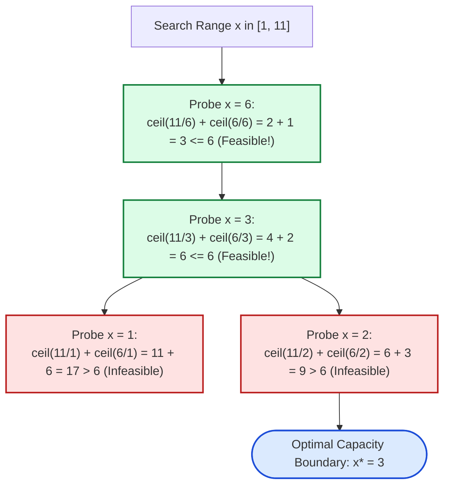

# Guided Example: Minimized Maximum of Products Distributed to Any Store

We trace the step-by-step monotonic predicate bisection and store-allocation ceiling division on a representative retail distribution instance:

- **Input:** $n = 6$, $\text{quantities} = [11, 6]$
- **Expected Output:** $3$

---

## 1. Problem Overview & Representative Instance

We are given $n$ specialty retail stores and $m$ product types with available amounts given by the array $\text{quantities}$. We must distribute all products to the stores adhering to two operational rules:
1. **Single-Product Constraint:** Each store may receive products of at most one type (stores cannot mix different product types). Stores may also receive zero products.
2. **Min-Max Goal:** If $x$ represents the maximum number of products assigned to any single store, we must determine the **minimum possible value** of $x$.

In the representative instance with $n = 6$ stores and products $[11, 6]$:
- If a store cannot hold more than $x = 2$ items:
  - Product type $0$ ($11$ items) requires $\lceil 11 / 2 \rceil = 6$ stores.
  - Product type $1$ ($6$ items) requires $\lceil 6 / 2 \rceil = 3$ stores.
  - Total stores needed = $6 + 3 = 9 > 6$ (impossible).
- If each store can hold up to $x = 3$ items:
  - Product type $0$ requires $\lceil 11 / 3 \rceil = 4$ stores (e.g. $[3, 3, 3, 2]$).
  - Product type $1$ requires $\lceil 6 / 3 \rceil = 2$ stores (e.g. $[3, 3]$).
  - Total stores needed = $4 + 2 = 6 \le 6$ (feasible!).
- The smallest feasible load capacity is $3$.

---

## 2. Theoretical Invariants & Monotonic Predicate Formulation

Because a store cannot stock multiple product types, each product type $i$ with count $q_i$ must be partitioned independently among some number of stores.

### Minimum Stores for Capacity $x$
To distribute $q_i$ items such that no store receives more than $x$ items, the minimum number of stores required for type $i$ is:
$$\text{stores}(q_i, x) = \left\lceil \frac{q_i}{x} \right\rceil = \left\lfloor \frac{q_i + x - 1}{x} \right\rfloor$$

Summing across all $m$ product types yields the total store demand function:
$$S(x) = \sum_{i=0}^{m-1} \left\lceil \frac{q_i}{x} \right\rceil$$

### Monotonicity & Bisection Invariant
For every $q_i$, $\lceil q_i / x \rceil$ is a monotonically non-increasing function of $x$. Consequently, their sum $S(x)$ is also monotonically non-increasing:
$$x_1 < x_2 \implies S(x_1) \ge S(x_2)$$

We define the feasibility predicate:
$$\text{Feasible}(x) \iff S(x) \le n$$
- If $\text{Feasible}(x)$ is true, then any capacity $x' > x$ is also feasible.
- If $\text{Feasible}(x)$ is false, then any capacity $x' < x$ is also infeasible.
This invariant guarantees that the solution space exhibits a binary transition from $\text{False}$ to $\text{True}$ at a unique threshold $x^* \in [1, \max_i q_i]$.

---

## 3. Step-by-Step Binary Search Execution Trace

We search for the minimal feasible $x$ within interval $[L, R] = [1, 11]$:

| Iteration | Search Interval $[L, R]$ | Midpoint Probe $M = \lfloor (L + R) / 2 \rfloor$ | Product 0 Stores $\lceil 11 / M \rceil$ | Product 1 Stores $\lceil 6 / M \rceil$ | Total Stores $S(M)$ | Feasible? ($S(M) \le 6$) | Boundary Update |
|---|---|---|---|---|---|---|---|
| 1 | $[1, 11]$ | $M = 6$ | $\lceil 11 / 6 \rceil = 2$ | $\lceil 6 / 6 \rceil = 1$ | $2 + 1 = 3$ | $3 \le 6$ (**True**) | $R \leftarrow 6$ |
| 2 | $[1, 6]$ | $M = 3$ | $\lceil 11 / 3 \rceil = 4$ | $\lceil 6 / 3 \rceil = 2$ | $4 + 2 = 6$ | $6 \le 6$ (**True**) | $R \leftarrow 3$ |
| 3 | $[1, 3]$ | $M = 2$ | $\lceil 11 / 2 \rceil = 6$ | $\lceil 6 / 2 \rceil = 3$ | $6 + 3 = 9$ | $9 \le 6$ (**False**) | $L \leftarrow 2 + 1 = 3$ |
| 4 | $[3, 3]$ | $M = 3$ | — | — | — | Interval converged | Terminate with $x = 3$ |

The binary search converges onto $x^* = 3$ in just 3 evaluation steps.

---

## 4. Store Allocation & Distribution Layout

Below is the concrete store assignment verifying that $x = 3$ satisfies all problem constraints:

| Store ID | Assigned Product Type | Distributed Item Count | Capacity Limit Checked ($\le 3$) |
|---|---|---|---|
| Store 1 | Type $0$ (11 items) | $3$ | $3 \le 3$ (Satisfied) |
| Store 2 | Type $0$ (11 items) | $3$ | $3 \le 3$ (Satisfied) |
| Store 3 | Type $0$ (11 items) | $3$ | $3 \le 3$ (Satisfied) |
| Store 4 | Type $0$ (11 items) | $2$ | $2 \le 3$ (Satisfied) |
| Store 5 | Type $1$ (6 items) | $3$ | $3 \le 3$ (Satisfied) |
| Store 6 | Type $1$ (6 items) | $3$ | $3 \le 3$ (Satisfied) |

Total stores utilized: $6$. Every store holds at most $3$ items.

---

## 5. Algorithmic Correctness & Soundness

1. **Minimality of Ceiling Division:**
   If a store can receive at most $x$ items of product type $i$, the maximum number of items $k$ stores can absorb is $k \cdot x$. To absorb all $q_i$ items, we must have $k \cdot x \ge q_i \implies k \ge \lceil q_i / x \rceil$. Thus $\lceil q_i / x \rceil$ is strictly the theoretical minimum number of stores necessary for that product.
2. **Exact Sufficiency:**
   Any total count $q_i$ can be partitioned into $\lceil q_i / x \rceil$ integers such that each integer is in $[1, x]$ (e.g. by setting $\lfloor q_i / x \rfloor$ stores to $x$ and the remaining store to $q_i \pmod x$). Thus the allocation is physically constructible whenever $S(x) \le n$.
3. **Optimality of Bisection:**
   Because $S(x)$ is monotonic, the first integer $x$ where $S(x) \le n$ is guaranteed to be the global minimum. No smaller integer can be feasible.

---

## 6. Edge Cases, Pitfalls & Structural Traps

- **Integer Division vs Ceiling:**
  In integer arithmetic, evaluating $q_i / x$ directly truncates toward zero ($11 / 3 = 3$), which undercounts stores ($3 \times 3 = 9 < 11$). The formula $(q_i + x - 1) // x$ correctly computes the mathematical ceiling without floating-point inaccuracies.
- **$n = m$ Lower Bound on Stores:**
  When $n = m$, each product type can receive exactly $1$ store. Therefore, the maximum capacity is constrained by the largest single product type: $x = \max_i q_i$.
- **Lower Bound $L = 1$:**
  Because stores must receive a positive integer capacity, the search range begins at $L = 1$, preventing division by zero.

---

## 7. Complexity Analysis

- **Time Complexity:** $\mathcal{O}(m \log (\max_i q_i))$ where $m$ is the number of product types and $\max_i q_i \le 10^5$ is the maximum quantity.
  Evaluating $S(x)$ takes $\mathcal{O}(m)$ time. The binary search operates over the interval $[1, 10^5]$, which requires $\lceil \log_2(10^5) \rceil \approx 17$ bisection iterations. Total runtime is at most $17 \times 10^5 \approx 1.7 \times 10^6$ operations, finishing in under 20 milliseconds.
- **Space Complexity:** $\mathcal{O}(1)$ auxiliary space since bisection only maintains loop boundary variables.