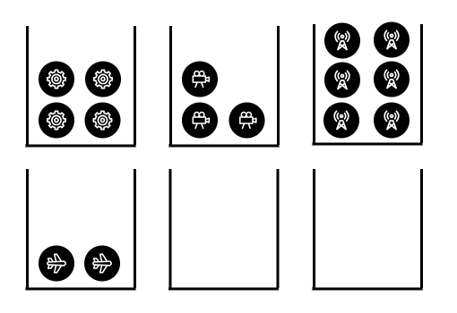
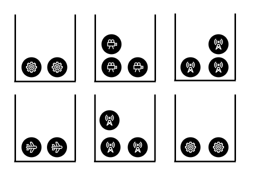

[TOC]

## Solution

---

### Overview

We are given an array `quantities` of length `m`, where $\text{quantities}[i]$ represents the number of products of the `i-th` type, and an integer `n` denotes the number of stores. Our task is to distribute the products among the stores such that each store only receives products of a single type, and we minimize the maximum number of products received by any store.

For example, consider $n = 6$ and $quantities = [4, 3, 6, 2]$. A simple distribution might assign each product type to a separate store, as shown in the following picture:



However, this leaves two stores unused, missing the opportunity to balance the load more effectively. A better strategy would be to distribute the products more evenly across all available stores as shown in the next picture, reducing the maximum number of products any store receives.



---

### Approach 1: Binary Search on The Answer

#### Intuition

To approach this problem, let’s first consider a slightly different question:

Given the parameters (`n` and `quantities`) and an additional integer $x$, can we determine if it's possible to distribute the products such that no store receives more than $x$ products?

A natural approach is to assign products to stores while avoiding overloading any single store. As we allocate products, we keep track of how many products of each type remain and how many stores are still available. If we can distribute all products without exceeding the limit at any store, we confirm that distribution is possible; otherwise, it is not.

Now, how does this help with our original problem?

We want to find the smallest $x$ for which such a valid distribution exists, ensuring no store gets more than $x$ products. Notice that for any $x \geq \max(\text{quantities}[i])$, the answer is trivially true because each store could handle just one type of product. A naive approach would be to linearly search for the smallest $x$ in the range $[0, \max(\text{quantities}[i])]$ where the distribution is valid. However, this would result in a time limit exceeded (TLE) error for larger inputs.

To optimize, we leverage the problem's monotonic property: if a distribution is possible for a certain $x$, it will be possible for any $x' > x$. Conversely, if it’s not possible for $x$, it won’t be for any $x' < x$. This allows us to apply Binary Search to efficiently find the smallest valid $x$.

#### Algorithm

-   Define a function `canDistribute`, which takes an integer `x`, the `quantities` array, and `n` as parameters and returns a boolean, indicating whether it’s possible to distribute the products such that no store receives more than `x` products.
-   Initialize a pointer to track the first product type that has not been fully distributed: $j = 0$
-   Initialize `remaining` to the quantity of the first product type.
-   Loop through each store with `i` from `0` to `n-1`:
-   Check if you can fully distribute to this store the remaining quantity of the `jth` product (`remaining` $\leq$ `x`):
-   If so:
-   Increment `j` to the next product type.
-   Check if all products have been distributed ($j = m$):
-   If so, return `true`.
-   Else, set $remaining = \text{quantities}[j]$.
-   Otherwise, distribute the maximum possible to the store, which is `x`, and reduce the remaining quantity of the `jth` type.
-   If the loop ends without having distributed all products, return `false`.
-   In the `minimizedMaximum` main function:
-   Initialize the boundaries of the binary search: $left = 0$ and $right = max(\text{quantities}[i])$.
-   While `left < right`:
-   Set $middle = (left + right) / 2$.
-   Check whether products can be distributed with no store receiving more than `middle` products, using the `canDistribute` function.
-   If this condition is `true`, set $right = middle$.
-   Otherwise, set $left = middle + 1$.
-   When the loop ends, $left = right$, so return `left`.

#### Implementation

```python
class Solution:
    def can_distribute(self, x: int, quantities: List[int], n: int) -> bool:
        # Pointer to the first not fully distributed product type
        j = 0
        # Remaining quantity of the jth product type
        remaining = quantities[j]

        # Loop through each store
        for i in range(n):
            # Check if the remaining quantity of the jth product type
            # can be fully distributed to the ith store
            if remaining <= x:
                # If yes, move the pointer to the next product type
                j += 1
                # Check if all products have been distributed
                if j == len(quantities):
                    return True
                else:
                    remaining = quantities[j]
            else:
                # Distribute the maximum possible quantity (x) to the ith store
                remaining -= x

        return False

    def minimizedMaximum(self, n: int, quantities: List[int]) -> int:
        # Initialize the boundaries of the binary search
        left = 0
        right = max(quantities)

        # Perform binary search until the boundaries converge
        while left < right:
            middle = (left + right) // 2
            if self.can_distribute(middle, quantities, n):
                # Try for a smaller maximum
                right = middle
            else:
                # Increase the minimum possible maximum
                left = middle + 1

        return left
```

#### Complexity Analysis

Let $k$ be the maximum value in the `quantities` array.

-   Time complexity: $O(nlogk)$

    The `canDistribute` function iterates through the `n` stores, executing constant-time operations during each iteration. As a result, its time complexity is $O(n)$.
    The main function, `minimizedMaximum`, performs a binary search over the range $(0, k)$, calling in each iteration the `canDistribute` function. Since the binary search runs in $O(logk)$ time, the overall time complexity of the `minimizedMaximum` function is $O(nlogk)$.

-   Space complexity: $O(1)$

    We only use a fixed number of integer variables, which doesn't depend on the input size.

    ###### Comments on space efficiency and in-place algorithms

    This problem illustrates why modifying input directly inside a helper function is not always appropriate. If we had altered the quantities array itself by decrementing the remaining quantity of each product type, rather than using the `remaining` variable, the algorithm would fail. This is because the binary search relies on the quantities array remaining unchanged throughout its execution.
    <br> One solution would be to pass the quantities array by **value** — essentially creating a copy of the array every time the `canDistribute` function is called. This could be done manually or by leveraging language-specific features. However, this approach would increase the overall space complexity to $O(n)$, due to the repeated copying of the array.
    <br>Instead, we avoid this overhead by recognizing that, in each iteration of the `canDistribute` function, we only need access to one element of the quantities array: the first product type that hasn’t been fully distributed yet. By storing this value in the `remaining` variable, we maintain constant space complexity, while ensuring that the algorithm works correctly without altering the original input.

---

### Approach 2: Greedy Approach Using a Heap

#### Intuition

The key idea of this approach is to assign stores to product types in an optimal way, rather than assigning products to stores. Initially, each product type is assigned one store, which is guaranteed by the constraint $m \leq n$. After this, we focus on which product types should receive additional stores. The algorithm greedily selects the product type `i` with the highest ratio of $\text{quantity}[i]$ to $\text{assigned}_{stores}[i]$, assigning the next available store to that product type.

Since we need to repeatedly access the product type with the highest ratio and update the ratios as stores are assigned, a priority queue (max-heap) is useful for efficiently managing these operations.

###### Proof of Correctness

Consider an arbitrary distribution of stores to products, represented as $[s_0, s_1, s_2, \dots, s_{m-1}]$, where $s_i$ denotes the number of stores assigned to the $i$-th product type. The specific indices of stores assigned or the order of assignment don’t affect the result.

To minimize the load on any single store, the products of type $i$ should be distributed as evenly as possible across its $s_i$ assigned stores. This ensures that each store handling products of type $i$ will have no more than $\left\lceil \frac{\text{quantities}\_i}{s_i} \right\rceil$ products.

Thus, our objective is to minimize the maximum number of products any store receives. The function should return:

$$
\begin{aligned}
    f(i) &= \max_{i \in [0, m-1]} \left\lceil \frac{\text{quantities}_i}{s_i} \right\rceil
\end{aligned}
$$

Now, consider the greedy approach: If at any point in the algorithm, we fail to assign the next available store to the product type with the highest ratio $\text{quantity}[i]$ to $\text{assigned}_{stores}[i]$, that ratio will remain the largest, leading to a non-optimal distribution. This would cause the highest ratio to dominate, violating our goal of minimizing the maximum number of products per store.

To gain a better understanding of the algorithm, let’s revisit our initial example with $n = 6$ and $quantities = [4, 3, 6, 2]$.

!?!../Documents/2064/2064_Approach2.json:960,540!?!

<br/>

#### Algorithm

-   Create an array of pairs, `typeStorePairsArray`, to store pairs of integers, where each pair represents the total quantity of a product type and the number of stores currently assigned to it. This array will help us initialize efficiently the priority queue.

-   Initialize a priority queue (max-heap) named `typeStorePairs`, using `typeStorePairsArray`, that sorts its elements by the ratio of their first to their second value.

-   Loop with `i` ranging from `0` to $n - m - 1$:

-   Pop the element with the highest ratio from the priority queue, denoted as $pairWithMaxRatio = [totalQuantityOfType, storesAssignedToType]$.
-   Push the element back into the heap, now assigning it an additional store: push `[totalQuantityOfType, storesAssignedToType + 1]`.

-   After the loop, pop the element with the highest ratio again, denoted as $pairWithMaxRatio = [totalQuantityOfType, storesAssignedToType]$.

-   Finally, return $ceil(totalQuantityOfType / storesAssignedToType)$.

#### Implementation

```python
class Solution:
    def minimizedMaximum(self, n, quantities):
        m = len(quantities)

        # Create a list of tuples (-ratio, quantity, stores_assigned)
        type_store_pairs = [(-q, q, 1) for q in quantities]

        # Use heapq.heapify() to convert the list into a heap in O(m) time
        heapq.heapify(type_store_pairs)

        # Iterate over the remaining n - m stores
        for _ in range(n - m):
            # Pop the element with the maximum ratio (due to negative sign it's min-heap)
            (
                neg_ratio,
                total_quantity_of_type,
                stores_assigned_to_type,
            ) = heapq.heappop(type_store_pairs)

            # Calculate the new ratio after assigning one more store
            new_stores_assigned_to_type = stores_assigned_to_type + 1
            new_ratio = total_quantity_of_type / new_stores_assigned_to_type

            # Push the updated pair back into the heap
            heapq.heappush(
                type_store_pairs,
                (
-new_ratio,
                    total_quantity_of_type,
                    new_stores_assigned_to_type,
                ),
            )

        # Pop the first element to get the final ratio
        _, total_quantity_of_type, stores_assigned_to_type = heapq.heappop(
            type_store_pairs
        )

        # Return the maximum minimum ratio
        return math.ceil(total_quantity_of_type / stores_assigned_to_type)
```

#### Complexity Analysis

-   Time complexity: $O(m + (n - m)logm)$

    We first iterate over the `quantities` array, pushing each value as the first element of a pair into the helper array. This operation takes $O(m)$ time.

    We then initialize a priority queue (heap) using the elements from the array. Building the heap takes $O(m)$ time because heapify is performed in linear time.

    After that, we enter a second loop that runs $n - m$ times. In each iteration, we perform one pop and one push operation on the priority queue. Both operations take $O(\log m)$ time, so this loop has a total time complexity of $O((n - m) \log m)$.

    Combining the time complexities of the initialization, heap construction, and store allocation, the overall time complexity of the algorithm is: $O(m + (n - m)logm)$.

-   Space complexity: $O(m)$

    The priority queue has a size of `m` since each value of the `quantities` array is inserted as the first element of exactly one `typeSortPair`.

---