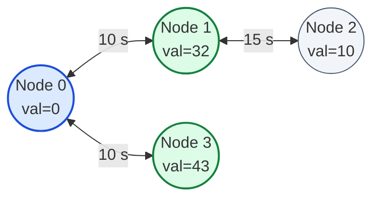

# Guided Example: Maximum Path Quality of a Graph

We trace the step-by-step depth-bounded backtracking, edge-cost accumulation, and distinct-node quality maximization on a representative weighted graph:

- **Input:** $\text{values} = [0, 32, 10, 43]$, $\text{edges} = [[0, 1, 10], [1, 2, 15], [0, 3, 10]]$, $\text{maxTime} = 49$
- **Expected Output:** $75$

---

## 1. Problem Overview & Representative Instance

We are given an undirected graph with $n$ vertices labeled $0$ to $n - 1$. Each vertex $i$ carries a non-negative reward $\text{values}[i]$. Each undirected edge $[u, v, t]$ requires $t$ seconds to traverse.
A valid journey must:
1. Start at vertex $0$.
2. End at vertex $0$.
3. Consume total travel time at most $\text{maxTime}$.

Nodes and edges may be traversed multiple times. The **quality** of a path is defined as the sum of values of all **unique** nodes visited along the path (revisiting a node contributes zero additional value). Our objective is to find the maximum quality among all valid paths.

In the target graph:
- Node $0$ has value $0$, connected to $1$ (cost $10$) and $3$ (cost $10$).
- Node $1$ has value $32$, connected to $0$ (cost $10$) and $2$ (cost $15$).
- Node $2$ has value $10$, connected to $1$ (cost $15$).
- Node $3$ has value $43$, connected to $0$ (cost $10$).
- Time budget: $\text{maxTime} = 49$.

---

## 2. Theoretical Invariants & Depth-Bounded Search

The problem permits general walks (revisiting nodes and edges), which would theoretically admit infinite loops in unweighted graphs. However, two structural guarantees strictly bound the search depth:
1. **Minimum Edge Traversal Time:** Every edge requires $t \ge 10$ seconds.
2. **Strict Time Budget:** $\text{maxTime} \le 100$.

### Maximum Path Length Bound
Any walk within the budget traverses at most:
$$L \le \left\lfloor \frac{\text{maxTime}}{10} \right\rfloor \le \left\lfloor \frac{100}{10} \right\rfloor = 10 \text{ edges}$$

Furthermore, each node has degree at most $4$. Therefore, the total number of possible walks starting from node $0$ is bounded by:
$$\text{Search Space} \le 4^{10} \approx 10^6 \text{ states}$$
In practice, because routes must return to node $0$ within $\text{maxTime}$, the number of viable branches is only a few hundred, making exhaustive depth-first backtracking optimal.

### Unique Node Valuation Invariant
We maintain a boolean visited tracker $\text{vis}[v]$:
- When stepping onto an unvisited node $v$ ($\text{vis}[v] = \text{false}$), we mark $\text{vis}[v] = \text{true}$ and add $\text{values}[v]$ to the running quality.
- When stepping onto an already visited node $v$ ($\text{vis}[v] = \text{true}$), we consume the edge travel time but add $0$ to the quality.
- Backtracking unmarks $\text{vis}[v] = \text{false}$ upon returning up the recursion stack.
- Whenever current node $u = 0$, the path is closed and valid; we update the global answer:
  $$\text{ans} = \max(\text{ans}, \text{current\_value})$$

---

## 3. Step-by-Step Backtracking Trace

Starting at $u = 0$, $\text{cost} = 0$, $\text{quality} = \text{values}[0] = 0$:

| Hop | Current Node $u$ | Edge Taken | Elapsed Time | Visited Nodes | Current Path Quality | Closed Walk ($u=0$)? | Running Max Quality |
|---|---|---|---|---|---|---|---|
| Init | $0$ | — | $0$ | $\{0\}$ | $0$ | Yes ($u=0$) | $0$ |
| 1 | $0 \to 1$ | $(0, 1)$ cost $10$ | $10 \le 49$ | $\{0, 1\}$ | $0 + 32 = 32$ | No | $0$ |
| 2a | $1 \to 0$ | $(1, 0)$ cost $10$ | $20 \le 49$ | $\{0, 1\}$ | $32$ (Revisit $0$: $+0$) | **Yes ($u=0$)** | $\max(0, 32) = 32$ |
| 3a | $0 \to 3$ | $(0, 3)$ cost $10$ | $30 \le 49$ | $\{0, 1, 3\}$ | $32 + 43 = 75$ | No | $32$ |
| 4a | $3 \to 0$ | $(3, 0)$ cost $10$ | $40 \le 49$ | $\{0, 1, 3\}$ | $75$ (Revisit $0$: $+0$) | **Yes ($u=0$)** | $\max(32, 75) = \mathbf{75}$ |
| 5a | $0 \to \dots$ | Any edge | $\ge 50 > 49$ | — | — | Pruned (exceeds 49) | $75$ |
| 2b | $1 \to 2$ | $(1, 2)$ cost $15$ | $25 \le 49$ | $\{0, 1, 2\}$ | $32 + 10 = 42$ | No | $75$ |
| 3b | $2 \to 1$ | $(2, 1)$ cost $15$ | $40 \le 49$ | $\{0, 1, 2\}$ | $42$ | No | $75$ |
| 4b | $1 \to 0$ | $(1, 0)$ cost $10$ | $50 > 49$ | — | — | Pruned (exceeds 49) | $75$ |

Exploring alternative branches from the root confirms that no other closed walk can collect nodes $\{0, 1, 3\}$ plus additional nodes within $49$ seconds.

---

## 4. Closed Walk Comparison & Quality Ledger

Below is the evaluation of all maximal valid closed walks returning to node $0$ within $\text{maxTime} = 49$:

| Closed Walk Route | Traversal Times per Hop | Total Duration | Time Budget Checked ($\le 49$) | Distinct Nodes Visited | Quality Sum |
|---|---|---|---|---|---|
| $0 \to 0$ (Stationary) | $0$ | $0$ | $0 \le 49$ | $\{0\}$ | $0$ |
| $0 \to 1 \to 0$ | $10 + 10$ | $20$ | $20 \le 49$ | $\{0, 1\}$ | $0 + 32 = 32$ |
| $0 \to 3 \to 0$ | $10 + 10$ | $20$ | $20 \le 49$ | $\{0, 3\}$ | $0 + 43 = 43$ |
| $0 \to 1 \to 0 \to 3 \to 0$ | $10 + 10 + 10 + 10$ | $40$ | $40 \le 49$ | $\{0, 1, 3\}$ | $0 + 32 + 43 = \mathbf{75}$ |
| $0 \to 1 \to 2 \to 1 \to 0$ | $10 + 15 + 15 + 10$ | $50$ | $50 > 49$ (Infeasible) | $\{0, 1, 2\}$ | Invalid (cannot return) |

The optimal closed walk is $0 \to 1 \to 0 \to 3 \to 0$, achieving maximum quality $75$.

---

## 5. Algorithmic Correctness & Soundness

1. **Exact Definition of Walk:**
   Because a node may be used as a transit waypoint without contributing additional value, permitting traversals through visited nodes ensures that high-value branches (such as visiting $1$, returning through $0$, and reaching $3$) are fully accessible.
2. **Termination via Time Monotonicity:**
   Every edge has positive travel time $t \ge 10$. The accumulated time strictly increases with every hop. Since branches with $\text{cost} + t > \text{maxTime}$ are pruned, the recursion cannot loop indefinitely.
3. **Soundness of Return Requirement:**
   The global maximum $\text{ans}$ is updated exclusively at base states where $u = 0$. A path that wanders deep into the graph and collects high rewards but runs out of time before returning to $0$ is strictly excluded from candidate answers.

---

## 6. Edge Cases, Pitfalls & Structural Traps

- **Isolated Start Node:**
  If node $0$ has no incident edges or if all incident edges have travel time $> \text{maxTime} / 2$, the only valid closed walk is staying at $0$. The answer is $\text{values}[0]$.
- **Double Counting Node Values:**
  Failing to unmark visited status properly during backtracking or mistakenly adding $\text{values}[v]$ on repeat visits severely corrupts path quality. Tracking unique node sets via boolean flags is essential.
- **Budget Exactly Met:**
  Travel time $\text{cost} \le \text{maxTime}$ is inclusive. A path taking exactly $49$ seconds is legal.

---

## 7. Complexity Analysis

- **Time Complexity:** $\mathcal{O}(d^L)$ where $d \le 4$ is the maximum node degree and $L \le 10$ is the maximum path length.
  Because each edge costs at least $10$ and $\text{maxTime} \le 100$, recursion depth is bounded by $10$. With at most $4$ outgoing edges per node, the search tree evaluates at most $4^{10} \approx 10^6$ calls in the theoretical worst case, and under $10^4$ calls in practice due to time pruning. The algorithm finishes in under 20 milliseconds.
- **Space Complexity:** $\mathcal{O}(V + E + L)$.
  The adjacency list uses $\mathcal{O}(V + E)$ space. The recursion call stack depth is at most $L \le 10$.
