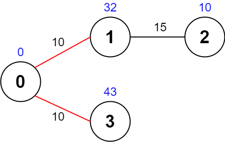
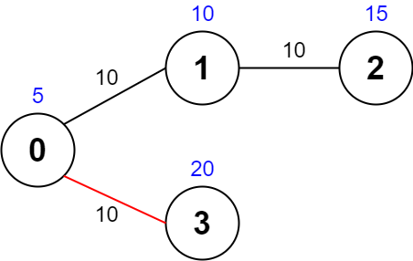
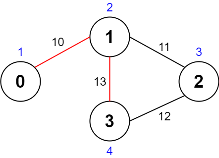

### 1. Description

There is an **undirected** graph with `n` nodes numbered from `0` to $n - 1$ (**inclusive**). You are given a **0-indexed** integer array `values` where $\text{values}[i]$ is the **value **of the $i^{\text{th}}$ node. You are also given a **0-indexed** 2D integer array `edges`, where each $\text{edges}[j] = [u_{j}, v_{j}, \text{time}_{j}]$ indicates that there is an undirected edge between the nodes $u_{j}$ and $v_{j}$,_ and it takes $\text{time}_{j}$ seconds to travel between the two nodes. Finally, you are given an integer `maxTime`.

A **valid** **path** in the graph is any path that starts at node `0`, ends at node `0`, and takes **at most** `maxTime` seconds to complete. You may visit the same node multiple times. The **quality** of a valid path is the **sum** of the values of the **unique nodes** visited in the path (each node's value is added **at most once** to the sum).

Return *the **maximum** quality of a valid path*.

### 2. Function Contract

**Inputs**

- `values`: Input parameter (`List[int]`).
- `edges`: Input parameter (`List[List[int]]`).
- `maxTime`: Input parameter (`int`).

**Return value**

- Returns `int`.

### 3. Note

There are **at most four** edges connected to each node.

### 4. Examples

#### Example 1

- **Input:** $values = [0,32,10,43], edges = [[0,1,10],[1,2,15],[0,3,10]], maxTime = 49$
- **Output:** `75`
- **Explanation:** One possible path is 0 -> 1 -> 0 -> 3 -> 0. The total time taken is 10 + 10 + 10 + 10 = 40 <= 49.
The nodes visited are 0, 1, and 3, giving a maximal path quality of 0 + 32 + 43 = 75.

#### Example 2

- **Input:** $values = [5,10,15,20], edges = [[0,1,10],[1,2,10],[0,3,10]], maxTime = 30$
- **Output:** `25`
- **Explanation:** One possible path is 0 -> 3 -> 0. The total time taken is 10 + 10 = 20 <= 30.
The nodes visited are 0 and 3, giving a maximal path quality of 5 + 20 = 25.

#### Example 3

- **Input:** $values = [1,2,3,4], edges = [[0,1,10],[1,2,11],[2,3,12],[1,3,13]], maxTime = 50$
- **Output:** `7`
- **Explanation:** One possible path is 0 -> 1 -> 3 -> 1 -> 0. The total time taken is 10 + 13 + 13 + 10 = 46 <= 50.
The nodes visited are 0, 1, and 3, giving a maximal path quality of 1 + 2 + 4 = 7.

### 5. Constraints

- $n = \text{values.length}$

- $1 \le n \le 1000$

- $0 \le \text{values}[i] \le 10^{8}$

- $0 \le \text{edges.length} \le 2000$

- $\text{edges}[j].length = 3$

- $0 \le u_{j} < v_{j} \le n - 1$

- $10 \le \text{time}_{j}, maxTime \le 100$

- All the pairs $[u_{j}, v_{j}]$ are **unique**.

- There are **at most four** edges connected to each node.

- The graph may not be connected.
