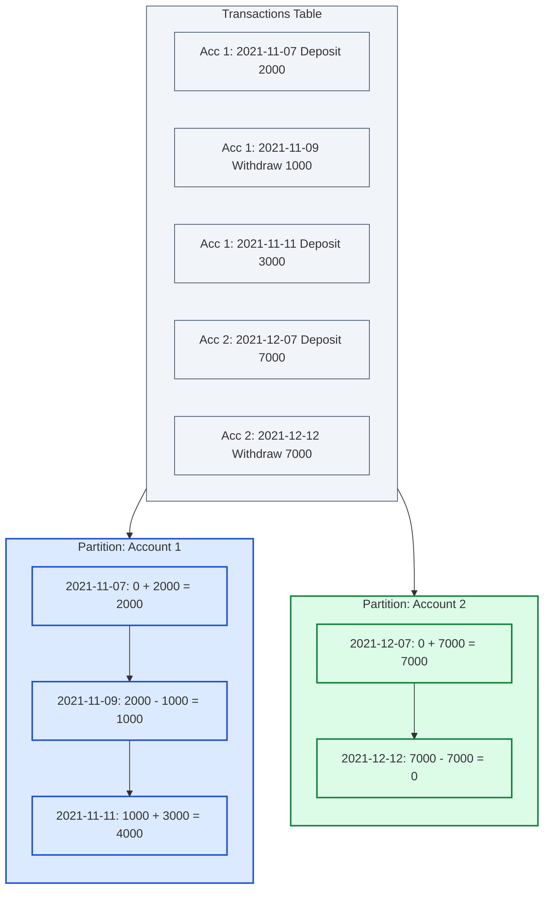

# Guided Example: Account Balance

We trace the step-by-step signed delta mapping, partition isolation, and cumulative window aggregation on a representative bank transaction dataset:

- **Input:** Relational table `Transactions` with accounts $1$ and $2$
- **Expected Output:** Historical ledger of account balances immediately following each transaction

---

## 1. Problem Overview & Representative Instance

We are given a database table `Transactions` recording the banking activity of various accounts:
- `account_id`: The identifier of the account.
- `day`: The date of the transaction. The pair `(account_id, day)` is guaranteed to be unique.
- `type`: Either `'Deposit'` or `'Withdraw'`.
- `amount`: The positive monetary value of the transaction.

### Business Rules
- Every account starts with an initial balance of $0$ prior to its first transaction.
- A `'Deposit'` increases the balance by $\text{amount}$.
- A `'Withdraw'` decreases the balance by $\text{amount}$.
- The data guarantees that balances never drop below zero.
- We must output `account_id`, `day`, and the resulting `balance` immediately after each transaction, sorted in ascending order by `account_id`, then by `day`.

### Representative Dataset
**Table: `Transactions`**
| `account_id` | `day` | `type` | `amount` |
|---|---|---|---|
| $1$ | 2021-11-07 | Deposit | $2000$ |
| $1$ | 2021-11-09 | Withdraw | $1000$ |
| $1$ | 2021-11-11 | Deposit | $3000$ |
| $2$ | 2021-12-07 | Deposit | $7000$ |
| $2$ | 2021-12-12 | Withdraw | $7000$ |

---

## 2. Theoretical Invariants & Window Function Mechanics

To calculate a running balance in a relational database without expensive recursive queries or quadratic self-joins, we utilize the SQL window function $\text{SUM}(\dots) \ \text{OVER} \ (\dots)$.

### 1. Signed Value Transformation Invariant
A transaction's net impact $\Delta$ on the account balance is determined by its type:
$$\Delta = \begin{cases} +\text{amount} & \text{if } \text{type} = \text{'Deposit'} \\ -\text{amount} & \text{if } \text{type} = \text{'Withdraw'} \end{cases}$$
In SQL, this is mapped via a `CASE` expression:
$$\text{CASE WHEN type} = \text{'Deposit' THEN amount ELSE} -\text{amount END}$$

### 2. Independent Account Isolation
The clause `PARTITION BY account_id` divides the table into independent evaluation partitions. Calculations for Account 1 are isolated from Account 2, ensuring that deposits in Account 2 do not affect the running total of Account 1.

### 3. Chronological Cumulative Sum Invariant
Within each partition, rows are ordered chronologically by `ORDER BY day`. The default window frame specification for an ordered aggregate is:
$$\text{ROWS BETWEEN UNBOUNDED PRECEDING AND CURRENT ROW}$$
For row $k$ within the account partition, the window function computes:
$$\text{balance}_k = \sum_{j=1}^k \Delta_j$$
Since the baseline balance is $0$, $\text{balance}_k$ represents the exact account balance immediately following transaction $k$.

---

## 3. Step-by-Step State Execution Trace

We trace the signed delta mapping and cumulative summation for each transaction row:

| Row | `account_id` | `day` | Transaction `type` | `amount` | Signed Delta $\Delta$ | Partition Window Calculation | Running `balance` |
|---|---|---|---|---|---|---|---|
| 1 | $1$ | 2021-11-07 | Deposit | $2000$ | $+2000$ | $0 + 2000$ | **$2000$** |
| 2 | $1$ | 2021-11-09 | Withdraw | $1000$ | $-1000$ | $2000 + (-1000)$ | **$1000$** |
| 3 | $1$ | 2021-11-11 | Deposit | $3000$ | $+3000$ | $1000 + 3000$ | **$4000$** |
| 4 | $2$ | 2021-12-07 | Deposit | $7000$ | $+7000$ | Base of Partition 2: $0 + 7000$ | **$7000$** |
| 5 | $2$ | 2021-12-12 | Withdraw | $7000$ | $-7000$ | $7000 + (-7000)$ | **$0$** |

---

## 4. Final Output Ledger

The query outputs the records ordered by `account_id ASC, day ASC`:

| `account_id` | `day` | `balance` |
|---|---|---|
| $1$ | 2021-11-07 | $2000$ |
| $1$ | 2021-11-09 | $1000$ |
| $1$ | 2021-11-11 | $4000$ |
| $2$ | 2021-12-07 | $7000$ |
| $2$ | 2021-12-12 | $0$ |

Each balance accurately reflects the historical running total of its respective account.

---

## 5. Algorithmic Correctness & Soundness

1. **Partition Isolation:**
   Window partitioning strictly segregates calculation contexts by key. Even if Account 1 and Account 2 share transactions on the same calendar day, `PARTITION BY account_id` guarantees that neither account leaks balance increments into the other.
2. **Determinism of Chronological Sorting:**
   Because `(account_id, day)` is a unique primary key candidate, each date within an account partition is distinct. There are no tie-breaking ambiguities, guaranteeing a deterministic evaluation order.
3. **Equivalence of Prefix Sum to Running Balance:**
   Because accounts start at balance $0$ and deposits/withdrawals strictly correspond to additions and subtractions of positive integer quantities, the prefix sum of signed changes $\sum_{j \le k} \Delta_j$ is formally equivalent to the ledger balance at step $k$.

---

## 6. Edge Cases, Pitfalls & Structural Traps

- **Omitting `PARTITION BY`:**
  Writing `SUM(...) OVER (ORDER BY day)` without `PARTITION BY account_id` computes a global cumulative total across all accounts mixed together, corrupting per-account balances.
- **Self-Join Performance Pitfall:**
  Solving running totals via non-equi self-joins (`T1.day >= T2.day`) incurs quadratic $\mathcal{O}(R^2)$ complexity and redundant row duplication. Window functions stream rows in a single pass of $\mathcal{O}(R \log R)$ time.
- **Zero Balance Transitions:**
  When a withdrawal equals the existing balance (such as Account 2 withdrawing $7000$ from $7000$), the balance drops to exactly $0$. The logic must handle $0$ cleanly without filtering out the row.

---

## 7. Complexity Analysis

- **Time Complexity:** $\mathcal{O}(R \log R)$ where $R$ is the number of rows in `Transactions`.
  The query requires sorting the $R$ records by `(account_id, day)` to establish the window partition frames and the final query output order. Once sorted, the cumulative prefix sum is evaluated in a single sequential pass of $\mathcal{O}(R)$ time.
- **Space Complexity:** $\mathcal{O}(R)$ auxiliary space used by the relational engine to maintain the sort buffer and window accumulator states.
