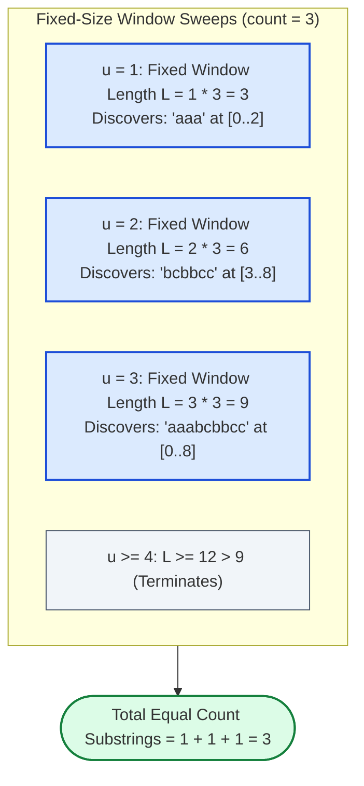

# Guided Example: Number of Equal Count Substrings

We trace the step-by-step alphabet-partitioned fixed-window sliding technique and frequency-match counting on a representative string instance:

- **Input:** $s = \text{"aaabcbbcc"}$, $\text{count} = 3$
- **Expected Output:** $3$

---

## 1. Problem Overview & Representative Instance

Given a lowercase English string $s$ and a positive integer $\text{count}$, an **equal count substring** is defined as a contiguous substring in which **every distinct character present** appears **exactly $\text{count}$ times**. Characters that do not appear in the substring impose no restrictions.

Our goal is to return the total number of index ranges $[l, r]$ that form equal count substrings.

In the string $s = \text{"aaabcbbcc"}$ ($n = 9$) with $\text{count} = 3$:
- For $u = 1$ unique character, substring length must be $1 \times 3 = 3$:
  - $s[0 \dots 2] = \text{"aaa"}$ has character `'a'` with frequency $3$. (Match 1)
- For $u = 2$ unique characters, substring length must be $2 \times 3 = 6$:
  - $s[3 \dots 8] = \text{"bcbbcc"}$ has `'b'` with frequency $3$ and `'c'` with frequency $3$. (Match 2)
- For $u = 3$ unique characters, substring length must be $3 \times 3 = 9$:
  - $s[0 \dots 8] = \text{"aaabcbbcc"}$ has `'a'`: $3$, `'b'`: $3$, `'c'`: $3$. (Match 3)
- Total equal count substrings = $3$.

---

## 2. Theoretical Invariants & Fixed Window Decomposition

A standard variable-length two-pointer window cannot be used because having every present character appear exactly $\text{count}$ times is **non-monotonic**: adding or removing a character can transition the window back and forth between valid and invalid arbitrarily.

### Structural Length Invariant
Suppose an equal count substring contains exactly $u$ distinct character types.
- Because each of the $u$ characters must appear exactly $\text{count}$ times, the total length of the substring is strictly constrained:
  $$L = u \cdot \text{count}$$
- Because the input alphabet contains only lowercase English letters, the number of distinct characters is bounded:
  $$u \in \{1, 2, \dots, 26\}$$
- This reduces the problem from evaluating arbitrary subsegments to running at most $26$ independent **fixed-size sliding window** passes, each with window length $L = u \cdot \text{count}$.

### Exact Qualification Invariant
During a sweep with fixed window length $L = u \cdot \text{count}$, we maintain:
- $\text{freq}[c]$: the occurrence count of character $c$ in the current window.
- $t$: the number of distinct characters in the current window whose frequency is **strictly equal to $\text{count}$**.

If $t = u$, then:
$$\sum_{c: \text{freq}[c] = \text{count}} \text{freq}[c] = u \cdot \text{count} = L$$
Because these $u$ characters account for the entire length $L$ of the window, no other characters can possibly be present in the window.
Therefore:
$$t = u \iff \text{The current window is an equal count substring}$$

---

## 3. Step-by-Step Sliding Window Traces

### Sweep 1: Single Unique Character ($u = 1$, Window Length $L = 3$)
We slide a window of size $3$ across $s = \text{"aaabcbbcc"}$:

| Window Span $[j-2, j]$ | Window Content | Character Frequencies in Window | Valid Count Tracker $t$ | Qualification ($t = 1$) | Match Count |
|---|---|---|---|---|---|
| $[0, 2]$ | `"aaa"` | `'a'`: $3$ | $t = 1$ (`'a'`) | **True** | $+1$ |
| $[1, 3]$ | `"aab"` | `'a'`: $2$, `'b'`: $1$ | $t = 0$ | False | $+0$ |
| $[2, 4]$ | `"abc"` | `'a'`: $1$, `'b'`: $1$, `'c'`: $1$ | $t = 0$ | False | $+0$ |
| $[3, 5]$ | `"bcb"` | `'b'`: $2$, `'c'`: $1$ | $t = 0$ | False | $+0$ |
| $[4, 6]$ | `"cbb"` | `'c'`: $1$, `'b'`: $2$ | $t = 0$ | False | $+0$ |
| $[5, 7]$ | `"bbc"` | `'b'`: $2$, `'c'`: $1$ | $t = 0$ | False | $+0$ |
| $[6, 8]$ | `"bcc"` | `'b'`: $1$, `'c'`: $2$ | $t = 0$ | False | $+0$ |

Total for $u = 1$: $1$ match (`"aaa"`).

---

### Sweep 2: Two Unique Characters ($u = 2$, Window Length $L = 6$)
We slide a window of size $6$ across $s$:

| Window Span $[j-5, j]$ | Window Content | Character Frequencies in Window | Characters with $\text{freq} = 3$ | Valid Count $t$ | Qualification ($t = 2$) |
|---|---|---|---|---|---|
| $[0, 5]$ | `"aaabcb"` | `'a'`: $3$, `'b'`: $2$, `'c'`: $1$ | `'a'` | $t = 1$ | False ($1 \ne 2$) |
| $[1, 6]$ | `"aabcbb"` | `'a'`: $2$, `'b'`: $3$, `'c'`: $1$ | `'b'` | $t = 1$ | False ($1 \ne 2$) |
| $[2, 7]$ | `"abcbbc"` | `'a'`: $1$, `'b'`: $3$, `'c'`: $2$ | `'b'` | $t = 1$ | False ($1 \ne 2$) |
| $[3, 8]$ | `"bcbbcc"` | `'b'`: $3$, `'c'`: $3$ | `'b'`, `'c'` | $t = 2$ | **True ($2 = 2$)** |

Total for $u = 2$: $1$ match (`"bcbbcc"`).

---

### Sweep 3: Three Unique Characters ($u = 3$, Window Length $L = 9$)
There is only one window of length $9$:
- Span $[0, 8]$: `"aaabcbbcc"`
- Frequencies: `'a'`: $3$, `'b'`: $3$, `'c'`: $3$.
- Characters with frequency $3$: $\{'a', 'b', 'c'\} \implies t = 3$.
- Qualification: $t = u \implies 3 = 3$ (**True**).
- Total for $u = 3$: $1$ match.

Any $u \ge 4$ requires length $L \ge 4 \times 3 = 12 > 9$, terminating the search.
Grand Total: $1 + 1 + 1 = 3$.

---

## 4. State Summary Across All Feasible $u$

| Parameter $u$ | Window Length $L = u \cdot \text{count}$ | Total Windows Tested | Valid Windows Found | Matching Substrings |
|---|---|---|---|---|
| $u = 1$ | $3$ | $7$ | $1$ | `s[0..2]` (`"aaa"`) |
| $u = 2$ | $6$ | $4$ | $1$ | `s[3..8]` (`"bcbbcc"`) |
| $u = 3$ | $9$ | $1$ | $1$ | `s[0..8]` (`"aaabcbbcc"`) |
| $u \ge 4$ | $\ge 12$ | $0$ (Exceeds $n = 9$) | $0$ | None |

---

## 5. Algorithmic Correctness & Soundness

1. **Partition Exhaustiveness:**
   Any valid equal count substring must have some integer number of distinct characters $u \in [1, 26]$. Because each distinct character occurs exactly $\text{count}$ times, its length is strictly $u \cdot \text{count}$. Iterating $u$ from $1$ to $26$ evaluates all possible candidate lengths exhaustively.
2. **Pigeonhole Sufficiency:**
   If a window of length $u \cdot \text{count}$ contains $t = u$ distinct characters that each have frequency $\text{count}$, their combined frequency is $u \cdot \text{count}$. By the pigeonhole principle, no remaining characters can exist in the window. Thus, testing $t = u$ guarantees both conditions (every present character has count $\text{count}$, and exactly $u$ characters are present).
3. **$\mathcal{O}(1)$ Window Updates:**
   Adding an incoming character and evicting an outgoing character adjusts frequency counts and updates $t$ in $\mathcal{O}(1)$ operations, ensuring that each of the $26$ passes executes in strictly linear time.

---

## 6. Edge Cases, Pitfalls & Structural Traps

- **$\text{count} > n$:**
  If $\text{count} > |s|$, even $u = 1$ yields $L > n$. The loop breaks immediately at $u = 1$, correctly returning $0$.
- **Variable-Window Assumption:**
  Treating this as a standard two-pointer window where left contracts whenever a count exceeds $\text{count}$ fails because intermediate substrings may be invalid while a larger superset is valid. Fixed-size windows avoid this trap entirely.
- **Accurate $t$ Delta Tracking:**
  When $\text{freq}[c]$ increments:
  - If it becomes $\text{count}$, $t$ increments by $1$.
  - If it becomes $\text{count} + 1$, $t$ decrements by $1$.
  Symmetric logic applies when evicting characters, maintaining $t$ correctly in $\mathcal{O}(1)$ time.

---

## 7. Complexity Analysis

- **Time Complexity:** $\mathcal{O}(|\Sigma| \cdot n)$ where $|\Sigma| = 26$ is the lowercase alphabet size and $n$ is the length of string $s$.
  At most $26$ fixed-window passes are performed. Each pass slides a window across $n$ characters, updating frequencies and $t$ in $\mathcal{O}(1)$ time. Total operations are bounded by $26 \times 30,000 \approx 7.8 \times 10^5$, executing in under 15 milliseconds.
- **Space Complexity:** $\mathcal{O}(|\Sigma|) = \mathcal{O}(1)$ auxiliary space.
  The frequency array stores at most $26$ integer counts.