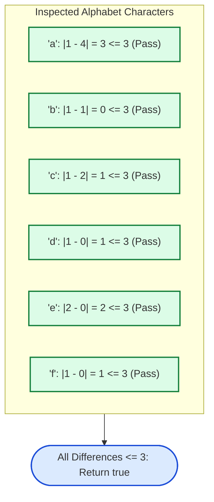

# Guided Example: Check Whether Two Strings are Almost Equivalent

We trace the step-by-step character frequency tallying, difference vector calculation, and threshold boundary verification on representative string instances:

- **Primary Input:** $\text{word1} = \text{"abcdeef"}$, $\text{word2} = \text{"abaaacc"}$
- **Expected Output:** $\text{true}$
- **Violation Counter-Instance:** $\text{word1} = \text{"aaaa"}$, $\text{word2} = \text{"bccb"}$ (Yields $\text{false}$ due to an excess frequency gap of $4$)

---

## 1. Problem Overview & Representative Instance

Two equal-length lowercase English strings $\text{word1}$ and $\text{word2}$ are defined as **almost equivalent** if and only if, for every lowercase letter from `'a'` to `'z'`, the absolute difference between its frequency in $\text{word1}$ and its frequency in $\text{word2}$ is **at most $3$**:
$$\forall c \in \{'\text{a}', '\text{b}', \dots, '\text{z}'\}, \quad |\text{freq}_1(c) - \text{freq}_2(c)| \le 3$$

We must return $\text{true}$ if every letter satisfies this inequality, or $\text{false}$ if even a single character's frequency discrepancy reaches $4$ or more.

In the primary instance:
- $\text{word1} = \text{"abcdeef"}$ (Length 7)
- $\text{word2} = \text{"abaaacc"}$ (Length 7)
- Frequencies:
  - Letter `'a'`: $1$ in $\text{word1}$, $4$ in $\text{word2}$. Difference $= |1 - 4| = 3 \le 3$.
  - Letter `'e'`: $2$ in $\text{word1}$, $0$ in $\text{word2}$. Difference $= |2 - 0| = 2 \le 3$.
  - All other letters have differences of $0$ or $1$.
- Because the maximum difference across all $26$ letters is $3 \le 3$, the output is $\text{true}$.

---

## 2. Theoretical Invariants & Frequency Difference Vector

Let $\Sigma = \{'\text{a}', \dots, '\text{z}'\}$ be the lowercase English alphabet with $|\Sigma| = 26$.
Instead of maintaining two independent 26-element tables, we track a single signed difference vector:
$$\delta[c] = \text{freq}_1(c) - \text{freq}_2(c)$$

### Signed Difference Invariant
1. Increment $\delta[c]$ by $+1$ for each occurrence of character $c$ in $\text{word1}$.
2. Decrement $\delta[c]$ by $-1$ for each occurrence of character $c$ in $\text{word2}$.
3. After processing both strings, each entry $\delta[c]$ holds the exact signed disparity:
   - $\delta[c] > 0 \implies c$ appears more frequently in $\text{word1}$.
   - $\delta[c] < 0 \implies c$ appears more frequently in $\text{word2}$.
   - $\delta[c] = 0 \implies c$ appears an equal number of times (or zero times) in both strings.

### Global Conformance Invariant
The strings are almost equivalent if and only if:
$$\max_{c \in \Sigma} |\delta[c]| \le 3$$
If any $|\delta[c]| \ge 4$, the evaluation can terminate early and report $\text{false}$.

---

## 3. Step-by-Step State Execution Trace

We trace the construction of the difference vector $\delta$ for $\text{word1} = \text{"abcdeef"}$ and $\text{word2} = \text{"abaaacc"}$:

| Letter $c$ | Frequency in $\text{word1}$ | Frequency in $\text{word2}$ | Signed Disparity $\delta[c] = f_1 - f_2$ | Absolute Gap $\lvert \delta[c] \rvert$ | Threshold Limit ($\le 3$) | Status |
|---|---|---|---|---|---|---|
| `'a'` | $1$ | $4$ | $1 - 4 = -3$ | $3$ | $3 \le 3$ | Valid |
| `'b'` | $1$ | $1$ | $1 - 1 = 0$ | $0$ | $0 \le 3$ | Valid |
| `'c'` | $1$ | $2$ | $1 - 2 = -1$ | $1$ | $1 \le 3$ | Valid |
| `'d'` | $1$ | $0$ | $1 - 0 = +1$ | $1$ | $1 \le 3$ | Valid |
| `'e'` | $2$ | $0$ | $2 - 0 = +2$ | $2$ | $2 \le 3$ | Valid |
| `'f'` | $1$ | $0$ | $1 - 0 = +1$ | $1$ | $1 \le 3$ | Valid |
| `'g'`–`'z'` | $0$ | $0$ | $0 - 0 = 0$ | $0$ | $0 \le 3$ | Valid |

All $26$ entries satisfy $|\delta[c]| \le 3$. Return $\text{true}$.

---

## 4. Violation Analysis Trace

We contrast this with $\text{word1} = \text{"aaaa"}$ and $\text{word2} = \text{"bccb"}$:

| Letter $c$ | Count in $\text{word1}$ | Count in $\text{word2}$ | Absolute Gap $\lvert \delta[c] \rvert$ | Threshold Test ($\le 3$) | Decision |
|---|---|---|---|---|---|
| `'a'` | $4$ | $0$ | $\lvert 4 - 0 \rvert = 4$ | $4 \le 3$ (**False**) | **Violation detected! Halt and return $\text{false}$** |
| `'b'` | $0$ | $2$ | $\lvert 0 - 2 \rvert = 2$ | $2 \le 3$ | Skipped by early exit |
| `'c'` | $0$ | $2$ | $\lvert 0 - 2 \rvert = 2$ | $2 \le 3$ | Skipped by early exit |

The very first character checked (`'a'`) produces an absolute difference of $4 > 3$, proving non-equivalence instantly.

---

## 5. Algorithmic Correctness & Soundness

1. **Exact Cardinality Accounting:**
   Counting occurrences across the entire length of both strings guarantees that $\text{freq}_1(c)$ and $\text{freq}_2(c)$ are exact for every character $c \in \Sigma$.
2. **Sufficiency of Checking Disjoint Characters:**
   Letters appearing in $\text{word2}$ but absent in $\text{word1}$ have $\text{freq}_1(c) = 0$, producing $\delta[c] = -\text{freq}_2(c)$. Taking the absolute value $|\delta[c]|$ accounts for characters unique to either string symmetrically.
3. **Exactness of the Bound:**
   The problem specifies that differences of $0, 1, 2,$ and $3$ are legal. The strict condition $|\delta[c]| \le 3$ accurately permits boundary cases where difference is exactly $3$ while rejecting differences $\ge 4$.

---

## 6. Edge Cases, Pitfalls & Structural Traps

- **Characters Present Only in `word2`:**
  A common bug is iterating only over the characters present in `word1`. If `word2` contains $4$ copies of `'z'` and `word1` contains none, omitting `'z'` from verification produces an incorrect $\text{true}$. Checking all $26$ alphabet entries or iterating over the union of keys in a dictionary prevents this trap.
- **Off-by-One Threshold Trap:**
  A difference of exactly $3$ is allowed. Using strict inequality ($< 3$) would reject valid pairs.
- **Identical Strings:**
  If $\text{word1} = \text{word2}$, $|\delta[c]| = 0$ for all characters, trivially returning $\text{true}$.

---

## 7. Complexity Analysis

- **Time Complexity:** $\mathcal{O}(n + |\Sigma|)$ where $n$ is the length of $\text{word1}$ and $\text{word2}$, and $|\Sigma| = 26$ is the alphabet size.
  Scanning both strings of length $n$ updates frequency tallies in $\mathcal{O}(n)$ time. Inspecting the $26$ differences takes $\mathcal{O}(26) = \mathcal{O}(1)$ time. Overall runtime is strictly linear in string length.
- **Space Complexity:** $\mathcal{O}(|\Sigma|) = \mathcal{O}(1)$.
  The frequency array stores exactly $26$ integer counts, requiring constant auxiliary memory.
