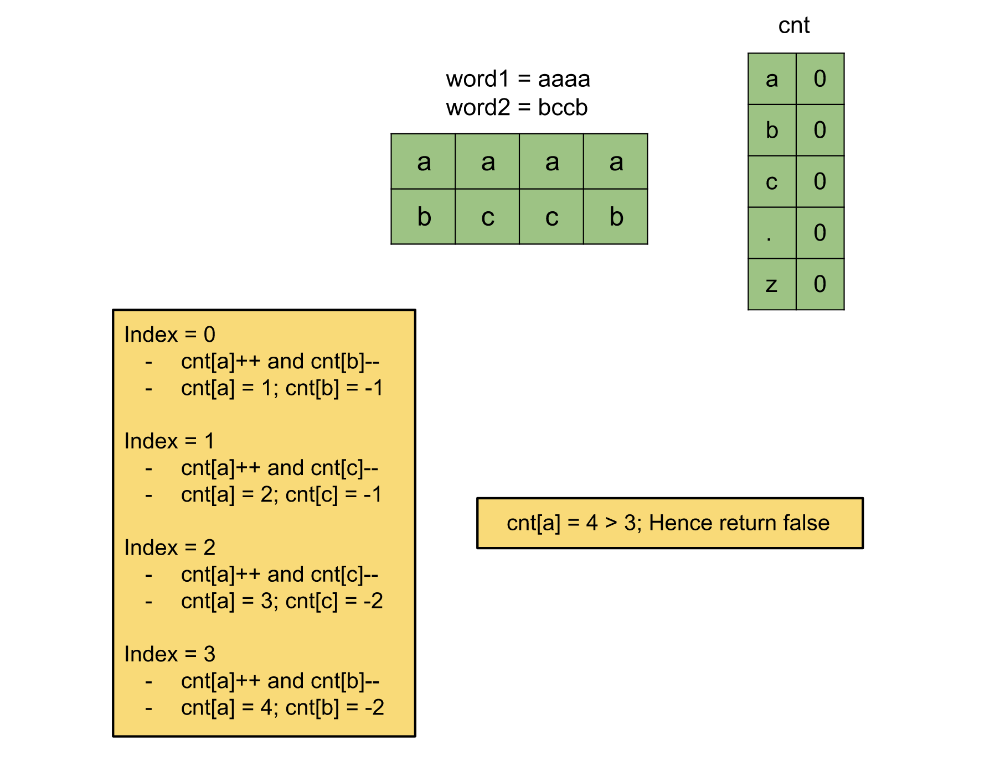

[TOC]

## Solution

---

### Approach: Array

**Intuition**

We are given two strings `word1` and `word2`, both having the same length. We should return `true` if for each letter the difference in the frequency between `word1` and `word2` is not greater than `3`.

We can have an array of size `26` (as the strings can only have lowercase English letters), and store the frequency of the letters in the string `word1`. Then, we do the same with the string `word2` and store its frequencies in another array. We can then iterate over each letter to find the difference and check if any of them exceeds `3`, if yes we will return `false` and `true` otherwise.

Since we don't care about the actual frequencies in each string but rather the difference, we can use the same array for both words. For string `word1` we will increment the count for each letter, and for `word2` letters we will decrement the count. This way we will be able to find the difference between the frequencies on the fly and would only need one array. Also, since the length of both strings is the same, instead of doing it in two iterations, one for `word1` and another for `word2` we can do it in one.



**Algorithm**

1. Initialise an empty array `cnt` of size `26` to store the difference of frequencies for each letter.
2. Iterate over the indices and for each index `i`:
  1. Increment the count of the letter $\text{word1}[i]$ by 1 and,
  2. Decrement the count of $\text{word2}[i]$ by 1.
3. In the end, iterate over the letters from `0` to `26` for each:
  1. Check if the absolute value in the `cnt` is more than `3`.
  2. If yes, return `false`.
4. Return `true` when the iteration is complete because that means there are no letters with a difference of more than `3`.

**Implementation**

```cpp
class Solution {
public:
    bool checkAlmostEquivalent(string word1, string word2) {
        int cnt[26] = {0};

        for (int i = 0; i < word1.size(); i++) {
            cnt[word1[i] - 'a']++;
            cnt[word2[i] - 'a']--;
        }

        for (int i = 0; i < 26; i++) {
            if (abs(cnt[i]) > 3) {
                return false;
            }
        }

        return true;
    }
};
```

**Complexity Analysis**

Here, $N$ is the length of the string `word1` and `word2`, and $K$ is the number of unique characters in these strings.

* Time complexity: $O(N)$

  We iterate over each letter in the strings `word1` and `word2` to store the frequency difference, this takes $O(N)$ operations. Then we iterate over each letter to check if the difference is more than `3`, this takes $O(K)$ operations. Hence, the total time complexity is equal to $O(N + K)$. The number of unique characters in the string cannot be more than the string of length itself, hence $K <= N$. Therefore the time complexity can be simplified as $O(N)$

* Space complexity: $O(1)$

  We need an array `cnt` to store the frequency difference for each letter, hence it would take an array of size $K$. In this problem, $K = 26$. Hence, the space complexity is constant.
  <br/>

---