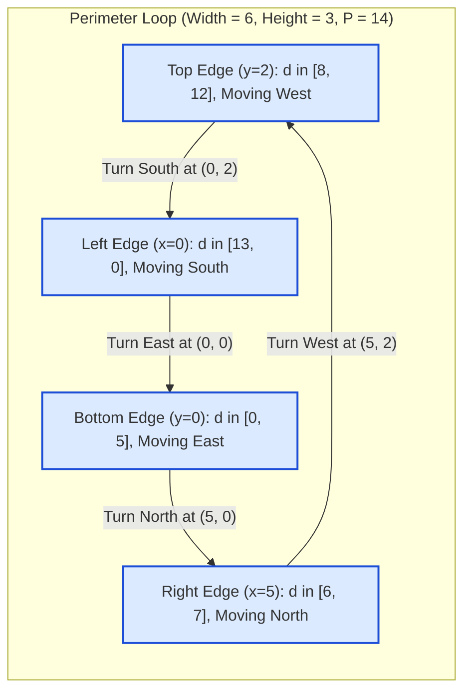

# Guided Example: Walking Robot Simulation II

We trace the step-by-step 1D perimeter modular mapping, coordinate unwrapping, and directional boundary determination on a representative robot simulation:

- **Grid Dimensions:** $\text{width} = 6$, $\text{height} = 3$
- **Operation Sequence:** `["Robot(6, 3)", "step(2)", "step(2)", "getPos", "getDir", "step(2)", "step(1)", "step(4)", "getPos", "getDir"]`
- **Expected Output:** `[null, null, null, [4, 0], "East", null, null, null, [1, 2], "West"]`

---

## 1. Problem Overview & Representative Instance

A robot begins at position $(0, 0)$ on a $W \times H$ grid, initially facing **East**. The grid spans coordinates $[0, W - 1] \times [0, H - 1]$.
When commanded to take $k$ steps:
- The robot moves forward one cell per step.
- If stepping forward would move outside the grid, the robot turns $90^\circ$ counterclockwise in place before taking that step.
- The robot never turns inward; it circumnavigates the **outer perimeter** of the rectangle indefinitely.

We must support three stateful operations:
1. `step(num)`: Advance by `num` steps along the perimeter.
2. `getPos()`: Return the current $[x, y]$ coordinates.
3. `getDir()`: Return the current heading (`"East"`, `"North"`, `"West"`, or `"South"`).

For $W = 6, H = 3$:
- Maximum horizontal steps: $m_x = 6 - 1 = 5$.
- Maximum vertical steps: $m_y = 3 - 1 = 2$.
- Total circuit perimeter: $P = 2 \cdot m_x + 2 \cdot m_y = 2(5) + 2(2) = 14$ steps.
- Because the robot moves in a closed loop of length $14$, every move of size $\text{num}$ is equivalent to advancing $\text{num} \pmod{14}$ positions along the 1D perimeter!

---

## 2. Theoretical Invariants & 1D Perimeter Projection

Simulating steps one by one would take $\mathcal{O}(\text{num})$ time, which times out when $\text{num} = 10^5$ across $10^4$ calls. Instead, we project the 2D perimeter onto a 1D scalar coordinate $d \in [0, P - 1]$:
$$d = (\text{current\_distance} + \text{num}) \pmod P$$

### Perimeter Coordinate Mapping Invariant
Let $m_x = W - 1$ and $m_y = H - 1$. The 1D distance $d$ maps to 2D coordinates $[x, y]$ via four piecewise linear segments:

| Segment | Distance Interval $d$ | Heading Direction | $x$-Coordinate Formula | $y$-Coordinate Formula | Coordinate Range |
|---|---|---|---|---|---|
| Bottom Edge | $0 \le d \le m_x$ | East (if $d > 0$ or moved) | $x = d$ | $y = 0$ | $(0, 0)$ to $(m_x, 0)$ |
| Right Edge | $m_x < d \le m_x + m_y$ | North | $x = m_x$ | $y = d - m_x$ | $(m_x, 1)$ to $(m_x, m_y)$ |
| Top Edge | $m_x + m_y < d \le 2m_x + m_y$ | West | $x = m_x - (d - (m_x + m_y))$ | $y = m_y$ | $(m_x - 1, m_y)$ to $(0, m_y)$ |
| Left Edge | $2m_x + m_y < d < P$ | South | $x = 0$ | $y = m_y - (d - (2m_x + m_y))$ | $(0, m_y - 1)$ to $(0, 1)$ |

### The Origin Direction Invariant (Subtle Edge Case)
When the robot is at $(0, 0)$ ($d = 0$):
- **Before any movement:** It was placed at $(0, 0)$ initialized to face **East**.
- **After moving at least once:** The robot reaches $(0, 0)$ by walking South down the left edge ($x = 0$). When it lands on $(0, 0)$, it faces **South**. (It only turns East when an upcoming command forces it to step forward).
Therefore:
$$\text{Direction at } (0, 0) = \begin{cases} \text{"East"} & \text{if } \neg\text{moved} \\ \text{"South"} & \text{if } \text{moved} \end{cases}$$

---

## 3. Step-by-Step State Execution Trace

We trace the sequence of method calls for $W = 6, H = 3$ ($m_x = 5, m_y = 2, P = 14$):

| Operation | Arguments | Internal 1D Distance $d$ Calculation | `moved` Flag | Computed Position $[x, y]$ | Computed Direction | Method Return Value |
|---|---|---|---|---|---|---|
| `Robot(6, 3)` | $[6, 3]$ | Initialize: $d = 0, P = 14$ | `False` | $[0, 0]$ | `"East"` | `null` |
| `step(2)` | $[2]$ | $(0 + 2) \pmod{14} = 2$ | `True` | $[2, 0]$ | `"East"` | `null` |
| `step(2)` | $[2]$ | $(2 + 2) \pmod{14} = 4$ | `True` | $[4, 0]$ | `"East"` | `null` |
| `getPos()` | $[\,]$ | $d = 4 \in [0, 5] \implies [4, 0]$ | `True` | $[4, 0]$ | — | **`[4, 0]`** |
| `getDir()` | $[\,]$ | $d = 4 \in [1, 5] \implies \text{"East"}$ | `True` | — | `"East"` | **`"East"`** |
| `step(2)` | $[2]$ | $(4 + 2) \pmod{14} = 6$ | `True` | $[5, 1]$ | `"North"` | `null` |
| `step(1)` | $[1]$ | $(6 + 1) \pmod{14} = 7$ | `True` | $[5, 2]$ | `"North"` | `null` |
| `step(4)` | $[4]$ | $(7 + 4) \pmod{14} = 11$ | `True` | Top edge: $x = 5 - (11 - 7) = 1$ | `"West"` | `null` |
| `getPos()` | $[\,]$ | $d = 11 \in [8, 12] \implies [1, 2]$ | `True` | $[1, 2]$ | — | **`[1, 2]`** |
| `getDir()` | $[\,]$ | $d = 11 \in [8, 12] \implies \text{"West"}$ | `True` | — | `"West"` | **`"West"`** |

---

## 4. Perimeter Segment Intervals for $6 \times 3$ Grid

Below is the complete coordinate unrolling table for all $14$ discrete positions along the perimeter:

| Distance $d$ | Coordinates $[x, y]$ | Facing Direction | Segment Description |
|---|---|---|---|
| $0$ | $[0, 0]$ | East (initial) / South (after move) | Bottom-Left Corner |
| $1 \dots 4$ | $[1, 0] \dots [4, 0]$ | East | Bottom Edge Interior |
| $5$ | $[5, 0]$ | East | Bottom-Right Corner |
| $6$ | $[5, 1]$ | North | Right Edge Interior |
| $7$ | $[5, 2]$ | North | Top-Right Corner |
| $8 \dots 11$ | $[4, 2] \dots [1, 2]$ | West | Top Edge Interior (Step 8 reaches $d=11 \implies [1, 2]$) |
| $12$ | $[0, 2]$ | West | Top-Left Corner |
| $13$ | $[0, 1]$ | South | Left Edge Interior |

---

## 5. Algorithmic Correctness & Soundness

1. **Cycle Equivalence:**
   Because turning occurs precisely when forward movement would exit the boundary, the robot's motion is strictly constrained to the 1D perimeter of length $P$. Since the grid boundary is invariant under translations of $P$, any displacement of $\text{num}$ steps is isomorphic to $\text{num} \pmod P$.
2. **Deterministic Unwrapping:**
   The four piecewise intervals $[0, m_x]$, $(m_x, m_x + m_y]$, $(m_x + m_y, 2m_x + m_y]$, and $(2m_x + m_y, P)$ form a disjoint, exhaustive partition of $[0, P - 1]$. Each distance $d$ maps to a unique $(x, y)$ coordinate.
3. **$\mathcal{O}(1)$ Efficiency:**
   Modular arithmetic replaces iterative single-step loops, making every operation execute in constant time regardless of how large $\text{num}$ is.

---

## 6. Edge Cases, Pitfalls & Structural Traps

- **Full Loop Multiples at Origin:**
  If the robot starts at $(0, 0)$ and takes `step(14)` (one full circuit), $d = (0 + 14) \pmod{14} = 0$. Its position is $[0, 0]$, but its direction is now **"South"**, because it walked South into $(0, 0)$. Without the `moved` flag, an implementation would erroneously report `"East"`.
- **Corner Heading Ambiguity:**
  At a corner (e.g. $d = 5 \implies (5, 0)$), the robot arrived traveling East. It faces East until a subsequent step forces it to turn North. The piecewise intervals correctly preserve this arrival heading.
- **Large Step Counts:**
  A query with $\text{num} = 10^9$ is reduced in $\mathcal{O}(1)$ via modulo arithmetic without any loops.

---

## 7. Complexity Analysis

- **Time Complexity:**
  - `__init__`: $\mathcal{O}(1)$ to calculate perimeter $P = 2(W + H - 2)$.
  - `step`: $\mathcal{O}(1)$ to perform addition and modulo $P$.
  - `getPos`: $\mathcal{O}(1)$ with four interval conditional checks.
  - `getDir`: $\mathcal{O}(1)$ with four interval conditional checks.
  All operations execute in $\mathcal{O}(1)$ time.
- **Space Complexity:** $\mathcal{O}(1)$ auxiliary space to store scalars $m_x, m_y, P, d,$ and `moved`.
