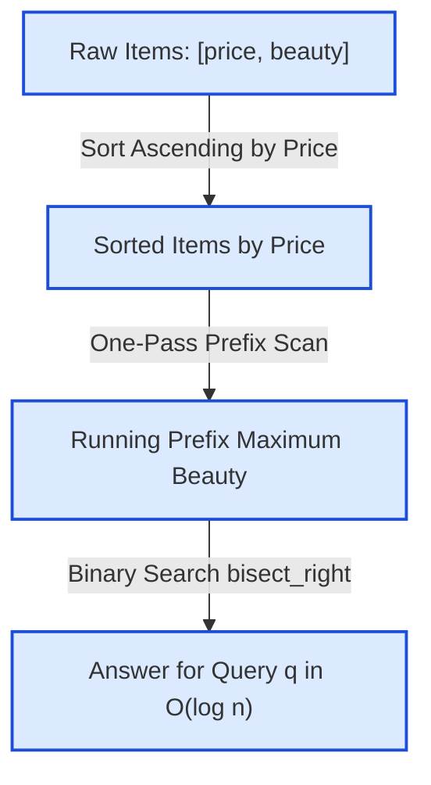

# Guided Example: Most Beautiful Item for Each Query

We trace the offline sorting, monotonic prefix maximum beauty propagation, and logarithmic binary search queries on a representative instance:

- **Items:** `[[1, 2], [3, 2], [2, 4], [5, 6], [3, 5]]`
- **Queries:** `[1, 2, 3, 4, 5, 6]`
- **Expected Output:** `[2, 4, 5, 5, 6, 6]`

---

## 1. Problem Overview & Representative Instance

We are given a 2D integer array $\text{items}$, where each $\text{items}[i] = [\text{price}_i, \text{beauty}_i]$, and an integer array $\text{queries}$. For each query $q_j$, we wish to determine the maximum beauty among all items whose price is at most $q_j$. If no such item exists with price $\le q_j$, the answer for that query is $0$.

### Naive vs. Monotonic Prefix Approach
- A naive evaluation compares each query $q_j$ against all $n$ items, requiring $\mathcal{O}(n \cdot q)$ time. For $n, q \le 10^5$, this results in $10^{10}$ operations, exceeding standard time limits.
- By sorting the items primarily by price in non-decreasing order, the allowable item set for any query $q$ forms a contiguous prefix $[0, k]$ of sorted items where $\text{price}_k \le q < \text{price}_{k+1}$.
- Because the maximum beauty over a prefix is monotonic:
  $$\text{max\_beauty}(k) = \max_{0 \le i \le k} \text{beauty}_i = \max(\text{max\_beauty}(k - 1), \text{beauty}_k)$$
  we can precalculate the cumulative maximum beauty in a single pass of length $n$.
- Then, for any query $q$, finding the optimal prefix index $k$ requires only a single binary search bisection ($\mathcal{O}(\log n)$).

---

## 2. Theoretical Invariants & Monotonic Beauty Structure

### Invariant 1: Price Sorting and Contiguous Prefix Validity
Let sorted items be $S = [(\tilde{p}_0, b_0), (\tilde{p}_1, b_1), \dots, (\tilde{p}_{n-1}, b_{n-1})]$ such that $\tilde{p}_0 \le \tilde{p}_1 \le \dots \le \tilde{p}_{n-1}$.
For any threshold $q$, the condition $\tilde{p}_i \le q$ holds for an initial contiguous segment of indices $i \in \{0, 1, \dots, k\}$.
If $\tilde{p}_0 > q$, the valid set is empty and the maximum beauty is $0$.

### Invariant 2: Non-Decreasing Prefix Maximum Beauty
Define the prefix maximum sequence $M$ by:
$$M[0] = b_0$$
$$M[i] = \max(M[i - 1], b_i) \quad \text{for } 1 \le i < n$$
By definition, $M[i] \ge M[i - 1]$ for all $i \ge 1$. Hence, the maximum beauty of any item with price $\le \tilde{p}_k$ is precisely $M[k]$.

| Item Property | Meaning | Mathematical Formulation |
|---|---|---|
| Sorted Prices | Non-decreasing sequence of affordability thresholds | $\tilde{p}_0 \le \tilde{p}_1 \le \dots \le \tilde{p}_{n-1}$ |
| Prefix Max Beauty $M[i]$ | Highest beauty achievable paying at most $\tilde{p}_i$ | $\max_{0 \le j \le i} b_j$ |
| Query Partition Index $k$ | Greatest index satisfying $\tilde{p}_k \le q$ | $\max \{ i \mid \tilde{p}_i \le q \}$ |
| Query Result | Answer extracted in $\mathcal{O}(1)$ after bisection | $M[k]$ if $k \ge 0$, else $0$ |

---

## 3. Step-by-Step State Execution Trace

### Phase 1: Sorting and Prefix Maximum Calculation
Original list: $[[1, 2], [3, 2], [2, 4], [5, 6], [3, 5]]$.

1. Sorting items by price:
   - Index 0: $[1, 2]$
   - Index 1: $[2, 4]$
   - Index 2: $[3, 2]$
   - Index 3: $[3, 5]$
   - Index 4: $[5, 6]$

2. Prefix maximum calculation table:

| Sorted Index $i$ | Price $\tilde{p}_i$ | Beauty $b_i$ | Formula $\max(M[i-1], b_i)$ | Prefix Max Beauty $M[i]$ |
|---|---|---|---|---|
| $0$ | $1$ | $2$ | Base case: $b_0$ | $2$ |
| $1$ | $2$ | $4$ | $\max(2, 4)$ | $4$ |
| $2$ | $3$ | $2$ | $\max(4, 2)$ | $4$ |
| $3$ | $3$ | $5$ | $\max(4, 5)$ | $5$ |
| $4$ | $5$ | $6$ | $\max(5, 6)$ | $6$ |

The reference price array is $P = [1, 2, 3, 3, 5]$ with matching prefix max beauty $M = [2, 4, 4, 5, 6]$.

---

### Phase 2: Evaluating Each Query via Binary Search
For each query $q$, we locate the rightmost index $k$ such that $P[k] \le q$.
Using standard upper-bound bisection (`bisect_right`) on $P$, we obtain the insertion index $\text{pos}$. The valid item index is $k = \text{pos} - 1$.
- If $k = -1$ (no price $\le q$), return $0$.
- Otherwise, return $M[k]$.

| Query $j$ | Budget $q$ | Bisection Search Range in $P$ | Rightmost Index $k$ with $P[k] \le q$ | Affordable Item $(P[k], b_k)$ | Prefix Max $M[k]$ | Emitted Result |
|---|---|---|---|---|---|---|
| 0 | $1$ | Search in $[1, 2, 3, 3, 5]$ | $k = 0$ ($P[0] = 1$) | $[1, 2]$ | $M[0] = 2$ | $2$ |
| 1 | $2$ | Search in $[1, 2, 3, 3, 5]$ | $k = 1$ ($P[1] = 2$) | $[2, 4]$ | $M[1] = 4$ | $4$ |
| 2 | $3$ | Search in $[1, 2, 3, 3, 5]$ | $k = 3$ ($P[3] = 3$) | $[3, 5]$ | $M[3] = 5$ | $5$ |
| 3 | $4$ | Search in $[1, 2, 3, 3, 5]$ | $k = 3$ ($P[3] = 3$) | $[3, 5]$ | $M[3] = 5$ | $5$ |
| 4 | $5$ | Search in $[1, 2, 3, 3, 5]$ | $k = 4$ ($P[4] = 5$) | $[5, 6]$ | $M[4] = 6$ | $6$ |
| 5 | $6$ | Search in $[1, 2, 3, 3, 5]$ | $k = 4$ ($P[4] = 5$) | $[5, 6]$ | $M[4] = 6$ | $6$ |

Concatenating results across all queries yields:
$$\text{output} = [2, 4, 5, 5, 6, 6]$$

---

## 4. Query Space Bisection State Mechanics

Consider the detailed bisection steps for query $q = 3$ against $P = [1, 2, 3, 3, 5]$:

| Bisection Step | Left Pointer $L$ | Right Pointer $R$ | Midpoint $m = \lfloor(L + R)/2\rfloor$ | Probe Value $P[m]$ | Comparison with $q = 3$ | New Interval |
|---|---|---|---|---|---|---|
| Step 1 | $0$ | $5$ | $2$ | $P[2] = 3$ | $P[2] \le 3 \implies$ move right | $L = 3, R = 5$ |
| Step 2 | $3$ | $5$ | $4$ | $P[4] = 5$ | $P[4] > 3 \implies$ move left | $L = 3, R = 4$ |
| Step 3 | $3$ | $4$ | $3$ | $P[3] = 3$ | $P[3] \le 3 \implies$ move right | $L = 4, R = 4$ |
| Final Convergence | $4$ | $4$ | — | Insertion pos $= 4$ | Index $k = 4 - 1 = 3$ | $M[3] = 5$ |

Notice how items with duplicate price $3$ (index 2 with beauty 2 and index 3 with beauty 5) are naturally handled: `bisect_right` advances past all identical prices, landing at index 3 where the running prefix max correctly reflects the superior beauty of 5.

---

## 5. Algorithmic Correctness & Soundness

1. **Completeness of Search Space:**
   Sorting items by price ensures that the set of all items with $\text{price} \le q$ is precisely the subset $\{S[0], S[1], \dots, S[k]\}$. No valid candidate is excluded.
2. **Optimality via Dynamic Programming Recurrence:**
   The recurrence $M[i] = \max(M[i - 1], b_i)$ guarantees that $M[k] = \max_{0 \le j \le k} b_j$. Because the subset of affordable items is $\{S[0], \dots, S[k]\}$, $M[k]$ is provably the maximum beauty obtainable within budget $q$.
3. **Sound Handling of Boundary Values:**
   If a query $q$ is strictly less than $\tilde{p}_0$, the bisection yields $k = -1$. The algorithm returns $0$, which conforms to the specification requirement that queries with no affordable items receive beauty $0$.

---

## 6. Edge Cases, Pitfalls & Structural Traps

- **Budget Below Minimum Price:**
  If the smallest item price is $5$ and a query specifies $q = 2$, no item can be afforded. The bisection produces insertion index $0$, corresponding to $k = -1$. Emitting $0$ is essential rather than accessing index $-1$ (which in languages like Python would incorrectly wrap around to the end of the list).
- **Multiple Items with Identical Prices:**
  Items can share the same price but have different beauty values (e.g., $[3, 2]$ and $[3, 5]$). By taking the cumulative maximum $M[i] = \max(M[i - 1], b_i)$ and using upper-bound bisection (`bisect_right`), the search always incorporates all items of that price, capturing the maximum beauty among ties.
- **Dominated Items:**
  An item with higher price and lower beauty is strictly dominated. The prefix maximum cleanly absorbs dominated items without requiring an explicit deletion or filtering step.

---

## 7. Complexity Analysis

- **Time Complexity:**
  - **Sorting Items:** $\mathcal{O}(n \log n)$ where $n$ is the number of items.
  - **Prefix Maximum Precomputation:** $\mathcal{O}(n)$ single-pass scan.
  - **Query Processing:** For each of the $m$ queries, binary search on $n$ prices takes $\mathcal{O}(\log n)$ time. Total query time is $\mathcal{O}(m \log n)$.
  - **Overall Time Complexity:** $\mathcal{O}((n + m) \log n)$, well within the time budget for $n, m \le 10^5$.
- **Auxiliary Space Complexity:**
  - Storing the sorted price array and the prefix maximum beauty array requires $\mathcal{O}(n)$ auxiliary space.
  - The output array of answers for $m$ queries requires $\mathcal{O}(m)$ space.
  - Total auxiliary space: $\mathcal{O}(n + m)$.
