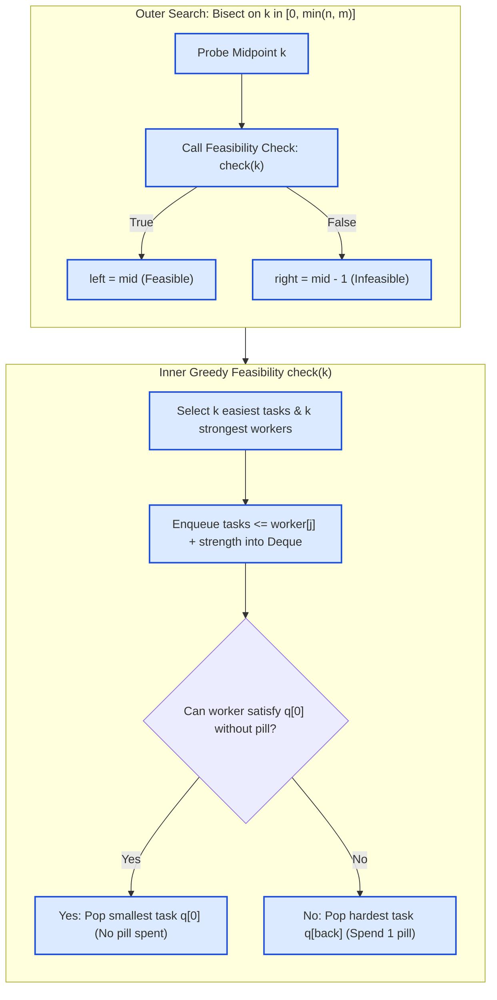

# Guided Example: Maximum Number of Tasks You Can Assign

We trace the binary search on answer feasibility coupled with greedy monotonic deque worker assignment on a representative instance:

- **Tasks:** `[3, 2, 1]`
- **Workers:** `[0, 3, 3]`
- **Pills Available:** `1`
- **Pill Strength Boost:** `1`
- **Expected Output:** `3`

---

## 1. Problem Overview & Representative Instance

We are given $n$ tasks with strength requirements in `tasks` and $m$ workers with capabilities in `workers`. Each worker can be assigned to at most one task and can perform that task only if their strength meets or exceeds the task requirement. We are provided with `pills` magical boost pills, each of which can increase an assigned worker's strength by `strength`. At most one pill can be administered per worker. We seek the maximum number of tasks that can be completed.

### Key Observation: Monotonicity of Feasibility
If it is possible to assign $k$ tasks, then any smaller quantity $k' < k$ is also feasible simply by discarding $k - k'$ task assignments. Conversely, if $k$ tasks cannot be completed, no $k'' > k$ tasks can ever be completed.
This monotonicity allows us to binary search the optimal count $k \in [0, \min(n, m)]$.

For our instance:
- Sorted tasks: $[1, 2, 3]$
- Sorted workers: $[0, 3, 3]$
- With $n = 3, m = 3$, the maximum possible completed tasks is bounded by $\min(3, 3) = 3$.
- We verify whether $k = 3$ can be assigned using at most $1$ pill offering a boost of $+1$.

---

## 2. Theoretical Invariants & Greedy Deque Logic

To check feasibility for a candidate count $k$:

### Invariant 1: Optimal Subsets of Tasks and Workers
To complete $k$ tasks:
1. It is always optimal to choose the $k$ easiest tasks: $T_k = \text{tasks}[0 \dots k-1]$ sorted ascending. Replacing any task with an unchosen harder task would only strictly increase requirements.
2. It is always optimal to choose the $k$ strongest workers: $W_k = \text{workers}[m-k \dots m-1]$ sorted ascending. Replacing any worker with an unchosen weaker worker would only strictly decrease available strength.

### Invariant 2: Weakest-Worker-First Greedy Dispatch
We process the chosen workers in ascending order of their natural strength: $j = m - k, \dots, m - 1$.
1. **Dynamic Task Frontier:** As we consider worker $j$ with strength $w_j$, we maintain a double-ended queue `q` containing all available tasks from $T_k$ whose requirement satisfies $t_i \le w_j + \text{strength}$.
2. **Decision Rule:**
   - If the easiest task in `q` satisfies $t_{\min} \le w_j$, the worker can accomplish it **without consuming a pill**. We greedily pop $t_{\min}$ from the front (`popleft`). Why? Conserving pills for later, more constrained assignments is optimal, and the weakest available worker should consume the easiest available task.
   - If $t_{\min} > w_j$, the worker **must** use a pill. If no pills remain, feasibility fails immediately. If pills are available, we consume 1 pill and pop the **hardest task** currently reachable in `q` from the back (`pop`). Why the hardest task? Since a pill is being expended regardless, disposing of the hardest reachable task leaves the maximum number of easier tasks for subsequent workers.

| State Parameter | Description & Purpose | Invariant Property |
|---|---|---|
| Search Interval $[L, R]$ | Range of possible task counts | $L \le \text{optimal\_answer} \le R$ |
| Candidate Tasks $T_k$ | Prefix of $k$ smallest task requirements | Monotonically ascending requirements |
| Candidate Workers $W_k$ | Suffix of $k$ greatest worker strengths | Monotonically ascending natural strengths |
| Monotonic Deque $q$ | Tasks accomplishable by $w_j$ with a pill | Sorted ascending: front is easiest, back is hardest |
| Remaining Pills $p$ | Counter of unspent magical strength pills | $p \ge 0$ at all valid execution steps |

---

## 3. Step-by-Step Worked Execution

We trace the feasibility check for $k = 3$ on `tasks = [1, 2, 3]`, `workers = [0, 3, 3]`, `pills = 1`, `strength = 1`.

- Selected tasks $T_3 = [1, 2, 3]$ (indices $i \in \{0, 1, 2\}$).
- Selected workers $W_3 = [0, 3, 3]$ (worker indices $j \in \{0, 1, 2\}$).
- Initial remaining pills $p = 1$, deque $q = [\,]$, task pointer $i = 0$.

### Iteration 1: Worker $j = 0$ (Strength $w_0 = 0$)
1. **Pill-Boosted Capacity:** $w_0 + \text{strength} = 0 + 1 = 1$.
2. **Enqueue Accessible Tasks:**
   - Task $i = 0$ has requirement $1 \le 1 \implies$ append to $q$. $i$ advances to $1$.
   - Task $i = 1$ has requirement $2 > 1 \implies$ loop halts.
   - Deque state: $q = [1]$.
3. **Pill Necessity Evaluation:**
   - Easiest task is $q[0] = 1$.
   - Does $w_0 \ge q[0]$? $0 \ge 1$ is False. Worker cannot perform task 1 naturally.
   - Must use a pill. Remaining pills $p = 1 > 0$.
   - Decrement pills: $p = 1 - 1 = 0$.
   - Remove hardest accessible task from back: $q.\text{pop}() \implies 1$.
   - Deque after dispatch: $q = [\,]$.

---

### Iteration 2: Worker $j = 1$ (Strength $w_1 = 3$)
1. **Pill-Boosted Capacity:** $w_1 + \text{strength} = 3 + 1 = 4$.
2. **Enqueue Accessible Tasks:**
   - Task $i = 1$ has requirement $2 \le 4 \implies$ append to $q$. $i$ advances to $2$.
   - Task $i = 2$ has requirement $3 \le 4 \implies$ append to $q$. $i$ advances to $3$.
   - Task pointer $i = 3 = k \implies$ all tasks enqueued.
   - Deque state: $q = [2, 3]$.
3. **Pill Necessity Evaluation:**
   - Easiest task is $q[0] = 2$.
   - Does $w_1 \ge q[0]$? $3 \ge 2$ is True! Worker performs task 2 naturally without a pill.
   - Remove easiest task from front: $q.\text{popleft}() \implies 2$.
   - Pills remaining: $p = 0$ (conserved).
   - Deque after dispatch: $q = [3]$.

---

### Iteration 3: Worker $j = 2$ (Strength $w_2 = 3$)
1. **Pill-Boosted Capacity:** $w_2 + \text{strength} = 3 + 1 = 4$.
2. **Enqueue Accessible Tasks:**
   - $i = 3 = k \implies$ no further tasks to enqueue.
   - Deque state: $q = [3]$.
3. **Pill Necessity Evaluation:**
   - Easiest task is $q[0] = 3$.
   - Does $w_2 \ge q[0]$? $3 \ge 3$ is True! Worker performs task 3 naturally without a pill.
   - Remove easiest task from front: $q.\text{popleft}() \implies 3$.
   - Pills remaining: $p = 0$.
   - Deque after dispatch: $q = [\,]$.

All $k = 3$ workers are successfully assigned to distinct tasks within the available pill budget. Thus, `check(3)` returns `True`.

---

## 4. Complete Execution Trace

Below is the comprehensive trace table of state variables across all worker evaluations for $k = 3$:

| Step / Worker | Worker Strength $w_j$ | Effective Reach $w_j + \text{boost}$ | Enqueued Tasks | Deque Before Assignment | Assignment Decision | Pill Expended | Deque After Assignment |
|---|---|---|---|---|---|---|---|
| Initial Setup | — | — | — | $[\,]$ | Baseline $p = 1, i = 0$ | $0$ | $[\,]$ |
| Worker $j = 0$ | $0$ | $0 + 1 = 1$ | Task $0$ (req $1$) | $[1]$ | Cannot meet naturally; take hardest with pill | $1$ pill (leaves $0$) | $[\,]$ |
| Worker $j = 1$ | $3$ | $3 + 1 = 4$ | Task $1$ (req $2$), Task $2$ (req $3$) | $[2, 3]$ | $3 \ge q[0]=2 \implies$ natural match (popleft) | None ($0$ spent) | $[3]$ |
| Worker $j = 2$ | $3$ | $3 + 1 = 4$ | None ($i = 3$) | $[3]$ | $3 \ge q[0]=3 \implies$ natural match (popleft) | None ($0$ spent) | $[\,]$ |

### Outer Binary Search Progression
With search interval $[0, 3]$:

| Bisection Step | Lower Bound $L$ | Upper Bound $R$ | Midpoint $k = \lfloor(L + R + 1)/2\rfloor$ | Feasibility Check `check(k)` | Next Interval $[L, R]$ |
|---|---|---|---|---|---|
| Step 1 | $0$ | $3$ | $\lfloor(0 + 3 + 1)/2\rfloor = 2$ | `check(2)` = True | $[2, 3]$ |
| Step 2 | $2$ | $3$ | $\lfloor(2 + 3 + 1)/2\rfloor = 3$ | `check(3)` = True | $[3, 3]$ |
| Convergence | $3$ | $3$ | Target reached: $L = R = 3$ | Optimal $k = 3$ | Terminate |

Final emitted answer: $3$.

---

## 5. Algorithmic Correctness & Soundness

1. **Subset Optimality:**
   Any assignment of $k$ tasks must choose a subset of size $k$ from `tasks` and a subset of size $k$ from `workers`. Pointwise, replacing any task in $T_k$ with a task outside $T_k$ never decreases requirements. Likewise, replacing any worker in $W_k$ with a worker outside $W_k$ never increases available strength. Thus, $T_k$ paired with $W_k$ dominates all other subsets of size $k$.
2. **Greedy Deque Dispatch Soundness:**
   - When worker $j$ can perform $q[0]$ without a pill, assigning $q[0]$ to worker $j$ is strictly optimal: it preserves pills for later workers who might otherwise fail, and leaves harder tasks in $q$ for stronger workers.
   - When worker $j$ cannot perform $q[0]$ without a pill, a pill must be spent on worker $j$. Since the pill increases strength by a fixed constant, assigning the **largest** reachable task ($q[-1]$) to worker $j$ maximally relaxes the requirements for all remaining unassigned tasks.
3. **Monotonicity & Bisection Completeness:**
   Feasibility is a monotonic predicate $f: \{0, \dots, \min(n, m)\} \to \{\text{True}, \text{False}\}$. The upper-midpoint formula $\lfloor(L + R + 1)/2\rfloor$ guarantees convergence without infinite looping, accurately identifying the maximum feasible integer $k$.

---

## 6. Edge Cases, Pitfalls & Structural Traps

- **Zero Pills Available ($pills = 0$):**
  When no pills are available, any worker who cannot satisfy $q[0]$ naturally immediately causes `check(k)` to return `False`. The deque algorithm handles this seamlessly at the `p == 0` check.
- **Pill Boost Exceeds Task Needs:**
  A worker with natural strength $0$ boosted by $1$ satisfies requirement $1$ exactly. The check uses inclusive comparison ($\le$).
- **Popping Direction Inversion:**
  Popping the wrong end of the deque is a fatal flaw:
  - Natural completion must pop from the **front** (smallest task).
  - Pill completion must pop from the **back** (hardest reachable task).
  Inverting either direction causes suboptimal task allocation and false negatives.
- **Off-by-One in Upper Midpoint:**
  In binary search for the maximum valid value, using $\lfloor(L + R)/2\rfloor$ leads to an infinite loop when $L = R - 1$ and `check(L)` is true. Using $(L + R + 1) // 2$ prevents this deadlock.

---

## 7. Complexity Analysis

- **Time Complexity:**
  - **Sorting:** Sorting `tasks` takes $\mathcal{O}(n \log n)$ and sorting `workers` takes $\mathcal{O}(m \log m)$.
  - **Feasibility Check:** For a candidate $k$, each of the $k$ tasks enters and leaves the deque at most once. Processing $k$ workers takes $\mathcal{O}(k) \le \mathcal{O}(\min(n, m))$ time.
  - **Binary Search:** The search range is $[0, \min(n, m)]$, requiring $\mathcal{O}(\log(\min(n, m)))$ bisection steps.
  - **Total Time Complexity:** $\mathcal{O}(n \log n + m \log m + \min(n, m) \log(\min(n, m)))$.
- **Auxiliary Space Complexity:**
  - The double-ended queue stores at most $k \le \min(n, m)$ task values.
  - In-place sorting of inputs requires $\mathcal{O}(1)$ or $\mathcal{O}(\log(\max(n, m)))$ call stack space.
  - Total auxiliary space: $\mathcal{O}(\min(n, m))$.
