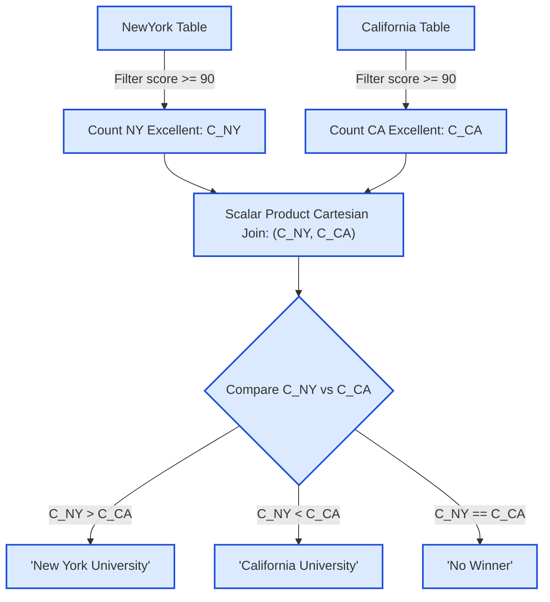

# Guided Example: The Winner University

We trace the relational aggregation, scalar cross-join, and three-valued conditional branch evaluation on a representative database state:

- **Input Tables:**
  - `NewYork`: `[(student_id: 1, score: 90), (student_id: 2, score: 87)]`
  - `California`: `[(student_id: 2, score: 89), (student_id: 3, score: 88)]`
- **Expected Output:**
  - `winner: "New York University"`

---

## 1. Problem Overview & Representative Instance

We are given two academic score relation schemas, `NewYork` and `California`, each containing `student_id` and integer exam `score`. A student is classified as "excellent" if and only if their score satisfies:
$$\text{score} \ge 90$$

The institution with the strictly greater count of excellent students wins the competition. If both universities have the exact same count of excellent students (including when both counts are zero), the competition ends in a draw. We must emit a single-row result set with column `winner`:
- `"New York University"` if $C_{\text{NY}} > C_{\text{CA}}$
- `"California University"` if $C_{\text{NY}} < C_{\text{CA}}$
- `"No Winner"` if $C_{\text{NY}} = C_{\text{CA}}$

---

## 2. Theoretical Invariants & Relational Logic

### Invariant 1: Independent Single-Relation Aggregation
The qualification criteria for students in `NewYork` and `California` are strictly isolated:
$$C_{\text{NY}} = \sum_{r \in \text{NewYork}} [\![r.\text{score} \ge 90]\!]$$
$$C_{\text{CA}} = \sum_{r \in \text{California}} [\![r.\text{score} \ge 90]\!]$$
where $[\![\cdot]\!]$ represents the Iverson bracket ($1$ if true, $0$ otherwise). Because an aggregate function without a `GROUP BY` clause on an empty or non-empty set always returns exactly one tuple containing a non-null integer count ($\ge 0$), both scalar subqueries produce cardinality exactly $1$.

### Invariant 2: Cartesian Product Cardinality Preservation
Joining two single-row relation singletons $(1 \times 1)$ via a cross product produces exactly $1 \times 1 = 1$ row. This ensures the outer projection never emits multiple rows, never collapses into an empty result set, and never requires `DISTINCT` or `LIMIT 1`.

| Relational Entity | Domain / Type | Logical Meaning | Invariant Guarantee |
|---|---|---|---|
| Filtered `NewYork` ($n_1$) | Integer scalar $C_{\text{NY}} \ge 0$ | Count of New York students scoring $\ge 90$ | Exactly $1$ scalar value emitted |
| Filtered `California` ($n_2$) | Integer scalar $C_{\text{CA}} \ge 0$ | Count of California students scoring $\ge 90$ | Exactly $1$ scalar value emitted |
| Cross Product ($n_1 \times n_2$) | Tuple $(C_{\text{NY}}, C_{\text{CA}})$ | Combined scalar metrics for decision | Exactly $1$ row in evaluation scope |
| Ternary Case Projection | String literal | Winner label or draw indicator | Mutually exclusive, exhaustive branch |

---

## 3. Step-by-Step State Execution Trace

We trace the pipeline on the sample database state:

### Step 1: Filter and Aggregate `NewYork`
Input rows for `NewYork`:
- Row 1: `student_id = 1, score = 90`
- Row 2: `student_id = 2, score = 87`

Evaluation of predicate $\text{score} \ge 90$:
- Row 1: $90 \ge 90 \implies$ True (count incremented).
- Row 2: $87 \ge 90 \implies$ False (ignored).

Aggregated scalar:
$$C_{\text{NY}} = 1$$

---

### Step 2: Filter and Aggregate `California`
Input rows for `California`:
- Row 1: `student_id = 2, score = 89`
- Row 2: `student_id = 3, score = 88`

Evaluation of predicate $\text{score} \ge 90$:
- Row 1: $89 \ge 90 \implies$ False (ignored).
- Row 2: $88 \ge 90 \implies$ False (ignored).

Aggregated scalar:
$$C_{\text{CA}} = 0$$

---

### Step 3: Cross Product and Case Decision
Forming the composite tuple:
$$(C_{\text{NY}}, C_{\text{CA}}) = (1, 0)$$

Evaluating the conditional ordering:
1. First branch: Does $C_{\text{NY}} > C_{\text{CA}}$?
   $$1 > 0 \implies \text{True}$$
2. The branch terminates immediately without assessing subsequent clauses.
3. Emitted result: `"New York University"`.

---

## 4. Multi-Scenario Decision Matrix

To guarantee robust behavior across all problem classes, we trace the relational outcomes across diverse institutional distributions:

| Scenario / Case ID | `NewYork` Excellent Scores | $C_{\text{NY}}$ | `California` Excellent Scores | $C_{\text{CA}}$ | Comparison Predicate | Emitted Winner |
|---|---|---|---|---|---|---|
| Sample 1 (NY Wins) | $\{90\}$ | $1$ | $\emptyset$ | $0$ | $1 > 0$ | `"New York University"` |
| Sample 2 (CA Wins) | $\emptyset$ | $0$ | $\{90\}$ | $1$ | $0 < 1$ | `"California University"` |
| Sample 3 (Draw: Non-zero) | $\{90\}$ | $1$ | $\{99\}$ | $1$ | $1 = 1$ | `"No Winner"` |
| Zero-Count Draw | $\emptyset$ | $0$ | $\emptyset$ | $0$ | $0 = 0$ | `"No Winner"` |
| Inclusive Boundary (score = 90) | $\{90, 90\}$ | $2$ | $\{100\}$ | $1$ | $2 > 1$ | `"New York University"` |

Notice how the inclusive comparison $\text{score} \ge 90$ is critical: in the last row, New York has two scores of 90 while California has one perfect score of 100. Because the metric is the count of qualifying students rather than total points or maximum score, New York wins ($2 > 1$).

---

## 5. Algorithmic Correctness & Soundness

1. **Exhaustive Trichotomy:**
   For any two non-negative integers $C_{\text{NY}}, C_{\text{CA}} \in \mathbb{N}_0$, the trichotomy law guarantees that exactly one of the three relations holds:
   $$C_{\text{NY}} > C_{\text{CA}}, \quad C_{\text{NY}} < C_{\text{CA}}, \quad \text{or} \quad C_{\text{NY}} = C_{\text{CA}}$$
   The ternary conditional expression maps each case to its required string literal with zero ambiguity.
2. **Deterministic Cardinality:**
   Because aggregate functions over an entire relation (such as `COUNT`) without a `GROUP BY` clause always return a single row with an integer value (returning $0$ when no rows match), neither derived table can ever be empty. Thus, the cross-product always contains exactly $1$ row, preventing unwanted `NULL` output.
3. **Threshold Precision:**
   The comparison operator is $\ge 90$. Strict inequality ($> 90$) would erroneously disqualify students scoring exactly 90, violating the problem specification.

---

## 6. Edge Cases, Pitfalls & Structural Traps

- **Both Tables Empty or No Qualifying Students:**
  If neither university has any student scoring $\ge 90$, $C_{\text{NY}} = 0$ and $C_{\text{CA}} = 0$. Since $0 = 0$, the evaluation falls into the `ELSE` branch, correctly outputting `"No Winner"`.
- **Score Value vs. Student Count Confusion:**
  A common conceptual error is computing the average or sum of scores rather than the cardinality of students whose individual score reaches 90. The problem explicitly asks for the count of students meeting the threshold.
- **Outer Joins on `student_id`:**
  Attempting to join the two tables directly on `student_id` is a severe trap: a student ID present in New York may not exist in California, or may represent two completely distinct individuals. Independent scalar aggregation completely avoids invalid cross-entity student key collisions.

---

## 7. Complexity Analysis

- **Time Complexity:**
  - **New York Scan & Filter:** $\mathcal{O}(|\text{NewYork}|)$ to inspect each row and check $\text{score} \ge 90$.
  - **California Scan & Filter:** $\mathcal{O}(|\text{California}|)$ to inspect each row and check $\text{score} \ge 90$.
  - **Cartesian Product & Conditional:** $\mathcal{O}(1)$ on two single-cell scalars.
  - **Total Time Complexity:** $\mathcal{O}(|\text{NewYork}| + |\text{California}|)$ linear time, optimal for scanning unindexed relational tables.
- **Auxiliary Space Complexity:**
  - Storing the two count scalars and the single-row result set requires $\mathcal{O}(1)$ auxiliary working memory.
