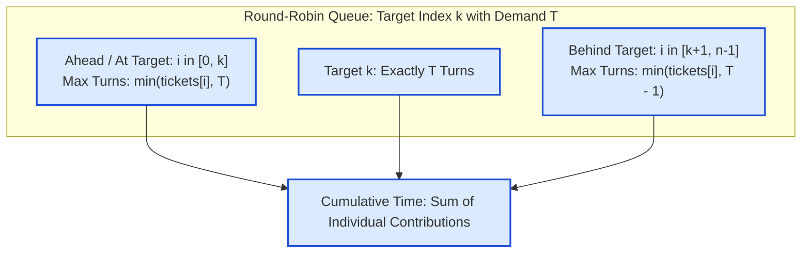

# Guided Example: Time Needed to Buy Tickets

We trace the queue round decomposition, position-dependent truncation, and single-pass closed-form summation on a representative problem instance:

- **Tickets Array:** `[5, 1, 1, 1]`
- **Target Index $k$:** `0`
- **Target Demand $tickets[k]$:** `5`
- **Expected Output:** `8`

---

## 1. Problem Overview & Representative Instance

There are $n$ people standing in a queue waiting to buy tickets, indexed from $0$ to $n - 1$. Each person $i$ wishes to purchase $tickets[i]$ tickets. The transaction follows a strict round-robin procedure:
- The person at the front buys exactly $1$ ticket, which consumes $1$ second.
- If they still need more tickets, they re-enter the line at the very back.
- If they have purchased all their required tickets, they exit the queue immediately.

We are asked to find the total time required for the person at index $k$ to finish purchasing all $tickets[k]$ tickets.

### Naive Queue Simulation vs. Closed-Form Contribution
- Simulating the queue round by round with an active collection takes $\mathcal{O}(n \cdot \max(tickets))$ time. When ticket demands reach $100$ and $n = 100$, this performs thousands of deque operations.
- By analyzing the lifecycle of person $k$, we notice that person $k$ must complete exactly $T = tickets[k]$ purchase turns.
- Every other person $i$ contributes a bounded number of transactions before person $k$ completes their final turn:
  - If $i \le k$ (ahead of or at person $k$), person $i$ participates in at most $T$ rounds.
  - If $i > k$ (behind person $k$), person $i$ participates in at most $T - 1$ rounds because person $k$ exits the queue during the $T$-th round before person $i$ can purchase again.

---

## 2. Theoretical Invariants & Closed-Form Round Decomposition

### Invariant 1: Fixed Turn Horizon for Target $k$
Person $k$ must undergo exactly $T = tickets[k]$ distinct service turns. The simulation halts the exact millisecond person $k$ completes their $T$-th purchase.

### Invariant 2: Positional Ceiling Inequality
Let $C(i)$ denote the total number of tickets bought by person $i$ prior to the completion of person $k$:
1. **For $i \le k$:** Person $i$ is served before or at the same position as $k$ in each pass. During the $T$ passes that person $k$ experiences, person $i$ gets up to $T$ opportunities to buy a ticket. Thus:
   $$C(i) = \min(tickets[i], tickets[k])$$
2. **For $i > k$:** Person $i$ is situated strictly behind person $k$. In the final ($T$-th) pass, person $k$ receives their last ticket and the process terminates instantly. Person $i$ never receives an opportunity in that final round. Thus, person $i$ participates in at most $T - 1$ passes:
   $$C(i) = \min(tickets[i], tickets[k] - 1)$$

Summing across all individuals yields the exact total time:
$$\text{Total Time} = \sum_{i = 0}^{n - 1} C(i) = \sum_{i = 0}^{k} \min(tickets[i], tickets[k]) + \sum_{i = k + 1}^{n - 1} \min(tickets[i], tickets[k] - 1)$$

| Queue Segment | Relation to Index $k$ | Maximum Rounds Participated | Individual Contribution Formula $C(i)$ |
|---|---|---|---|
| Prefix & Target | $i \le k$ | Up to $tickets[k]$ | $\min(tickets[i], tickets[k])$ |
| Suffix | $i > k$ | Up to $tickets[k] - 1$ | $\min(tickets[i], tickets[k] - 1)$ |
| Target Element | $i = k$ | Exactly $tickets[k]$ | $\min(tickets[k], tickets[k]) = tickets[k]$ |

---

## 3. Step-by-Step Worked Execution

We trace the representative instance: `tickets = [5, 1, 1, 1]`, $k = 0$, $tickets[k] = 5$.
Here, $T = 5$, and $T - 1 = 4$.

### Individual Contribution Calculations
1. **Index $i = 0$ (Target $k = 0$):**
   - Condition: $i \le k$ ($0 \le 0$).
   - Ceiling: $\min(tickets[0], T) = \min(5, 5) = 5$.
   - Contribution: $5$ seconds.
2. **Index $i = 1$:**
   - Condition: $i > k$ ($1 > 0$).
   - Ceiling: $\min(tickets[1], T - 1) = \min(1, 4) = 1$.
   - Contribution: $1$ second.
3. **Index $i = 2$:**
   - Condition: $i > k$ ($2 > 0$).
   - Ceiling: $\min(tickets[2], T - 1) = \min(1, 4) = 1$.
   - Contribution: $1$ second.
4. **Index $i = 3$:**
   - Condition: $i > k$ ($3 > 0$).
   - Ceiling: $\min(tickets[3], T - 1) = \min(1, 4) = 1$.
   - Contribution: $1$ second.

Total calculated time:
$$\text{Total Time} = 5 + 1 + 1 + 1 = 8$$

---

## 4. Complete Execution Trace & Simulation Reconciliation

Below is the verification table demonstrating that the mathematical formula matches the physical queue round-robin progression step-by-step:

| Round Number | Queue State at Round Start | Actions Taken During Round | Round Elapsed Time | Cumulative Time | Remaining Demand for $k=0$ |
|---|---|---|---|---|---|
| Round 1 | $[(0:5), (1:1), (2:1), (3:1)]$ | Person $0$ buys ($4$ left), Persons $1, 2, 3$ buy ($0$ left, all exit) | $4$ seconds | $4$ | $4$ |
| Round 2 | $[(0:4)]$ | Person $0$ buys alone ($3$ left) | $1$ second | $5$ | $3$ |
| Round 3 | $[(0:3)]$ | Person $0$ buys alone ($2$ left) | $1$ second | $6$ | $2$ |
| Round 4 | $[(0:2)]$ | Person $0$ buys alone ($1$ left) | $1$ second | $7$ | $1$ |
| Round 5 (Final) | $[(0:1)]$ | Person $0$ buys final ticket ($0$ left, exits) | $1$ second | **$8$** | $0$ |

Now contrast this with an instance where $k$ is at the end: `tickets = [2, 3, 2]`, $k = 2$ ($T = 2$):

| Person Index $i$ | Demand $tickets[i]$ | Positional Rule | Effective Bound | Evaluated Contribution $C(i)$ | Running Sum |
|---|---|---|---|---|---|
| $0$ | $2$ | $i \le k \implies \min(x, 2)$ | $\min(2, 2)$ | $2$ | $2$ |
| $1$ | $3$ | $i \le k \implies \min(x, 2)$ | $\min(3, 2)$ | $2$ | $4$ |
| $2$ | $2$ | $i \le k \implies \min(x, 2)$ | $\min(2, 2)$ | $2$ | **$6$** |

---

## 5. Algorithmic Correctness & Soundness

1. **Independence of Additive Contributions:**
   Because each ticket purchased takes exactly $1$ second, the total time equals the total count of tickets purchased across all persons up to the instant $k$ finishes. Because no person can skip turns or buy out of order, the number of turns each individual receives is determined strictly by their demand and their relative position to $k$.
2. **Exhaustive Positional Partition:**
   - Any person $i \le k$ is served before $k$ in round $r \in \{1, \dots, T\}$. If $tickets[i] \ge T$, they purchase in all $T$ rounds. If $tickets[i] < T$, they exit after $tickets[i]$ rounds. Hence they purchase exactly $\min(tickets[i], T)$ tickets.
   - Any person $i > k$ is served after $k$ in round $r$. In round $T$, $k$ finishes and the process halts immediately. Thus, person $i$ only participates in rounds $1, \dots, T - 1$. Hence they purchase exactly $\min(tickets[i], T - 1)$ tickets.
   The sum of these exact individual quantities is mathematically identical to the simulation duration.

---

## 6. Edge Cases, Pitfalls & Structural Traps

- **Target Requires 1 Ticket ($tickets[k] = 1$):**
  If $tickets[k] = 1$, then $T - 1 = 0$. For any $i > k$, $\min(tickets[i], 0) = 0$. Persons behind $k$ never buy a single ticket, correctly yielding a contribution of $0$.
- **Person Ahead with Surplus Tickets:**
  If a person ahead of $k$ requires $100$ tickets but $tickets[k] = 2$, they only buy $2$ tickets before $k$ leaves. The $\min$ operator correctly bounds their contribution to $2$.
- **Queue Simulation Memory Overhead:**
  A physical queue simulation with nodes or array manipulation requires continuous popping and appending, incurring overhead and potential timeout when numbers are large. The closed-form approach executes in a single linear pass with $\mathcal{O}(1)$ space.

---

## 7. Complexity Analysis

- **Time Complexity:**
  - We perform a single pass over the array of size $n$, computing a constant-time $\min$ comparison at each index.
  - Total time complexity: $\mathcal{O}(n)$, strictly optimal.
- **Auxiliary Space Complexity:**
  - Only a single scalar accumulator is maintained.
  - Total auxiliary space: $\mathcal{O}(1)$ memory.
