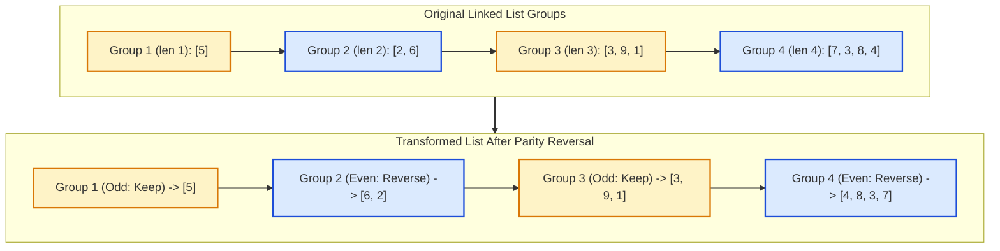

# Guided Example: Reverse Nodes in Even Length Groups

We trace the sequential triangular grouping, actual length parity determination, and in-place sublist reversal pointer manipulation on a representative linked list:

- **Input Head:** `[5, 2, 6, 3, 9, 1, 7, 3, 8, 4]`
- **List Length $n$:** `10`
- **Expected Output:** `[5, 6, 2, 3, 9, 1, 4, 8, 3, 7]`

---

## 1. Problem Overview & Representative Instance

We are given the head of a singly linked list with $n$ nodes. The nodes are sequentially partitioned into groups of increasing natural numbers:
- Group 1 has target length $1$.
- Group 2 has target length $2$.
- Group 3 has target length $3$.
- In general, Group $g$ has target length $g$.
- The final group may contain fewer than its target length if the list runs out of nodes. Its actual length is simply the number of remaining nodes.

**Reversal Rule:** We must reverse the nodes in every group whose **actual length** is **even**. Groups whose actual length is odd must remain in their original order.

### A Critical Structural Nuance
The decision to reverse a group depends strictly on its **actual** length, not its target group index. If Group 5 (target length 5) contains only 4 leftover nodes at the end of the list, its actual length is 4 (an even number), and therefore those 4 nodes must be reversed.

---

## 2. Theoretical Invariants & Pointer Splicing Mechanics

### Invariant 1: Triangular Partition Slicing
Let $L_g$ be the actual number of nodes in Group $g$.
- For full groups, $L_g = g$.
- The cumulative node index at the end of group $g$ follows triangular numbers $T_g = \frac{g(g+1)}{2}$.
- If $n - T_{g-1} < g$, the final group has actual length $L_{\text{final}} = n - T_{g-1}$.

### Invariant 2: Sublist Reversal Anchor and Boundary Splicing
When reversing a subsegment of length $L$ that begins after node $\text{prev}$:
1. Identify the subsegment head: $H = \text{prev.next}$.
2. Reverse the $L$ consecutive links: during the reversal, $H$ becomes the new subsegment tail, and the $L$-th node becomes the new subsegment head $H'$.
3. Preserve the forward frontier: the successor node immediately following the subsegment is $S = \text{cur}$ after $L$ steps.
4. Splice: reconnect $\text{prev.next} = H'$ and reconnect $H.\text{next} = S$.
5. Advance anchor: set $\text{prev} = H$ (the new subsegment tail) to prepare for the subsequent group.

| Variable / Pointer | Role in List Reorganization | Invariant Property |
|---|---|---|
| Sentinel $\text{dummy}$ | Fixed anchor preceding `head` | $\text{dummy.next}$ always references the list head |
| Preceding Anchor $\text{prev}$ | Tail of the previously stabilized group | Points to the node preceding the current active group |
| Group Target Length $g$ | Sequential counter $1, 2, 3, \dots$ | Dictates maximum possible capacity of current group |
| Actual Length $L_g$ | Number of nodes available ($\le g$) | Parity of $L_g$ dictates whether to reverse ($L_g \pmod 2 == 0$) |
| Suffix Frontier $S$ | First node of the next group | Preserved across in-place pointer inversions |

---

## 3. Step-by-Step State Execution Trace

Total nodes: $n = 10$. Nodes: $5 \to 2 \to 6 \to 3 \to 9 \to 1 \to 7 \to 3 \to 8 \to 4$.
Initialize sentinel $\text{dummy} \to 5$, anchor $\text{prev} = \text{dummy}$.

### Group 1: Target Length $g = 1$
- Remaining nodes: $10 \ge 1 \implies$ actual length $L_1 = 1$.
- Parity: $1 \pmod 2 = 1$ (Odd).
- Decision: Do not reverse.
- Advance anchor: $\text{prev}$ advances $1$ step to node $5$.
- Stabilized prefix: $[5]$.

---

### Group 2: Target Length $g = 2$
- Remaining nodes: $10 - 1 = 9 \ge 2 \implies$ actual length $L_2 = 2$.
- Parity: $2 \pmod 2 = 0$ (Even).
- Decision: **Reverse** subsegment $[2, 6]$.
- Reversal mechanics:
  - Original subsegment: $2 \to 6 \to 3 \dots$
  - Inverted subsegment: $6 \to 2$.
  - Reconnect anchor: node $5 \to 6$.
  - Reconnect tail: node $2 \to 3$.
- Advance anchor: $\text{prev}$ is set to new tail node $2$.
- Stabilized prefix: $5 \to 6 \to 2$.

---

### Group 3: Target Length $g = 3$
- Remaining nodes: $10 - 3 = 7 \ge 3 \implies$ actual length $L_3 = 3$.
- Parity: $3 \pmod 2 = 1$ (Odd).
- Decision: Do not reverse.
- Advance anchor: $\text{prev}$ advances $3$ steps from node $2$ through $3 \to 9 \to 1$.
- $\text{prev}$ is now at node $1$.
- Stabilized prefix: $5 \to 6 \to 2 \to 3 \to 9 \to 1$.

---

### Group 4: Target Length $g = 4$
- Remaining nodes: $10 - 6 = 4 \ge 4 \implies$ actual length $L_4 = 4$.
- Parity: $4 \pmod 2 = 0$ (Even).
- Decision: **Reverse** subsegment $[7, 3, 8, 4]$.
- Reversal mechanics:
  - Original subsegment: $7 \to 3 \to 8 \to 4 \to \text{None}$.
  - Inverted subsegment: $4 \to 8 \to 3 \to 7$.
  - Reconnect anchor: node $1 \to 4$.
  - Reconnect tail: node $7 \to \text{None}$.
- Advance anchor: $\text{prev}$ is set to new tail node $7$.
- Stabilized prefix: $5 \to 6 \to 2 \to 3 \to 9 \to 1 \to 4 \to 8 \to 3 \to 7$.

All $10$ nodes are processed. Final list: `[5, 6, 2, 3, 9, 1, 4, 8, 3, 7]`.

---

## 4. Complete Execution Trace Across All Groups

Below is the comprehensive state transition trace across all four groups:

| Group Index $g$ | Target Capacity | Nodes in Window | Actual Length $L_g$ | Parity | Action Taken | Spliced Segment Connection | Resulting Chain Configuration |
|---|---|---|---|---|---|---|---|
| Initialization | — | — | — | — | Attach dummy | $\text{dummy} \to 5$ | $\text{dummy} \to [5, 2, 6, 3, 9, 1, 7, 3, 8, 4]$ |
| Group 1 | $1$ | $[5]$ | $1$ | Odd | Keep as-is | Advance anchor to $5$ | $[5] \to \dots$ |
| Group 2 | $2$ | $[2, 6]$ | $2$ | Even | Reverse nodes | $5 \to 6 \to 2 \to 3$ | $[5, 6, 2] \to \dots$ |
| Group 3 | $3$ | $[3, 9, 1]$ | $3$ | Odd | Keep as-is | Advance anchor to $1$ | $[5, 6, 2, 3, 9, 1] \to \dots$ |
| Group 4 | $4$ | $[7, 3, 8, 4]$ | $4$ | Even | Reverse nodes | $1 \to 4 \to 8 \to 3 \to 7 \to \text{None}$ | $[5, 6, 2, 3, 9, 1, 4, 8, 3, 7]$ |

### Comparison Table: Full vs. Truncated Final Groups
To highlight the importance of actual length over target group index, consider an alternate list of length $n = 5$ with elements $[1, 2, 3, 4, 5]$:

| Group Index $g$ | Target Capacity | Available Nodes | Actual Length $L$ | Parity of Actual Length | Action Taken | Final Node Order |
|---|---|---|---|---|---|---|
| Group 1 | $1$ | $[1]$ | $1$ | Odd | Keep | $[1]$ |
| Group 2 | $2$ | $[2, 3]$ | $2$ | Even | Reverse | $[3, 2]$ |
| Group 3 | $3$ | $[4, 5]$ | $2$ ($< 3$) | **Even** (2 nodes left) | **Reverse** (Even actual length!) | $[5, 4]$ |

If an implementation incorrectly inspected target group index $g = 3$ (which is odd) instead of the actual node count $2$ (which is even), it would fail to reverse $[4, 5]$, resulting in an incorrect output.

---

## 5. Algorithmic Correctness & Soundness

1. **Pre-Counting vs. Lookahead Invariant:**
   By measuring list length $n$ or looking ahead up to $g$ nodes before performing any reversal, the algorithm determines the exact actual length $L = \min(g, \text{remaining})$. The parity test $L \pmod 2 == 0$ operates on the ground-truth node count.
2. **Pointer Integrity during In-Place Inversion:**
   The standard three-pointer sublist inversion maintains `prev`, `cur`, and `next_node`. The initial head becomes the terminal tail with its `next` pointer directed to the unprocessed suffix. The terminal node of the reversed block becomes the new target of the anchor's `next` reference. No reference is overwritten before its destination is preserved.
3. **Loop Termination & Completeness:**
   Since each group advances the processing anchor by exactly $L_g \ge 1$ nodes, the remaining node count strictly decreases on every iteration. The process terminates in exactly $\mathcal{O}(\sqrt{n})$ group steps when all $n$ nodes have been processed.

---

## 6. Edge Cases, Pitfalls & Structural Traps

- **Truncated Last Group Parity Trap:**
  The most notorious bug is checking `group_number % 2 == 0` instead of `actual_length % 2 == 0`. When the final group is truncated, its parity often differs from the group number.
- **Lost Suffix Reference:**
  When reversing $L$ nodes, failing to save the pointer to the $(L+1)$-th node causes the entire remainder of the list to be disconnected and lost.
- **Single-Node Lists ($n = 1$):**
  Group 1 has length 1 (odd). The loop does not trigger a reversal and returns `head` immediately.
- **Accidental Pointer Cycles:**
  If the old subsegment head (which becomes the new tail) is not explicitly connected to the $(L+1)$-th node (or `None`), a cycle can form between the reversed nodes.

---

## 7. Complexity Analysis

- **Time Complexity:**
  - Finding total length $n$ takes $\mathcal{O}(n)$ steps.
  - Traversing and reversing groups: each node is traversed once to advance or reverse links.
  - Total time complexity: $\mathcal{O}(n)$ linear time.
- **Auxiliary Space Complexity:**
  - All pointer manipulations are executed in place using a fixed set of node references (`dummy`, `prev`, `cur`, `tail`).
  - Total auxiliary space: $\mathcal{O}(1)$ constant memory.