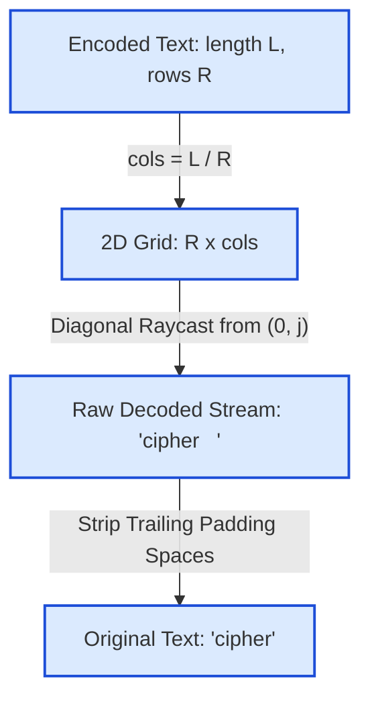

# Guided Example: Decode the Slanted Ciphertext

We trace the matrix dimension reconstruction, row-major diagonal traversal, and trailing whitespace trimming on a representative cipher instance:

- **Encoded Text:** `"ch   ie   pr"`
- **Rows:** `3`
- **Encoded Text Length:** `12`
- **Expected Output:** `"cipher"`

---

## 1. Problem Overview & Representative Instance

An original plain string was encoded into a 2D character matrix with `rows` rows. The characters were placed diagonally from top-left to bottom-right along successive diagonals:
- The first diagonal begins at cell $(0, 0)$ and moves $(1, 1), (2, 2), \dots$
- When that diagonal hits a matrix boundary, the next diagonal begins at cell $(0, 1)$ and moves $(1, 2), (2, 3), \dots$
- Subsequent diagonals start at $(0, 2), (0, 3), \dots, (0, \text{cols} - 1)$.
- Unused trailing positions in the matrix were padded with spaces (`' '`).
- The matrix was then serialized into a 1D string `encodedText` by reading the cells row by row from top to bottom, left to right.

Given `encodedText` and `rows`, our goal is to reconstruct the original plain text, preserving all authentic interior spaces while stripping off trailing padding spaces.

For our instance:
- Total length $L = 12$, rows $R = 3$.
- Columns: $\text{cols} = L / R = 12 / 3 = 4$.
- The 2D matrix spans coordinates $[0, 2] \times [0, 3]$.

---

## 2. Theoretical Invariants & Matrix Stride Arithmetic

### Invariant 1: Row-Major Coordinate Bijection
A character located at row $x \in [0, \text{rows} - 1]$ and column $y \in [0, \text{cols} - 1]$ resides at 1D string index:
$$\text{index}(x, y) = x \cdot \text{cols} + y$$
Because $0 \le x < \text{rows}$ and $0 \le y < \text{cols}$, this mapping is a strict bijection onto $[0, L - 1]$. We never need to materialize an explicit 2D matrix; we can directly sample characters via stride arithmetic.

### Invariant 2: Diagonal Ray Trajectory
Every diagonal $j \in [0, \text{cols} - 1]$ originates at $(0, j)$.
Successive elements along diagonal $j$ advance with direction vector $(\Delta x, \Delta y) = (+1, +1)$:
$$(x_k, y_k) = (k, j + k) \quad \text{for } k = 0, 1, \dots$$
The ray terminates when either:
- $x_k \ge \text{rows}$ (exits bottom edge), or
- $y_k \ge \text{cols}$ (exits right edge).

### Invariant 3: Semantic Interior Spaces vs. Suffix Padding
The original message may contain authentic interior space characters (such as between words). However, spaces introduced solely to pad empty cells at the end of the rectangular grid appear strictly as a suffix of the decoded sequence. Stripping trailing spaces from the right preserves all legitimate internal spaces.

| Component | Algebraic Formula | Representative Value ($L=12, R=3$) |
|---|---|---|
| Total Characters $L$ | $\text{length}(\text{encodedText})$ | $12$ |
| Row Count $R$ | `rows` | $3$ |
| Column Count $C$ | $L / R$ | $4$ |
| Stride Address | $x \cdot C + y$ | $x \cdot 4 + y$ |
| Diagonal Origin | $(0, j)$ where $0 \le j < C$ | $(0, 0), (0, 1), (0, 2), (0, 3)$ |
| Ray Termination | $x \ge R \lor y \ge C$ | $x \ge 3 \lor y \ge 4$ |

---

## 3. Step-by-Step State Execution Trace

We reconstruct the matrix view for `encodedText = "ch   ie   pr"` ($R = 3, C = 4$):

### 2D Matrix Representation
- Row 0 ($0 \le \text{idx} \le 3$): `'c'`, `'h'`, `' '`, `' '`
- Row 1 ($4 \le \text{idx} \le 7$): `' '`, `'i'`, `'e'`, `' '`
- Row 2 ($8 \le \text{idx} \le 11$): `' '`, `' '`, `'p'`, `'r'`

| Row $\backslash$ Col | Col 0 | Col 1 | Col 2 | Col 3 |
|---|---|---|---|---|
| **Row 0** | `'c'` (idx 0) | `'h'` (idx 1) | `' '` (idx 2) | `' '` (idx 3) |
| **Row 1** | `' '` (idx 4) | `'i'` (idx 5) | `'e'` (idx 6) | `' '` (idx 7) |
| **Row 2** | `' '` (idx 8) | `' '` (idx 9) | `'p'` (idx 10) | `'r'` (idx 11) |

---

### Phase 2: Diagonal Raycasting Trace

#### Diagonal $j = 0$ (Starts at $(0, 0)$):
- Step $k = 0$: $(x, y) = (0, 0) \implies \text{idx} = 0 \cdot 4 + 0 = 0 \implies \text{char} = \text{'c'}$.
- Step $k = 1$: $(x, y) = (1, 1) \implies \text{idx} = 1 \cdot 4 + 1 = 5 \implies \text{char} = \text{'i'}$.
- Step $k = 2$: $(x, y) = (2, 2) \implies \text{idx} = 2 \cdot 4 + 2 = 10 \implies \text{char} = \text{'p'}$.
- Step $k = 3$: $(x, y) = (3, 3) \implies x = 3 \ge \text{rows} \implies$ Ray terminates.
- Emitted chunk: `"cip"`.

#### Diagonal $j = 1$ (Starts at $(0, 1)$):
- Step $k = 0$: $(x, y) = (0, 1) \implies \text{idx} = 0 \cdot 4 + 1 = 1 \implies \text{char} = \text{'h'}$.
- Step $k = 1$: $(x, y) = (1, 2) \implies \text{idx} = 1 \cdot 4 + 2 = 6 \implies \text{char} = \text{'e'}$.
- Step $k = 2$: $(x, y) = (2, 3) \implies \text{idx} = 2 \cdot 4 + 3 = 11 \implies \text{char} = \text{'r'}$.
- Step $k = 3$: $(x, y) = (3, 4) \implies x \ge \text{rows} \implies$ Ray terminates.
- Emitted chunk: `"her"`.

#### Diagonal $j = 2$ (Starts at $(0, 2)$):
- Step $k = 0$: $(x, y) = (0, 2) \implies \text{idx} = 0 \cdot 4 + 2 = 2 \implies \text{char} = \text{' '}$.
- Step $k = 1$: $(x, y) = (1, 3) \implies \text{idx} = 1 \cdot 4 + 3 = 7 \implies \text{char} = \text{' '}$.
- Step $k = 2$: $(x, y) = (2, 4) \implies y = 4 \ge \text{cols} \implies$ Ray terminates.
- Emitted chunk: `"  "`.

#### Diagonal $j = 3$ (Starts at $(0, 3)$):
- Step $k = 0$: $(x, y) = (0, 3) \implies \text{idx} = 0 \cdot 4 + 3 = 3 \implies \text{char} = \text{' '}$.
- Step $k = 1$: $(x, y) = (1, 4) \implies y = 4 \ge \text{cols} \implies$ Ray terminates.
- Emitted chunk: `" "`.

---

## 4. Complete Execution Trace & Suffix Trimming

Concatenating characters across all diagonals in order:

| Diagonal Origin $j$ | Traversed Cells $(x, y)$ | Linear Indices Visited | Extracted Characters | Substring Accumulated |
|---|---|---|---|---|
| $j = 0$ | $(0, 0), (1, 1), (2, 2)$ | $0, 5, 10$ | `'c'`, `'i'`, `'p'` | `"cip"` |
| $j = 1$ | $(0, 1), (1, 2), (2, 3)$ | $1, 6, 11$ | `'h'`, `'e'`, `'r'` | `"cipher"` |
| $j = 2$ | $(0, 2), (1, 3)$ | $2, 7$ | `' '`, `' '` | `"cipher  "` |
| $j = 3$ | $(0, 3)$ | $3$ | `' '` | `"cipher   "` |

### Trimming Operation:
- Raw decoded string: `"cipher   "`.
- Trimming trailing spaces from right: `"cipher   ".rstrip()` $\implies$ `"cipher"`.
- Final output: `"cipher"`.

---

## 5. Algorithmic Correctness & Soundness

1. **Exact Inverse Permutation:**
   The encoding algorithm writes plain characters along diagonals $(0, j), (1, j+1), \dots$ in increasing order of $j$, then serializes the matrix in row-major order.
   By reversing this mapping—computing $\text{cols} = L / \text{rows}$ and traversing the cells in the identical diagonal order—we recover the exact permutation of original characters and padding spaces.
2. **Boundary Safety:**
   Because each diagonal loop halts as soon as $x = \text{rows}$ or $y = \text{cols}$, every computed index $x \cdot \text{cols} + y$ is guaranteed to satisfy:
   $$0 \le x \cdot \text{cols} + y < \text{rows} \cdot \text{cols} = L$$
   Out-of-bounds access is mathematically impossible.
3. **Preservation of Authentic Spaces:**
   Authentic spaces within sentences (e.g. between words) appear earlier in the stream prior to the last printable character. Stripping from the right (`rstrip()`) discards only the padding spaces trailing behind the final character, leaving all interior spaces intact.

---

## 6. Edge Cases, Pitfalls & Structural Traps

- **Single Row ($rows = 1$):**
  When $rows = 1$, $\text{cols} = L$. The diagonals have length $1$: $(0, 0), (0, 1), \dots, (0, L-1)$. The decoded text is identical to `encodedText.rstrip()`.
- **Empty String ($L = 0$):**
  If `encodedText` is empty, $\text{cols} = 0$. The diagonal loop over $j \in [0, 0)$ does not execute and returns `""`.
- **Internal Spaces in Sentence:**
  In phrases like `"i love leetcode"`, multiple spaces occur naturally between words. A common mistake is stripping all spaces or splitting words; only trailing spaces must be removed.
- **Narrow Matrix ($rows > cols$):**
  A diagonal ray can terminate prematurely on the right boundary ($y \ge \text{cols}$) before reaching the bottom row ($x < \text{rows}$). Both conditions must be guarded.

---

## 7. Complexity Analysis

- **Time Complexity:**
  - Finding $\text{cols} = L / \text{rows}$ takes $\mathcal{O}(1)$ time.
  - Each cell of the virtual matrix is visited along at most one diagonal ray. The total number of cell evaluations across all diagonals is bounded by $\text{rows} \cdot \text{cols} = L$.
  - Trimming trailing spaces takes $\mathcal{O}(L)$ time.
  - Total time complexity: $\mathcal{O}(L)$ where $L$ is the length of `encodedText`.
- **Auxiliary Space Complexity:**
  - We build a character list of length at most $L$.
  - No 2D matrix structure is allocated.
  - Total auxiliary space: $\mathcal{O}(L)$ to store the decoded output.
