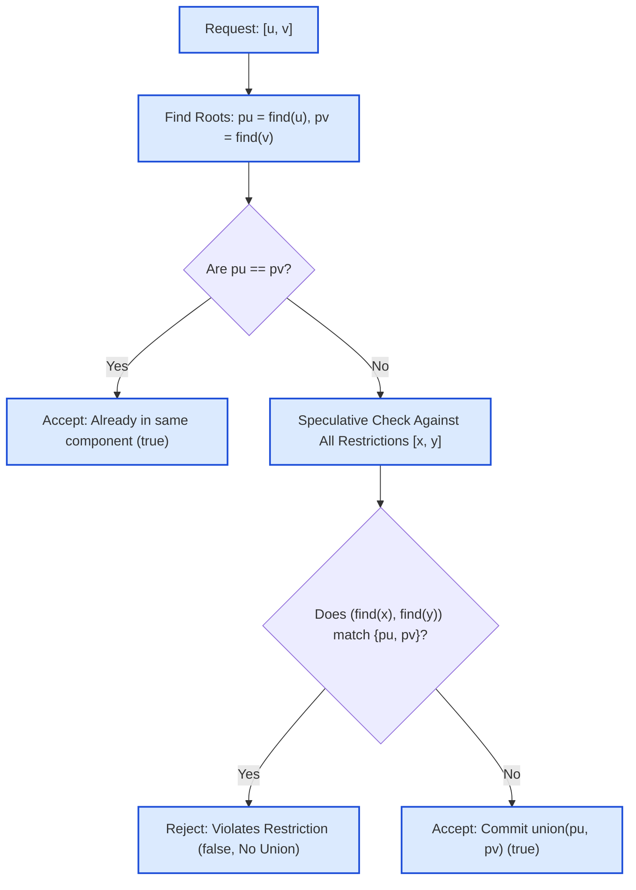

# Guided Example: Process Restricted Friend Requests

We trace the Disjoint Set Union (DSU) partitioning, speculative component merge validation, and restriction-conflict prevention on a representative social graph instance:

- **Number of Persons $n$:** `5`
- **Restrictions:** `[[0, 1], [1, 2], [2, 3]]`
- **Requests:** `[[0, 4], [1, 2], [3, 1], [3, 4]]`
- **Expected Output:** `[true, false, true, false]`

---

## 1. Problem Overview & Representative Instance

We are given an integer $n$ denoting $n$ people labeled $0$ to $n - 1$. Initially, no two people are friends. We are also given:
1. `restrictions`: A list of pairs $[x, y]$ indicating that person $x$ and person $y$ can **never** become friends, either directly or indirectly through intermediate friends.
2. `requests`: A sequence of prospective friendship proposals $[u, v]$ evaluated strictly in chronological order.

For each request $[u, v]$:
- If making $u$ and $v$ friends would cause **any** restricted pair $[x, y]$ to end up in the same connected friendship component, the request is **rejected** (`false`), and the friendship network remains unchanged.
- Otherwise, the request is **accepted** (`true`), and the friendship is formed, merging their respective friendship components.

We seek the boolean decision array for all requests in sequence.

---

## 2. Theoretical Invariants & Speculative DSU Mechanics

### Invariant 1: Friendship Equivalence Classes
Friendship is an equivalence relation (reflexive, symmetric, transitive). The friendship network is uniquely partitioned into disjoint connected components $C_1, C_2, \dots, C_k$ managed by a Disjoint Set Union (DSU) forest with path compression.

### Invariant 2: The Forbidden Root Pair Invariant
Let $\text{root}(i)$ denote the canonical representative of person $i$. A restriction $[x, y]$ dictates that $x$ and $y$ can never share the same component, meaning:
$$\text{root}(x) \neq \text{root}(y) \quad \text{for all } [x, y] \in \text{restrictions}$$

When evaluating a request $[u, v]$ with distinct roots $pu = \text{root}(u)$ and $pv = \text{root}(v)$:
- Merging components $pu$ and $pv$ collapses the set of roots $\{pu, pv\}$ into a single unified root.
- This merge is valid if and only if **no** restriction $[x, y]$ has its two members anchored in $\{pu, pv\}$.
- Formally, the merge is forbidden if there exists $[x, y]$ such that:
  $$\{\text{root}(x), \text{root}(y)\} = \{pu, pv\}$$

| State Parameter | Mathematical Definition | Role in Decision Process |
|---|---|---|
| DSU Parent Array $p$ | $p[i]$ points to parent of $i$ | Maintains forest structure and connectivity |
| Canonical Root $pu, pv$ | $\text{find}(u), \text{find}(v)$ | Identifies active component boundaries |
| Forbidden Pair $\{px, py\}$ | $\{\text{find}(x), \text{find}(y)\}$ | Dynamic component endpoints of restriction $[x, y]$ |
| Speculative Gate | $\{pu, pv\} \stackrel{?}{=} \{px, py\}$ | Decides whether proposed edge causes an illegal merge |

---

## 3. Step-by-Step Worked Execution

We trace the representative instance: $n = 5$, restrictions $= [[0, 1], [1, 2], [2, 3]]$, requests $= [[0, 4], [1, 2], [3, 1], [3, 4]]$.
Initial component partitions: $\{0\}, \{1\}, \{2\}, \{3\}, \{4\}$. DSU parents: $p = [0, 1, 2, 3, 4]$.

---

### Request 1: $[0, 4]$
1. **Find Roots:**
   - $pu = \text{find}(0) = 0$
   - $pv = \text{find}(4) = 4$
   - Because $0 \neq 4$, evaluate speculative conflict against all 3 restrictions.
2. **Scan Restrictions:**
   - Restriction $[0, 1]$: roots are $\{\text{find}(0), \text{find}(1)\} = \{0, 1\} \neq \{0, 4\}$. Safe.
   - Restriction $[1, 2]$: roots are $\{1, 2\} \neq \{0, 4\}$. Safe.
   - Restriction $[2, 3]$: roots are $\{2, 3\} \neq \{0, 4\}$. Safe.
3. **Decision & Union:**
   - No restriction violated $\implies$ **Accept (`true`)**.
   - Commit union: set $p[0] = 4$.
   - Components: $\{1\}, \{2\}, \{3\}, \{0, 4\}$ (rooted at $4$).

---

### Request 2: $[1, 2]$
1. **Find Roots:**
   - $pu = \text{find}(1) = 1$
   - $pv = \text{find}(2) = 2$
   - Distinct roots $1 \neq 2$.
2. **Scan Restrictions:**
   - Restriction $[0, 1]$: roots are $\{4, 1\} \neq \{1, 2\}$.
   - Restriction $[1, 2]$: roots are $\{\text{find}(1), \text{find}(2)\} = \{1, 2\}$.
   - **Conflict Detected!** The set of proposed roots $\{pu, pv\} = \{1, 2\}$ directly matches the restricted pair $\{1, 2\}$.
3. **Decision & Rejection:**
   - Merging would place restricted persons $1$ and $2$ in the same component.
   - **Reject (`false`)**.
   - No union is performed. DSU state remains unchanged.

---

### Request 3: $[3, 1]$
1. **Find Roots:**
   - $pu = \text{find}(3) = 3$
   - $pv = \text{find}(1) = 1$
   - Distinct roots $3 \neq 1$.
2. **Scan Restrictions:**
   - Restriction $[0, 1]$: roots are $\{4, 1\} \neq \{3, 1\}$. Safe.
   - Restriction $[1, 2]$: roots are $\{1, 2\} \neq \{3, 1\}$. Safe.
   - Restriction $[2, 3]$: roots are $\{2, 3\} \neq \{3, 1\}$. Safe.
3. **Decision & Union:**
   - No restriction violated $\implies$ **Accept (`true`)**.
   - Commit union: set $p[3] = 1$.
   - Components: $\{2\}, \{0, 4\}$, $\{1, 3\}$ (rooted at $1$).

---

### Request 4: $[3, 4]$
1. **Find Roots:**
   - $pu = \text{find}(3) = 1$ (component $\{1, 3\}$)
   - $pv = \text{find}(4) = 4$ (component $\{0, 4\}$)
   - Distinct roots $1 \neq 4$.
2. **Scan Restrictions:**
   - Restriction $[0, 1]$:
     - $\text{find}(0) = 4$
     - $\text{find}(1) = 1$
     - Forbidden root pair is $\{4, 1\}$.
     - Proposed merge pair is $\{pu, pv\} = \{1, 4\}$.
     - **Conflict Detected!** Because $\{1, 4\} = \{4, 1\}$, merging components $\{1, 3\}$ and $\{0, 4\}$ would indirectly make restricted individuals $0$ and $1$ friends!
3. **Decision & Rejection:**
   - Violates restriction $[0, 1]$.
   - **Reject (`false`)**.
   - No union is performed.

Concatenated results across all requests:
$$\text{output} = [\text{true}, \text{false}, \text{true}, \text{false}]$$

---

## 4. Complete Execution Trace

Below is the comprehensive audit table across all chronological requests:

| Request Index | Pair $[u, v]$ | Root $pu = \text{find}(u)$ | Root $pv = \text{find}(v)$ | Conflict Check Against Restrictions | Decision | Action Taken | Resulting Components |
|---|---|---|---|---|---|---|---|
| 0 | $[0, 4]$ | $0$ | $4$ | $\{0, 4\}$ conflicts with none | **`true`** | Union $0 \to 4$ | $\{0, 4\}, \{1\}, \{2\}, \{3\}$ |
| 1 | $[1, 2]$ | $1$ | $2$ | Direct match with restriction $[1, 2]$ | **`false`** | Reject; no change | $\{0, 4\}, \{1\}, \{2\}, \{3\}$ |
| 2 | $[3, 1]$ | $3$ | $1$ | $\{3, 1\}$ conflicts with none | **`true`** | Union $3 \to 1$ | $\{0, 4\}, \{1, 3\}, \{2\}$ |
| 3 | $[3, 4]$ | $1$ | $4$ | Matches restriction $[0, 1]$ ($\text{roots } \{4, 1\}$) | **`false`** | Reject; no change | $\{0, 4\}, \{1, 3\}, \{2\}$ |

### Restriction Root Dynamic Evolution Table
Observe how the roots of the restricted pairs evolve as components merge:

| Restriction | Original Pair | Roots at Request 0 | Roots at Request 2 | Roots at Request 3 | Conflict with $\{1, 4\}$? |
|---|---|---|---|---|---|
| $R_1$ | $[0, 1]$ | $\{0, 1\}$ | $\{4, 1\}$ | $\{4, 1\}$ | **Yes: Matches $\{1, 4\}$** |
| $R_2$ | $[1, 2]$ | $\{1, 2\}$ | $\{1, 2\}$ | $\{1, 2\}$ | No ($\{1, 2\} \neq \{1, 4\}$) |
| $R_3$ | $[2, 3]$ | $\{2, 3\}$ | $\{2, 3\}$ | $\{2, 1\}$ | No ($\{2, 1\} \neq \{1, 4\}$) |

---

## 5. Algorithmic Correctness & Soundness

1. **Equivalence Class Preservation:**
   Because the DSU data structure partitions elements into disjoint sets, checking whether $\text{find}(x) == \text{find}(y)$ is a necessary and sufficient test for whether $x$ and $y$ are connected.
2. **Soundness of Speculative Validation:**
   If a proposed union of components $pu$ and $pv$ were enacted, every pair of vertices $(x, y)$ such that $x \in pu$ and $y \in pv$ would become connected.
   Therefore, an illegal connection occurs if and only if there exists a restriction $[x, y]$ with $x \in pu$ and $y \in pv$ (or vice versa).
   Testing whether $\{\text{find}(x), \text{find}(y)\} = \{pu, pv\}$ checks this exact condition across all restrictions.
3. **Sequential Invariance:**
   Requests must be evaluated in order. Rejected requests do not modify the DSU, ensuring that future requests are validated against the true, uncorrupted state of the graph.

---

## 6. Edge Cases, Pitfalls & Structural Traps

- **Already Connected Vertices ($pu == pv$):**
  If a request connects two people already in the same component, no new edges are added, and no new connections are formed. Such requests always succeed (`true`) and require no restriction scan.
- **Indirect Restriction Activation:**
  A common pitfall is checking only direct edges (e.g. checking whether $[u, v]$ equals $[x, y]$). As shown in Request 4, neither $3$ nor $4$ is directly restricted from each other, but merging their components links $0$ and $1$. The check must use canonical roots ($\text{find}$), never raw vertex indices.
- **Rollback Complexity:**
  Modifying DSU pointers before validating restrictions requires rollback mechanics. Speculatively testing roots *before* writing parent pointers keeps the DSU strictly immutable on rejected requests.

---

## 7. Complexity Analysis

- **Time Complexity:**
  - Let $N$ be the number of people, $M$ the number of requests, and $R$ the number of restrictions.
  - For each of the $M$ requests:
    - Finding $pu$ and $pv$ takes $\mathcal{O}(\alpha(N))$ using path compression.
    - Scanning all $R$ restrictions requires $2R$ root queries, taking $\mathcal{O}(R \cdot \alpha(N))$ time.
    - Committing the union takes $\mathcal{O}(\alpha(N))$.
  - Total time complexity: $\mathcal{O}(M \cdot R \cdot \alpha(N))$. For $N \le 1000$ and $M, R \le 1000$, this requires $\approx 10^6$ operations, executing well within typical limits.
- **Auxiliary Space Complexity:**
  - The DSU parent array requires $\mathcal{O}(N)$ space.
  - Total auxiliary space: $\mathcal{O}(N + M)$ including the boolean answer output array.
