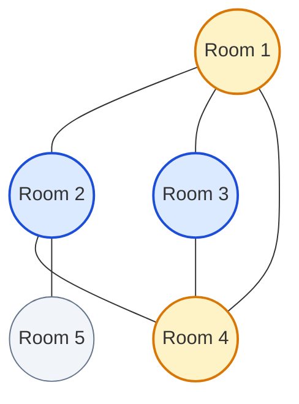

# Guided Example: Paths in Maze That Lead to Same Room

We trace graph adjacency representation, topological triangular cycle ($K_3$) detection, and canonical symmetric triple deduplication on a representative maze instance:

- **Rooms Count $n$:** `5`
- **Corridors:** `[[1, 2], [5, 2], [4, 1], [2, 4], [3, 1], [3, 4]]`
- **Expected Output:** `2`

---

## 1. Problem Overview & Representative Instance

A maze consists of $n$ rooms numbered from $1$ to $n$. A 2D array `corridors` describes bidirectional passages connecting pairs of rooms. We seek the number of different paths of length $3$ that start and end in the same room without traversing any corridor more than once.
Such a path corresponds to a simple cycle of length $3$, commonly known as a **graph triangle** ($K_3$). Two cycles are considered identical if they visit the exact same set of three rooms $\{u, v, w\}$ regardless of starting point or traversal orientation.

For our instance:
- Edges: $(1, 2)$, $(5, 2)$, $(4, 1)$, $(2, 4)$, $(3, 1)$, $(3, 4)$.
- Room $5$ has degree $1$ (connected only to room $2$).
- Triangles:
  1. $\{1, 2, 4\}$ via edges $(1, 2), (2, 4), (4, 1)$.
  2. $\{1, 3, 4\}$ via edges $(1, 3), (3, 4), (4, 1)$.
- Total count of valid triangular cycles: $2$.

---

## 2. Theoretical Invariants & Triangle Enumeration

### Invariant 1: Definition of a 3-Cycle Subgraph ($K_3$)
A subset of three distinct vertices $\{u, v, w\} \subseteq V$ forms a cycle of length 3 if and only if all three pairwise undirected edges exist:
$$(u, v) \in E \land (v, w) \in E \land (w, u) \in E$$

### Invariant 2: Deduplication via Vertex Ordering vs. 3-Fold Division
- **Approach A (Vertex-Centered Neighbor Pairing):**
  For each vertex $u$, iterate over all unordered pairs of its neighbors $\{v, w\} \subseteq N(u)$. If $(v, w) \in E$, increment an accumulator. Because every triangle $\{u, v, w\}$ contains three distinct vertices, it will be discovered once centered at $u$, once at $v$, and once at $w$. The true triangle count is:
  $$T = \frac{\text{Total Detected Instances}}{3}$$
- **Approach B (Canonical Directed Ordering $u < v < w$):**
  We orient every undirected edge $(x, y)$ from smaller index to larger index ($x \to y$ where $x < y$). A triangle then forms a directed DAG configuration $u \to v$, $u \to w$, and $v \to w$. Each triangle has a unique minimum vertex $u$ and unique median vertex $v$, so it is counted exactly once without division.

| Graph Parameter | Representation in Sample | Structural Role |
|---|---|---|
| Vertices $V$ | $\{1, 2, 3, 4, 5\}$ | Set of rooms in the maze |
| Undirected Edges $E$ | $6$ bidirectional corridors | Reachable passage links |
| Neighbor Sets $N(u)$ | Hash sets of adjacent rooms | Facilitates $\mathcal{O}(1)$ edge containment tests |
| Shared Edge $(1, 4)$ | Appears in $\{1, 2, 4\}$ and $\{1, 3, 4\}$ | Chord bounding two adjacent triangles |

---

## 3. Step-by-Step Worked Execution

We trace the canonical vertex-centered enumeration on the adjacency structure:

### Adjacency Graph Construction
- $N(1) = \{2, 3, 4\}$
- $N(2) = \{1, 4, 5\}$
- $N(3) = \{1, 4\}$
- $N(4) = \{1, 2, 3\}$
- $N(5) = \{2\}$

---

### Vertex-by-Vertex Neighbor Pair Scan

#### Processing Room $u = 1$:
- Neighbors: $N(1) = \{2, 3, 4\}$.
- Distinct unordered neighbor pairs $\binom{|N(1)|}{2} = \binom{3}{2} = 3$ pairs:
  1. Pair $\{2, 3\}$: Is $2 \in N(3)$? False (no corridor between 2 and 3).
  2. Pair $\{2, 4\}$: Is $2 \in N(4)$? **True!** Edge $(2, 4)$ exists $\implies$ Triangle $\{1, 2, 4\}$ identified.
  3. Pair $\{3, 4\}$: Is $3 \in N(4)$? **True!** Edge $(3, 4)$ exists $\implies$ Triangle $\{1, 3, 4\}$ identified.
- Discovered at vertex 1: $2$ triangles.

#### Processing Room $u = 2$:
- Neighbors: $N(2) = \{1, 4, 5\}$.
- Distinct pairs from $N(2)$:
  1. Pair $\{1, 4\}$: Is $1 \in N(4)$? **True!** Edge $(1, 4)$ exists $\implies$ Triangle $\{2, 1, 4\}$ identified.
  2. Pair $\{1, 5\}$: Is $1 \in N(5)$? False.
  3. Pair $\{4, 5\}$: Is $4 \in N(5)$? False.
- Discovered at vertex 2: $1$ triangle.

#### Processing Room $u = 3$:
- Neighbors: $N(3) = \{1, 4\}$.
- Distinct pairs from $N(3)$:
  1. Pair $\{1, 4\}$: Is $1 \in N(4)$? **True!** Edge $(1, 4)$ exists $\implies$ Triangle $\{3, 1, 4\}$ identified.
- Discovered at vertex 3: $1$ triangle.

#### Processing Room $u = 4$:
- Neighbors: $N(4) = \{1, 2, 3\}$.
- Distinct pairs from $N(4)$:
  1. Pair $\{1, 2\}$: Is $1 \in N(2)$? **True!** Edge $(1, 2)$ exists $\implies$ Triangle $\{4, 1, 2\}$ identified.
  2. Pair $\{1, 3\}$: Is $1 \in N(3)$? **True!** Edge $(1, 3)$ exists $\implies$ Triangle $\{4, 1, 3\}$ identified.
  3. Pair $\{2, 3\}$: Is $2 \in N(3)$? False.
- Discovered at vertex 4: $2$ triangles.

#### Processing Room $u = 5$:
- Neighbors: $N(5) = \{2\}$ (degree $1$).
- Number of pairs: $\binom{1}{2} = 0$.
- Discovered at vertex 5: $0$ triangles.

---

### Aggregation and Normalization
Total identified instances:
$$\text{Sum} = 2 + 1 + 1 + 2 + 0 = 6$$
Accounting for 3-fold vertex symmetry:
$$\text{Distinct Triangles} = \frac{6}{3} = 2$$

---

## 4. Complete Execution Trace

Below is the comprehensive pairing audit table across all vertices:

| Vertex $u$ | Neighbor Set $N(u)$ | Evaluated Neighbor Pair $\{v, w\}$ | Edge $(v, w) \in E$? | Verified 3-Cycle $\{u, v, w\}$ | Running Matches |
|---|---|---|---|---|---|
| $1$ | $\{2, 3, 4\}$ | $\{2, 3\}$ | False | None | $0$ |
| $1$ | $\{2, 3, 4\}$ | $\{2, 4\}$ | **True** | $\{1, 2, 4\}$ | $1$ |
| $1$ | $\{2, 3, 4\}$ | $\{3, 4\}$ | **True** | $\{1, 3, 4\}$ | $2$ |
| $2$ | $\{1, 4, 5\}$ | $\{1, 4\}$ | **True** | $\{2, 1, 4\}$ | $3$ |
| $2$ | $\{1, 4, 5\}$ | $\{1, 5\}$ | False | None | $3$ |
| $2$ | $\{1, 4, 5\}$ | $\{4, 5\}$ | False | None | $3$ |
| $3$ | $\{1, 4\}$ | $\{1, 4\}$ | **True** | $\{3, 1, 4\}$ | $4$ |
| $4$ | $\{1, 2, 3\}$ | $\{1, 2\}$ | **True** | $\{4, 1, 2\}$ | $5$ |
| $4$ | $\{1, 2, 3\}$ | $\{1, 3\}$ | **True** | $\{4, 1, 3\}$ | $6$ |
| $4$ | $\{1, 2, 3\}$ | $\{2, 3\}$ | False | None | $6$ |
| $5$ | $\{2\}$ | — | — | None | $6$ |

### Canonical Triangles Discovered:
1. Cycle $\{1, 2, 4\}$: detected at $u = 1$, $u = 2$, and $u = 4$ ($3$ times).
2. Cycle $\{1, 3, 4\}$: detected at $u = 1$, $u = 3$, and $u = 4$ ($3$ times).
Final count: $6 / 3 = 2$.

---

## 5. Algorithmic Correctness & Soundness

1. **Equivalence of 3-Cycle and Triplet Clique:**
   A simple closed path of length 3 in a simple undirected graph consists of three vertices $u, v, w$ and edges $(u, v), (v, w), (w, u)$. This is topologically identical to the complete graph $K_3$.
2. **Symmetry and Exact 3-Fold Multiplicity:**
   For every triangle $\{u, v, w\}$, $v$ and $w$ are neighbors of $u$, $u$ and $w$ are neighbors of $v$, and $u$ and $v$ are neighbors of $w$.
   The pair $\{v, w\}$ is examined when centering at $u$; $\{u, w\}$ when centering at $v$; and $\{u, v\}$ when centering at $w$.
   No other vertex can have $\{u, v, w\}$ in its neighborhood. Hence, every triangle contributes exactly $3$ to the cumulative sum, and integer division by $3$ produces the exact count.
3. **No Double-Count of Edges:**
   Because neighbor pairs $\{v, w\}$ are unordered (combinations without repetition), each pair is tested at most once per center vertex.

---

## 6. Edge Cases, Pitfalls & Structural Traps

- **Pendant Vertices ($degree < 2$):**
  A vertex with degree $0$ or $1$ cannot anchor any triangle since $\binom{0}{2} = \binom{1}{2} = 0$. The combination generator naturally yields zero pairs, safely bypassing them without special checks.
- **Disconnected Graph Components:**
  If the maze has multiple disconnected rooms or clusters, triangles in separate components are evaluated independently and contribute correctly to the total.
- **High-Degree Star Nodes:**
  If a hub node has degree $D$, iterating over all $\binom{D}{2} \approx D^2 / 2$ pairs could be slow if $D$ is large. Forward DAG orientation ($u < v < w$ or ordering by degree) optimizes worst-case triangle enumeration to $\mathcal{O}(m \sqrt{m})$.

---

## 7. Complexity Analysis

- **Time Complexity:**
  - Building the adjacency hash sets takes $\mathcal{O}(m)$ time where $m$ is the number of corridors.
  - For each vertex $u$, scanning pairs of neighbors takes $\sum_{u} \binom{\text{deg}(u)}{2}$ constant-time set lookups.
  - With bounded degrees or canonical DAG orientation, triangle listing runs in $\mathcal{O}(m \sqrt{m})$ time, well within the limit for $n, m \le 1000$.
- **Auxiliary Space Complexity:**
  - The adjacency structure stores each edge twice across neighbor sets, requiring $\mathcal{O}(n + m)$ auxiliary memory.
