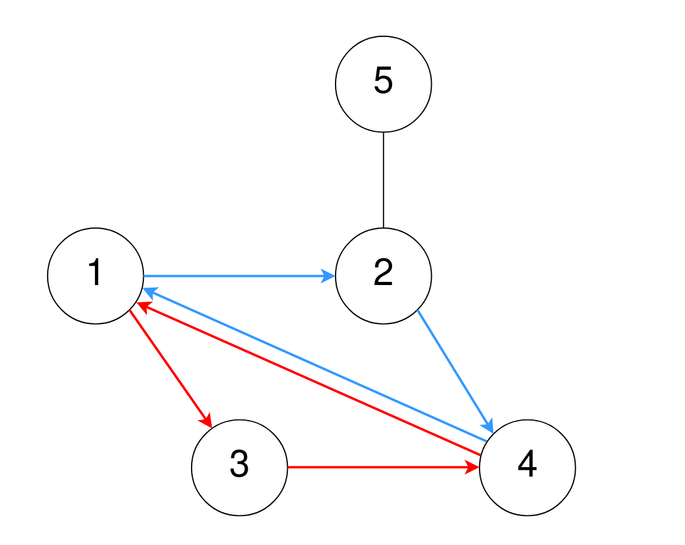
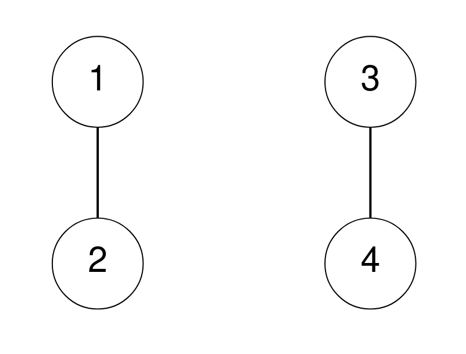

### 1. Description

A maze consists of `n` rooms numbered from `1` to `n`, and some rooms are connected by corridors. You are given a 2D integer array `corridors` where $\text{corridors}[i] = [\text{room1}_{i}, \text{room2}_{i}]$ indicates that there is a corridor connecting $\text{room1}_{i}$ and $\text{room2}_{i}$, allowing a person in the maze to go from $\text{room1}_{i}$ to $\text{room2}_{i}$ **and vice versa**.

The designer of the maze wants to know how confusing the maze is. The **confusion** **score** of the maze is the number of different cycles of **length 3**.

- For example, `1 → 2 → 3 → 1` is a cycle of length 3, but `1 → 2 → 3 → 4` and `1 → 2 → 3 → 2 → 1` are not.

Two cycles are considered to be **different** if one or more of the rooms visited in the first cycle is **not** in the second cycle.

Return *the* ***confusion**** score** of the maze.*

### 2. Function Contract

- Refer to method signature.

### 3. Examples

#### Example 1

- **Input:** $n = 5, corridors = [[1,2],[5,2],[4,1],[2,4],[3,1],[3,4]]$
- **Output:** `2`
- **Explanation:** One cycle of length 3 is 4 → 1 → 3 → 4, denoted in red.
Note that this is the same cycle as 3 → 4 → 1 → 3 or 1 → 3 → 4 → 1 because the rooms are the same.
Another cycle of length 3 is 1 → 2 → 4 → 1, denoted in blue.
Thus, there are two different cycles of length 3.

#### Example 2

- **Input:** $n = 4, corridors = [[1,2],[3,4]]$
- **Output:** `0`
- **Explanation:** There are no cycles of length 3.

### 4. Constraints

- $2 \le n \le 1000$

- $1 \le \text{corridors.length} \le 5 * 10^{4}$

- $\text{corridors}[i].length = 2$

- $1 \le \text{room1}_{i}, \text{room2}_{i} \le n$

- $\text{room1}_{i} \neq \text{room2}_{i}$

- There are no duplicate corridors.
