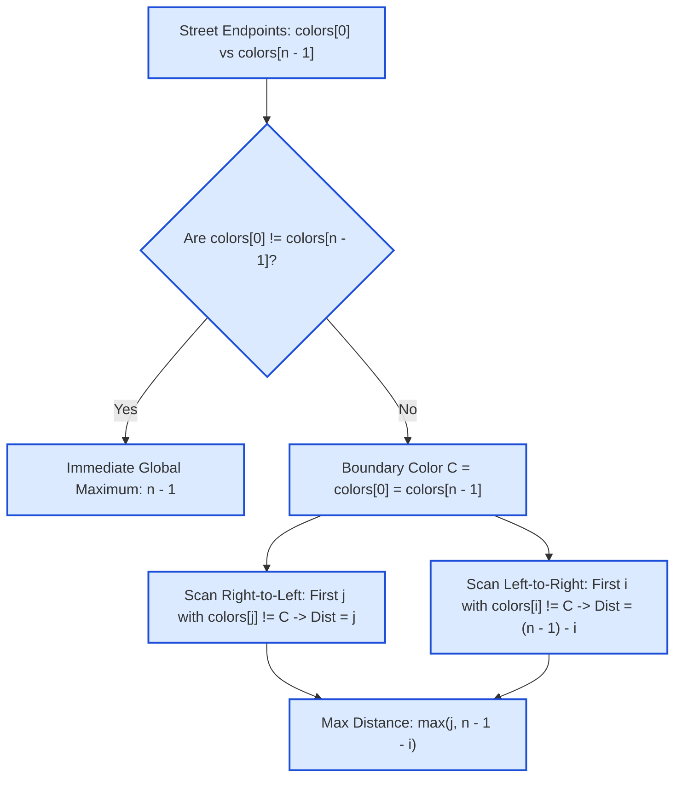

# Guided Example: Two Furthest Houses With Different Colors

We trace the Endpoint Dominance Theorem, bidirectional anchor scanning, and linear-time extremal distance resolution on a representative street layout:

- **Colors Array:** `[1, 1, 1, 6, 1, 1, 1]`
- **Number of Houses $n$:** `7`
- **Expected Output:** `3`

---

## 1. Problem Overview & Representative Instance

There are $n$ houses arranged in a straight line, indexed $0$ through $n - 1$. The color of house $i$ is represented by the integer $colors[i]$. We wish to find the maximum possible distance $|i - j|$ between two houses $i$ and $j$ such that their colors are strictly different ($colors[i] \neq colors[j]$).

### A Naive Approach vs. Extremal Anchor Scanning
- A brute-force search compares all $\binom{n}{2} = \frac{n(n-1)}{2}$ pairs of houses, requiring $\mathcal{O}(n^2)$ time.
- The theoretical maximum distance between any two houses on a street of length $n$ is $n - 1$ (the distance between house $0$ and house $n - 1$).
- If $colors[0] \neq colors[n - 1]$, then the answer is immediately $n - 1$.
- If $colors[0] == colors[n - 1]$, any pair with different colors must contain at least one house whose color differs from this common boundary color. By establishing that at least one of the optimal houses must be located at one of the boundaries ($0$ or $n - 1$), we reduce the search space to scanning only from the two ends inward.

---

## 2. Theoretical Invariants & The Endpoint Dominance Theorem

### The Endpoint Dominance Theorem
**Theorem.** *In any street array $colors$ of length $n$, there exists an optimal pair $(i^*, j^*)$ with $colors[i^*] \neq colors[j^*]$ achieving the maximum distance $|i^* - j^*|$ such that at least one endpoint is either $0$ or $n - 1$.*

**Proof by Contradiction:**
Suppose the unique maximum distance is achieved exclusively by an interior pair $(i, j)$ with $0 < i < j < n - 1$, yielding distance $j - i$.
Because the pair has different colors, $colors[i] \neq colors[j]$.
Consider the boundary color at the left end, $c_0 = colors[0]$:
1. Since $colors[i] \neq colors[j]$, at most one of $\{colors[i], colors[j]\}$ can equal $c_0$.
2. **Case 1:** $colors[j] \neq c_0$.
   The pair $(0, j)$ has different colors ($colors[0] \neq colors[j]$), and its distance is:
   $$\text{dist}(0, j) = j - 0 = j > j - i$$
   This strictly exceeds $j - i$, contradicting the optimality of $(i, j)$.
3. **Case 2:** $colors[j] == c_0$.
   Then $colors[i] \neq c_0$. Now consider the right boundary color $c_{n-1} = colors[n - 1]$.
   - If $colors[i] \neq c_{n-1}$, the pair $(i, n - 1)$ has different colors, and its distance is:
     $$\text{dist}(i, n - 1) = (n - 1) - i > j - i$$
     again strictly exceeding $j - i$.
   - If $colors[i] == c_{n-1}$, then $c_{n-1} = colors[i] \neq colors[j] = c_0$. But if $c_0 \neq c_{n-1}$, the pair $(0, n - 1)$ has different colors and distance $n - 1 > j - i$.
In all cases, an interior pair is strictly dominated by a pair anchored at $0$ or $n - 1$. $\blacksquare$

### The Resulting Invariant Formula
$$\text{Max Distance} = \max\left( \max_{j : colors[j] \neq colors[0]} j, \quad \max_{i : colors[i] \neq colors[n-1]} (n - 1 - i) \right)$$

| Parameter | Mathematical Expression | Meaning in Search |
|---|---|---|
| Left Anchor Search | $\max \{ j \mid colors[j] \neq colors[0] \}$ | Rightmost house with color different from house $0$ |
| Right Anchor Search | $\max \{ (n - 1) - i \mid colors[i] \neq colors[n-1] \}$ | Leftmost house with color different from house $n - 1$ |
| Global Maximum | $\max(d_{\text{left}}, d_{\text{right}})$ | Proven supremum of all valid house pairs |

---

## 3. Step-by-Step Worked Execution

We trace `colors = [1, 1, 1, 6, 1, 1, 1]` ($n = 7$).
House indices: $0, 1, 2, 3, 4, 5, 6$.
Boundary colors: $colors[0] = 1$, $colors[6] = 1$.

---

### Phase 1: Boundary Comparison
- $colors[0] = 1$
- $colors[6] = 1$
- $colors[0] == colors[6]$ (both are color $1$).
- An immediate span of $n - 1 = 6$ is not possible; proceed to anchor scans.

---

### Phase 2: Anchor Scan from Left End ($i = 0$)
We fix house $0$ (color $1$) and search from the rightmost house backwards ($j = 6, 5, 4, \dots$) for the first house whose color is NOT $1$:
1. Check $j = 6$: $colors[6] = 1 == colors[0]$ (skip).
2. Check $j = 5$: $colors[5] = 1 == colors[0]$ (skip).
3. Check $j = 4$: $colors[4] = 1 == colors[0]$ (skip).
4. Check $j = 3$: $colors[3] = 6 \neq colors[0]$ (**Match!**).
- Distance to left anchor:
  $$d_{\text{left}} = 3 - 0 = 3$$

---

### Phase 3: Anchor Scan from Right End ($j = n - 1 = 6$)
We fix house $6$ (color $1$) and search from the leftmost house forwards ($i = 0, 1, 2, \dots$) for the first house whose color is NOT $1$:
1. Check $i = 0$: $colors[0] = 1 == colors[6]$ (skip).
2. Check $i = 1$: $colors[1] = 1 == colors[6]$ (skip).
3. Check $i = 2$: $colors[2] = 1 == colors[6]$ (skip).
4. Check $i = 3$: $colors[3] = 6 \neq colors[6]$ (**Match!**).
- Distance to right anchor:
  $$d_{\text{right}} = 6 - 3 = 3$$

---

### Phase 4: Maximum Resolution
$$\text{Max Distance} = \max(d_{\text{left}}, d_{\text{right}}) = \max(3, 3) = 3$$
The furthest houses with different colors are $(0, 3)$ or $(3, 6)$, each separated by distance $3$.

---

## 4. Multi-Scenario Execution Trace

Below is the verification trace across diverse distribution structures:

| Array Configuration | $n$ | $colors[0]$ | $colors[n-1]$ | Scan Direction | First Differing Index | Evaluated Distance | Final Output |
|---|---|---|---|---|---|---|---|
| `[1, 1, 1, 6, 1, 1, 1]` | $7$ | $1$ | $1$ | Left Anchor ($0 \to j$) Right Anchor ($i \leftarrow 6$) | $j = 3$ $i = 3$ | $3 - 0 = 3$ $6 - 3 = 3$ | **$3$** |
| `[1, 8, 3, 8, 3]` | $5$ | $1$ | $3$ | Boundary Direct | $0$ and $4$ differ | $4 - 0 = 4$ | **$4$** |
| `[0, 1]` | $2$ | $0$ | $1$ | Boundary Direct | $0$ and $1$ differ | $1 - 0 = 1$ | **$1$** |
| `[5, 9, 5, 5, 5, 5]` | $6$ | $5$ | $5$ | Right Anchor ($i \leftarrow 5$) | $i = 1$ ($colors[1] = 9$) | $5 - 1 = 4$ | **$4$** |
| `[7, 7, 7, 7, 2, 7]` | $6$ | $7$ | $7$ | Left Anchor ($0 \to j$) | $j = 4$ ($colors[4] = 2$) | $4 - 0 = 4$ | **$4$** |

### Asymmetric Outlier Observation
Notice in `[5, 9, 5, 5, 5, 5]`:
- Comparing house $0$ with the outlier at index $1$ gives distance $1 - 0 = 1$.
- Comparing house $5$ with the outlier at index $1$ gives distance $5 - 1 = 4$.
Because the search checks both the left and right boundaries, the larger distance $4$ is captured immediately.

---

## 5. Algorithmic Correctness & Soundness

1. **Sufficiency of Boundary Anchors:**
   The Endpoint Dominance Theorem guarantees that the global supremum cannot reside strictly within the open interval $(0, n - 1)$. Any non-boundary pair $(i, j)$ is dominated by $(0, j)$ or $(i, n - 1)$. Therefore, searching exclusively for pairs anchored at $0$ or $n - 1$ is complete.
2. **Greedy Monotonicity of Scanning:**
   When searching from the right end backwards for an anchor at $0$, the first index $j$ encountered with $colors[j] \neq colors[0]$ has the maximum possible value of $j$. Any other differing house $j' < j$ would produce a smaller distance $j' < j$. Similarly, scanning from index $0$ upwards finds the minimum index $i$ with $colors[i] \neq colors[n - 1]$, maximizing $(n - 1) - i$.
3. **Problem Guarantee of Solution Existence:**
   The problem statement guarantees that there are at least two houses with different colors. Hence, at least one differing house is guaranteed to exist in both scan directions.

---

## 6. Edge Cases, Pitfalls & Structural Traps

- **Endpoints Already Differ ($colors[0] \neq colors[n-1]$):**
  If the very first and last houses have different colors, the distance is $n - 1$, which is the theoretical upper bound for the entire array. Scanning is bypassed entirely.
- **Minimum Array Size ($n = 2$):**
  When $n = 2$, $colors[0] \neq colors[1]$ by the guarantee of distinct colors, returning $2 - 1 = 1$.
- **Asymmetric Outliers:**
  Checking only from one end (e.g. only fixing house $0$) fails when the only differing house is located at index $1$ in an array of identical houses ($[5, 9, 5, 5, 5]$). Examining both endpoints avoids this asymmetry trap.

---

## 7. Complexity Analysis

- **Time Complexity:**
  - Boundary check: $\mathcal{O}(1)$.
  - Backward scan from $n - 1$: at most $n$ iterations.
  - Forward scan from $0$: at most $n$ iterations.
  - Total time complexity: $\mathcal{O}(n)$ strictly linear time.
- **Auxiliary Space Complexity:**
  - The algorithm operates directly on indices with integer variables (`i`, `j`, `n`).
  - Total auxiliary space: $\mathcal{O}(1)$ constant memory.
