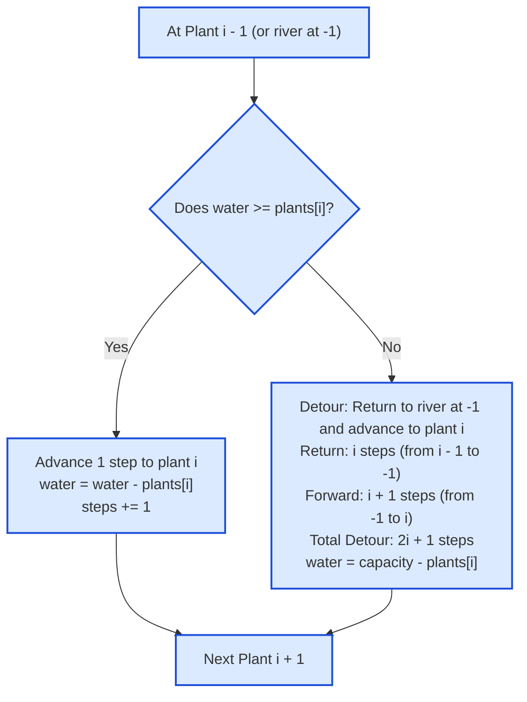

# Guided Example: Watering Plants

We trace the 1D coordinate metric, greedy capacity depletion, and round-trip detour step calculation on a representative garden instance:

- **Plants Array:** `[2, 2, 3, 3]`
- **Can Capacity:** `5`
- **Number of Plants $n$:** `4`
- **Expected Output:** `14`

---

## 1. Problem Overview & Representative Instance

You want to water $n$ plants arranged in a straight line, positioned at non-negative coordinates $0, 1, \dots, n - 1$. A river is situated at coordinate $-1$. Each plant $i$ requires $plants[i]$ units of water. You possess a watering can with maximum capacity `capacity`.

The watering protocol follows these rules:
1. You begin at the river (coordinate $-1$) with a completely full can ($water = capacity$).
2. You must water plants sequentially from left to right: plant $0$, then plant $1$, up to plant $n - 1$.
3. You cannot water part of a plant with the remaining water and then finish it later; each plant must be watered completely in one visit.
4. Moving between adjacent coordinates (e.g. from $x$ to $x + 1$ or $x$ to $x - 1$) consumes exactly $1$ step.
5. If your current water volume is at least $plants[i]$, you step forward to plant $i$ and water it.
6. If your current water volume is strictly less than $plants[i]$, you must return to the river (coordinate $-1$) to refill your can completely, and then walk forward to plant $i$ to water it.

We seek the total number of steps taken to water all $n$ plants.

---

## 2. Theoretical Invariants & Detour Geometry

### Invariant 1: Detour Distance Formula
Suppose you are standing at plant $i - 1$ (coordinate $i - 1$) and discover that your remaining water is insufficient to satisfy plant $i$ ($water < plants[i]$):
1. **Walk to River:** Distance from coordinate $i - 1$ to the river at coordinate $-1$ is:
   $$\Delta_{\text{back}} = (i - 1) - (-1) = i \text{ steps}$$
2. **Walk to Plant $i$:** Distance from the river at $-1$ to plant $i$ at coordinate $i$ is:
   $$\Delta_{\text{forward}} = i - (-1) = i + 1 \text{ steps}$$
3. **Total Detour Steps:**
   $$\Delta_{\text{total}} = \Delta_{\text{back}} + \Delta_{\text{forward}} = i + (i + 1) = 2i + 1 \text{ steps}$$

Notice that when $water \ge plants[i]$, the distance from plant $i - 1$ to plant $i$ is simply $1$ step.
Thus, each plant $i \in [0, n - 1]$ adds either:
$$\text{Cost}(i) = \begin{cases} 1 & \text{if } water \ge plants[i] \\ 2i + 1 & \text{if } water < plants[i] \end{cases}$$

### Invariant 2: Greedy Refill Invariant
Because capacity is fixed and water is strictly consumed to satisfy deterministic positive demands, you should never refill early when your can holds enough water for the immediate plant. Deferring the refill maximizes the coordinate index of when the detour occurs, which is strictly optimal.

| State Variable | Meaning | Transition Rule |
|---|---|---|
| Coordinate Position | Current location on 1D line | $-1$ initially, advances to $i$ |
| Water Volume $w$ | Current water in the can | Decrements by $plants[i]$, resets to $capacity - plants[i]$ on detour |
| Total Steps $S$ | Cumulative distance traveled | Increments by $1$ or $2i + 1$ |

---

## 3. Step-by-Step Worked Execution

We trace `plants = [2, 2, 3, 3]`, `capacity = 5`.
Initial state: start at coordinate $-1$, $water = 5$, $steps = 0$.

---

### Plant $i = 0$ (Requirement: $2$)
- Current water: $5$.
- Check sufficiency: $5 \ge 2 \implies$ **Sufficient**.
- Advance from coordinate $-1$ to coordinate $0$:
  $$steps = 0 + 1 = 1$$
- Water plant: $water = 5 - 2 = 3$.
- End position: coordinate $0$.

---

### Plant $i = 1$ (Requirement: $2$)
- Current water: $3$.
- Check sufficiency: $3 \ge 2 \implies$ **Sufficient**.
- Advance from coordinate $0$ to coordinate $1$:
  $$steps = 1 + 1 = 2$$
- Water plant: $water = 3 - 2 = 1$.
- End position: coordinate $1$.

---

### Plant $i = 2$ (Requirement: $3$)
- Current water: $1$.
- Check sufficiency: $1 < 3 \implies$ **Insufficient! Refill required**.
- Detour calculation for $i = 2$:
  - Walk backwards from coordinate $1$ to river $-1$: $1 - (-1) = 2$ steps.
  - Refill can to full capacity $5$.
  - Walk forward from river $-1$ to plant $2$: $2 - (-1) = 3$ steps.
  - Total detour cost: $2 + 3 = 5$ steps (matching formula $2(2) + 1 = 5$).
- Cumulative steps:
  $$steps = 2 + 5 = 7$$
- Water plant: $water = 5 - 3 = 2$.
- End position: coordinate $2$.

---

### Plant $i = 3$ (Requirement: $3$)
- Current water: $2$.
- Check sufficiency: $2 < 3 \implies$ **Insufficient! Refill required**.
- Detour calculation for $i = 3$:
  - Walk backwards from coordinate $2$ to river $-1$: $2 - (-1) = 3$ steps.
  - Refill can to full capacity $5$.
  - Walk forward from river $-1$ to plant $3$: $3 - (-1) = 4$ steps.
  - Total detour cost: $3 + 4 = 7$ steps (matching formula $2(3) + 1 = 7$).
- Cumulative steps:
  $$steps = 7 + 7 = 14$$
- Water plant: $water = 5 - 3 = 2$.
- End position: coordinate $3$.

All plants are watered. Final total steps: $14$.

---

## 4. Complete Execution Trace

Below is the complete state progression table for each plant:

| Plant Index $i$ | Water Demand $plants[i]$ | Can Volume Before | Sufficiency Check | Step Calculation Formula | Steps Added | Cumulative Steps | Can Volume After |
|---|---|---|---|---|---|---|---|
| Init | — | — | — | Start at river ($-1$) | $0$ | $0$ | $5$ (full) |
| $0$ | $2$ | $5$ | $5 \ge 2$ (OK) | Direct step: $1$ | $1$ | $1$ | $5 - 2 = 3$ |
| $1$ | $2$ | $3$ | $3 \ge 2$ (OK) | Direct step: $1$ | $1$ | $2$ | $3 - 2 = 1$ |
| $2$ | $3$ | $1$ | $1 < 3$ (Refill) | Detour: $2(2) + 1 = 5$ | $5$ | $7$ | $5 - 3 = 2$ |
| $3$ | $3$ | $2$ | $2 < 3$ (Refill) | Detour: $2(3) + 1 = 7$ | $7$ | **$14$** | $5 - 3 = 2$ |

### Contrast Instance: Exact Capacity Boundary
Consider `plants = [2, 3]`, `capacity = 5`:

| Plant Index $i$ | Demand | Water Before | Check | Steps Added | Running Steps | Water After |
|---|---|---|---|---|---|---|
| $0$ | $2$ | $5$ | $5 \ge 2$ | $1$ | $1$ | $3$ |
| $1$ | $3$ | $3$ | $3 \ge 3$ (Exact match) | $1$ | **$2$** | $0$ |

When remaining water matches the demand exactly ($3 \ge 3$), no refill is triggered, requiring only $2$ total steps.

---

## 5. Algorithmic Correctness & Soundness

1. **Closed-Form Distance Equivalence:**
   The physical movement consists of moving along a 1D coordinate line.
   When water is sufficient, moving from $i - 1$ to $i$ has Euclidean displacement $i - (i - 1) = 1$.
   When water is insufficient, the path is $(i - 1) \to -1 \to i$. The total distance is $|(i - 1) - (-1)| + |i - (-1)| = i + (i + 1) = 2i + 1$.
   The closed-form update matches physical walking distance identically without simulating step-by-step increments.
2. **Mandatory Refill Condition:**
   Because the problem statement forbids partial watering, a refill must occur if and only if $water < plants[i]$. The condition $water \ge plants[i]$ is necessary and sufficient.
3. **Capacity Feasibility:**
   The problem constraints guarantee that $plants[i] \le capacity$ for all $i$. Hence, a single trip to the river always provides enough water to satisfy at least plant $i$.

---

## 6. Edge Cases, Pitfalls & Structural Traps

- **Refill on Plant 0:**
  The problem constraints guarantee that $plants[0] \le capacity$, and the can starts full. Thus, a refill is never required before watering plant $0$.
- **Off-by-One in River Distance:**
  Remembering that the river is at coordinate $-1$, not $0$, is essential. If the river were at $0$, the detour would be $2i$, but because it is at $-1$, the distance to plant $i$ is $i - (-1) = i + 1$, yielding $2i + 1$.
- **Exact Water Exhaustion:**
  If a plant consumes the very last drop of water ($water = 0$), no refill is triggered for *that* plant. The refill is only triggered when the *next* plant requires water.

---

## 7. Complexity Analysis

- **Time Complexity:**
  - The algorithm iterates through the $n$ plants once in a simple linear loop.
  - In each iteration, arithmetic checks and additions take $\mathcal{O}(1)$ time.
  - Total time complexity: $\mathcal{O}(n)$ linear time.
- **Auxiliary Space Complexity:**
  - Only scalar counters for total steps and current water are maintained.
  - Total auxiliary space: $\mathcal{O}(1)$ constant memory.
