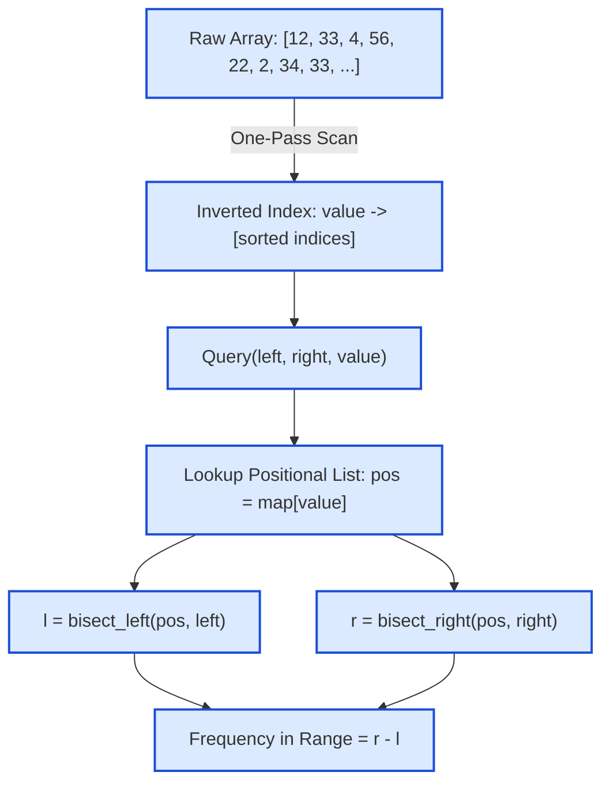

# Guided Example: Range Frequency Queries

We trace the inverted index hash construction, sorted positional coordinate lists, and logarithmic range frequency evaluation via binary search on a representative array:

- **Base Array:** `[12, 33, 4, 56, 22, 2, 34, 33, 22, 12, 34, 56]`
- **Queries:**
  1. `query(left: 1, right: 2, value: 4)` $\to$ Expected: `1`
  2. `query(left: 0, right: 11, value: 33)` $\to$ Expected: `2`
- **Cumulative Output:** `[null, 1, 2]`

---

## 1. Problem Overview & Representative Instance

We are tasked with designing a data structure that efficiently answers queries of the form:
$$\text{query}(left, right, value)$$
which returns the frequency (count of occurrences) of integer `value` strictly within the subarray slice `arr[left ... right]` inclusive.

### The Pitfall of Linear Scanning vs. Inverted Index Bisection
- A naive linear scan across each query takes $\mathcal{O}(R - L + 1) = \mathcal{O}(n)$ time. Over $10^5$ queries on an array of length $10^5$, this requires up to $10^{10}$ operations, resulting in a Time Limit Exceeded failure.
- By preprocessing the array into an **inverted index** (a hash map mapping each unique value to the sorted list of indices where it appears), any query on a specific `value` isolates only the occurrences of that value.
- Because the indices are appended in ascending order during a single forward pass, every positional list is strictly sorted.
- We then use binary search (`bisect_left` and `bisect_right`) to locate the subsegment of indices lying within $[left, right]$ in $\mathcal{O}(\log k)$ time, where $k$ is the frequency of that value.

---

## 2. Theoretical Invariants & Positional Bisection

### Invariant 1: Monotonic Positional Lists
Let $I(v) = [p_0, p_1, \dots, p_{k-1}]$ be the list of 0-based indices where $\text{arr}[p_m] = v$.
Because elements are inserted during a sequential scan from index $0$ to $n - 1$:
$$p_0 < p_1 < p_2 < \dots < p_{k-1}$$
The sequence $I(v)$ is strictly increasing.

### Invariant 2: Range Inclusion via Bisection Boundaries
An occurrence at index $p \in I(v)$ falls within the query interval $[left, right]$ if and only if:
$$left \le p \le right$$
Using monotonic bisection:
1. **Lower Bound $l$:** The first index in $I(v)$ with $p \ge left$ is given by:
   $$l = \text{bisect\_left}(I(v), left)$$
2. **Upper Bound $r$:** The number of indices in $I(v)$ with $p \le right$ is given by the insertion point strictly greater than $right$:
   $$r = \text{bisect\_right}(I(v), right) = \text{bisect\_left}(I(v), right + 1)$$
3. **Exact Cardinality:** The subset of qualifying positions corresponds to the contiguous slice $I(v)[l : r]$. Its length is exactly:
   $$\text{count} = \max(0, r - l)$$

| Data Structure Component | Purpose | Mathematical Guarantee |
|---|---|---|
| Inverted Map $g$ | Maps each value $v$ to list $I(v)$ | Space bounded by $\sum \lvert I(v) \rvert = n$ |
| Sorted List $I(v)$ | Array indices where $v$ appears | Strictly ascending: $p_i < p_{i+1}$ |
| Bisection Pointer $l$ | Lower insertion index | Smallest index with $I(v)[l] \ge left$ |
| Bisection Pointer $r$ | Upper insertion index | Smallest index with $I(v)[r] > right$ |
| Result Difference | $r - l$ | Exact occurrences of $v$ in $[left, right]$ |

---

## 3. Step-by-Step Worked Execution

We trace the preprocessing and subsequent query answering for:
$$\text{arr} = [12, 33, 4, 56, 22, 2, 34, 33, 22, 12, 34, 56]$$

### Phase 1: Inverted Index Precomputation
Traverse $i$ from $0$ to $11$:

| Array Index $i$ | Value $\text{arr}[i]$ | Updated Positional List for Value |
|---|---|---|
| $0$ | $12$ | $12 \to [0]$ |
| $1$ | $33$ | $33 \to [1]$ |
| $2$ | $4$ | $4 \to [2]$ |
| $3$ | $56$ | $56 \to [3]$ |
| $4$ | $22$ | $22 \to [4]$ |
| $5$ | $2$ | $2 \to [5]$ |
| $6$ | $34$ | $34 \to [6]$ |
| $7$ | $33$ | $33 \to [1, 7]$ |
| $8$ | $22$ | $22 \to [4, 8]$ |
| $9$ | $12$ | $12 \to [0, 9]$ |
| $10$ | $34$ | $34 \to [6, 10]$ |
| $11$ | $56$ | $56 \to [3, 11]$ |

---

### Phase 2: Evaluating Query 1: `query(1, 2, 4)`
- Target value: $4$, range: $[1, 2]$.
- Retrieve index list for $4$: $I(4) = [2]$.
- **Compute Lower Bound $l$:**
  - Locate first index in $[2]$ with position $\ge 1$.
  - At slot $0$, value is $2 \ge 1 \implies l = 0$.
- **Compute Upper Bound $r$:**
  - Locate insertion point for position $> 2$ (or $\ge 3$) in $[2]$.
  - At slot $0$, value is $2 \le 2$. At slot $1$ (end), position exceeds $2 \implies r = 1$.
- **Extract Count:**
  $$\text{count} = r - l = 1 - 0 = 1$$

---

### Phase 3: Evaluating Query 2: `query(0, 11, 33)`
- Target value: $33$, range: $[0, 11]$.
- Retrieve index list for $33$: $I(33) = [1, 7]$.
- **Compute Lower Bound $l$:**
  - Locate first index in $[1, 7]$ with position $\ge 0$.
  - $I(33)[0] = 1 \ge 0 \implies l = 0$.
- **Compute Upper Bound $r$:**
  - Locate insertion point for position $> 11$ in $[1, 7]$.
  - Both $1 \le 11$ and $7 \le 11$. Insertion point is at the end $\implies r = 2$.
- **Extract Count:**
  $$\text{count} = r - l = 2 - 0 = 2$$

---

## 4. Complete Execution Trace & Multi-Scenario Bisection

Below is the verification trace across diverse range configurations on the preprocessed array:

| Query ID | Range $[left, right]$ | Target Value | Positional List $I(v)$ | Lower Bound $l$ | Upper Bound $r$ | Slice $I(v)[l:r]$ | Emitted Count |
|---|---|---|---|---|---|---|---|
| Query 1 | $[1, 2]$ | $4$ | $[2]$ | $l = 0$ | $r = 1$ | $[2]$ | **$1$** |
| Query 2 | $[0, 11]$ | $33$ | $[1, 7]$ | $l = 0$ | $r = 2$ | $[1, 7]$ | **$2$** |
| Partial Interval | $[2, 6]$ | $33$ | $[1, 7]$ | $l = 1$ ($I[1]=7 \ge 2$) | $r = 1$ ($7 > 6$) | $[\,]$ | **$0$** |
| Single Match | $[0, 5]$ | $33$ | $[1, 7]$ | $l = 0$ | $r = 1$ | $[1]$ | **$1$** |
| Missing Value | $[0, 10]$ | $99$ | $[\,]$ | $l = 0$ | $r = 0$ | $[\,]$ | **$0$** |

### Notice the Missing-Value and Out-of-Range Handling
When a requested value does not exist in the array (e.g. $value = 99$), its index list is empty ($[\,]$). The bisection naturally returns $l = 0$ and $r = 0$, yielding $0 - 0 = 0$ without throwing exceptions or requiring special branches.

---

## 5. Algorithmic Correctness & Soundness

1. **Exact Set Equality:**
   The set of indices where $\text{arr}[i] == value$ is completely captured by $I(value)$.
   The set of indices in $[left, right]$ where $\text{arr}[i] == value$ is therefore $I(value) \cap [left, right]$.
2. **Contiguity of Intersection:**
   Because $I(value)$ is sorted, the elements of $I(value)$ that fall in $[left, right]$ form a contiguous subsegment $I(value)[l : r]$.
   By definition of binary search:
   - $l$ is the index of the first element $\ge left$.
   - $r$ is the index of the first element $> right$.
   All elements at indices $k \in [l, r - 1]$ satisfy $left \le I(value)[k] \le right$, and no elements outside this range satisfy the condition.
   Therefore, the count of elements in the intersection is strictly $r - l$.

---

## 6. Edge Cases, Pitfalls & Structural Traps

- **Value Not Present in Array:**
  Querying a value that never occurs in `arr` should return $0$. Using a default empty list in the hash map handles this automatically ($l = 0, r = 0 \implies 0$).
- **Range Contains No Occurrences:**
  When the value exists in `arr` but all its occurrences lie strictly before $left$ (or strictly after $right$), $l$ and $r$ converge to the same index ($l = r$). The difference $r - l = 0$ correctly reports zero occurrences.
- **Entire Array Spanned:**
  When $[left, right] = [0, n - 1]$, $l = 0$ and $r = |I(value)|$, returning the global frequency of that value.

---

## 7. Complexity Analysis

- **Initialization Time Complexity:**
  - Traversing `arr` of length $n$ once takes $\mathcal{O}(n)$ time.
  - Appending to hash map lists takes $\mathcal{O}(1)$ amortized time per element.
  - Total constructor time: $\mathcal{O}(n)$.
- **Query Time Complexity:**
  - Hash map lookup takes $\mathcal{O}(1)$ average time.
  - Binary searching on list $I(value)$ of size $k \le n$ takes $\mathcal{O}(\log k) \le \mathcal{O}(\log n)$ time.
  - Total per-query time: $\mathcal{O}(\log n)$. For $q$ queries, total query time is $\mathcal{O}(q \log n)$.
- **Auxiliary Space Complexity:**
  - Storing all indices across all lists in the inverted index takes $\mathcal{O}(n)$ memory.
  - Total auxiliary space: $\mathcal{O}(n)$.
