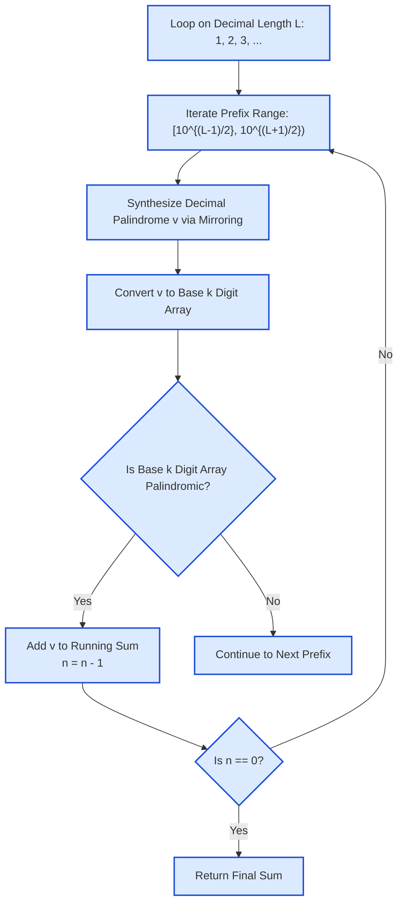

# Guided Example: Sum of k-Mirror Numbers

We trace the half-integer reflective generation of decimal palindromes, radix-$k$ modular digit extraction, and symmetry filtering on a representative dual-base instance:

- **Target Base $k$:** `2` (Binary)
- **Target Count $n$:** `5`
- **Expected Output:** `25` (Sum of first 5 numbers: $1 + 3 + 5 + 7 + 9$)

---

## 1. Problem Overview & Representative Instance

A positive integer is defined as a **$k$-mirror number** if and only if:
1. Its representation in standard decimal (base $10$) is a palindrome without leading zeros.
2. Its representation in base $k$ is also a palindrome without leading zeros.

Given base $k$ and integer $n$, we wish to calculate the sum of the $n$ smallest $k$-mirror numbers.

### Naive Counting vs. Palindrome-Only Generation
- Iterating through every positive integer $1, 2, 3, \dots$ and checking both bases is catastrophically slow because palindromes become exponentially sparse as numbers grow (only $10^{\lceil L/2 \rceil}$ decimal palindromes exist among $10^L$ numbers).
- Instead, we directly generate base-10 palindromes in strictly increasing order by constructing their left halves and reflecting them across the center axis.
- For each generated base-10 palindrome, we convert it to base $k$ and verify its radix symmetry.
- The search terminates the moment exactly $n$ valid numbers have been accumulated.

---

## 2. Theoretical Invariants & Reflective Generation

### Invariant 1: Decimal Palindrome Construction
Every decimal palindrome of length $L$ is uniquely determined by its first $\lceil L/2 \rceil$ digits (the "seed" or "half-prefix").
Let the prefix integer be $p \in [10^{\lfloor (L-1)/2 \rfloor}, 10^{\lceil L/2 \rceil} - 1]$:
- **Odd Length $L$:** $p$ contains $\frac{L+1}{2}$ digits. The last digit of $p$ is the central pivot and is not duplicated.
  $$v = p \cdot 10^{(L-1)/2} + \text{reverse}(\lfloor p / 10 \rfloor)$$
- **Even Length $L$:** $p$ contains $\frac{L}{2}$ digits. The entire prefix $p$ is mirrored.
  $$v = p \cdot 10^{L/2} + \text{reverse}(p)$$

Because $p$ iterates in strictly increasing numeric order for each fixed length $L$, the synthesized palindromes $v$ are produced in strictly ascending order without omissions or duplicates.

### Invariant 2: Radix-$k$ Symmetry Predicate
To test if $v$ is a palindrome in base $k$, we extract its digits via repeated division by $k$:
$$d_m = v \pmod k, \quad v \leftarrow \lfloor v / k \rfloor$$
The resulting digit sequence $D = [d_0, d_1, \dots, d_{m-1}]$ represents $v$ from least to most significant digit. Because palindromic symmetry is invariant under full reversal, $D$ is palindromic if and only if $D = \text{reverse}(D)$.

| Component | Algebraic Representation | Role in Algorithm |
|---|---|---|
| Decimal Length $L$ | Natural number $1, 2, 3, \dots$ | Controls symmetry mode (odd vs. even) |
| Prefix Seed $p$ | $p \in [10^{\lfloor(L-1)/2\rfloor}, 10^{\lceil L/2\rceil})$ | Generates unique ascending base-10 palindromes |
| Base-$k$ Conversion | $v = \sum_{i=0}^{m-1} d_i k^i$ | Obtains positional digit vector in target base |
| Symmetry Test | $d_i == d_{m-1-i} \;\forall i$ | Filters candidate for dual-base qualification |

---

## 3. Step-by-Step Worked Execution

We trace the generation for $k = 2$, target count $n = 5$.
Accumulator: $sum = 0$, remaining target $n = 5$.

---

### Phase 1: Odd Length $L = 1$
Prefix range: $p \in [1, 10)$, meaning $p \in \{1, 2, 3, 4, 5, 6, 7, 8, 9\}$.
Because $L = 1$, the palindrome is simply $v = p$.

1. **Candidate $v = 1$:**
   - Binary representation: $1_{10} = [1]_2$.
   - Symmetry: $[1]$ is a palindrome.
   - **Match 1 found!** Add $1$ to sum: $sum = 0 + 1 = 1$, $n = 5 - 1 = 4$.
2. **Candidate $v = 2$:**
   - Binary representation: $2_{10} = [0, 1]_2 \implies 10_2$.
   - Symmetry: $10_2$ is NOT a palindrome ($1 \neq 0$). Rejected.
3. **Candidate $v = 3$:**
   - Binary representation: $3_{10} = [1, 1]_2 \implies 11_2$.
   - Symmetry: $11_2$ is a palindrome.
   - **Match 2 found!** Add $3$ to sum: $sum = 1 + 3 = 4$, $n = 4 - 1 = 3$.
4. **Candidate $v = 4$:**
   - Binary representation: $4_{10} = [0, 0, 1]_2 \implies 100_2$.
   - Symmetry: Not a palindrome. Rejected.
5. **Candidate $v = 5$:**
   - Binary representation: $5_{10} = [1, 0, 1]_2 \implies 101_2$.
   - Symmetry: $101_2$ is a palindrome.
   - **Match 3 found!** Add $5$ to sum: $sum = 4 + 5 = 9$, $n = 3 - 1 = 2$.
6. **Candidate $v = 6$:**
   - Binary representation: $6_{10} = 110_2$. Not a palindrome. Rejected.
7. **Candidate $v = 7$:**
   - Binary representation: $7_{10} = 111_2$.
   - Symmetry: $111_2$ is a palindrome.
   - **Match 4 found!** Add $7$ to sum: $sum = 9 + 7 = 16$, $n = 2 - 1 = 1$.
8. **Candidate $v = 8$:**
   - Binary representation: $8_{10} = 1000_2$. Not a palindrome. Rejected.
9. **Candidate $v = 9$:**
   - Binary representation: $9_{10} = 1001_2$.
   - Symmetry: $1001_2$ is a palindrome.
   - **Match 5 found!** Add $9$ to sum: $sum = 16 + 9 = 25$, $n = 1 - 1 = 0$.

Target count reached ($n = 0$). Generation terminates immediately!
Final computed sum: $25$.

---

## 4. Complete Execution Trace & Radix Verification

Below is the verification trace for all generated candidates during the run:

| Candidate Decimal $v$ | Length $L$ | Prefix $p$ | Base-2 Digit Sequence | Binary String | Binary Palindrome? | Action Taken | Cumulative Sum | Remaining $n$ |
|---|---|---|---|---|---|---|---|---|
| $1$ | $1$ | $1$ | $[1]$ | `"1"` | **Yes** | Include in sum | $1$ | $4$ |
| $2$ | $1$ | $2$ | $[0, 1]$ | `"10"` | No | Discard | $1$ | $4$ |
| $3$ | $1$ | $3$ | $[1, 1]$ | `"11"` | **Yes** | Include in sum | $4$ | $3$ |
| $4$ | $1$ | $4$ | $[0, 0, 1]$ | `"100"` | No | Discard | $4$ | $3$ |
| $5$ | $1$ | $5$ | $[1, 0, 1]$ | `"101"` | **Yes** | Include in sum | $9$ | $2$ |
| $6$ | $1$ | $6$ | $[0, 1, 1]$ | `"110"` | No | Discard | $9$ | $2$ |
| $7$ | $1$ | $7$ | $[1, 1, 1]$ | `"111"` | **Yes** | Include in sum | $16$ | $1$ |
| $8$ | $1$ | $8$ | $[0, 0, 0, 1]$ | `"1000"` | No | Discard | $16$ | $1$ |
| $9$ | $1$ | $9$ | $[1, 0, 0, 1]$ | `"1001"` | **Yes** | Include in sum | **$25$** | **$0$ (Done)** |

### Beyond $L = 1$: Multi-Digit Reflective Mechanics
To demonstrate how even lengths work, suppose $n = 6$. The algorithm continues to length $L = 2$:
Prefix range $p \in [1, 10)$:

| Prefix $p$ | Mirroring Rule ($L = 2$) | Synthesized Decimal $v$ | Binary String | Binary Palindrome? |
|---|---|---|---|---|
| $1$ | $1 \cdot 10 + 1$ | $11$ | `"1011"` | No ($1011 \neq 1101$) |
| $2$ | $2 \cdot 10 + 2$ | $22$ | `"10110"` | No |
| $3$ | $3 \cdot 10 + 3$ | $33$ | `"100001"` | **Yes!** ($100001_2$ is symmetric) |

Thus, the 6th binary mirror number is $33$, bringing the sum to $25 + 33 = 58$.

---

## 5. Algorithmic Correctness & Soundness

1. **Ascending Monotonicity Guarantee:**
   Because decimal palindromes of length $L$ are strictly smaller than palindromes of length $L + 1$, and within a fixed length $L$, the value $v$ is strictly monotonic with respect to prefix $p$, the generator enumerates all decimal palindromes in strictly ascending order. No decimal palindrome is skipped.
2. **Base-$k$ Conversion Correctness:**
   Repeated division by $k$ produces the exact representation of $v$ in radix $k$. Since $v > 0$, the most significant digit is non-zero, satisfying the "no leading zeros" constraint. The two-pointer symmetry check on the digit array determines palindromicity with zero false positives.
3. **Soundness of Early Termination:**
   Since candidates are evaluated in strictly increasing order, the first $n$ candidates that satisfy the base-$k$ check are provably the $n$ smallest $k$-mirror numbers. Summing them yields the exact minimal sum.

---

## 6. Edge Cases, Pitfalls & Structural Traps

- **Even Base-2 Palindromes with Odd Value:**
  In base 2, any even number ends with digit $0$. Since a palindrome cannot have a leading zero, its first digit is $1$. Therefore, no even number $> 0$ can ever be a binary palindrome! Generating decimal numbers directly and checking parity would filter out $50\%$ of candidates instantly.
- **Prefix Pivot in Odd Lengths:**
  In odd lengths ($L = 3, 5, \dots$), the central digit belongs to the prefix seed but must not be reflected. Mirroring $p // 10$ rather than $p$ prevents creating an accidental even-length number.
- **Large Value Integer Overflow:**
  For $n = 30$, numbers can exceed $2^{31} - 1$. Using 64-bit integer accumulators is required to prevent arithmetic overflow.

---

## 7. Complexity Analysis

- **Time Complexity:**
  - Generating each decimal palindrome from its half-prefix takes $\mathcal{O}(\log_{10} v)$ time.
  - Converting $v$ to base $k$ takes $\mathcal{O}(\log_k v)$ time.
  - Sifting through the sparse set of dual palindromes to find $n \le 30$ mirror numbers examines a relatively small search space of prefixes, executing in well under 1 second.
- **Auxiliary Space Complexity:**
  - Storing the base-$k$ digits takes $\mathcal{O}(\log_k v)$ space (at most 64 digits).
  - Total auxiliary space: $\mathcal{O}(\log_k v)$ memory.
