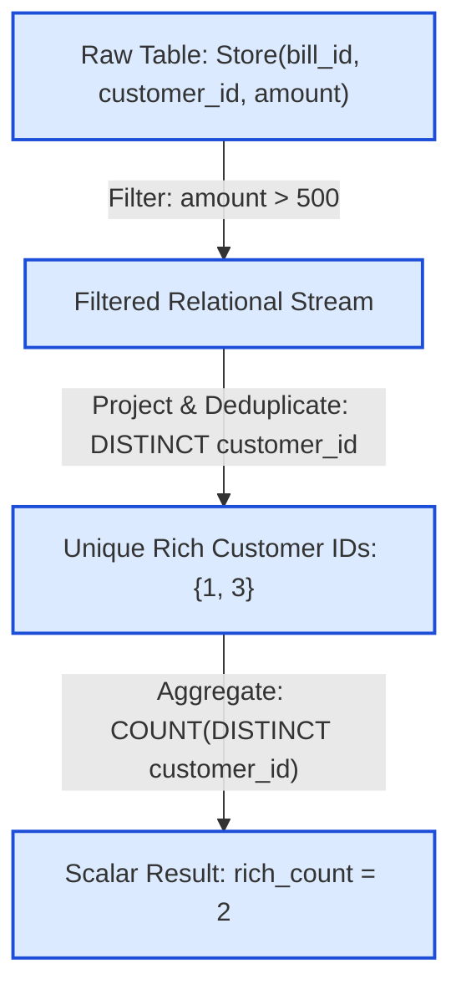

# Guided Example: The Number of Rich Customers

We trace relational selection filtering, customer identifier projection, and distinct aggregate cardinality calculation on a representative transactional store database:

- **Store Table Input:**
  - `(bill_id: 6, customer_id: 1, amount: 549)`
  - `(bill_id: 8, customer_id: 1, amount: 834)`
  - `(bill_id: 4, customer_id: 2, amount: 394)`
  - `(bill_id: 11, customer_id: 3, amount: 657)`
  - `(bill_id: 13, customer_id: 3, amount: 257)`
- **Expected Output:**
  - `rich_count: 2`

---

## 1. Problem Overview & Representative Instance

We are given a database relation `Store` recording customer transactions with schema:
$$\text{Store}(\text{bill\_id}, \text{customer\_id}, \text{amount})$$
where `bill_id` is the primary key. A customer is designated as a **rich customer** if they have at least one bill with an `amount` strictly greater than $500$ ($amount > 500$).

Our goal is to report the number of rich customers under the column name `rich_count`.

### Distinctness and Threshold Nuances
- A single rich customer may generate multiple transactions exceeding $500$ (e.g. customer $1$ has bills of $549$ and $834$). Such a customer must be counted exactly once.
- The qualification threshold is strictly greater than ($> 500$); an amount of exactly $500$ does not qualify.
- If no transaction exceeds $500$, the query must return $0$.

---

## 2. Theoretical Invariants & Relational Algebra Formulations

### Invariant 1: Relational Selection and Set Cardinality
In relational algebra, the operation corresponds to:
$$\text{rich\_count} = \left| \pi_{\text{customer\_id}} \left( \sigma_{\text{amount} > 500}(\text{Store}) \right) \right|$$
1. **Selection ($\sigma$):** Isolates all tuples satisfying the strict predicate $\text{amount} > 500$.
2. **Projection ($\pi$):** Extracts the `customer_id` attribute, eliminating duplicate IDs through set semantics.
3. **Cardinality ($|\cdot|$):** Measures the size of the resulting set of unique customer identifiers.

### Invariant 2: Aggregation Over Empty Match Sets
In SQL, applying `COUNT(DISTINCT column)` over an empty set returns the integer scalar $0$, not `NULL`. This guarantees that queries with no qualifying customers emit a single row containing `rich_count = 0` without needing `COALESCE` or default value handlers.

| Relational Component | Algebraic Operation | State Representation |
|---|---|---|
| Input Relation | Base table $\text{Store}$ | $5$ raw transaction tuples |
| Filter Condition | $\sigma_{\text{amount} > 500}$ | Retains tuples with strictly positive excess over $500$ |
| Distinct Projection | $\pi_{\text{customer\_id}}$ | Set deduplication of active customer IDs |
| Aggregated Output | $\text{COUNT}(\text{DISTINCT } \dots)$ | Single-row scalar metric `rich_count` |

---

## 3. Step-by-Step State Execution Trace

We trace the relational pipeline row by row on the sample `Store` data:

### Phase 1: Row Evaluation Against Strict Threshold ($\text{amount} > 500$)

1. **Tuple 1: `(bill_id: 6, customer_id: 1, amount: 549)`**
   - Check: $549 > 500 \implies$ **True**.
   - Action: Pass to candidate set. Candidate: `customer_id = 1`.
2. **Tuple 2: `(bill_id: 8, customer_id: 1, amount: 834)`**
   - Check: $834 > 500 \implies$ **True**.
   - Action: Pass to candidate set. Candidate: `customer_id = 1`.
3. **Tuple 3: `(bill_id: 4, customer_id: 2, amount: 394)`**
   - Check: $394 > 500 \implies$ False.
   - Action: Discarded.
4. **Tuple 4: `(bill_id: 11, customer_id: 3, amount: 657)`**
   - Check: $657 > 500 \implies$ **True**.
   - Action: Pass to candidate set. Candidate: `customer_id = 3`.
5. **Tuple 5: `(bill_id: 13, customer_id: 3, amount: 257)`**
   - Check: $257 > 500 \implies$ False.
   - Action: Discarded.

---

### Phase 2: Set Deduplication of Candidate Customer IDs
The qualifying multiset of customer IDs from Phase 1 is:
$$M = \{1, 1, 3\}$$
Applying set projection eliminates duplicate occurrences:
$$S = \text{DISTINCT}(M) = \{1, 3\}$$

---

### Phase 3: Aggregation and Formatting
Counting the elements in set $S$:
$$\text{rich\_count} = |\{1, 3\}| = 2$$

Result table emitted:

| rich_count |
|---|
| 2 |

---

## 4. Complete Execution Trace & Boundary Scenarios

Below is the verification trace across diverse transactional distributions:

| Case Description | Table Transactions $(bill\_id, customer\_id, amount)$ | Filtered Tuples ($amount > 500$) | Distinct Customer Set | Emitted `rich_count` |
|---|---|---|---|---|
| Sample 1 (Multiple bills, duplicates) | $(6, 1, 549), (8, 1, 834), (4, 2, 394), (11, 3, 657), (13, 3, 257)$ | $(6, 1, 549), (8, 1, 834), (11, 3, 657)$ | $\{1, 3\}$ | **$2$** |
| Strict Boundary (Amount = 500) | $(1, 7, 500), (2, 8, 501)$ | $(2, 8, 501)$ | $\{8\}$ | **$1$** |
| Zero Qualifying Customers | $(10, 1, 500), (11, 2, 1), (12, 1, 499)$ | $\emptyset$ | $\emptyset$ | **$0$** |
| Many Qualifying Bills for One Person | $(20, 9, 501), (21, 9, 700), (22, 9, 1000), (23, 10, 500)$ | $(20, 9, 501), (21, 9, 700), (22, 9, 1000)$ | $\{9\}$ | **$1$** |

### Critical Observation on the Strict Boundary ($amount = 500$)
Notice in the second row:
- Customer $7$ has a bill of exactly $500$.
- Because the condition is strictly greater than ($> 500$), customer $7$ is disqualified.
- Only customer $8$ with $501$ qualifies, correctly yielding `rich_count = 1`.

---

## 5. Algorithmic Correctness & Soundness

1. **Predicate Exactness:**
   The predicate `amount > 500` conforms directly to the definition that a rich customer has at least one bill with amount strictly greater than 500.
2. **Deduplication Soundness:**
   A customer who has $k \ge 1$ qualifying bills would be counted $k$ times if standard `COUNT(customer_id)` were used. The `DISTINCT` modifier collapses duplicate keys, guaranteeing each qualifying customer contributes exactly $1$ to the final count regardless of transaction volume.
3. **Single-Row Output Invariant:**
   An aggregate function executed without a `GROUP BY` clause over the entire table (or filtered table) is defined by the SQL standard to always produce exactly one tuple. Even if the filtered set is empty, `COUNT` emits $0$, preventing empty result sets.

---

## 6. Edge Cases, Pitfalls & Structural Traps

- **Non-Strict Inequality ($\ge 500$):**
  Using $\ge 500$ erroneously counts customers whose largest transaction is exactly $500$. The problem specification explicitly mandates strictly greater than $500$.
- **Omitting `DISTINCT`:**
  Omitting `DISTINCT` in `COUNT(customer_id)` counts the number of qualifying *bills* rather than the number of qualifying *customers*, leading to inflated counts.
- **Grouping Without Re-aggregation:**
  Using `GROUP BY customer_id` without an outer count produces a list of individual customer IDs rather than the requested scalar total.

---

## 7. Complexity Analysis

- **Time Complexity:**
  - Scanning the table of $N$ rows and applying the filter `amount > 500` takes $\mathcal{O}(N)$ time.
  - Inserting qualifying customer IDs into a hash set for deduplication takes $\mathcal{O}(1)$ average time per row.
  - Total time complexity: $\mathcal{O}(N)$ linear time.
- **Auxiliary Space Complexity:**
  - The distinct set retains at most $\min(N, U)$ entries, where $U$ is the number of unique customers.
  - Total auxiliary space: $\mathcal{O}(U)$ working memory.
