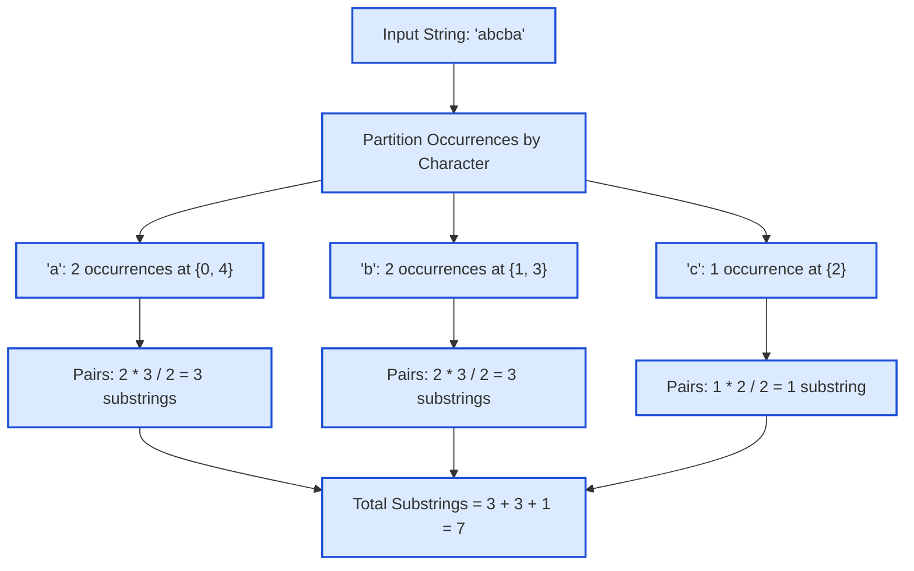

# Guided Example: Substrings That Begin and End With the Same Letter

We trace character partitioning, combinatorial endpoint pairing, and single-pass cumulative frequency contribution on a representative string:

- **Input String:** `"abcba"`
- **String Length $n$:** `5`
- **Expected Output:** `7`

---

## 1. Problem Overview & Representative Instance

We are given a string `s` consisting of lowercase English letters. We wish to find the total number of substrings that begin and end with the exact same character.
- A substring is defined by an index pair $(i, j)$ with $0 \le i \le j < n$, representing the contiguous segment $s[i \dots j]$.
- The condition is satisfied if and only if $s[i] == s[j]$.
- A substring of length $1$ ($i = j$) trivially begins and ends with the same character and is always valid.

For `"abcba"`:
- Substrings starting and ending with `'a'`: `"a"` (at index 0), `"a"` (at index 4), and `"abcba"` (from index 0 to 4) $\implies 3$.
- Substrings starting and ending with `'b'`: `"b"` (at index 1), `"b"` (at index 3), and `"bcb"` (from index 1 to 3) $\implies 3$.
- Substrings starting and ending with `'c'`: `"c"` (at index 2) $\implies 1$.
- Total valid substrings: $3 + 3 + 1 = 7$.

---

## 2. Theoretical Invariants & Combinatorial Reduction

### Invariant 1: Independent Character Classes
A substring starting and ending with character $c_1$ can never start and end with character $c_2$ when $c_1 \neq c_2$.
Therefore, the total number of valid substrings is the disjoint sum of valid substrings for each distinct character in the alphabet:
$$\text{Total Substrings} = \sum_{c \in \Sigma} N(c)$$
where $N(c)$ is the number of pairs $(i, j)$ such that $i \le j$ and $s[i] = s[j] = c$.

### Invariant 2: Triangular Number Counting Formula
If character $c$ appears $k$ times in $s$ at positions $p_1 < p_2 < \dots < p_k$:
- Any single occurrence $i = j = p_m$ forms a valid 1-character substring ($k$ choices).
- Any pair of distinct occurrences $p_m < p_r$ forms a valid multi-character substring ($i = p_m, j = p_r$), giving $\binom{k}{2} = \frac{k(k-1)}{2}$ choices.
Combining both:
$$N(c) = k + \frac{k(k-1)}{2} = \frac{k(k+1)}{2}$$

### Invariant 3: Online Incremental Accumulation
In an online single-pass scan from left to right, when the $m$-th occurrence of character $c$ is visited ($m = 1, 2, \dots, k$):
- This new character can serve as the right endpoint $j$ paired with any of the previous $m - 1$ occurrences of $c$, plus itself as a single-character substring.
- Thus, the $m$-th occurrence immediately contributes exactly $+m$ new valid substrings:
  $$\sum_{m=1}^{k} m = \frac{k(k+1)}{2}$$
By maintaining a running frequency counter $\text{cnt}[c]$ and updating $\text{ans} \leftarrow \text{ans} + \text{cnt}[c]$, the total is accumulated in $\mathcal{O}(n)$ time and $\mathcal{O}(|\Sigma|)$ space.

| Parameter | Mathematical Term | Meaning in Processing |
|---|---|---|
| Character Occurrences $k_c$ | $\sum_{i=0}^{n-1} [\![s[i] == c]\!]$ | Total frequency of character $c$ in string |
| Combinatorial Contribution | $\frac{k_c(k_c + 1)}{2}$ | Total substrings with boundary character $c$ |
| Online Step Contribution | $\text{cnt}[c]$ (after increment) | Substrings ending at current index with same start |
| Cumulative Total | $\sum_c \frac{k_c(k_c + 1)}{2}$ | Total qualifying substrings across entire string |

---

## 3. Step-by-Step State Execution Trace

We trace the single-pass online scan for $s = \text{"abcba"}$:

### Index 0: Character `'a'`
- Character frequency before: $\text{cnt}[\text{'a'}] = 0$.
- Increment frequency: $\text{cnt}[\text{'a'}] = 1$.
- New substrings ending at index 0:
  - $s[0 \dots 0] = \text{"a"}$ ($1$ substring).
- Cumulative answer:
  $$ans = 0 + 1 = 1$$

---

### Index 1: Character `'b'`
- Character frequency before: $\text{cnt}[\text{'b'}] = 0$.
- Increment frequency: $\text{cnt}[\text{'b'}] = 1$.
- New substrings ending at index 1:
  - $s[1 \dots 1] = \text{"b"}$ ($1$ substring).
- Cumulative answer:
  $$ans = 1 + 1 = 2$$

---

### Index 2: Character `'c'`
- Character frequency before: $\text{cnt}[\text{'c'}] = 0$.
- Increment frequency: $\text{cnt}[\text{'c'}] = 1$.
- New substrings ending at index 2:
  - $s[2 \dots 2] = \text{"c"}$ ($1$ substring).
- Cumulative answer:
  $$ans = 2 + 1 = 3$$

---

### Index 3: Character `'b'`
- Character frequency before: $\text{cnt}[\text{'b'}] = 1$.
- Increment frequency: $\text{cnt}[\text{'b'}] = 2$.
- New substrings ending at index 3:
  - $s[3 \dots 3] = \text{"b"}$ (paired with itself).
  - $s[1 \dots 3] = \text{"bcb"}$ (paired with first `'b'` at index 1).
  - Total newly formed: $2$ substrings.
- Cumulative answer:
  $$ans = 3 + 2 = 5$$

---

### Index 4: Character `'a'`
- Character frequency before: $\text{cnt}[\text{'a'}] = 1$.
- Increment frequency: $\text{cnt}[\text{'a'}] = 2$.
- New substrings ending at index 4:
  - $s[4 \dots 4] = \text{"a"}$ (paired with itself).
  - $s[0 \dots 4] = \text{"abcba"}$ (paired with first `'a'` at index 0).
  - Total newly formed: $2$ substrings.
- Cumulative answer:
  $$ans = 5 + 2 = 7$$

All characters processed. Emitted answer: $7$.

---

## 4. Complete Execution Trace & Multi-Scenario Audit

Below is the state progression table across each step:

| Index $i$ | Character $s[i]$ | Frequency Before | Updated Frequency $\text{cnt}[s[i]]$ | Newly Formed Substrings | Running Total `ans` |
|---|---|---|---|---|---|
| $0$ | `'a'` | $0$ | $1$ | `s[0..0]` (`"a"`) | $1$ |
| $1$ | `'b'` | $0$ | $1$ | `s[1..1]` (`"b"`) | $2$ |
| $2$ | `'c'` | $0$ | $1$ | `s[2..2]` (`"c"`) | $3$ |
| $3$ | `'b'` | $1$ | $2$ | `s[3..3]` (`"b"`), `s[1..3]` (`"bcb"`) | $5$ |
| $4$ | `'a'` | $1$ | $2$ | `s[4..4]` (`"a"`), `s[0..4]` (`"abcba"`) | **$7$** |

### Combinatorial Verification by Frequency Totals
At the end of traversal, the overall frequency distribution is:

| Character | Total Count $k_c$ | Formula $\frac{k_c(k_c + 1)}{2}$ | Substrings Generated |
|---|---|---|---|
| `'a'` | $2$ | $\frac{2 \cdot 3}{2} = 3$ | `"a"` (0), `"a"` (4), `"abcba"` (0..4) |
| `'b'` | $2$ | $\frac{2 \cdot 3}{2} = 3$ | `"b"` (1), `"b"` (3), `"bcb"` (1..3) |
| `'c'` | $1$ | $\frac{1 \cdot 2}{2} = 1$ | `"c"` (2) |
| **Sum** | **$5$** | **$3 + 3 + 1 = 7$** | **$7$ total valid substrings** |

---

## 5. Algorithmic Correctness & Soundness

1. **Bijective Mapping:**
   Every valid substring corresponds to an ordered pair of indices $(i, j)$ with $i \le j$ and $s[i] == s[j]$.
   For a fixed character $c$, if its indices are $p_1 < p_2 < \dots < p_k$, every choice of $1 \le a \le b \le k$ yields the unique valid substring $s[p_a \dots p_b]$. The number of such pairs is known to be $\binom{k+1}{2} = \frac{k(k+1)}{2}$.
2. **Exhaustive Disjoint Partition:**
   Since a substring has exactly one first character and one last character, substrings that begin and end with `'a'` are completely disjoint from those that begin and end with `'b'`. Summing the independent contributions across all alphabet characters is strictly complete and double-counting-free.
3. **Equivalence of Online Accumulation:**
   Because $\sum_{m=1}^k m = \frac{k(k+1)}{2}$, adding the running frequency at each step yields the exact mathematical sum without requiring a second pass.

---

## 6. Edge Cases, Pitfalls & Structural Traps

- **All Characters Distinct:**
  If every character is unique ($k_c = 1$ for all $c$), each character contributes $\frac{1(2)}{2} = 1$. The answer is simply the length of the string $n$.
- **All Characters Identical (`"zzzz"`):**
  If all characters are the same ($k = n$), every substring qualifies. The total is $\frac{n(n+1)}{2}$. For $n = 4$, $\frac{4 \cdot 5}{2} = 10$.
- **Large Strings & Integer Overflow:**
  For strings of length $10^5$ where all characters are identical, the answer can reach $\frac{10^5 \cdot 10^5}{2} \approx 5 \times 10^9$, exceeding standard 32-bit signed integers. A 64-bit integer type is necessary.

---

## 7. Complexity Analysis

- **Time Complexity:**
  - The algorithm processes each character of `s` exactly once.
  - Frequency lookups and updates in a fixed-size table or hash map take $\mathcal{O}(1)$ time.
  - Total time complexity: $\mathcal{O}(n)$ linear time.
- **Auxiliary Space Complexity:**
  - The alphabet consists only of lowercase English letters ($|\Sigma| \le 26$).
  - Total auxiliary space: $\mathcal{O}(|\Sigma|) = \mathcal{O}(1)$ strictly constant memory.
