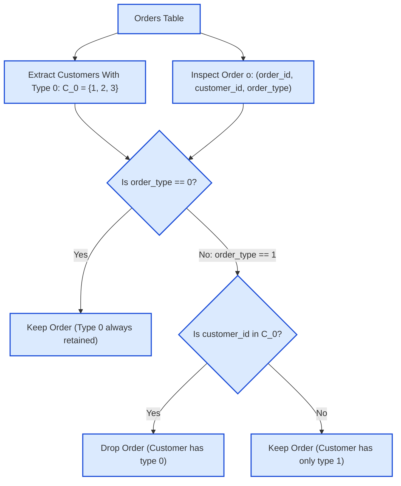

# Guided Example: Drop Type 1 Orders for Customers With Type 0 Orders

We trace relational partitioning, customer-level existential anti-join filtering, and conditional order retention on a representative e-commerce orders table:

- **Orders Table Input:**
  - `(order_id: 1, customer_id: 1, order_type: 0)`
  - `(order_id: 2, customer_id: 1, order_type: 0)`
  - `(order_id: 11, customer_id: 2, order_type: 0)`
  - `(order_id: 12, customer_id: 2, order_type: 1)`
  - `(order_id: 21, customer_id: 3, order_type: 1)`
  - `(order_id: 22, customer_id: 3, order_type: 0)`
  - `(order_id: 31, customer_id: 4, order_type: 1)`
  - `(order_id: 32, customer_id: 4, order_type: 1)`
- **Expected Output Rows:**
  - `(1, 1, 0)`, `(2, 1, 0)`, `(11, 2, 0)`, `(22, 3, 0)`, `(31, 4, 1)`, `(32, 4, 1)`

---

## 1. Problem Overview & Representative Instance

We are given a database relation `Orders` recording customer purchase transactions with schema:
$$\text{Orders}(\text{order\_id}, \text{customer\_id}, \text{order\_type})$$
where `order_id` is the primary key, and `order_type` takes values in $\{0, 1\}$.

**Filtering Rule:**
- If a customer has at least one order of type $0$, we must drop all of their orders of type $1$.
- If a customer has NO orders of type $0$, all of their orders of type $1$ must be retained.
- Orders of type $0$ are always retained unconditionally.

We wish to report the filtered result containing all surviving order records.

---

## 2. Theoretical Invariants & Customer Partition Logic

### Invariant 1: Customer Partition Classification
Let $C$ denote the set of all customers present in `Orders`. We partition $C$ into two mutually exclusive, exhaustive subsets:
1. **Type-0 Customer Set ($C_0$):**
   $$C_0 = \pi_{\text{customer\_id}} \left( \sigma_{\text{order\_type} = 0}(\text{Orders}) \right)$$
   Customers in $C_0$ have at least one order with `order_type = 0`.
2. **Type-1 Exclusive Customer Set ($C_1$):**
   $$C_1 = C \setminus C_0$$
   Customers in $C_1$ have zero orders with `order_type = 0`; all their orders are of type $1$.

### Invariant 2: Row-Level Retention Predicate
An order tuple $o \in \text{Orders}$ is preserved in the output relation if and only if the following boolean formula evaluates to true:
$$\text{keep}(o) \iff (o.\text{order\_type} = 0) \lor (o.\text{customer\_id} \notin C_0)$$

Equivalently, an order is dropped if and only if:
$$\text{drop}(o) \iff (o.\text{order\_type} = 1) \land (o.\text{customer\_id} \in C_0)$$

| Customer Category | Definition | Type 0 Orders Status | Type 1 Orders Status |
|---|---|---|---|
| Pure Type 0 ($C_0 \setminus \text{has\_type\_1}$) | Only placed type 0 orders | Kept unconditionally | None exist |
| Mixed ($C_0 \cap \text{has\_type\_1}$) | Placed both type 0 and type 1 | Kept unconditionally | **Dropped completely** |
| Pure Type 1 ($C_1$) | Placed only type 1 orders | None exist | **Kept unconditionally** |

---

## 3. Step-by-Step State Execution Trace

We trace the relational evaluation on the sample dataset:

### Step 1: Materialize Type-0 Customer Set ($C_0$)
Scan `Orders` for rows where `order_type = 0`:
- Order 1: `customer_id = 1`
- Order 2: `customer_id = 1`
- Order 11: `customer_id = 2`
- Order 22: `customer_id = 3`

Extracting unique customer identifiers gives:
$$C_0 = \{1, 2, 3\}$$

---

### Step 2: Row-by-Row Retention Evaluation

1. **Order 1: `(order_id: 1, customer_id: 1, order_type: 0)`**
   - `order_type` is $0$.
   - Decision: **Kept** (Type 0 always retained).
2. **Order 2: `(order_id: 2, customer_id: 1, order_type: 0)`**
   - `order_type` is $0$.
   - Decision: **Kept** (Type 0 always retained).
3. **Order 11: `(order_id: 11, customer_id: 2, order_type: 0)`**
   - `order_type` is $0$.
   - Decision: **Kept** (Type 0 always retained).
4. **Order 12: `(order_id: 12, customer_id: 2, order_type: 1)`**
   - `order_type` is $1$.
   - Customer check: Does $2 \in C_0$? **Yes!**
   - Decision: **Dropped** (Customer 2 has type 0 orders).
5. **Order 21: `(order_id: 21, customer_id: 3, order_type: 1)`**
   - `order_type` is $1$.
   - Customer check: Does $3 \in C_0$? **Yes!**
   - Decision: **Dropped** (Customer 3 has type 0 orders).
6. **Order 22: `(order_id: 22, customer_id: 3, order_type: 0)`**
   - `order_type` is $0$.
   - Decision: **Kept** (Type 0 always retained).
7. **Order 31: `(order_id: 31, customer_id: 4, order_type: 1)`**
   - `order_type` is $1$.
   - Customer check: Does $4 \in C_0$? False ($4 \notin \{1, 2, 3\}$).
   - Decision: **Kept** (Customer 4 has no type 0 orders).
8. **Order 32: `(order_id: 32, customer_id: 4, order_type: 1)`**
   - `order_type` is $1$.
   - Customer check: Does $4 \in C_0$? False.
   - Decision: **Kept** (Customer 4 has no type 0 orders).

---

## 4. Complete Execution Trace

Below is the comprehensive decision audit table across all rows:

| `order_id` | `customer_id` | `order_type` | Customer in $C_0$? | Retention Logic | Decision |
|---|---|---|---|---|---|
| $1$ | $1$ | $0$ | Yes ($1 \in C_0$) | Type $0 \implies$ Always keep | **Kept** |
| $2$ | $1$ | $0$ | Yes ($1 \in C_0$) | Type $0 \implies$ Always keep | **Kept** |
| $11$ | $2$ | $0$ | Yes ($2 \in C_0$) | Type $0 \implies$ Always keep | **Kept** |
| $12$ | $2$ | $1$ | Yes ($2 \in C_0$) | Type $1$ and $2 \in C_0 \implies$ Drop | **Dropped** |
| $21$ | $3$ | $1$ | Yes ($3 \in C_0$) | Type $1$ and $3 \in C_0 \implies$ Drop | **Dropped** |
| $22$ | $3$ | $0$ | Yes ($3 \in C_0$) | Type $0 \implies$ Always keep | **Kept** |
| $31$ | $4$ | $1$ | No ($4 \notin C_0$) | Type $1$ and $4 \notin C_0 \implies$ Keep | **Kept** |
| $32$ | $4$ | $1$ | No ($4 \notin C_0$) | Type $1$ and $4 \notin C_0 \implies$ Keep | **Kept** |

### Output Result Table:

| order_id | customer_id | order_type |
|---|---|---|
| 1 | 1 | 0 |
| 2 | 1 | 0 |
| 11 | 2 | 0 |
| 22 | 3 | 0 |
| 31 | 4 | 1 |
| 32 | 4 | 1 |

---

## 5. Algorithmic Correctness & Soundness

1. **Preservation of All Type 0 Orders:**
   The predicate `order_type = 0 OR ...` guarantees that every order with `order_type = 0` evaluates to true regardless of the customer's other orders. No type 0 order is ever dropped.
2. **Selective Elimination of Subordinate Type 1 Orders:**
   For any row with `order_type = 1`, the row survives if and only if `NOT EXISTS (SELECT 1 FROM Orders WHERE customer_id = o.customer_id AND order_type = 0)`.
   This is mathematically identical to checking that customer `o.customer_id` has never placed a type 0 order.
3. **Partition Independence:**
   Because the subquery or CTE condition is keyed strictly on `customer_id`, the presence or absence of type 0 orders for customer $A$ has zero effect on the retention of orders for customer $B$.

---

## 6. Edge Cases, Pitfalls & Structural Traps

- **Chronological / Physical Order Independence:**
  In `Orders`, a type 1 order might appear before a type 0 order for the same customer (e.g., Order 21 appears before Order 22 for customer 3). Relational operations operate over sets, so Order 21 is properly suppressed even though it appeared earlier in the table.
- **Customers With Only Type 1 Orders:**
  A customer who only placed type 1 orders (like customer 4) must have all of their type 1 orders retained. Dropping all type 1 orders indiscriminately is an incorrect approach.
- **Singleton Partitions:**
  A customer with exactly one order keeps that order regardless of whether it is type 0 or type 1.

---

## 7. Complexity Analysis

- **Time Complexity:**
  - Materializing the set of customers with type 0 orders takes $\mathcal{O}(N)$ time.
  - Looking up customer existence in a hash set or index during the outer scan takes $\mathcal{O}(1)$ time per row.
  - Total time complexity: $\mathcal{O}(N)$ linear time where $N$ is the number of rows in `Orders`.
- **Auxiliary Space Complexity:**
  - The set $C_0$ stores at most $U \le N$ unique customer IDs.
  - Total auxiliary space: $\mathcal{O}(U)$ working memory.
