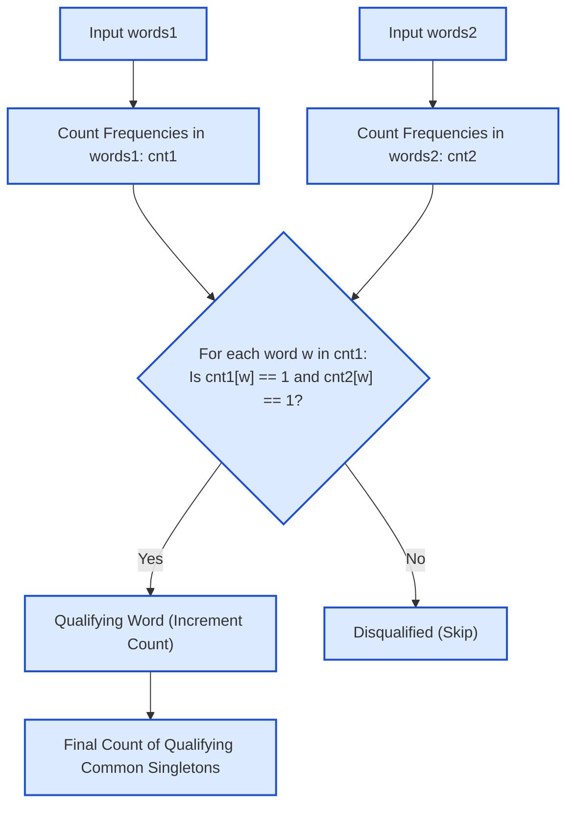

# Guided Example: Count Common Words With One Occurrence

We trace the independent multiset frequency counting, hash-indexed singleton filtering, and symmetric intersection evaluation on a representative string list pair:

- **Words Array 1:** `["leetcode", "is", "amazing", "as", "is"]`
- **Words Array 2:** `["amazing", "leetcode", "is"]`
- **Expected Output:** `2` (Qualifying words: `"leetcode"`, `"amazing"`)

---

## 1. Problem Overview & Representative Instance

We are given two string arrays `words1` and `words2`. We want to determine the count of strings that appear **exactly once** in `words1` AND **exactly once** in `words2`.
- If a string appears more than once in `words1`, it is disqualified even if it appears once in `words2`.
- If a string appears more than once in `words2`, it is disqualified even if it appears once in `words1`.
- If a string appears in only one of the arrays, it is disqualified.

For our instance:
- `"leetcode"` appears once in `words1` and once in `words2` $\implies$ Valid.
- `"amazing"` appears once in `words1` and once in `words2` $\implies$ Valid.
- `"is"` appears twice in `words1` and once in `words2` $\implies$ Disqualified.
- `"as"` appears once in `words1` and zero times in `words2` $\implies$ Disqualified.
Total qualifying words: $2$.

---

## 2. Theoretical Invariants & Multiset Singleton Logic

### Invariant 1: Singleton Equivalence
Let $f_1(w)$ and $f_2(w)$ denote the multiplicities of string $w$ in multisets $W_1$ and $W_2$, respectively:
$$f_1(w) = \sum_{x \in \text{words1}} [\![x == w]\!], \quad f_2(w) = \sum_{y \in \text{words2}} [\![y == w]\!]$$
A string $w$ belongs to the qualifying set $Q$ if and only if:
$$w \in Q \iff f_1(w) = 1 \land f_2(w) = 1$$

### Invariant 2: Asymmetric Disqualification & Cardinality
Notice that $Q$ is symmetric with respect to both input arrays ($Q = U_1 \cap U_2$ where $U_i = \{w \mid f_i(w) = 1\}$).
The search space can be pruned by enumerating only the keys of $cnt_1$ whose value is $1$:
$$|Q| = \sum_{w \in \text{keys}(cnt_1)} [\![f_1(w) = 1 \land f_2(w) = 1]\!]$$
This avoids scanning strings that appear multiple times in `words1` or checking words absent from `words1`.

| Frequency State $(f_1, f_2)$ | Qualification Status | Reason |
|---|---|---|
| $(1, 1)$ | **Qualified** | Appears exactly once in both arrays |
| $(>1, 1)$ | Disqualified | Duplicated in first array |
| $(1, >1)$ | Disqualified | Duplicated in second array |
| $(1, 0)$ | Disqualified | Missing from second array |
| $(>1, >1)$ | Disqualified | Duplicated in both arrays |

---

## 3. Step-by-Step State Execution Trace

We trace the hash counting and intersection filtering:

### Phase 1: Frequency Histogram Construction
1. **Processing `words1`:** `["leetcode", "is", "amazing", "as", "is"]`
   - `"leetcode"`: count $= 1$
   - `"is"`: count $= 1 + 1 = 2$
   - `"amazing"`: count $= 1$
   - `"as"`: count $= 1$
   - Resulting map: $cnt_1 = \{\text{"leetcode"}: 1, \text{"is"}: 2, \text{"amazing"}: 1, \text{"as"}: 1\}$

2. **Processing `words2`:** `["amazing", "leetcode", "is"]`
   - `"amazing"`: count $= 1$
   - `"leetcode"`: count $= 1$
   - `"is"`: count $= 1$
   - Resulting map: $cnt_2 = \{\text{"amazing"}: 1, \text{"leetcode"}: 1, \text{"is"}: 1\}$

---

### Phase 2: Candidate Verification
We iterate through all unique words in $cnt_1$:

1. **Word: `"leetcode"`**
   - Frequency in `words1`: $f_1 = 1$.
   - Lookup in `words2`: $f_2 = 1$.
   - Condition $f_1 == 1 \land f_2 == 1 \implies 1 == 1 \land 1 == 1 \implies$ **True!**
   - Action: Increment count ($ans = 0 + 1 = 1$).
2. **Word: `"is"`**
   - Frequency in `words1`: $f_1 = 2$.
   - Condition $f_1 == 1 \implies 2 == 1 \implies$ False.
   - Action: Disqualified ($ans = 1$).
3. **Word: `"amazing"`**
   - Frequency in `words1`: $f_1 = 1$.
   - Lookup in `words2`: $f_2 = 1$.
   - Condition $f_1 == 1 \land f_2 == 1 \implies 1 == 1 \land 1 == 1 \implies$ **True!**
   - Action: Increment count ($ans = 1 + 1 = 2$).
4. **Word: `"as"`**
   - Frequency in `words1`: $f_1 = 1$.
   - Lookup in `words2`: $f_2 = 0$ (not present).
   - Condition $f_2 == 1 \implies 0 == 1 \implies$ False.
   - Action: Disqualified ($ans = 2$).

Final emitted count: $2$.

---

## 4. Complete Execution Trace & Multiset Matrix

Below is the comparative audit table across all unique words observed across both inputs:

| Distinct Word $w$ | Count in `words1` ($f_1$) | Singleton in `words1`? | Count in `words2` ($f_2$) | Singleton in `words2`? | Joint Predicate ($f_1=1 \land f_2=1$) | Outcome |
|---|---|---|---|---|---|---|
| `"leetcode"` | $1$ | Yes | $1$ | Yes | **True** | **Included (+1)** |
| `"amazing"` | $1$ | Yes | $1$ | Yes | **True** | **Included (+1)** |
| `"is"` | $2$ | No | $1$ | Yes | False | Excluded (Duplicate in $W_1$) |
| `"as"` | $1$ | Yes | $0$ | No | False | Excluded (Absent from $W_2$) |

### Contrast Instance: Duplicate in Second Array
Consider `words1 = ["a", "ab"]`, `words2 = ["a", "a", "a", "ab"]`:

| Candidate Word | $f_1$ in `words1` | $f_2$ in `words2` | Evaluation | Decision |
|---|---|---|---|---|
| `"a"` | $1$ | $3$ | $f_2 = 3 \neq 1 \implies$ Repeated in second array | Disqualified |
| `"ab"` | $1$ | $1$ | $f_1 = 1 \land f_2 = 1 \implies$ Singleton in both | **Qualified (+1)** |

The output for that instance is $1$. Even though `"a"` appears once in `words1`, its repetition in `words2` correctly disqualifies it.

---

## 5. Algorithmic Correctness & Soundness

1. **Exact Cardinality of Symmetric Difference Exclusions:**
   The specification demands that qualifying strings satisfy $w \in \{x \mid f_1(x) = 1\} \cap \{y \mid f_2(y) = 1\}$.
   Because a hash table accurately counts the exact frequency of every string, testing $cnt_1[w] == 1 \land cnt_2[w] == 1$ is both necessary and sufficient.
2. **Double-Counting Prevention:**
   The outer iteration runs over the unique keys of $cnt_1$. Since keys in a hash map are strictly distinct, each qualifying string is evaluated and counted exactly once.
3. **Soundness of Default Zero Multiplicity:**
   Looking up a key that does not exist in $cnt_2$ returns $0$. Since $0 \neq 1$, absent strings are safely rejected without throwing key-error exceptions.

---

## 6. Edge Cases, Pitfalls & Structural Traps

- **Disjoint String Arrays:**
  If `words1` and `words2` share no common strings, $cnt_2[w] = 0$ for all keys in $cnt_1$. The answer is $0$.
- **Duplicate Suppression vs. Membership Checking:**
  Checking only whether a string is present (`w in words2`) without checking frequency fails when the string is duplicated in `words2`. Both frequencies must be checked for strict equality to $1$.
- **All Words Repeated:**
  If every common word is repeated multiple times in both lists (e.g. `["red", "red"]` and `["red", "red"]`), the count is $0$.

---

## 7. Complexity Analysis

- **Time Complexity:**
  - Building $cnt_1$ takes $\mathcal{O}(L_1)$ time, where $L_1$ is the total number of characters across strings in `words1`.
  - Building $cnt_2$ takes $\mathcal{O}(L_2)$ time, where $L_2$ is the total number of characters across strings in `words2`.
  - Iterating over the unique keys of $cnt_1$ and looking up each in $cnt_2$ takes $\mathcal{O}(L_1)$ string hashing and comparison time.
  - Total time complexity: $\mathcal{O}(L_1 + L_2)$ linear time with respect to the total input size.
- **Auxiliary Space Complexity:**
  - The two frequency hash maps store each unique string once along with its integer count.
  - Total auxiliary space: $\mathcal{O}(L_1 + L_2)$ memory.
