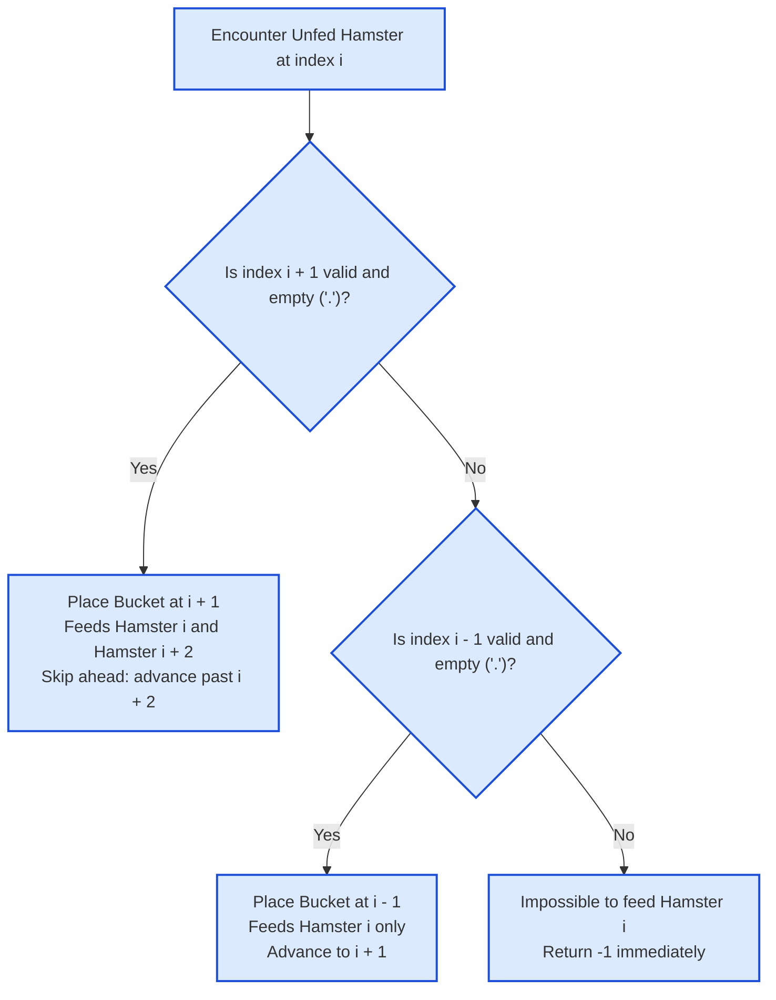

# Guided Example: Minimum Number of Food Buckets to Feed the Hamsters

We trace greedy rightward bucket placement, sharing window leapfrogging, and adjacency obstruction detection on a representative street instance:

- **Street Layout:** `".H.H."`
- **Street Length $n$:** `5`
- **Expected Output:** `1` (Single bucket placed at index 2 feeds both hamsters)

---

## 1. Problem Overview & Representative Instance

You are given a 0-indexed string `street` where each character is either:
- `'H'`, denoting that there is a hamster at that position.
- `'.'`, denoting an empty space where a food bucket can be placed.

A food bucket placed at empty index $i$ can feed a hamster located at $i - 1$ and/or a hamster located at $i + 1$. Each hamster needs to be fed by at least one adjacent bucket. A bucket can feed up to two hamsters simultaneously if placed between them.

Our objective is to determine the **minimum** number of food buckets needed to feed all hamsters, or return `-1` if it is impossible to feed every hamster.

### The Greedy Rightward Placement Principle
When traversing from left to right, suppose we encounter an unfed hamster at index $i$:
- We could potentially place a bucket at $i - 1$ (if empty) or at $i + 1$ (if empty).
- Placing a bucket at $i - 1$ can only ever feed hamster $i$, because all hamsters to the left of $i - 1$ have already been processed and fed.
- In contrast, placing a bucket at $i + 1$ feeds hamster $i$ AND might also feed a future hamster at index $i + 2$!
- Therefore, whenever $i + 1$ is an empty space (`'.'`), placing the bucket at $i + 1$ is strictly optimal or equivalent.

---

## 2. Theoretical Invariants & Greedy Dominance

### Invariant 1: Forward Placement Dominance
Let $i$ be the leftmost unfed hamster.
Any valid configuration must place a bucket adjacent to $i$, either at $i - 1$ or $i + 1$.
- Any solution placing a bucket at $i - 1$ can be transformed into a solution of equal or fewer buckets by relocating the bucket to $i + 1$ (provided $i + 1$ is empty).
- The relocated bucket still covers hamster $i$ and may additionally cover hamster $i + 2$, potentially eliminating the need for another bucket further down the street.
- Thus, the greedy choice of preferring $i + 1$ over $i - 1$ never destroys optimality.

### Invariant 2: Leapfrog Advancement on Right Placement
When a bucket is placed at $i + 1$:
- Hamster $i$ is satisfied.
- If position $i + 2$ contains a hamster, that hamster is already adjacent to the bucket at $i + 1$ and is therefore completely fed!
- We can safely advance the scanner to index $i + 3$, bypassing hamster $i + 2$.

### Invariant 3: Adjacency Obstruction Invariant
If position $i$ contains a hamster, and:
- $i + 1$ is not empty (either out of bounds or another hamster), AND
- $i - 1$ is not empty (either out of bounds or another hamster),
then no bucket can ever be placed adjacent to hamster $i$. The problem instance is provably unsolvable $\implies$ return $-1$.

| State Parameter | Role in Greedy Scan | Action Rule |
|---|---|---|
| Cursor Index $i$ | Position of current street cell | Scans from $0$ to $n - 1$ |
| Cell Value $street[i]$ | `'H'` (hamster) or `'.'` (empty space) | Trigger placement logic on `'H'` |
| Preferred Bucket Spot | $i + 1$ if empty | Enables dual-coverage of $i$ and $i + 2$ |
| Fallback Bucket Spot | $i - 1$ if empty | Dedicated single-hamster coverage |
| Impossibility Flag | Both $i - 1$ and $i + 1$ blocked | Abort and return $-1$ |

---

## 3. Step-by-Step Worked Execution

We trace the representative instance: `street = ".H.H."` of length $n = 5$.
Initial state: cursor $i = 0$, bucket count $ans = 0$.

---

### Step 1: Index $i = 0$
- Character: `street[0] = '.'`.
- This is an empty space. No action required.
- Increment pointer: $i = 0 + 1 = 1$.

---

### Step 2: Index $i = 1$
- Character: `street[1] = 'H'` (Hamster).
- **Evaluate Right Placement ($i + 1 = 2$):**
  - Check boundary: $2 < 5$ (valid).
  - Check content: `street[2] == '.'` (empty space!).
  - **Decision:** Greedily place a food bucket at index $2$.
  - Increment bucket count: $ans = 0 + 1 = 1$.
- **Leapfrog Advancement:**
  - The bucket at index $2$ feeds both hamster $1$ and hamster $1 + 1 + 1 = 3$.
  - We skip past the covered hamster at $i + 2$:
    $$i \leftarrow i + 2 = 1 + 2 = 3$$
  - At the end of the loop iteration, pointer increments by $1$:
    $$i \leftarrow 3 + 1 = 4$$

---

### Step 3: Index $i = 4$
- Character: `street[4] = '.'`.
- Empty space. No action required.
- Increment pointer: $i = 4 + 1 = 5$.

---

### Termination
Pointer $i = 5 \ge n$. Traversal complete.
All hamsters have been fed.
Final answer: $ans = 1$.

---

## 4. Complete Execution Trace & Multi-Scenario Audit

Below is the state transition trace across all evaluation steps for `".H.H."`:

| Loop Step | Cursor $i$ | `street[i]` | Placement Decision | Bucket Placed At | Advance Increment | Next Cursor | Running Buckets |
|---|---|---|---|---|---|---|---|
| Step 1 | $0$ | `'.'` | Empty space; advance | None | $+1$ | $1$ | $0$ |
| Step 2 | $1$ | `'H'` | Right space empty (`street[2] == '.'`) | Index $2$ | $+2$ (leapfrog) $+1$ | $4$ | **$1$** |
| Step 3 | $4$ | `'.'` | Empty space; advance | None | $+1$ | $5$ (End) | **$1$** |

### Comparison Across Edge Topologies

| Street String | Structure Type | Step-by-Step Analysis | Feasible? | Buckets Required |
|---|---|---|---|---|
| `".H.H."` | Shared bucket | Bucket at $2$ feeds hamsters at $1$ and $3$ | **Yes** | **$1$** |
| `"H..H"` | Separated endpoints | Hamster $0$ uses $1$; Hamster $3$ uses $2$ | **Yes** | **$2$** |
| `".HHH."` | Three consecutive | Hamster at $2$ has no adjacent empty cell | **No** | **$-1$** |
| `"H"` | Single isolated | No space to left or right ($n = 1$) | **No** | **$-1$** |
| `"...."` | No hamsters | Loop finishes without encountering any `'H'` | **Yes** | **$0$** |
| `".HH."` | Adjacent pair | Hamster $1$ cannot use right; uses $0$. Hamster $2$ uses $3$. | **Yes** | **$2$** |

Notice in `".HHH."`:
- Hamster at index 1 can use index 0.
- But hamster at index 2 has `street[1] = 'H'` on its left and `street[3] = 'H'` on its right.
- Neither adjacent cell is an empty space `'.'`.
- It is physically impossible to feed hamster 2, correctly returning `-1`.

---

## 5. Algorithmic Correctness & Soundness

1. **Greedy Choice Property:**
   Let $i$ be the first unfed hamster from the left. Placing a bucket at $i + 1$ rather than $i - 1$ leaves strictly more opportunities for rightward hamsters to share the bucket, while satisfying hamster $i$ identically. Hence, an optimal solution with a bucket at $i + 1$ always exists whenever $i + 1$ is empty.
2. **Fallback Soundness:**
   If $i + 1$ is occupied by another hamster or is out of bounds, the only remaining adjacent cell that could possibly feed hamster $i$ is $i - 1$. If $i - 1$ is empty, placing a bucket there is mandatory.
3. **Sound Impossibility Criterion:**
   A hamster at index $i$ can only be fed by cells $i - 1$ and $i + 1$. If neither cell is an empty space within bounds, no valid placement can ever feed hamster $i$. The detection of $-1$ is mathematically certain.

---

## 6. Edge Cases, Pitfalls & Structural Traps

- **Boundary Hamsters (`"H"` or `"HH."`):**
  A hamster at index $0$ has no left neighbor ($i - 1 < 0$). If $i + 1$ is also blocked (or out of bounds), failure is immediate.
- **Double-Counting Shared Buckets:**
  When a bucket is placed at $i + 1$, skipping past $i + 2$ is vital. Failing to advance past $i + 2$ treats hamster $i + 2$ as unfed, placing a redundant bucket at $i + 3$.
- **All Empty String (`"...."`):**
  If there are no hamsters, the loop visits all cells, finds no `'H'`, and returns $0$.

---

## 7. Complexity Analysis

- **Time Complexity:**
  - The string of length $n$ is scanned from left to right.
  - The pointer $i$ advances by either $1$ or $3$ positions at each step.
  - Each cell is inspected $\mathcal{O}(1)$ times.
  - Total time complexity: $\mathcal{O}(n)$ linear time.
- **Auxiliary Space Complexity:**
  - The algorithm only maintains scalar index variables (`i`, `n`, `ans`).
  - Total auxiliary space: $\mathcal{O}(1)$ constant memory.