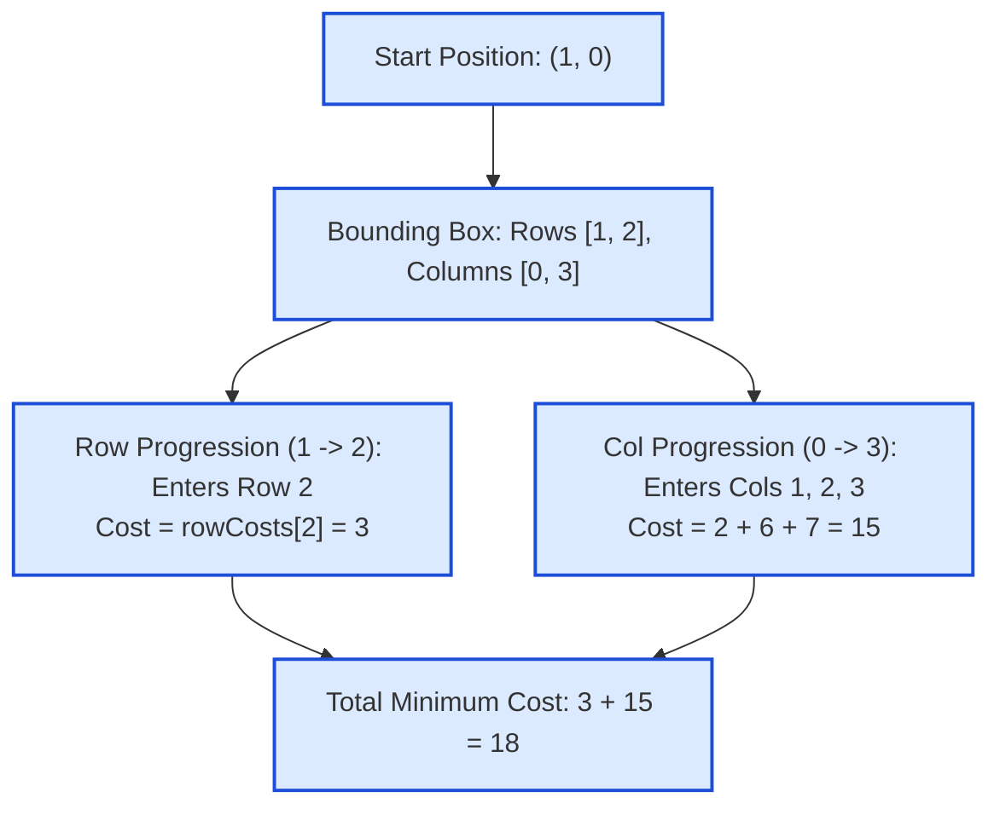

# Guided Example: Minimum Cost Homecoming of a Robot in a Grid

We trace the Manhattan bounding box path-invariance theorem, non-negative separable transition costs, and closed-form interval summation on a representative grid navigation problem:

- **Start Position:** `[1, 0]` (Row 1, Column 0)
- **Home Position:** `[2, 3]` (Row 2, Column 3)
- **Row Costs:** `[5, 4, 3]`
- **Column Costs:** `[8, 2, 6, 7]`
- **Expected Output:** `18`

---

## 1. Problem Overview & Representative Instance

We are given an $m \times n$ grid. A robot is initially located at cell `startPos = [startRow, startCol]`, and its home is located at `homePos = [homeRow, homeCol]`.
The robot can move in four cardinal directions (up, down, left, right):
- Moving into row $r$ from an adjacent cell incurs cost `rowCosts[r]`.
- Moving into column $c$ from an adjacent cell incurs cost `colCosts[c]`.
- The starting cell `startPos` incurs no cost initially because the robot starts there without moving into it.
- All entries in `rowCosts` and `colCosts` are non-negative ($\ge 0$).

We want to find the **minimum total cost** to guide the robot from `startPos` to `homePos`.

### The Deceptive Graph Search vs. Path-Invariance Insight
At first glance, this problem looks like a 2D shortest-path problem requiring Dijkstra's algorithm or dynamic programming on a grid.
However, because all costs are strictly non-negative:
1. Moving away from the destination row or column (a detour) can only incur extra non-negative costs upon returning.
2. Any **monotonic path** moving solely in the direction of the home position enters each intermediate row between `startRow` and `homeRow` **exactly once**, and each intermediate column between `startCol` and `homeCol` **exactly once**.
3. Consequently, **every monotonic path has the exact same total cost**, and no non-monotonic path can achieve a lower cost!
4. The minimum cost is simply the direct sum of costs of the traversed rows and columns.

---

## 2. Theoretical Invariants & Path Invariance Theorem

### Invariant 1: Mandatory Entry of Coordinate Slices
Let $x_0 = \text{startRow}, x_1 = \text{homeRow}$ and $y_0 = \text{startCol}, y_1 = \text{homeCol}$.
To travel from $(x_0, y_0)$ to $(x_1, y_1)$ on a grid graph:
- Any continuous path must cross every intermediate row between $x_0$ and $x_1$. Thus, every row in the half-open interval $(x_0, x_1]$ (or $[x_1, x_0)$ if moving upwards) must be entered **at least once**.
- Similarly, every column in $(y_0, y_1]$ (or $[y_1, y_0)$ if moving leftwards) must be entered **at least once**.

### Invariant 2: Non-Negativity and Monotonic Optimality
Because all transition costs are non-negative:
$$\text{rowCosts}[r] \ge 0, \quad \text{colCosts}[c] \ge 0$$
Entering any row or column more than once strictly adds non-negative cost without changing the destination.
Therefore, an optimal path will enter each required row and column **at most once**.
A path that enters each coordinate line exactly once is precisely a monotonic Manhattan path.

### The Closed-Form Cost Invariant
The cost is completely separable into two independent 1D range sums:
$$\text{Min Cost} = \Delta_{\text{row}} + \Delta_{\text{col}}$$
where:
$$\Delta_{\text{row}} = \begin{cases} \sum_{r = x_0 + 1}^{x_1} \text{rowCosts}[r] & \text{if } x_0 < x_1 \\ \sum_{r = x_1}^{x_0 - 1} \text{rowCosts}[r] & \text{if } x_0 > x_1 \\ 0 & \text{if } x_0 = x_1 \end{cases}$$
$$\Delta_{\text{col}} = \begin{cases} \sum_{c = y_0 + 1}^{y_1} \text{colCosts}[c] & \text{if } y_0 < y_1 \\ \sum_{c = y_1}^{y_0 - 1} \text{colCosts}[c] & \text{if } y_0 > y_1 \\ 0 & \text{if } y_0 = y_1 \end{cases}$$

| Coordinate Axis | Start to Home Range | Entered Indices Charged | Sub-Cost Formula |
|---|---|---|---|
| Vertical (Row) | $x_0 = 1 \to x_1 = 2$ | Row $2$ only (excludes start $1$) | $\sum_{r=2}^2 \text{rowCosts}[r] = 3$ |
| Horizontal (Column) | $y_0 = 0 \to y_1 = 3$ | Cols $1, 2, 3$ (excludes start $0$) | $\sum_{c=1}^3 \text{colCosts}[c] = 2 + 6 + 7 = 15$ |
| Combined Cost | $(1, 0) \to (2, 3)$ | Union of charged entries | $3 + 15 = 18$ |

---

## 3. Step-by-Step Worked Execution

We trace the representative instance: `startPos = [1, 0]`, `homePos = [2, 3]`, `rowCosts = [5, 4, 3]`, `colCosts = [8, 2, 6, 7]`.

### Step 1: Vertical Displacement Cost Calculation
- Start row: $x_0 = 1$.
- Home row: $x_1 = 2$.
- Direction: Downward ($x_0 < x_1$).
- Entered rows: $r \in [x_0 + 1, x_1] = [2, 2]$.
- Cost accumulated:
  $$\Delta_{\text{row}} = \text{rowCosts}[2] = 3$$
- Notice row $1$ (`rowCosts[1] = 4`) is NOT charged because the robot begins at row 1.

---

### Step 2: Horizontal Displacement Cost Calculation
- Start column: $y_0 = 0$.
- Home column: $y_1 = 3$.
- Direction: Rightward ($y_0 < y_1$).
- Entered columns: $c \in [y_0 + 1, y_1] = [1, 3]$.
- Individual column entries:
  - Column 1: $\text{colCosts}[1] = 2$.
  - Column 2: $\text{colCosts}[2] = 6$.
  - Column 3: $\text{colCosts}[3] = 7$.
- Cumulative horizontal cost:
  $$\Delta_{\text{col}} = 2 + 6 + 7 = 15$$
- Notice column $0$ (`colCosts[0] = 8`) is NOT charged because the robot begins at column 0.

---

### Step 3: Total Cost Combination
$$\text{Min Cost} = \Delta_{\text{row}} + \Delta_{\text{col}} = 3 + 15 = 18$$

---

## 4. Complete Execution Trace & Multi-Directional Audit

Below is the verification trace demonstrating consistency across multiple movement topologies:

| Route Scenario | `startPos` | `homePos` | Traversed Row Indices | Row Cost | Traversed Col Indices | Col Cost | Total Minimum Cost |
|---|---|---|---|---|---|---|---|
| Sample 1 (Down & Right) | $[1, 0]$ | $[2, 3]$ | $\{2\}$ | $3$ | $\{1, 2, 3\}$ | $2 + 6 + 7 = 15$ | **$18$** |
| Already Home | $[0, 0]$ | $[0, 0]$ | $\emptyset$ | $0$ | $\emptyset$ | $0$ | **$0$** |
| Up and Left | $[3, 3]$ | $[1, 0]$ | $\{2, 1\}$ | $\text{rowCosts}[1..2]$ | $\{2, 1, 0\}$ | $\text{colCosts}[0..2]$ | Sum of entered lines |
| Horizontal Only | $[1, 3]$ | $[1, 1]$ | $\emptyset$ | $0$ | $\{2, 1\}$ | $\text{colCosts}[1..2]$ | Col sum only |
| Vertical Only | $[0, 1]$ | $[3, 1]$ | $\{1, 2, 3\}$ | $\text{rowCosts}[1..3]$ | $\emptyset$ | $0$ | Row sum only |

### Equivalence of All Monotonic Routes
Consider two different monotonic paths from $(1, 0)$ to $(2, 3)$:
- **Path A (Down first, then right):**
  $(1, 0) \to (2, 0) \to (2, 1) \to (2, 2) \to (2, 3)$.
  Steps: enter row 2 ($3$), enter col 1 ($2$), enter col 2 ($6$), enter col 3 ($7$). Total = $3 + 2 + 6 + 7 = 18$.
- **Path B (Right first, then down):**
  $(1, 0) \to (1, 1) \to (1, 2) \to (1, 3) \to (2, 3)$.
  Steps: enter col 1 ($2$), enter col 2 ($6$), enter col 3 ($7$), enter row 2 ($3$). Total = $2 + 6 + 7 + 3 = 18$.
Both paths produce the exact same minimal cost, confirming the path-invariance principle.

---

## 5. Algorithmic Correctness & Soundness

1. **Lower Bound Guarantee:**
   Any path connecting $(x_0, y_0)$ to $(x_1, y_1)$ must enter every row strictly between $x_0$ and $x_1$ and the final row $x_1$ at least once. Likewise, it must enter every column strictly between $y_0$ and $y_1$ and the final column $y_1$ at least once.
   Because all costs are non-negative, the sum of these entry costs represents a strict lower bound on any path.
2. **Attainability:**
   Any simple monotonic path (e.g. moving entirely vertically to $x_1$ then entirely horizontally to $y_1$) achieves this lower bound with zero redundant visits.
   Since the lower bound is achievable, it is the global minimum.
3. **Exclusion of Starting Point:**
   The rules state that cost is incurred only when *moving into* a cell. The starting coordinates $(x_0, y_0)$ are never moved into, so their values are never added to the total.

---

## 6. Edge Cases, Pitfalls & Structural Traps

- **Charging the Starting Position:**
  Adding `rowCosts[x0]` or `colCosts[y0]` is a common error. The robot starts already located at $(x_0, y_0)$ and is not charged for its initial cell.
- **Overcomplicating with Dijkstra / BFS:**
  Implementing a shortest-path graph search like Dijkstra's algorithm adds an unnecessary $\mathcal{O}(mn \log(mn))$ overhead, which will time out for $m, n \le 10^5$. The mathematical property makes the problem $\mathcal{O}(m + n)$.
- **Directional Signs in Slicing:**
  When $x_0 > x_1$, the robot moves upwards, entering rows $x_0 - 1, x_0 - 2, \dots, x_1$. Slicing must span `rowCosts[x1:x0]` to correctly capture all entered rows.

---

## 7. Complexity Analysis

- **Time Complexity:**
  - Summing the sub-arrays of `rowCosts` and `colCosts` takes $\mathcal{O}(|x_1 - x_0| + |y_1 - y_0|)$ time.
  - In the worst case, this is bounded by $\mathcal{O}(m + n)$ where $m$ and $n$ are the grid dimensions.
  - Strictly linear time, optimal for reading the relevant slice of inputs.
- **Auxiliary Space Complexity:**
  - Only scalar variables storing coordinate bounds and range sums are maintained.
  - Total auxiliary space: $\mathcal{O}(1)$ constant memory.
