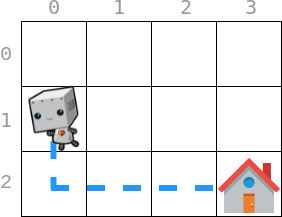

## Description

There is an `m x n` grid, where `(0, 0)` is the top-left cell and $(m - 1, n - 1)$ is the bottom-right cell. You are given an integer array `startPos` where $startPos = [\text{start}_{row}, \text{start}_{col}]$ indicates that **initially**, a **robot** is at the cell $(\text{start}_{row}, \text{start}_{col})$. You are also given an integer array `homePos` where $homePos = [\text{home}_{row}, \text{home}_{col}]$ indicates that its **home** is at the cell $(\text{home}_{row}, \text{home}_{col})$.

The robot needs to go to its home. It can move one cell in four directions: **left**, **right**, **up**, or **down**, and it can not move outside the boundary. Every move incurs some cost. You are further given two **0-indexed** integer arrays: `rowCosts` of length `m` and `colCosts` of length `n`.

- If the robot moves **up** or **down** into a cell whose **row** is `r`, then this move costs $\text{rowCosts}[r]$.

- If the robot moves **left** or **right** into a cell whose **column** is `c`, then this move costs $\text{colCosts}[c]$.

Return *the **minimum total cost** for this robot to return home*.
### Function Contract

- `n`: Input parameter.
- Returns expected result.

### Examples

#### Example 1

- **Input:** $startPos = [1, 0], homePos = [2, 3], rowCosts = [5, 4, 3], colCosts = [8, 2, 6, 7]$
- **Output:** `18`
- **Explanation:** One optimal path is that:
Starting from (1, 0)
-> It goes down to (<u>**2**</u>, 0). This move costs rowCosts[2] = 3.
-> It goes right to (2, <u>**1**</u>). This move costs colCosts[1] = 2.
-> It goes right to (2, <u>**2**</u>). This move costs colCosts[2] = 6.
-> It goes right to (2, <u>**3**</u>). This move costs colCosts[3] = 7.
The total cost is 3 + 2 + 6 + 7 = 18
#### Example 2

- **Input:** $startPos = [0, 0], homePos = [0, 0], rowCosts = [5], colCosts = [26]$
- **Output:** `0`
- **Explanation:** The robot is already at its home. Since no moves occur, the total cost is 0.
### Constraints

- $m = \text{rowCosts.length}$

- $n = \text{colCosts.length}$

- $1 \le m, n \le 10^{5}$

- $0 \le \text{rowCosts}[r], \text{colCosts}[c] \le 10^{4}$

- $\text{startPos.length} = 2$

- $\text{homePos.length} = 2$

- $0 \le \text{start}_{row}, \text{home}_{row} < m$

- $0 \le \text{start}_{col}, \text{home}_{col} < n$