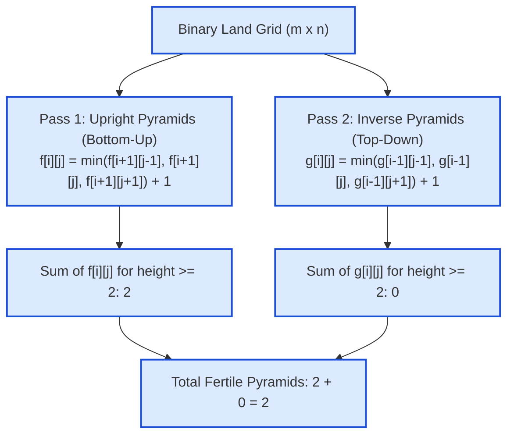

# Guided Example: Count Fertile Pyramids in a Land

We trace triangular geometric constraints, dual-orientation dynamic programming recurrences, and 3-cell support min-aggregation on a representative agricultural grid:

- **Land Grid:**
  ```text
  [[0, 1, 1, 0],
   [1, 1, 1, 1]]
  ```
- **Grid Dimensions:** $m = 2, n = 4$
- **Expected Output:** `2` (Two upright pyramids of height 2)

---

## 1. Problem Overview & Representative Instance

A plot of land is represented as an $m \times n$ binary grid `grid` where `1` represents fertile land and `0` represents barren land.
We wish to count the total number of **pyramidal** and **inverse pyramidal** plots of land:
1. **Pyramidal Plot (Upright):**
   - Has an apex cell $(r, c)$ with height $h \ge 2$.
   - For every $0 \le k < h$, row $r + k$ must contain fertile cells (`1`) across the contiguous column span $[c - k, c + k]$.
2. **Inverse Pyramidal Plot:**
   - Has an apex cell $(r, c)$ with height $h \ge 2$.
   - For every $0 \le k < h$, row $r - k$ must contain fertile cells (`1`) across the contiguous column span $[c - k, c + k]$.

A plot must have height $h \ge 2$ (a single cell of height $1$ is not considered a pyramid).

For our instance:
- Row 0: `[0, 1, 1, 0]`
- Row 1: `[1, 1, 1, 1]`
- Upright Pyramid 1: Apex $(0, 1)$ with base $(1, 0), (1, 1), (1, 2)$ (height 2).
- Upright Pyramid 2: Apex $(0, 2)$ with base $(1, 1), (1, 2), (1, 3)$ (height 2).
- Inverse Pyramids: None (apexes at row 1 require barren boundary cells $(0, 0)$ or $(0, 3)$).
- Total pyramids: $2 + 0 = 2$.



---

## 2. Theoretical Invariants & Triangular DP Recurrence

### Invariant 1: Inductive 3-Cell Support Foundation
A pyramid of height $h$ centered at apex $(i, j)$ requires that the next row $i + 1$ contains fertile cells from $j - 1$ to $j + 1$, and that each of those three cells supports a pyramid of height $h - 1$:
- Cell $(i + 1, j - 1)$ covers $[j - h, j - 2]$ at row $i + h - 1$.
- Cell $(i + 1, j)$ covers $[j - (h - 1), j + (h - 1)]$ at row $i + h - 1$.
- Cell $(i + 1, j + 1)$ covers $[j + 2, j + h]$ at row $i + h - 1$.
Taking the union of these three overlapping spans creates precisely the required continuous span $[j - (h - 1), j + (h - 1)]$ of width $2h - 1$!

### Invariant 2: Dynamic Programming State Definition
Let $f[i][j]$ denote the number of valid pyramids of height $\ge 2$ rooted at apex $(i, j)$:
- If $grid[i][j] == 0$, cell $(i, j)$ cannot serve as an apex: $f[i][j] = -1$.
- If on the boundary ($i = m - 1$ or $j = 0$ or $j = n - 1$), the apex has no room to expand to height $2$: $f[i][j] = 0$.
- Otherwise:
  $$f[i][j] = \min(f[i+1][j-1], f[i+1][j], f[i+1][j+1]) + 1$$
Here, $f[i][j]$ directly counts how many distinct pyramids of height $h \in [2, f[i][j] + 1]$ have apex $(i, j)$.
Summing $f[i][j]$ across all cells yields the exact count of upright pyramids.

### Invariant 3: Symmetric Inversion
By reflecting the vertical coordinate ($i - 1$ instead of $i + 1$), the exact same recurrence counts all inverse pyramids:
$$g[i][j] = \min(g[i-1][j-1], g[i-1][j], g[i-1][j+1]) + 1$$

| DP State | Value | Geometric Meaning |
|---|---|---|
| $f[i][j] = -1$ | Barren cell | Cannot be part of any pyramid apex |
| $f[i][j] = 0$ | Fertile cell, height 1 only | Base boundary cell; contributes $0$ pyramids |
| $f[i][j] = k \ge 1$ | Apex of pyramids | Contributes exactly $k$ valid pyramids ($h = 2, \dots, k+1$) |

---

## 3. Step-by-Step Worked Execution

We trace the representative grid: $m = 2, n = 4$.
`grid = [[0, 1, 1, 0], [1, 1, 1, 1]]`.

---

### Phase 1: Upright Pyramids (Bottom-Up Pass)

1. **Row 1 (Bottom Boundary: $i = m - 1 = 1$):**
   - For all columns $j \in \{0, 1, 2, 3\}$, since $grid[1][j] == 1$ and $i = 1$ is the bottom row:
     $$f[1][0] = 0, \quad f[1][1] = 0, \quad f[1][2] = 0, \quad f[1][3] = 0$$
   - Contribution from Row 1: $0$.

2. **Row 0 ($i = 0$):**
   - Cell $(0, 0)$: $grid[0][0] == 0 \implies f[0][0] = -1$.
   - Cell $(0, 1)$: $grid[0][1] == 1$.
     - Look at the three supporting cells in Row 1:
       - Left support: $f[1][0] = 0$
       - Center support: $f[1][1] = 0$
       - Right support: $f[1][2] = 0$
     - Apply recurrence:
       $$f[0][1] = \min(f[1][0], f[1][1], f[1][2]) + 1 = \min(0, 0, 0) + 1 = 1$$
     - Apex $(0, 1)$ supports $1$ pyramid of height $2$. Add $1$ to answer.
   - Cell $(0, 2)$: $grid[0][2] == 1$.
     - Look at three supporting cells in Row 1:
       - Left support: $f[1][1] = 0$
       - Center support: $f[1][2] = 0$
       - Right support: $f[1][3] = 0$
     - Apply recurrence:
       $$f[0][2] = \min(f[1][1], f[1][2], f[1][3]) + 1 = \min(0, 0, 0) + 1 = 1$$
     - Apex $(0, 2)$ supports $1$ pyramid of height $2$. Add $1$ to answer.
   - Cell $(0, 3)$: $grid[0][3] == 0 \implies f[0][3] = -1$.

Total Upright Pyramids:
$$\text{Upright Total} = 0 + 1 + 1 + 0 = 2$$

---

### Phase 2: Inverse Pyramids (Top-Down Pass)

1. **Row 0 (Top Boundary: $i = 0$):**
   - Boundary row cannot expand upward:
     $$g[0][0] = -1, \quad g[0][1] = 0, \quad g[0][2] = 0, \quad g[0][3] = -1$$
   - Contribution: $0$.

2. **Row 1 ($i = 1$):**
   - Cell $(1, 0)$: boundary column ($j = 0$) $\implies g[1][0] = 0$.
   - Cell $(1, 1)$: supports in Row 0 are $g[0][0] = -1, g[0][1] = 0, g[0][2] = 0$.
     - Recurrence:
       $$g[1][1] = \min(g[0][0], g[0][1], g[0][2]) + 1 = \min(-1, 0, 0) + 1 = -1 + 1 = 0$$
     - Because $(0, 0)$ is barren ($-1$), no inverse pyramid of height $\ge 2$ can be formed!
   - Cell $(1, 2)$: supports in Row 0 are $g[0][1] = 0, g[0][2] = 0, g[0][3] = -1$.
     - Recurrence:
       $$g[1][2] = \min(0, 0, -1) + 1 = 0$$
     - Because $(0, 3)$ is barren, no inverse pyramid can be formed!
   - Cell $(1, 3)$: boundary column ($j = 3$) $\implies g[1][3] = 0$.

Total Inverse Pyramids:
$$\text{Inverse Total} = 0$$

Grand Total:
$$\text{Total Pyramids} = 2 + 0 = 2$$

---

## 4. Complete Execution Trace & DP Grid Tables

Below is the state representation of the dynamic programming matrices for both passes:

### Upright DP Matrix $f[i][j]$:

| Row $i \backslash$ Col $j$ | Col 0 | Col 1 | Col 2 | Col 3 | Row Pyramids Count |
|---|---|---|---|---|---|
| **Row 0** | $-1$ (Barren) | **$1$ (Height 2)** | **$1$ (Height 2)** | $-1$ (Barren) | **$2$** |
| **Row 1 (Bottom)** | $0$ (Base) | $0$ (Base) | $0$ (Base) | $0$ (Base) | **$0$** |

### Inverse DP Matrix $g[i][j]$:

| Row $i \backslash$ Col $j$ | Col 0 | Col 1 | Col 2 | Col 3 | Row Inverse Count |
|---|---|---|---|---|---|
| **Row 0 (Top)** | $-1$ (Barren) | $0$ (Base) | $0$ (Base) | $-1$ (Barren) | **$0$** |
| **Row 1** | $0$ (Boundary) | $0$ (Blocked by $(0,0)$) | $0$ (Blocked by $(0,3)$) | $0$ (Boundary) | **$0$** |

---

## 5. Algorithmic Correctness & Soundness

1. **Geometric Sufficiency of 3-Cell Minimum:**
   By mathematical induction, if cells $(i+1, j-1)$, $(i+1, j)$, and $(i+1, j+1)$ each anchor pyramids of height $h - 1$, their respective horizontal spans on row $i + k$ are $[(j - 1) - (k - 1), (j - 1) + (k - 1)]$, $[j - (k - 1), j + (k - 1)]$, and $[(j + 1) - (k - 1), (j + 1) + (k - 1)]$.
   The union of these three intervals is precisely $[j - k, j + k]$.
   Therefore, cell $(i, j)$ anchors a pyramid of height $h$ if and only if all three underlying cells anchor pyramids of height at least $h - 1$.
2. **Counting Soundness:**
   A cell with maximum height $H = f[i][j] + 1$ contains exactly $f[i][j]$ valid pyramids of heights $2, 3, \dots, H$. Summing $f[i][j]$ across all cells directly yields the total count of valid pyramids without overcounting or omissions.
3. **Orientation Independence:**
   Because an upright pyramid and an inverse pyramid have opposite geometric orientations, their spans in the grid can never be identical. Summing the two passes yields the exact global total.

---

## 6. Edge Cases, Pitfalls & Structural Traps

- **Height 1 Cells:**
  A single fertile cell has height $1$. The problem explicitly mandates height $h \ge 2$. Initializing baseline cells to $0$ and only accumulating $f[i][j] \ge 1$ guarantees height 1 cells are excluded.
- **Barren Cell Encoding:**
  Encoding barren cells as $-1$ is essential. If barren cells were encoded as $0$, the formula $\min(0, 0, 0) + 1 = 1$ would erroneously claim that a fertile cell resting on barren ground forms a pyramid of height 2!
- **Grid Boundary Cells:**
  Cells along the left and right borders ($j = 0$ or $j = n - 1$) cannot have three supporting neighbors and must be clamped to $0$.

---

## 7. Complexity Analysis

- **Time Complexity:**
  - Upright pass: $\mathcal{O}(m \cdot n)$ filling the table bottom-up.
  - Inverse pass: $\mathcal{O}(m \cdot n)$ filling the table top-down.
  - Total time complexity: $\mathcal{O}(m \cdot n)$ strictly linear in the number of grid cells.
- **Auxiliary Space Complexity:**
  - The DP table requires $\mathcal{O}(m \cdot n)$ auxiliary memory (or can be optimized to $\mathcal{O}(n)$ using two row buffers).
  - Total auxiliary space: $\mathcal{O}(m \cdot n)$.
