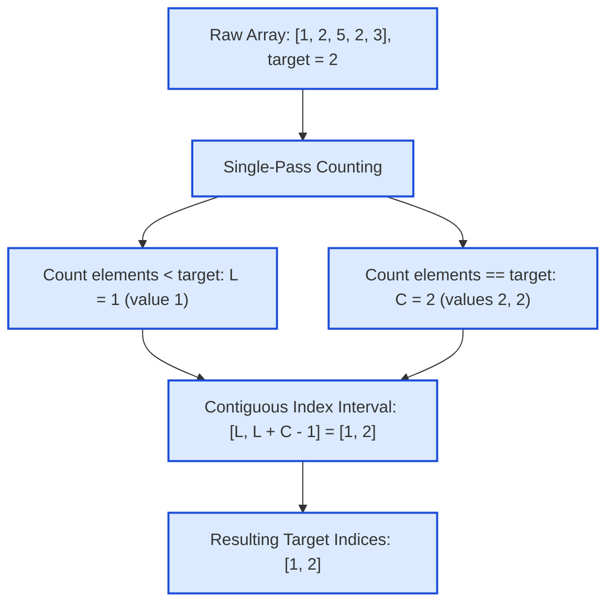

# Guided Example: Find Target Indices After Sorting Array

We trace the sorting index mapping, rank-based counting decomposition, and linear-time target index interval extraction on a representative integer array:

- **Input Array:** `[1, 2, 5, 2, 3]`
- **Target Value:** `2`
- **Expected Output:** `[1, 2]`

---

## 1. Problem Overview & Representative Instance

We are given an integer array `nums` and a value `target`. A **target index** is an index $i$ such that after sorting `nums` in non-decreasing order, `nums[i] == target`.
We wish to return a list of all target indices sorted in increasing order. If `target` does not appear in `nums`, we return an empty list `[]`.

### Sorting vs. Counting Rank Decomposition
- The standard baseline approach explicitly sorts `nums` in $\mathcal{O}(n \log n)$ time, then scans the array to collect all indices where the element equals `target`.
- However, we can determine the exact sorted positions of `target` in $\mathcal{O}(n)$ time without sorting!
- In any non-decreasingly sorted array, all elements strictly less than `target` must precede all occurrences of `target`.
- Therefore, if there are $L$ elements strictly smaller than `target` and $C$ elements equal to `target`:
  - Elements smaller than `target` occupy indices $0, 1, \dots, L - 1$.
  - The $C$ occurrences of `target` must occupy the contiguous index interval $[L, L + C - 1]$.

---

## 2. Theoretical Invariants & Counting Rank Logic

### Invariant 1: Permutation Order Invariance
Let $S$ be the sorted permutation of `nums`.
Because $S$ is weakly monotonic ($S[0] \le S[1] \le \dots \le S[n-1]$), the set of indices matching `target` forms an unbroken contiguous interval:
$$\{i \mid S[i] == \text{target}\} = [L, L + C - 1]$$
where:
$$L = \sum_{x \in \text{nums}} [\![x < \text{target}]\!]$$
$$C = \sum_{x \in \text{nums}} [\![x == \text{target}]\!]$$

### Invariant 2: Direct Generation
- If $C = 0$ (the target does not exist in `nums`), the interval $[L, L - 1]$ is empty, and the output is `[]`.
- If $C > 0$, the target indices are explicitly:
  $$[L, L + 1, L + 2, \dots, L + C - 1]$$
This guarantees the indices are generated in strictly increasing order without allocating or sorting the intermediate array.

| Parameter | Mathematical Expression | Value in Sample Instance |
|---|---|---|
| Less Counter $L$ | Count of $x \in \text{nums}$ with $x < 2$ | $1$ (for element $1$) |
| Equal Counter $C$ | Count of $x \in \text{nums}$ with $x == 2$ | $2$ (for elements $2, 2$) |
| Target Starting Index | $L$ | $1$ |
| Target Ending Index | $L + C - 1$ | $1 + 2 - 1 = 2$ |
| Emitted Range | $[L \dots L + C - 1]$ | $[1, 2]$ |

---

## 3. Step-by-Step Worked Execution

We trace `nums = [1, 2, 5, 2, 3]`, `target = 2`.
Length $n = 5$. Counters: $L = 0, C = 0$.

### Phase 1: Counting Pass

1. **Element at index 0: `nums[0] = 1`**
   - Check: $1 < 2 \implies$ **True**.
   - Increment smaller counter: $L = 0 + 1 = 1$.
2. **Element at index 1: `nums[1] = 2`**
   - Check: $2 == 2 \implies$ **True**.
   - Increment equal counter: $C = 0 + 1 = 1$.
3. **Element at index 2: `nums[2] = 5`**
   - Check: $5 > 2 \implies$ Greater than target; ignore.
4. **Element at index 3: `nums[3] = 2`**
   - Check: $2 == 2 \implies$ **True**.
   - Increment equal counter: $C = 1 + 1 = 2$.
5. **Element at index 4: `nums[4] = 3`**
   - Check: $3 > 2 \implies$ Greater than target; ignore.

Counting totals:
$$L = 1, \quad C = 2$$

---

### Phase 2: Index Sequence Generation
Because $C = 2 > 0$, we emit the $C$ consecutive integers starting at $L = 1$:
- First target index: $L = 1$.
- Second target index: $L + 1 = 2$.

Synthesized result list:
$$\text{indices} = [1, 2]$$

---

## 4. Complete Execution Trace & Sorting Reconciliation

Below is the verification trace reconciling the counting approach with the explicit sorting view:

| Original Index | Element $x$ | Comparison to Target $2$ | Running $L$ ($x < 2$) | Running $C$ ($x == 2$) |
|---|---|---|---|---|
| $0$ | $1$ | $1 < 2$ | $1$ | $0$ |
| $1$ | $2$ | $2 == 2$ | $1$ | $1$ |
| $2$ | $5$ | $5 > 2$ | $1$ | $1$ |
| $3$ | $2$ | $2 == 2$ | $1$ | $2$ |
| $4$ | $3$ | $3 > 2$ | $1$ | $2$ |

### Explicit Sorted Array Comparison:
Sorting `[1, 2, 5, 2, 3]` yields:

| Sorted Index $i$ | Sorted Value $S[i]$ | Matches Target $2$? | Target Index? |
|---|---|---|---|
| $0$ | $1$ | $1 \neq 2$ | No |
| **$1$** | **$2$** | **$2 == 2$** | **Yes (Index 1)** |
| **$2$** | **$2$** | **$2 == 2$** | **Yes (Index 2)** |
| $3$ | $3$ | $3 \neq 2$ | No |
| $4$ | $5$ | $5 \neq 2$ | No |

Notice how the indices matching the target in the sorted array ($1$ and $2$) correspond identically to the mathematical interval $[L, L + C - 1] = [1, 2]$.

---

## 5. Algorithmic Correctness & Soundness

1. **Stability of Counting Rank:**
   In any sorted array of numbers, the position of an element $v$ is determined solely by the number of elements strictly smaller than $v$. All $L$ smaller elements must occupy indices $0 \dots L - 1$.
2. **Contiguity of Duplicate Values:**
   Because the array is sorted non-decreasingly, all identical values are clustered together. If there are $C$ occurrences of `target`, they must occupy the contiguous block of indices from $L$ to $L + C - 1$.
3. **Empty Result Soundness:**
   If `target` does not appear in `nums`, $C = 0$. The range $[L, L - 1]$ contains zero elements, correctly producing an empty list `[]`.

---

## 6. Edge Cases, Pitfalls & Structural Traps

- **Target Not in Array:**
  If `nums = [1, 3, 5]` and `target = 2`, $L = 1$ and $C = 0$. Emitting `[]` is handled cleanly when $C = 0$.
- **All Elements Equal to Target:**
  If `nums = [2, 2, 2]` and `target = 2`, $L = 0$ and $C = 3$. The emitted indices are $[0, 1, 2]$.
- **Target Smaller Than Minimum Element:**
  If `nums = [3, 4, 5]` and `target = 1`, $L = 0, C = 0 \implies []$.
- **Target Larger Than Maximum Element:**
  If `nums = [3, 4, 5]` and `target = 10`, $L = 3, C = 0 \implies []$.

---

## 7. Complexity Analysis

- **Time Complexity:**
  - **Counting Approach:** A single pass over `nums` of length $n$ counts $L$ and $C$ in $\mathcal{O}(n)$ time. Generating $C \le n$ integers takes $\mathcal{O}(C)$ time. Total time complexity is $\mathcal{O}(n)$ strictly linear time.
  - **Sorting Approach:** Sorting takes $\mathcal{O}(n \log n)$ time, followed by an $\mathcal{O}(n)$ filter pass.
- **Auxiliary Space Complexity:**
  - The counting approach requires only two integer scalar counters ($L, C$).
  - The output array of target indices requires $\mathcal{O}(C) \le \mathcal{O}(n)$ space.
  - Total auxiliary space: $\mathcal{O}(1)$ extra memory beyond the returned answer.