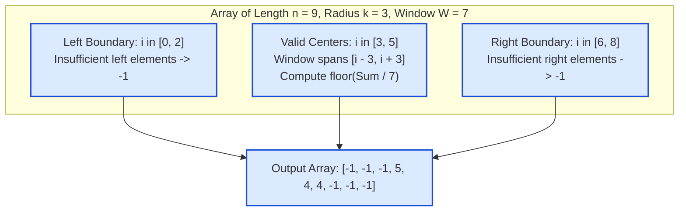

# Guided Example: K Radius Subarray Averages

We trace the symmetric neighborhood radius, boundary feasibility filtering, and constant-time sliding window sum propagation on a representative numerical array:

- **Input Array:** `[7, 4, 3, 9, 1, 8, 5, 2, 6]`
- **Radius $k$:** `3`
- **Array Length $n$:** `9`
- **Window Width $2k + 1$:** `7`
- **Expected Output:** `[-1, -1, -1, 5, 4, 4, -1, -1, -1]`

---

## 1. Problem Overview & Representative Instance

We are given a 0-indexed array `nums` of $n$ integers and an integer radius $k$.
The **$k$-radius average** for a center index $i$ is defined as the average of all elements in the symmetric subarray centered at $i$ spanning from index $i - k$ to $i + k$ (inclusive).
- The total number of elements in a valid window is $W = 2k + 1$ ($k$ elements to the left, the center element, and $k$ elements to the right).
- The average is rounded down to the nearest integer using integer division: $\lfloor \text{sum} / W \rfloor$.
- If there are fewer than $k$ elements before index $i$ (i.e. $i < k$) or fewer than $k$ elements after index $i$ (i.e. $i + k \ge n$), the $k$-radius average cannot be computed, and the value is $-1$.

Our goal is to construct and return the array `avgs` of length $n$.

### Naive $\mathcal{O}(n \cdot k)$ vs. Sliding Window $\mathcal{O}(n)$
- Summing $2k + 1$ elements from scratch for each of the $n$ indices takes $\mathcal{O}(n \cdot k)$ time. With $n = 10^5$ and $k = 10^5$, this requires $10^{10}$ operations, causing a time-out.
- Because each successive center index $i + 1$ shifts the window $[i - k, i + k]$ one position to the right to $[i - k + 1, i + k + 1]$, the new window sum can be updated in $\mathcal{O}(1)$ time:
  $$S_{i+1} = S_i - nums[i - k] + nums[i + k + 1]$$
- We initialize all $n$ entries to $-1$, and compute the running sum of width $2k + 1$ across valid centers $i \in [k, n - 1 - k]$.

---

## 2. Theoretical Invariants & Window Mechanics

### Invariant 1: Feasibility Interval
A center index $i$ can host a complete $k$-radius window if and only if both boundaries fall within the array bounds:
$$0 \le i - k \quad \land \quad i + k < n$$
Solving for $i$ yields the valid center interval:
$$i \in [k, n - 1 - k]$$
- If $n < 2k + 1$, the valid interval is empty; all entries in `avgs` must be $-1$.
- Any index $i < k$ or $i > n - 1 - k$ receives $-1$.

### Invariant 2: Constant-Time Sliding Window Sum
Let $S(i) = \sum_{j = i - k}^{i + k} nums[j]$.
1. **Initial Window ($i = k$):**
   $$S(k) = \sum_{j = 0}^{2k} nums[j]$$
2. **Inductive Slide ($i \to i + 1$):**
   $$S(i + 1) = S(i) + nums[i + k + 1] - nums[i - k]$$
The new sum is maintained in $\mathcal{O}(1)$ operations, and the average is emitted directly as $\lfloor S(i) / (2k + 1) \rfloor$.

| Parameter | Algebraic Term | Value in Sample Instance ($n=9, k=3$) |
|---|---|---|
| Window Width $W$ | $2k + 1$ | $2(3) + 1 = 7$ |
| Left Invalid Suffix | $[0, k - 1]$ | $[0, 2]$ (3 elements) |
| Right Invalid Suffix | $[n - k, n - 1]$ | $[6, 8]$ (3 elements) |
| Valid Centers | $[k, n - 1 - k]$ | $[3, 5]$ (indices 3, 4, 5) |

---

## 3. Step-by-Step Worked Execution

We trace `nums = [7, 4, 3, 9, 1, 8, 5, 2, 6]`, $k = 3$, $W = 7$.
Initialize `ans = [-1, -1, -1, -1, -1, -1, -1, -1, -1]`.

---

### Step 1: Accumulate Initial Window
We scan $i$ from $0$ to $2k = 6$:
- $i = 0$: $s = 7$
- $i = 1$: $s = 7 + 4 = 11$
- $i = 2$: $s = 11 + 3 = 14$
- $i = 3$: $s = 14 + 9 = 23$
- $i = 4$: $s = 23 + 1 = 24$
- $i = 5$: $s = 24 + 8 = 32$
- $i = 6$: $s = 32 + 5 = 37$

At $i = 6$, the window $[0, 6]$ covers $7$ elements with center at index $i - k = 6 - 3 = 3$:
- Window elements: `[7, 4, 3, 9, 1, 8, 5]`.
- Sum: $37$.
- Floor average: $\lfloor 37 / 7 \rfloor = 5$.
- Record: `ans[3] = 5`.
- Slide out entering element for next turn: subtract $nums[6 - 6] = nums[0] = 7$.
  $$s \leftarrow 37 - 7 = 30$$

---

### Step 2: Advance to $i = 7$
- Add incoming element: $s = 30 + nums[7] = 30 + 2 = 32$.
- The window $[1, 7]$ has center at index $i - k = 7 - 3 = 4$:
  - Window elements: `[4, 3, 9, 1, 8, 5, 2]`.
  - Sum: $32$.
  - Floor average: $\lfloor 32 / 7 \rfloor = 4$.
  - Record: `ans[4] = 4`.
- Slide out leftmost element: subtract $nums[7 - 6] = nums[1] = 4$.
  $$s \leftarrow 32 - 4 = 28$$

---

### Step 3: Advance to $i = 8$
- Add incoming element: $s = 28 + nums[8] = 28 + 6 = 34$.
- The window $[2, 8]$ has center at index $i - k = 8 - 3 = 5$:
  - Window elements: `[3, 9, 1, 8, 5, 2, 6]`.
  - Sum: $34$.
  - Floor average: $\lfloor 34 / 7 \rfloor = 4$.
  - Record: `ans[5] = 4`.
- Slide out leftmost element: subtract $nums[8 - 6] = nums[2] = 3$.
  $$s \leftarrow 34 - 3 = 31$$

---

### Finalization
Loop terminates at $i = 8 = n - 1$.
All indices without an assigned average remain $-1$.
Emitted result:
$$\text{avgs} = [-1, -1, -1, 5, 4, 4, -1, -1, -1]$$

---

## 4. Complete Execution Trace

Below is the state progression audit table across all array indices:

| Index $i$ | Value $nums[i]$ | Running Sum $s$ | Center Index ($i - k$) | Window Range | Window Sum | Floor Average $\lfloor S / 7 \rfloor$ | Action on `ans` |
|---|---|---|---|---|---|---|---|
| $0$ | $7$ | $7$ | — | Incomplete ($< W$) | — | — | Keep default $-1$ |
| $1$ | $4$ | $11$ | — | Incomplete ($< W$) | — | — | Keep default $-1$ |
| $2$ | $3$ | $14$ | — | Incomplete ($< W$) | — | — | Keep default $-1$ |
| $3$ | $9$ | $23$ | — | Incomplete ($< W$) | — | — | Keep default $-1$ |
| $4$ | $1$ | $24$ | — | Incomplete ($< W$) | — | — | Keep default $-1$ |
| $5$ | $8$ | $32$ | — | Incomplete ($< W$) | — | — | Keep default $-1$ |
| $6$ | $5$ | $37$ | $3$ | $[0, 6]$ | $37$ | $\lfloor 37/7 \rfloor = 5$ | Set `ans[3] = 5` |
| $7$ | $2$ | $32$ | $4$ | $[1, 7]$ | $32$ | $\lfloor 32/7 \rfloor = 4$ | Set `ans[4] = 4` |
| $8$ | $6$ | $34$ | $5$ | $[2, 8]$ | $34$ | $\lfloor 34/7 \rfloor = 4$ | Set `ans[5] = 4` |

### Output Array Verification by Position:

| Index | $0$ | $1$ | $2$ | $3$ | $4$ | $5$ | $6$ | $7$ | $8$ |
|---|---|---|---|---|---|---|---|---|---|
| $k$-Radius Status | Left boundary | Left boundary | Left boundary | **Valid center** | **Valid center** | **Valid center** | Right boundary | Right boundary | Right boundary |
| Emitted Average | $-1$ | $-1$ | $-1$ | **$5$** | **$4$** | **$4$** | $-1$ | $-1$ | $-1$ |

---

## 5. Algorithmic Correctness & Soundness

1. **Boundary Precision:**
   Any index $i < k$ has fewer than $k$ predecessors, and any index $i > n - 1 - k$ has fewer than $k$ successors. The problem definition strictly demands that these indices receive $-1$. Initializing the output array with $-1$ guarantees all boundary conditions are met.
2. **Window Sum Invariance:**
   For any center $c \in [k, n - 1 - k]$, the window covers indices $[c - k, c + k]$.
   Because $S_{c+1} = S_c + nums[c + k + 1] - nums[c - k]$, the sum of the sliding window strictly equals $\sum_{j = c - k}^{c + k} nums[j]$ without numerical drift.
3. **Integer Division Semantics:**
   The division $\lfloor S / W \rfloor$ truncates towards zero as mandated by the floor average requirement.

---

## 6. Edge Cases, Pitfalls & Structural Traps

- **Radius Zero ($k = 0$):**
  When $k = 0$, $W = 1$. The window centered at $i$ is simply $[i, i]$. The average is $nums[i] / 1 = nums[i]$. The algorithm correctly outputs a copy of `nums`.
- **Window Exceeds Array ($2k + 1 > n$):**
  If $k = 5$ but $n = 7$, no index can host a full window ($k > n - 1 - k$). The loop never reaches $i \ge 2k$, and the array of all $-1$ is returned safely.
- **Large Sum Integer Overflow:**
  For $n = 10^5$ with elements up to $10^5$, window sums can reach $10^{10}$, exceeding standard 32-bit signed integer limits. A 64-bit integer accumulator must be used.

---

## 7. Complexity Analysis

- **Time Complexity:**
  - The array of length $n$ is traversed exactly once in a single forward pass.
  - Adding the incoming element and subtracting the outgoing element takes $\mathcal{O}(1)$ time per index.
  - Total time complexity: $\mathcal{O}(n)$ linear time.
- **Auxiliary Space Complexity:**
  - We maintain a single integer accumulator `s` and the output array of size $n$.
  - Total auxiliary space: $\mathcal{O}(1)$ auxiliary space beyond the output array.
