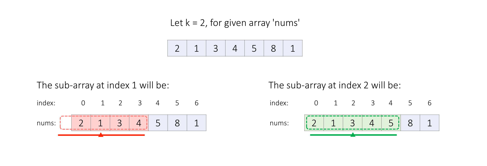
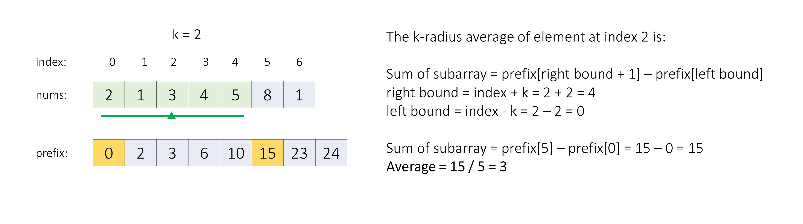
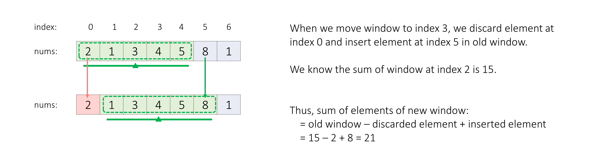

[TOC]

## Solution

---

### Overview

In this problem, we have to return the k-radius average for each given element of the `nums` array.
If any element doesn't have k-elements in its left and right, then its average is considered to be `-1`, otherwise, the average will be the sum of all these $(2 * k + 1)$ elements divided by the number of elements.



---

### Approach 1: Prefix Sum

#### Intuition

We can iterate on each element of the `nums` array and based on its index `i` we can check if it has `k` elements in its left and right, if it doesn't have then we know the average for the current element is `-1`, but if it has then we need to sum all the elements from index $i - k$ to index $i + k$ and divide this sum by `windowSize`, calculated by $2 * k + 1$.


Now an easy way will be to iterate over all elements from index $i - k$ to $i + k$, sum all the elements, and divide this sum by `windowSize`. But repeating this step (i.e., iterating over the sub-array) for each index will result in Time Limit Exceeded.

Instead, we can use the help of a prefix sum array to get the sum of elements of any sub-array in constant time instead of linear time.

> **If you are wondering how does prefix sum array work?**
>
> Given an array `nums` of `n` elements, the prefix sum array `prefix` is another array of $n + 1$ elements such that $prefix[i + 1]$ is the sum of the first `i` elements of the array `nums`. In other words, $prefix[i + 1] = \text{nums}[0] + \text{nums}[1] + ... + nums[i - 1] + \text{nums}[i]$.
>
> The prefix sum array can be used to answer range sum queries (i.e., queries that ask for the sum of a contiguous sub-array) in constant time, as the sum of the elements from indices `x` to `y` can be calculated as $prefix[y + 1] - \text{prefix}[x]$.



**Note:** If you aren't aware of this concept we recommend you first solve this problem [1480. Running Sum of 1d Array](https://leetcode.com/problems/running-sum-of-1d-array/).

#### Algorithm

1. Initialize variables:
- `n`, to store the number of elements in the `nums` array.
- `averages`, an array of size `n` initially initialized with `-1` to store the k-radius average of each index of the `nums` array.
- `prefix`, an array of size $n + 1$ to store the prefix sum of the `nums` array.
2. If `k` is `0`, which means we have to find the average of only one number at each index, so we return the `nums` array, or if `windowSize`, $2 * k + 1$, is greater than `n`, which means we have to find the average of more than `n` numbers which is not possible, thus we return the `averages` array.
3. We iterate on the `nums` array and generate its `prefix` array, where $prefix[i + 1]$ is $\text{prefix}[i] + \text{nums}[i]$.
4. We iterate on those indices which will have at least `k` elements on their left and right sides, calculate the sum of the required sub-array using prefix array $prefix[rightBound + 1] - \text{prefix}[leftBound]$, and store the average by dividing the sum by `windowSize` in `averages` array.
5. In the end we return `averages` array.

#### Implementation

```python
class Solution:
    def getAverages(self, nums: List[int], k: int) -> List[int]:
        # When a single element is considered then its average will be the number itself only.
        if k == 0:
            return nums

        window_size = 2 * k + 1
        n = len(nums)
        averages = [-1] * n

        # Any index will not have 'k' elements in it's left and right.
        if window_size > n:
            return averages

        # Generate 'prefix' array for 'nums'.
        # 'prefix[i + 1]' will be sum of all elements of 'nums' from index '0' to 'i'.
        prefix = [0] * (n + 1)
        for i in range(n):
            prefix[i + 1] = prefix[i] + nums[i]

        # We iterate only on those indices which have atleast 'k' elements in their left and right.
        # i.e. indices from 'k' to 'n - k'
        for i in range(k, n - k):
            leftBound, rightBound = i - k, i + k
            subArraySum = prefix[rightBound + 1] - prefix[leftBound]
            average = subArraySum // window_size
            averages[i] = average

        return averages
```

#### Complexity Analysis

Here, $n$ is the number of elements in the `nums` array.

* Time complexity: $O(n)$
- We generate the `prefix` array by iterating on the `nums` array once, thus it will take $O(n)$ time.
- Then, we fill the `averages` array by again iterating on the `nums` array, where finding the average of each index is a constant time operation, thus, it will take us $O(n)$ time.
- So, overall we take $O(n)$ time.

* Space complexity: $O(n)$
- The output array `averages` is not considered as additional space usage.
- But, we have used another additional array `prefix` of size $n + 1$, thus, we use $O(n)$ additional space in this approach.

---

<br />

### Approach 2: Sliding Window

#### Intuition

We know that we always have to keep a window of size $2 * k + 1$ (centered around index `x`) to find its k-radius average.

Let's assume we already know the sum of the $2 * k + 1$ elements centered at index `x`, let this sum be $S_x$. When we move to the next index $x + 1$ we shift our window to the right by one element, thus from the sum of elements of the previous window range ($S_x$) we subtract the left-most element of the previous window and add the next element on the right to get the new window sum in constant time.

$S_{x + 1} = S_x + \text{(next element on the right)} - \text{(left most window element)}$



Thus we can eliminate the use of the `prefix` array to generate the sum of all elements of all windows of size $2 * k + 1$.

**Note:** If you aren't familiar with the sliding window concept we recommend you first solve this problem [1456. Maximum Number of Vowels in a Substring of Given Length](https://leetcode.com/problems/maximum-number-of-vowels-in-a-substring-of-given-length/description/).

#### Algorithm

1. Initialize variables:
- `n`, to store the number of elements in the `nums` array.
- `averages`, an array of size `n` initially initialized with `-1` to store the k-radius average of each index of the `nums` array.
- `windowSum`, to store the sum of the current window.
2. If `k` is `0`, which means we have to find the average of only one number at each index, so we return the `nums` array, or if `windowSize`, $2 * k + 1$, is greater than `n`, which means we have to find the average of more than `n` numbers which is not possible, thus we return the `averages` array.
3. We iterate on the first `windowSize` elements to get the sum of the first window, calculate the first `windowSum`, and store the average in the `averages` array.
4. Now we will shift the window by one element at each iteration to find the averages of all remaining windows.
- For each window, variable `i` will point to the rightmost, $i - windowSize + 1$ will point to the leftmost, and $i - k$ will point to the center element.
- We calculate the sum of the current window using the previous window's sum as discussed, $windowSum - nums[i - windowSize] + \text{num}[i]$, and store the average in the `averages` array.
5. In the end we return the `averages` array.

#### Implementation

```python
class Solution:
    def getAverages(self, nums: List[int], k: int) -> List[int]:
        averages = [-1] * len(nums)
        # When a single element is considered then its average will be the number itself only.
        if k == 0:
            return nums

        window_size = 2 * k + 1
        n = len(nums)

        # Any index will not have 'k' elements in it's left and right.
        if window_size > n:
            return averages

        # First get the sum of first window of the 'nums' arrray.
        window_sum = sum(nums[:window_size])
        averages[k] = window_sum // window_size

        # Iterate on rest indices which have at least 'k' elements
        # on its left and right sides.
        for i in range(window_size, n):
            # We remove the discarded element and add the new element to get current window sum.
            # 'i' is the index of new inserted element, and
            # 'i - (window size)' is the index of the last removed element.
            window_sum = window_sum - nums[i - window_size] + nums[i]
            averages[i - k] = window_sum // window_size

        return averages
```

#### Complexity Analysis

Here, $n$ is the number of elements in the `nums` array.

* Time complexity: $O(n)$
- Initializing the `averages` array with `-1` will take $O(n)$ time.
- Then we iterate over the `nums` array linearly to find the k-radius average of each index, which will also take $O(n)$ time.
    Thus, overall we use $O(n)$ time.

* Space complexity: $O(1)$
- The output array `averages` is not considered as additional space usage.