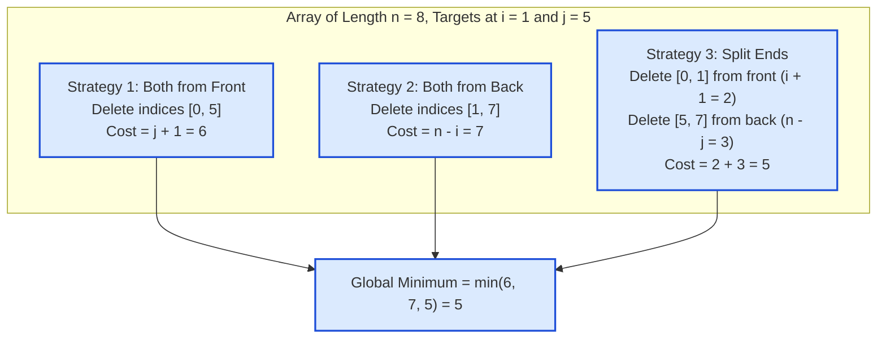

# Guided Example: Removing Minimum and Maximum From Array

We trace extremal index discovery, boundary-deletion geometry, and three-strategy cost minimization on a representative integer array:

- **Input Array:** `[2, 10, 7, 5, 4, 1, 8, 6]`
- **Array Length $n$:** `8`
- **Minimum Element:** `1` (at index 5)
- **Maximum Element:** `10` (at index 1)
- **Expected Output:** `5`

---

## 1. Problem Overview & Representative Instance

We are given a 0-indexed integer array `nums` consisting of **distinct** integers.
We wish to remove both the **minimum** element and the **maximum** element from the array.
In each deletion step, we are allowed to remove either:
- The front element (the element currently at index $0$).
- The back element (the element currently at the end of the array).

We seek the **minimum total number of deletions** required so that both the minimum and maximum elements are removed.

### Geometry of Deletions
Because deletions can only occur from the outer boundaries inward:
- Removing an element at index $k$ from the front requires removing all preceding elements $0, 1, \dots, k - 1$, consuming $k + 1$ operations.
- Removing an element at index $k$ from the back requires removing all following elements $k + 1, \dots, n - 1$, consuming $n - k$ operations.
- When targeting two distinct elements at sorted indices $i < j$, any deletion sequence corresponds to one of three exhaustive topological patterns:
  1. Remove both from the front.
  2. Remove both from the back.
  3. Remove $i$ from the front and $j$ from the back.

---

## 2. Theoretical Invariants & The Three-Strategy Trichotomy

### Invariant 1: Extremal Uniqueness and Canonical Sorting
Because all elements in `nums` are pairwise distinct, the minimum element and maximum element occur at unique indices $p_{\min}$ and $p_{\max}$.
We define:
$$i = \min(p_{\min}, p_{\max}), \quad j = \max(p_{\min}, p_{\max})$$
such that $0 \le i < j < n$.

### Invariant 2: The Three-Strategy Exhaustion Theorem
**Theorem.** *Any sequence of front and back deletions that removes elements at indices $i$ and $j$ ($i < j$) deletes a prefix of length $L \ge 0$ and a suffix of length $R \ge 0$. To cover both $i$ and $j$, the pair $(L, R)$ must satisfy one of three minimal configurations:*
1. **Front Dominant ($L \ge j + 1, R = 0$):**
   The front deletion envelope extends past both targets.
   $$\text{Cost}_1 = j + 1$$
2. **Back Dominant ($L = 0, R \ge n - i$):**
   The back deletion envelope extends past both targets.
   $$\text{Cost}_2 = n - i$$
3. **Split Envelope ($L \ge i + 1, R \ge n - j$):**
   The front envelope clears the first target $i$, and the back envelope clears the second target $j$.
   $$\text{Cost}_3 = (i + 1) + (n - j)$$

Any configuration with $L > 0$ and $R > 0$ that also clears $j$ from the front would have cost $L + R \ge (j + 1) + R > j + 1$, strictly worse than pure front deletion. Thus, the minimum deletions across all possible choices is:
$$\text{Min Deletions} = \min\left( j + 1, \quad n - i, \quad (i + 1) + (n - j) \right)$$

| Strategy Option | Prefix Deleted | Suffix Deleted | Operational Cost Formula | Physical Action |
|---|---|---|---|---|
| Option 1: All Front | $[0 \dots j]$ | None | $j + 1$ | Unidirectional front peeling |
| Option 2: All Back | None | $[i \dots n - 1]$ | $n - i$ | Unidirectional back peeling |
| Option 3: Split Sides | $[0 \dots i]$ | $[j \dots n - 1]$ | $(i + 1) + (n - j)$ | Bidirectional inward peeling |

---

## 3. Step-by-Step Worked Execution

We trace `nums = [2, 10, 7, 5, 4, 1, 8, 6]` ($n = 8$).

---

### Step 1: Extremal Element Discovery
Traverse the array to locate the minimum and maximum:
- Value `10` is greatest: $p_{\max} = 1$.
- Value `1` is smallest: $p_{\min} = 5$.
- Sort the indices canonically:
  $$i = \min(1, 5) = 1, \quad j = \max(1, 5) = 5$$

---

### Step 2: Evaluate Strategy 1 (Both from Front)
- Front envelope must reach index $j = 5$.
- Deletes elements at indices $0, 1, 2, 3, 4, 5$ (values `[2, 10, 7, 5, 4, 1]`).
- Both $10$ (index 1) and $1$ (index 5) are removed.
- Cost:
  $$\text{Cost}_1 = j + 1 = 5 + 1 = 6$$

---

### Step 3: Evaluate Strategy 2 (Both from Back)
- Back envelope must reach index $i = 1$.
- Deletes elements at indices $7, 6, 5, 4, 3, 2, 1$ (values `[6, 8, 1, 4, 5, 7, 10]`).
- Both $1$ (index 5) and $10$ (index 1) are removed.
- Cost:
  $$\text{Cost}_2 = n - i = 8 - 1 = 7$$

---

### Step 4: Evaluate Strategy 3 (Split: Front and Back)
- Front envelope removes index $0$ to $i = 1$ (values `[2, 10]`):
  $$L = i + 1 = 1 + 1 = 2 \text{ deletions}$$
- Back envelope removes index $n - 1 = 7$ down to $j = 5$ (values `[6, 8, 1]`):
  $$R = n - j = 8 - 5 = 3 \text{ deletions}$$
- Total combined cost:
  $$\text{Cost}_3 = L + R = 2 + 3 = 5$$

---

### Step 5: Cost Minimization
$$\text{Min Deletions} = \min(\text{Cost}_1, \text{Cost}_2, \text{Cost}_3) = \min(6, 7, 5) = 5$$
The optimal plan performs 2 front deletions and 3 back deletions, totaling 5 operations.

---

## 4. Complete Execution Trace & Multi-Case Comparison

Below is the comparative trace across diverse target distribution topologies:

| Array Configuration | Length $n$ | Target Indices $(i, j)$ | Cost 1: Front ($j + 1$) | Cost 2: Back ($n - i$) | Cost 3: Split ($(i+1) + (n-j)$) | Optimal Minimum | Optimal Strategy |
|---|---|---|---|---|---|---|---|
| `[2, 10, 7, 5, 4, 1, 8, 6]` | $8$ | $(1, 5)$ | $5 + 1 = 6$ | $8 - 1 = 7$ | $2 + 3 = \mathbf{5}$ | **$5$** | Split Ends |
| `[0, -4, 19, 1, 8, -2, -3, 5]` | $8$ | $(1, 2)$ | $2 + 1 = \mathbf{3}$ | $8 - 1 = 7$ | $2 + 6 = 8$ | **$3$** | All Front |
| `[101]` | $1$ | $(0, 0)$ | $0 + 1 = \mathbf{1}$ | $1 - 0 = 1$ | $1 + 1 = 2$ | **$1$** | Single Element |
| `[2, 1]` | $2$ | $(0, 1)$ | $1 + 1 = \mathbf{2}$ | $2 - 0 = \mathbf{2}$ | $1 + 1 = \mathbf{2}$ | **$2$** | Any Strategy |
| Near Right Boundary | $8$ | $(6, 7)$ | $7 + 1 = 8$ | $8 - 6 = \mathbf{2}$ | $7 + 1 = 8$ | **$2$** | All Back |

### Observation on Extremal Clustering
- When both targets are clustered near the left (e.g. $(1, 2)$ in row 2), `All Front` wins decisively ($3$ vs $7$ and $8$).
- When both targets are clustered near the right (e.g. $(6, 7)$ in row 5), `All Back` wins decisively ($2$ vs $8$).
- When targets are spread towards opposite ends (e.g. $(1, 5)$ in row 1), `Split Ends` wins decisively ($5$ vs $6$ and $7$).

---

## 5. Algorithmic Correctness & Soundness

1. **Completeness of Search Space:**
   Any valid deletion sequence removes some prefix of size $L$ and suffix of size $R$.
   Since $i < j$, the target at $i$ must be in the prefix ($i < L$) or suffix ($i \ge n - R$).
   Similarly, the target at $j$ must be in the prefix ($j < L$) or suffix ($j \ge n - R$).
   The four combinations collapse to:
   - Both in prefix $\implies L \ge j + 1$.
   - Both in suffix $\implies R \ge n - i$.
   - $i$ in prefix, $j$ in suffix $\implies L \ge i + 1, R \ge n - j$.
   - $j$ in prefix, $i$ in suffix: impossible since $i < j$.
   The three tested strategies are the exact unique local minima of these three feasible regions.
2. **Deterministic Extremal Extraction:**
   A single linear pass identifies the absolute minimum and maximum in $\mathcal{O}(n)$ time without sorting or modifying the array.
3. **No Redundant Overlaps:**
   In Strategy 3, the prefix $[0 \dots i]$ and suffix $[j \dots n - 1]$ are disjoint because $i < j$. No element is deleted twice.

---

## 6. Edge Cases, Pitfalls & Structural Traps

- **Single-Element Array ($n = 1$):**
  The sole element is simultaneously the minimum and maximum ($i = j = 0$). Removing it requires exactly $1$ deletion ($0 + 1 = 1$).
- **Two Elements ($n = 2$):**
  Both elements must be removed. All strategies yield $2$.
- **Index Order Inversion:**
  Failing to enforce $i < j$ before evaluating $(i + 1) + (n - j)$ yields incorrect bounds. Sorting the indices $i = \min(p_{\min}, p_{\max})$ and $j = \max(p_{\min}, p_{\max})$ prevents sign inversions.

---

## 7. Complexity Analysis

- **Time Complexity:**
  - Finding the indices of minimum and maximum elements takes $\mathcal{O}(n)$ time via a single pass.
  - Computing the minimum of three closed-form arithmetic expressions takes $\mathcal{O}(1)$ time.
  - Total time complexity: $\mathcal{O}(n)$ linear time.
- **Auxiliary Space Complexity:**
  - Only scalar integer indices ($i, j, n, p_{\min}, p_{\max}$) are stored.
  - Total auxiliary space: $\mathcal{O}(1)$ strictly constant memory.
