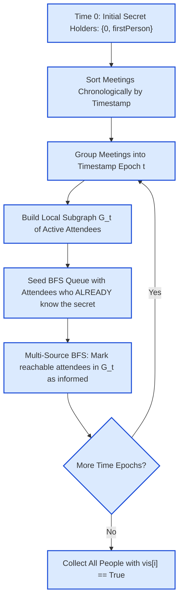

# Guided Example: Find All People With Secret

We trace the temporal graph decomposition, instantaneous same-timestamp transitive propagation, and non-retroactive information barriers on a representative communication network:

- **Total People $n$:** `5`
- **Initial Knower (`firstPerson`):** `1` (along with person `0`)
- **Meetings:** `[[3, 4, 2], [1, 2, 1], [2, 3, 1]]`
- **Expected Output:** `[0, 1, 2, 3, 4]`

---

## 1. Problem Overview & Representative Instance

There are $n$ people numbered from $0$ to $n - 1$. Initially, at time $0$, person $0$ possesses a secret and immediately shares it with `firstPerson`.
We are given a 2D array `meetings` where each entry $[x_i, y_i, t_i]$ denotes that person $x_i$ and person $y_i$ hold a meeting at discrete timestamp $t_i$.
- **Instantaneous Transmission:** If a person attending a meeting at timestamp $t$ possesses the secret, they immediately share it with the other attendee. If multiple meetings happen at the exact same timestamp $t$, the secret can propagate across a connected chain of attendees instantaneously at that time.
- **No Retroactive Transmission:** A meeting at time $t_1$ cannot convey information that is only learned later at time $t_2 > t_1$.

Our objective is to return a list of all people who know the secret after all meetings have concluded.

For our instance:
- At time $0$: $\{0, 1\}$ know the secret.
- Meetings at $t = 1$: $[1, 2]$ and $[2, 3]$.
  - Person $1$ knows the secret and meets $2$. Person $2$ learns the secret and immediately shares it with $3$ at the same timestamp $t = 1$!
  - Secret holders at end of $t = 1$: $\{0, 1, 2, 3\}$.
- Meetings at $t = 2$: $[3, 4]$.
  - Person $3$ already knows the secret and meets $4$. Person $4$ learns the secret.
- Final set of informed people: $\{0, 1, 2, 3, 4\}$.

---

## 2. Theoretical Invariants & Temporal Snapshot Mechanics

### Invariant 1: Monotonic Knowledge Expansion
Let $K(t) \subseteq \{0, 1, \dots, n - 1\}$ denote the set of informed individuals at the conclusion of time $t$.
Because knowledge cannot be forgotten or erased:
$$K(t_1) \subseteq K(t_2) \quad \text{for all } t_1 \le t_2$$
A person marked as knowing the secret remains informed for all future timestamps.

### Invariant 2: Same-Time Transitive Closure
Let $M_t = \{(u, v) \mid (u, v, t) \in \text{meetings}\}$ be the set of undirected edges active at timestamp $t$.
At time $t$, the secret propagates to all vertices in the connected component of $M_t$ that contain at least one vertex from $K(t^-)$ (the set of people who knew the secret prior to the start of time $t$).
Formally:
$$u \in K(t) \iff u \in K(t^-) \lor \exists v \in K(t^-) \text{ such that } u \stackrel{M_t}{\longleftrightarrow} v$$
Attendees belonging to connected components of $M_t$ that contain zero informed seeds learn nothing and remain uninformed.

### Invariant 3: Temporal Isolation (No Retroactivity)
Edges belonging to timestamp $t$ are discarded as soon as time $t$ finishes. A meeting that occurred at $t = 1$ between uninformed people cannot be reactivated if one of them learns the secret later at $t = 3$.

| State Variable | Type | Invariant Guarantee |
|---|---|---|
| Knowledge Array `vis` | Boolean array of size $n$ | Monotonically non-decreasing (`True` is irreversible) |
| Local Graph $G_t$ | Adjacency list for timestamp $t$ | Contains only edges active at exact time $t$ |
| Local BFS Queue $Q$ | Multi-source exploration queue | Seeded strictly with attendees having $\text{vis}[u] == \text{True}$ |

---

## 3. Step-by-Step Worked Execution

We trace `n = 5`, `firstPerson = 1`, `meetings = [[3, 4, 2], [1, 2, 1], [2, 3, 1]]`.
Initialize: $\text{vis}[0] = \text{True}, \text{vis}[1] = \text{True}$, all other $\text{vis}[k] = \text{False}$.
Sort meetings chronologically:
- Index 0: `[1, 2, 1]` ($t = 1$)
- Index 1: `[2, 3, 1]` ($t = 1$)
- Index 2: `[3, 4, 2]` ($t = 2$)

---

### Epoch 1: Timestamp $t = 1$
1. **Identify Batch:** Meetings `[1, 2, 1]` and `[2, 3, 1]`.
2. **Build Local Graph $G_1$:**
   - Active attendees: $S = \{1, 2, 3\}$.
   - Edges: $(1, 2)$ and $(2, 3)$.
   - Adjacency:
     - $N(1) = [2]$
     - $N(2) = [1, 3]$
     - $N(3) = [2]$
3. **Seed BFS Queue:**
   - Check $u \in \{1, 2, 3\}$:
     - $\text{vis}[1] == \text{True} \implies$ push $1$ to queue $Q$.
     - $\text{vis}[2] == \text{False}$.
     - $\text{vis}[3] == \text{False}$.
   - Initial queue: $Q = [1]$.
4. **BFS Traversal:**
   - Pop $u = 1$: inspect neighbor $v = 2$.
     - $\text{vis}[2]$ is `False` $\implies$ set $\text{vis}[2] = \text{True}$, push $2$ to $Q$.
   - Pop $u = 2$: inspect neighbors $1$ and $3$.
     - Neighbor $1$: $\text{vis}[1]$ is already `True`.
     - Neighbor $3$: $\text{vis}[3]$ is `False` $\implies$ set $\text{vis}[3] = \text{True}$, push $3$ to $Q$.
   - Pop $u = 3$: inspect neighbor $2$ (already `True`).
   - Queue empty.
- Informed set at end of $t = 1$: $\{0, 1, 2, 3\}$.

---

### Epoch 2: Timestamp $t = 2$
1. **Identify Batch:** Meeting `[3, 4, 2]`.
2. **Build Local Graph $G_2$:**
   - Active attendees: $S = \{3, 4\}$.
   - Edge: $(3, 4)$.
   - Adjacency: $N(3) = [4], N(4) = [3]$.
3. **Seed BFS Queue:**
   - Check $u \in \{3, 4\}$:
     - $\text{vis}[3] == \text{True} \implies$ push $3$ to queue $Q$.
     - $\text{vis}[4] == \text{False}$.
   - Initial queue: $Q = [3]$.
4. **BFS Traversal:**
   - Pop $u = 3$: inspect neighbor $v = 4$.
     - $\text{vis}[4]$ is `False` $\implies$ set $\text{vis}[4] = \text{True}$, push $4$ to $Q$.
   - Pop $u = 4$: neighbor $3$ already `True`.
   - Queue empty.
- Informed set at end of $t = 2$: $\{0, 1, 2, 3, 4\}$.

---

### Termination
All meetings processed.
Collect all indices where $\text{vis}[i] == \text{True}$:
$$\text{output} = [0, 1, 2, 3, 4]$$

---

## 4. Complete Execution Trace & Non-Retroactivity Contrast

Below is the execution trace table across both timestamp epochs:

| Epoch Time $t$ | Meetings in Batch | Attendees Involved | Pre-Informed Seeds | BFS Traversal Path | Newly Informed People | End-of-Epoch Informed Set |
|---|---|---|---|---|---|---|
| Init ($t = 0$) | Direct handover | $\{0, 1\}$ | $\{0, 1\}$ | — | $0, 1$ | $\{0, 1\}$ |
| $t = 1$ | $(1, 2), (2, 3)$ | $\{1, 2, 3\}$ | $\{1\}$ | $1 \to 2 \to 3$ | $2, 3$ | $\{0, 1, 2, 3\}$ |
| $t = 2$ | $(3, 4)$ | $\{3, 4\}$ | $\{3\}$ | $3 \to 4$ | $4$ | **$\{0, 1, 2, 3, 4\}$** |

### Contrast Instance: Non-Retroactivity Protection
Consider an alternate instance showing why past meetings must not transmit future knowledge:
- `firstPerson = 3`, meetings: `[1, 2, 2]` at $t = 2$, and `[0, 3, 3], [3, 1, 3]` at $t = 3$.

| Timestamp $t$ | Active Meeting | Attendees | Informed Seeds | Outcome |
|---|---|---|---|---|
| $t = 2$ | $(1, 2)$ | $\{1, 2\}$ | $\emptyset$ (Neither knows secret) | No transmission! Person 2 remains uninformed. |
| $t = 3$ | $(0, 3), (3, 1)$ | $\{0, 1, 3\}$ | $\{0, 3\}$ | $3 \to 1$. Person 1 learns secret. |

Even though Person 1 meets Person 2 at $t = 2$, Person 1 did not know the secret until $t = 3$. Person 2 never receives the secret! Output: `[0, 1, 3]`.

---

## 5. Algorithmic Correctness & Soundness

1. **Chronological Equivalence:**
   Because real-world time moves forward monotonically, information can only flow along edges whose timestamps are non-decreasing. Sorting meetings by timestamp ensures causality is strictly preserved.
2. **Instantaneous Transitivity via Connected Components:**
   Within a fixed timestamp $t$, secret transmission is simultaneous. A path of meetings $(u_1, u_2), (u_2, u_3), \dots$ all occurring at timestamp $t$ forms a connected component in $G_t$. If any single attendee in this component already knows the secret, BFS from that seed reaches and informs every vertex in the component.
3. **No Retroactive Contamination:**
   Because the local graph $G_t$ is constructed and cleared per timestamp batch, edges from past timestamps are never revisited. An attendee who learns the secret at time $t_2$ cannot transmit it over an edge that closed at time $t_1 < t_2$.

---

## 6. Edge Cases, Pitfalls & Structural Traps

- **Isolated Uninformed Clusters at Same Time:**
  If two meetings occur at time $t$: one between informed people ($A-B$) and one between uninformed people ($C-D$). If $C$ and $D$ are not connected to $A$ or $B$, neither $C$ nor $D$ should learn the secret. Multi-source BFS starting strictly from informed seeds correctly leaves $C-D$ unvisited.
- **Self-Meetings or Redundant Edges:**
  Multiple meetings between the same pair of individuals at the same timestamp are absorbed harmlessly by the adjacency list and visited flags.
- **Uninformed Person Zero / FirstPerson:**
  Persons $0$ and `firstPerson` must be seeded before any meetings begin, even if `firstPerson == 0`.

---

## 7. Complexity Analysis

- **Time Complexity:**
  - Sorting $M$ meetings takes $\mathcal{O}(M \log M)$ time.
  - In each timestamp batch, constructing the local graph $G_t$ and running BFS visits each meeting edge at most twice and each participating vertex at most once.
  - Summing across all batches, the total graph construction and traversal time is $\mathcal{O}(M + N)$.
  - Total time complexity: $\mathcal{O}(M \log M + N)$, executing efficiently for $N, M \le 10^5$.
- **Auxiliary Space Complexity:**
  - The global `vis` array takes $\mathcal{O}(N)$ memory.
  - The local adjacency list $G_t$ and BFS queue $Q$ take $\mathcal{O}(M_t)$ memory per batch.
  - Total auxiliary space: $\mathcal{O}(N + M)$ working memory.
