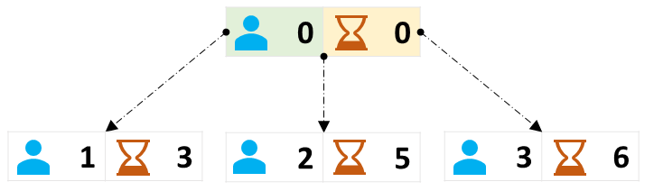
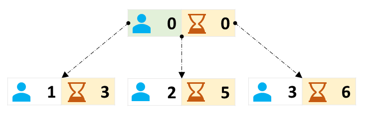
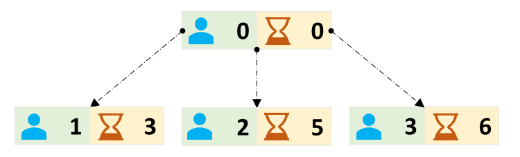
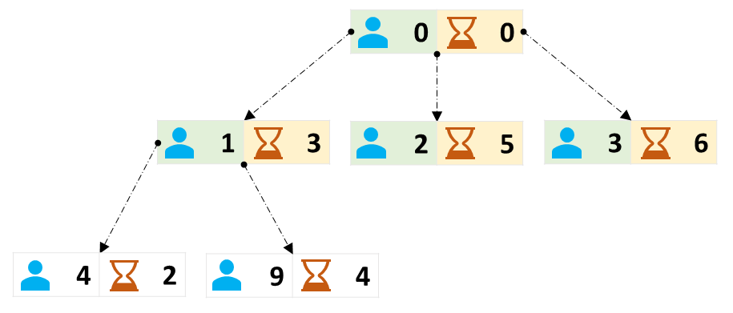
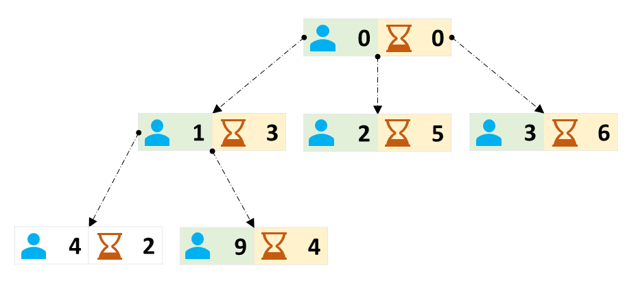
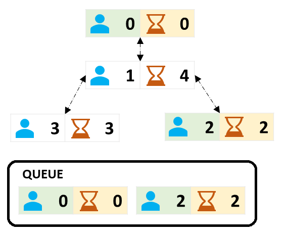
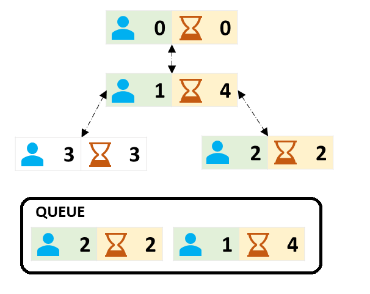
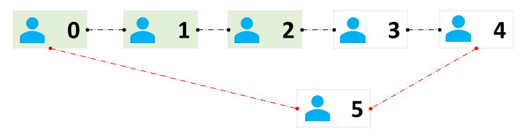

[TOC]

## Solution

---

### Overview

In this problem,

- We have `n` people labeled from `0` to $n - 1$ and

- Initially (at time $t = 0$), person `0` and `firstPerson` know the secret.

- Multiple `meetings` take place between people. Each meeting is characterized by an array `[x, y, t]`, where `x` and `y` are the labels of the two people that meet, and `t` is the time of the meeting. If any one of the two people who meet knows the secret at a time `t`, then both of them will know the secret instantly at the time `t`.

    More than one meeting can take place at the same time `t`

    A person can attend multiple meetings at the same time `t`

    > If at a time `t`, we are given the following meetings:
    > - `x` and `y`
    > - `x` and `z`
    > - `z` and `w`
    > - `a` and `b`
    >
    >
    > Then we can deduce that all `x`, `y`, `z`, and `w` are in the same meeting at the time `t`.

    Thus, given fixed time `t`, meetings evolve as [Equivalence Relation](https://en.wikipedia.org/wiki/Equivalence_relation). Particularly meetings are [**transitive**](https://en.wikipedia.org/wiki/Transitive_relation) in nature.

    It's worth noting that it is **NOT** necessary that all participants of the meeting happening at a time `t`  are in the same meeting. Meetings can be disjoint even if they are happening at the same time `t`.

    > For example, there are two meetings in the above-mentioned example. In the first meeting, we have `(x, y, z, w)` and in the second meeting, we have `(a, b)`. Both meetings are happening at the same time `t` but they are disjoint.

We are supposed to find and return the labels of all the people who know the secret after all the meetings have taken place.

The editorial systematically solves the problem using multiple approaches.

---

### Approach 1: Breadth First Search

#### Intuition

We are given that person `0` and `firstPerson` know the secret at time $t = 0$.

Let's restrict our attention to person `0` only.
*(We may generalize our solution for `firstPerson` similarly)*


`0` knows the secret at time $t = 0$.


Assume person `0` takes part in following meetings `[0, 1, 3]`, `[0, 2, 5]`, `[0, 3, 6]`, sorted in ascending order of time.



Highlighted meetings take place **after or at time $t = 0$**, the time at which person `0` learned the secret.



Hence we can say that all those persons corresponding to highlighted meetings will know the secret at the time of the meeting.



Now let's assume that person `1` takes part in the following meetings `[1, 4, 2]`, `[1, 9, 4]`. There is also a meeting `[1, 0, 3]`, but it has been processed already.



Out of these two, only one meeting `[1, 9, 4]` takes place **after or at time $t = 3$**, the time at which person `1` learned the secret, as per the current state of knowledge. Hence, we can say that only person `9` will know the secret after meeting `1`.



Can we now say that person `4` will NEVER know the secret?
No, we can't. Person `4` may know the secret in the future.

Hence, we can draft the following approach:

- We will start with person `0` and person `firstPerson`. They both know the secret at time $t = 0$.

- Process people whom they meet after the time at which they learned the secret. All these people will know the secret at the time of the meeting.

    Moreover, they will propagate the secret to people they meet after the time they learn the secret. Hence, process these individuals in the same manner as `0` and `firstPerson` were processed, except they learned the secret at a different time.

- Repeat the above step until we have processed all the meetings.

> We are processing persons in a **level-by-level** manner. Whenever we realize that a person knows the secret, we make sufficient efforts to process all the people whom he/she meets after the time at which he/she learned the secret, since we know that they will ultimately know the secret.
>
> [**Breadth First Search (BFS)**](https://leetcode.com/explore/featured/card/graph/620/breadth-first-search-in-graph/) is a natural choice to explore level by level, usually implemented with the help of the queue.
> It is a graph traversal algorithm that explores the neighbor nodes first, before moving to the next level neighbors. If readers are not familiar with the BFS, they are strongly encouraged to dive into our [**Queue Explore Card**](https://leetcode.com/explore/learn/card/queue-stack/231/practical-application-queue/) and [**Graph Explore Card**](https://leetcode.com/explore/featured/card/graph/620/breadth-first-search-in-graph/)

Readers are encouraged to implement the above approach. It is worth mentioning that in `meetings` we are given meetings in the form of `[x, y, t]`. However, we are interested that given `x`, we should be able to find the `(y, t)` pair for all the meetings in which `x` participated. Hence, we should use an appropriate data structure to store the information.

#### Algorithm

1. Create a `graph` to store the information about `meetings`. For every person, we store the meeting time and label of the person met.

    We can use HashMap to store the information. The key of HashMap will be person, and the value will be a list of `(time, person)` pairs.

2. Create a queue `q` to store the people whom we need to process. It will store `(person, time of knowing the secret)`.

    Initially, we will add `(0, 0)` and `(firstPerson, 0)` to the queue since both of them know the secret at time $t = 0$.

3. Create an `earliest` array of size `n`. It will store the earliest time at which a person learned the secret as per the current state of knowledge. It will be initialized with `INT.MAX` for all the people indicating that no one knows the secret.

    However, for person `0` and `firstPerson`, we will update the `earliest` array with `0` since they know the secret at time $t = 0$.

4. Do the following while the `q` is not empty:

1. Deque the front of `q` and store it in `(person, time)`.

2. Iterate over neighbors of `person` using the `for` loop. Let's say the neighbor is `(t, nextPerson)`.

        If $t \ge time$ and $\text{earliest}[nextPerson] > t$, then update $\text{earliest}[nextPerson] = t$ and add `(nextPerson, t)` to the queue.

        > We are adding `(nextPerson, t)` to the queue because we have updated $\text{earliest}[nextPerson]$ and we need to process all the people whom `nextPerson` meets after time `t`.

        > We are checking $t \ge time$ because the `nextPerson` can know the secret only if he/she meets `person` after the `time` at which `person` learned the secret.

        > We are checking $\text{earliest}[nextPerson] > t$ because we are interested in the earliest time at which `nextPerson` learned the secret. If $\text{earliest}[nextPerson] \le t$, then we have already processed `nextPerson` at an earlier time, and we don't need to process it again.

5. Iterate over the `earliest` array and return indices of all the people who know the secret. They are identified by the fact that $\text{earliest}[i] \neq \text{INT.MAX}$.

#### Implementation

```python
class Solution:
    def findAllPeople(
        self, n: int, meetings: List[List[int]], firstPerson: int
    ) -> List[int]:
        # For every person, store the time and label of the person met.
        graph = defaultdict(list)
        for x, y, t in meetings:
            graph[x].append((t, y))
            graph[y].append((t, x))

        # Earliest time at which a person learned the secret
        # as per current state of knowledge. If due to some new information,
        # the earliest time of knowing the secret changes, we will update it
        # and again process all the people whom he/she meets after the time
        # at which he/she learned the secret.
        earliest = [inf] * n
        earliest[0] = 0
        earliest[firstPerson] = 0

        # Queue for BFS. It will store (person, time of knowing the secret)
        q = deque()
        q.append((0, 0))
        q.append((firstPerson, 0))

        # Do BFS
        while q:
            person, time = q.popleft()
            for t, next_person in graph[person]:
                if t >= time and earliest[next_person] > t:
                    earliest[next_person] = t
                    q.append((next_person, t))

        # Since we visited only those people who know the secret,
        # we need to return indices of all visited people.
        return [i for i in range(n) if earliest[i] != inf]
```

**Implementation Note:** The above implementation is slightly different from the standard [Breadth First Search](https://leetcode.com/explore/featured/card/graph/620/breadth-first-search-in-graph/). In standard Breadth First Search, we never process a node twice, and we facilitate this by maintaining a separate `visited` array.

However, in the above implementation, we may process a node again if we get to know that the earliest time at which a person learns the secret decreases. To facilitate this we are maintaining the `earliest` array.

Let's assume we will NOT revisit a node.

```testcase []
4
[[0,1,4],[1,3,3],[2,1,2]]
2
```

This can be represented in the graph as follows. The green-colored people are those who initially know the secret.


The front of the queue `(0, 0)` will be processed first. We will process person `0`, and will add its neighbors to the queue. Hence, `(1, 4)` will be added to the queue.


Next in the queue is `(2, 2)`. We will process person `2`. However, all its neighbors are already processed. Hence, we will not add any new person to the queue.


Next in the queue is `(1, 4)`. We will process person `1`, and due to state information, we will assume that it was informed of the secret at time `t = 4`. Hence, it can inform the secret only to those people it meets after time `t = 4`. However, it meets person `3` at time `t = 3`, hence we will not add person `3` to the queue.

Turns out we are incorrect. Person `1` was informed of the secret at time `t = 2`, because of meeting `[2, 1, 2]`. Hence, `1` can inform the secret to person `3` at time `t = 3`.

We are arriving at an incorrect answer because of the incorrect assumption that we will not revisit a node. Hence, we need to revisit a node if we realize that the earliest time at which a person learns the secret decreases.

> **Connecting the Dots:** [Dijkstra's algorithm](https://leetcode.com/explore/featured/card/graph/622/single-source-shortest-path-algorithm/3862/) is used for finding shortest path in a graph. It works when the weights of edges are non-negative.
>
> However, we can modify the algorithm to work for graphs where the weights of edges can be negative, but no negative cycle is present. The above algorithm captures the essence of the **modified Dijkstra's algorithm**. The key idea is to revisit a node if we realize that the shortest distance to a node decreases.
>
> However, readers must note that this problem, ideally **cannot** be modeled as the shortest path problem, particularly because meeting time is not the weight of edges. What we have done is to use the idea of modified Dijkstra's algorithm to solve the problem.

Readers should also note that since the initial queue contains more than one element, the process is often called **Multi-Source BFS**

#### Complexity Analysis

Let $N$ be the number of people, and $M$ be the number of meetings.

* Time complexity: $O( M \cdot (M + N) )$

- Initially, we are creating a `graph` by processing `meetings`. This will take $O(M)$ time.

- Then we are initializing `q` by enqueuing two people. It will take $O(1)$ time.

- Then we initialize the `earliest` array of size $N$. It will take $O(N)$ time.

- Now there is a `while` loop.

- In each iteration, we are dequeuing one element from `q`. It will take $O(1)$ time.

- Then we iterate over neighbors of the dequeued element using the `for` loop. There will be at most $M$ neighbors because a person can meet at most $M$ people. In each iteration of the `for` loop, we are doing some constant time operations of checking conditions and enqueuing.

            Hence, the time complexity of the `for` loop will be $O(M)$.

        Thus, each iteration of the `while` loop will take $O(1 + M)$, which is $O(M)$ time.

**How many times `while` loop will run?**
        In each iteration, one person is processed. The person was enqueued because of meeting with some other person. Hence, there will be at most $M + N$ iterations of the `while` loop.

        Thus, the `while` loop takes $O( (M + N) \cdot M )$ time.

- Finally, we are iterating over the `earliest` array to find indices of people who know the secret. It will take $O(N)$ time.

    Hence, total time complexity will be $O(M + 1 + N + (M + N) \cdot M + N)$, which is $O( M \cdot (M + N) )$.

* Space complexity: $O(M + N)$

- The `graph` will take $O(M)$ space.

- The `earliest` array will take $O(N)$ space.

- The `q` may grow upto $O(M + N)$, because at any instance, there can be at most $M + N$ nodes in the queue. It is worth noting that there can be multiple instances of person `x` in the queue, with multiple times of knowing the secret

    Hence, total space complexity will be $O(M + N)$.

---

### Approach 2: Depth First Search

#### Intuition

In [previous approach](#approach-1-breadth-first-search), we were essentially traversing the graph, keeping in mind the condition that we can visit a node only if we are confident that the person will know the secret at the time of the meeting. After traversal, we were returning indices of all the people who were visited.

The graph can be traversed primarily in two ways:

- [Breadth First Search](https://leetcode.com/explore/featured/card/graph/620/breadth-first-search-in-graph/) using [Queue](https://leetcode.com/explore/learn/card/queue-stack/231/practical-application-queue/)
- [Depth First Search](https://leetcode.com/explore/featured/card/graph/619/depth-first-search-in-graph/) using [Stack](https://leetcode.com/explore/learn/card/queue-stack/232/practical-application-stack/1389/)

In this approach, let's try to solve the problem using Depth First Search. It can be implemented using Recursion or Stack. It is worth noting that Recursion implicitly uses Call Stack.

#### Algorithm

1. Create a `graph` to store the information about `meetings`. For every person, we store the meeting time and label of the person met.

    We can use HashMap to store the information. The key of HashMap will be person, and the value will be a list of `(time, person)` pairs.

2. Create an `earliest` array of size `n`. It will store the earliest time at which a person learned the secret as per the current state of knowledge. It will be initialized with `INT.MAX` for all the people indicating that no one knows the secret.

    However, for person `0` and `firstPerson`, we will update the `earliest` array with `0` since they know the secret at time `t = 0`.

3. Create a stack `stack` to store the people whom we need to process. It will store `(person, time of knowing the secret)`.

    Initially, we will add `(0, 0)` and `(firstPerson, 0)` to the stack since both of them know the secret at time `t = 0`.

4. Do the following while the `stack` is not empty:

- Pop the top of `stack` and store it in `(person, time)`.

- Iterate over neighbors of `person` using the `for` loop. Let's say the neighbor is `(t, nextPerson)`.

        If `t >= time` and `earliest[nextPerson] > t`, then update `earliest[nextPerson] = t` and add `(nextPerson, t)` to the stack.

        > We are adding `(nextPerson, t)` to the stack because we have updated `earliest[nextPerson]` and we need to process all the people whom `nextPerson` meets after time `t`.

        > We are checking `t >= time` because the `nextPerson` can know the secret only if he/she meets `person` after the `time` at which `person` learned the secret.

        > We are checking `earliest[nextPerson] > t` because we are interested in the earliest time at which `nextPerson` learned the secret. If `earliest[nextPerson] <= t`, then we have already processed `nextPerson` at an earlier time, and we don't need to process it again.

5. Iterate over the `earliest` array and return indices of all the people who know the secret. They are identified by the fact that `earliest[i] != INT.MAX`.

#### Implementation

```python
class Solution:
    def findAllPeople(
        self, n: int, meetings: List[List[int]], firstPerson: int
    ) -> List[int]:
        # For every person, store the time and label of the person met.
        graph = defaultdict(list)
        for x, y, t in meetings:
            graph[x].append((t, y))
            graph[y].append((t, x))

        # Earliest time at which a person learned the secret
        # as per current state of knowledge. If due to some new information,
        # the earliest time of knowing the secret changes, we will update it
        # and again process all the people whom he/she meets after the time
        # at which he/she learned the secret.
        earliest = [inf] * n
        earliest[0] = 0
        earliest[firstPerson] = 0

        # Stack for DFS. It will store (person, time of knowing the secret)
        stack = [(0, 0), (firstPerson, 0)]

        # Do DFS
        while stack:
            person, time = stack.pop()
            for t, next_person in graph[person]:
                if t >= time and earliest[next_person] > t:
                    earliest[next_person] = t
                    stack.append((next_person, t))

        # Since we visited only those people who know the secret
        # we need to return indices of all visited people.
        return [i for i in range(n) if earliest[i] != inf]
```

**Implementation Note:** The above implementation is slightly different from the standard [Depth First Search](https://leetcode.com/explore/featured/card/graph/619/depth-first-search-in-graph/). In standard Depth First Search, we never process a node twice, and we facilitate this by maintaining a separate `visited` array.

However, in the above implementation, we may process a node again if we get to know that the earliest time at which a person learns the secret decreases. To facilitate this, we are maintaining the `earliest` array. We are doing this for the same reason mentioned in [previous approach](#implementation).

Here is the implementation using Recursion.

```python
class Solution:
    def findAllPeople(
        self, n: int, meetings: List[List[int]], firstPerson: int
    ) -> List[int]:
        # For every person, store the time and label of the person met.
        graph = defaultdict(list)
        for x, y, t in meetings:
            graph[x].append((t, y))
            graph[y].append((t, x))

        # Earliest time at which a person learned the secret
        # as per current state of knowledge. If due to some new information,
        # the earliest time of knowing the secret changes, we will update it
        # and again process all the people whom he/she meets after the time
        # at which he/she learned the secret.
        earliest = [inf] * n
        earliest[0] = 0
        earliest[firstPerson] = 0

        # Do DFS
        def dfs(person, time):
            for t, next_person in graph[person]:
                if t >= time and earliest[next_person] > t:
                    earliest[next_person] = t
                    dfs(next_person, t)

        dfs(0, 0)
        dfs(firstPerson, 0)

        # Since we visited only those people who know the secret
        # we need to return indices of all visited people.
        return [i for i in range(n) if earliest[i] != inf]
```

#### Complexity Analysis

Let $N$ be the number of people, and $M$ be the number of meetings.

* Time complexity: $O( M \cdot (M + N) )$

- Initially, we are creating a `graph` by processing `meetings`. This will take $O(M)$ time.

- Then we initialize the `earliest` array of size $N$. It will take $O(N)$ time.

- Now there is a `while` loop.

- In each iteration, we are popping one element from `stack`. It will take $O(1)$ time.

- Then we iterate over neighbors of the popped element using the `for` loop. There will be at most $M$ neighbors because a person can meet at most $M$ people. In each iteration of the `for` loop, we are doing some constant time operations of checking conditions and pushing.

            Hence, the time complexity of the `for` loop will be $O(M)$.

        Thus, each iteration of the `while` loop will take $O(1 + M)$, which is $O(M)$ time.

**How many times `while` loop will run?**
        In each iteration, one person is processed. The person was pushed because of meeting with some other person. Hence, there will be at most $M + N$ iterations of the `while` loop.

        Thus, the `while` loop takes $O( (M + N) \cdot M )$ time.

- Finally, we are iterating over the `earliest` array to find indices of people who know the secret. It will take $O(N)$ time.

    Hence, the total time complexity will be $O(M + N + (M + N) \cdot M + N)$, which is $O( M \cdot (M + N) )$.

* Space complexity: $O(M + N)$

- The `graph` will take $O(M)$ space.

- The `earliest` array will take $O(N)$ space.

- The `stack` may grow upto $O(M + N)$, because at any instance, there can be at most $M + N$ nodes in the stack. It is worth noting that there can be multiple instances of person `x` in the stack, with multiple times of knowing the secret.

    Hence, total space complexity will be $O(M + N)$.

---

### Approach 3: Earliest Informed First Traversal

#### Intuition

Let's revisit the [Approach 1](#approach-1-breadth-first-search), and particularly the test case discussed in [Implementation Note](#implementation).

```testcase []
4
[[0,1,4],[1,3,3],[2,1,2]]
2
```

If we process each node exactly once, then we will arrive at the incorrect answer. The reason was that person `1` could know the secret through two different meetings.
**(a)** `[0, 1, 4]`, from person `0` at time `t = 4`
**(b)** `[2, 1, 2]`, from person `2` at time `t = 2`

If we process the meeting **(a)** before meeting **(b)**, then we will arrive at the incorrect answer.

What if we process the meeting **(b)** before meeting **(a)**? Will we arrive at the correct answer?
Yes, we will, at least for this test case.

In general, we must process that person in the queue whose time of knowing the secret is the minimum. We will dequeue the person with the minimum time of knowing the secret. Moreover, **the person should be marked as visited after it is dequeued from the queue (and not when it is enqueued) because the time the person is enqueued might not be the earliest time the person learned the secret, but the time the person is dequeued will be the earliest time a person learned the secret**. This way, we are ensuring that given a person, if he/she learned the secret through multiple meetings, then we will process the earliest meeting first.

For efficiently dequeuing the person with the minimum time of knowing the secret, we may use [Binary Heap](https://leetcode.com/explore/learn/card/heap/) with Min Heap property.

> [**Binary Heap**](https://leetcode.com/explore/learn/card/heap/) is a specialized binary tree-based data structure that is a complete tree that satisfies the heap property.
>
> In a Min-Heap, the key at the root must be minimum among all keys present in the Binary Heap. The same property must be recursively true for all nodes in the Binary Tree. We can pop and push elements in time proportional to the logarithm of the number of elements present in the heap.

> The approach is similar to [Dijkstra's algorithm](https://leetcode.com/explore/featured/card/graph/622/single-source-shortest-path-algorithm/3862/) with a notable difference that the weight of edges represents absolute time and not the time difference.

Readers are encouraged to implement this approach.

#### Algorithm

1. Create a `graph` to store the information about `meetings`. For every person, we store the meeting time and label of the person met.

    We can use HashMap to store the information. The key of HashMap will be person, and the value will be a list of `(time, person)` pairs.

2. Create a priority queue (min-heap) `pq` to store the people whom we need to process. It will store `(time of knowing the secret, person)`.

    The `time of knowing the secret` will be used to maintain the Min Heap property. The person with minimum `time of knowing the secret` will be at the top of the heap.

3. Push `(0, 0)` and `(0, firstPerson)` to the queue since both of them know the secret at time `t = 0`.

4. Create a `visited` array of size `n`. It will store if a person is visited or not. Initially, all the people are not visited.

    We will mark a person as visited after it is popped from the queue. This will be the earliest time at which a person learns the secret because we are processing the person with the minimum time of knowing the secret.

5. Do the following while the `pq` is not empty:

1. Deque the front of `pq` and store it in `(time, person)`.

2. If `visited[person]` is `True`, then continue to the next iteration of the `while` loop. We have already processed `person` at an earlier time, and we don't need to process it again.

3. Mark `visited[person]` as `True`.

4. Iterate over neighbors of `person` using the `for` loop. Let's say the neighbor is `(t, nextPerson)`.

        If `t >= time` and `visited[nextPerson]` is `False`, then push `(t, nextPerson)` to the queue.

        > We are checking `t >= time` because the `nextPerson` can know the secret only if he/she meets `person` after the `time` at which `person` learned the secret.

        > We are checking `visited[nextPerson]` because we are interested in the earliest time at which `nextPerson` learned the secret. If `visited[nextPerson]` is `True`, then we have already processed `nextPerson` at an earlier time, and we don't need to process it again.

6. Iterate over the `visited` array and return indices of all the people who know the secret. They are identified by the fact that `visited[i]` is `True`.

#### Implementation

```python
class Solution:
    def findAllPeople(
        self, n: int, meetings: List[List[int]], firstPerson: int
    ) -> List[int]:
        # For every person, store the time and label of the person met.
        graph = defaultdict(list)
        for x, y, t in meetings:
            graph[x].append((t, y))
            graph[y].append((t, x))

        # Priority Queue for BFS. It stores (time secret learned, person)
        # It pops the person with the minimum time of knowing the secret.
        pq = []
        heappush(pq, (0, 0))
        heappush(pq, (0, firstPerson))

        # Visited array to mark if a person is visited or not.
        # We will mark a person as visited after it is dequeued
        # from the queue.
        visited = [False] * n

        # Do BFS, but pop minimum.
        while pq:
            time, person = heappop(pq)
            if visited[person]:
                continue
            visited[person] = True
            for t, next_person in graph[person]:
                if not visited[next_person] and t >= time:
                    heappush(pq, (t, next_person))

        # Since we visited only those people who know the secret
        # we need to return indices of all visited people.
        return [i for i in range(n) if visited[i]]
```

**Implementation Note:** In `for` loop under `while`, we are checking every `(t, nextPerson)` pair of `graph[person]` to find all those `t >= time`, where `time` is earliest time person learned the secret.

However, if `graph[person]` was sorted in increasing order of `t`, then instead of starting from the very beginning of `graph[person]`, we can start from the index where `t >= time`. This index can be found using [Binary Search](https://leetcode.com/explore/learn/card/binary-search/) because `graph[person]` is sorted. This will reduce the number of iterations of the `for` loop. Readers are encouraged to implement this optimization and comment on their implementation.

#### Complexity Analysis

Let $N$ be the number of people, and $M$ be the number of meetings.

* Time complexity: $O((N + M) \log (N + M) + N \cdot M )$.

- Initially, we create the `graph` by processing `meetings`. This takes $O(M)$ time.

- Then, we initialize the min-heap `pq` by enqueuing two people. This takes $O(1)$ time.

- Next, we initialize the `visited` array of size $N$. This takes $O(N)$ time.

- Now, consider the `while` loop.

- In each iteration, we pop one element from `pq`. This takes $O(\log (N + M))$ time because, at any instance, there can be at most $N + M$ elements in the heap.

- Then, we iterate over the neighbors of the popped element using the `for` loop. There can be at most $M$ neighbors because a person can meet at most $M$ people. In each iteration of the `for` loop, we perform constant-time operations such as condition checks and pushing into the heap.

            Hence, the time complexity of the `for` loop is $O(M)$.

        Thus, each iteration of the `while` loop takes $O(\log (N + M) + M)$ time.

**How many times will the `while` loop run?**
        In each iteration, one person is processed. A person is enqueued due to a meeting with some other person. Hence, there can be at most $N + M$ iterations of the `while` loop.

        However, the `for` loop is executed only for those persons who have not yet been visited. Therefore, the `for` loop with time complexity $O(M)$ will run for at most $N$ iterations of the `while` loop.

- For $N$ iterations of the `while` loop, the cost is $O(\log (N + M) + M)$ per iteration.

- For the remaining $M$ iterations of the `while` loop, the cost is $O(\log (N + M))$ per iteration, since the `for` loop does not execute.

        Thus, the total time taken by the `while` loop is $O\big( N \cdot (\log (N + M) + M) + M \cdot \log (N + M) \big)$, which simplifies to $O\big( N \log (N + M) + N M + M \log (N + M) \big)$. This can be rearranged as $O\big( (N + M) \log (N + M) + N M \big)$.

- Finally, we iterate over the `visited` array to collect the indices of people who know the secret. This takes $O(N)$ time.

    Hence, the total time complexity is $O(M + 1 + N + (N + M) \log (N + M) + N M + N)$, which simplifies to $O\big( (N + M) \log (N + M) + N M \big)$.

* Space complexity: $O(M + N)$

- The `graph` will take $O(M)$ space.

- The `pq` may grow upto $O(M + N)$, because at any instance, there can be at most $M + N$ nodes in the queue. It is worth noting that there can be multiple instances of person `x` in the queue, with multiple times of knowing the secret.

- The `visited` array will take $O(N)$ space.

    Hence, total space complexity will be $O(M + N)$.

---

### Approach 4: Breadth First Search on Time Scale

#### Intuition

Let's minutely analyze an arbitrary meeting `[x, y, t]`:

- If any one of `x` or `y` were informed the secret **before or at time `t`**, then both `x` and `y` will know the secret at time `t`.

    > This will be true for all participants of all transitive meetings happening at time `t` as well.

    > However, for disjoint meetings happening at the time `t`, this may or may not be true. To decide on disjoint meetings, we need to separately analyze each disjoint meeting at the time `t`.

- If none of `x` and `y` *(or as a general case, no participant of transitive meeting)* were informed the secret **before or at time `t`**, then none of `x` and `y` *(or as a general case, no participant of transitive meeting)* will know the secret at time `t`.

    > However, for disjoint meetings happening at the time `t`, this may or may not be true. To decide on disjoint meetings, we need to separately analyze each disjoint meeting at the time `t`.

    Let's assume that one participant of a transitive meeting gets to know the secret **after time `t`**. It is worth noting that knowing after time `t` will not affect meetings happening at the time `t`.

    More particularly, if none of `x` and `y` knew the secret **before or at the time `t`**, and assume one of them gets to know the secret **after time `t`**, then it will not affect meeting `[x, y, t]`.

From minutely analyzing, we can agree on the fact that processing `meetings` in ascending order of `t` will be helpful.
*We also incorporated this fact in [previous approach](#approach-3-earliest-informed-first-traversal)*.

Moreover, we should consider all meetings happening at the same time `t` together.

Assume at a time `t`, we have `[x, y], [y, z], [z, w], [a, b], [c, d], [d, e]` meetings taking place. We can form the following three groups of people meeting each other at the time `t`.

- `[x, y, z, w]`: If any one of these four knows the secret, then all of them will get to know the secret.
- `[a, b]`: If any one of these two knows the secret, then both of them will get to know the secret.
- `[c, d, e]`: If any one of these three knows the secret, then all of them will get to know the secret.

Thus at every timestamp `t`, we can do graph traversal to **find all those people to whom the secret can propagate**. The traversal will be started by people who already know the secret at the time `t`. We need to do so in increasing order of time `t`.

For traversal, we can do either BFS or DFS. The purpose of traversal is to find the connectedness of the graph at a particular time.

We, in this approach, will use BFS to find the connectedness of the graph at a particular time and leave DFS as an exercise for readers.

#### Algorithm

1. Sort `meetings` in increasing order of `t`.

2. Create a HashMap `sameTimeMeetings` for grouping meetings happening at the same time `t`. The key of HashMap will be time `t`, and the value will be a list of `(x, y)` pairs.

    Make sure that `sameTimeMeetings` remembers the order of insertion, since we are inserting meetings in increasing order of `t`.

3. Create a Boolean Array `knowsSecret` of size `n`. It will tell if a person knows the secret or not.

    Initially, only person `0` and `firstPerson` knows the secret. Hence, mark `knowsSecret[0]` and `knowsSecret[firstPerson]` as `True`.

4. Iterate over `sameTimeMeetings` in increasing order of `t`. Let's say `t` is the time.

- For each person, save all the people whom he/she meets at the time `t` in a HashMap `meet`. The key of HashMap will be person, and value will be a list of people whom he/she meets at the time `t`.

- Create a set `q`. Add to `q` those people who have some meeting scheduled at time `t`, and who already know the secret at time `t`.

        > We are using `set` to avoid redundancy. A person can be in multiple meetings, so to avoid adding the same person multiple times, we are using `set`.

- Convert set `q` to queue `q` to do BFS.

- While `q` is not empty, do the following:

- Dequeue the front of `q` and store it in `person`.

- Iterate over all those persons whom `person` meets at the time `t`. Let's say the person is `nextPerson`.

            If `knowsSecret[nextPerson]` is `False`, then mark `knowsSecret[nextPerson]` as `True` and enqueue `nextPerson` to `q`.

            This is because after meeting `person` at a time `t`, `nextPerson` will know the secret at the time `t`.

5. Iterate over the `knowsSecret` array and return indices of all the people who know the secret. They are identified by the fact that `knowsSecret[i]` is `True`.

#### Implementation

```python
class Solution:
    def findAllPeople(
        self, n: int, meetings: List[List[int]], firstPerson: int
    ) -> List[int]:
        # Sort meetings in increasing order of time
        meetings.sort(key=lambda x: x[2])

        # Group Meetings in increasing order of time
        same_time_meetings = defaultdict(list)
        for x, y, t in meetings:
            same_time_meetings[t].append((x, y))

        # Boolean Array to mark if a person knows the secret or not
        knows_secret = [False] * n
        knows_secret[0] = True
        knows_secret[firstPerson] = True

        # Process in increasing order of time
        for t in same_time_meetings:
            # For each person, save all the people whom he/she meets at time t
            meet = defaultdict(list)
            for x, y in same_time_meetings[t]:
                meet[x].append(y)
                meet[y].append(x)

            # Start traversal from those who already know the secret at time t
            # Set to avoid redundancy
            q = set()
            for x, y in same_time_meetings[t]:
                if knows_secret[x]:
                    q.add(x)
                if knows_secret[y]:
                    q.add(y)

            # Do BFS
            q = deque(q)
            while q:
                person = q.popleft()
                for next_person in meet[person]:
                    if not knows_secret[next_person]:
                        knows_secret[next_person] = True
                        q.append(next_person)

        # List of people who know the secret
        return [i for i in range(n) if knows_secret[i]]
```

**Implementation Note:** For every `t`, the initial queue is created using `set` to avoid redundancy. We are populating the initial queue using meetings. A person can be in multiple meetings, so to avoid adding the same person multiple times, we are using `set`.

Afterward, the queue is populated only when the person doesn't know the secret, and as soon as we populate, we mark the person as known. Hence, there won't be redundancy in the queue.

#### Complexity Analysis

Let $N$ be the number of people, and $M$ be the number of meetings.

* Time complexity: $O( M \log M + N )$

- Sorting `meetings` will take $O(M \log M)$ time. This may vary depending on the implementation of the sorting algorithm in the programming language.

       - In Python3, the `sort` method sorts a list using the Timsort algorithm, which is a combination of Merge Sort and Insertion Sort and takes $O(M \log M)$ time in the worst case.

       - In C++, the `sort()` function is implemented as a hybrid of Quick Sort, Heap Sort, and Insertion Sort, with worst-case time complexity of $O(M \log M)$.

- In Java, `Arrays.sort()` is implemented using a variant of the Quick Sort algorithm which has a time complexity of $O(M \log M)$.

- Populating `sameTimeMeetings` will take $O(M)$ time.

- Then we initialize the `knowsSecret` array of size $N$. It will take $O(N)$ time.

- Then there is a `for` loop. The number of iterations of the `for` loop depends on the number of unique meeting times. It will be at most $M$. Let's narrow our analysis to one iteration of the `for` loop.

- Creating `meet` and initiating `q` may vary from $O(1)$ time to $O(M)$ time, depending on the number of meetings happening at the time `t`. However, the amortized time complexity will be $O(1)$.

            (**Amortized time complexity** is the time taken per operation averaged over all operations)

            > - If one iteration of creating `meet` and initiating `q` takes $O(1)$ time (when a single meeting is happening at the time `t`), then there may be the next iteration of the `for` loop. However, it will be limited to $M$ iterations.

            > - If one iteration of creating `meet` and initiating `q` takes $O(M)$ time, then there will be no next iteration of the `for` loop because all meetings happening will get processed in the current iteration.

            > Hence, when creating `meet` and initiating `q` takes $O(1)$ time, the number of `for` loop iterations will be $O(M)$. When creating `meet` and initiating `q` takes $O(M)$ time, the number of `for` loop iterations will be $O(1)$.

            Thus, the amortized time complexity for creating `meet` and initiating `q` per iteration of the `for` loop will be $O(1)$

- The BFS may take $O(N)$ time in the worst case because, at any instance, there can be at most $N$ nodes in the queue. However, the amortized time complexity will be $O(1)$.

            > - If every meeting time has only $2$ participants, then there will be $O(M)$ unique meeting times deciding the number of iterations of the `for` loop. In each iteration of the `for` loop, there will be $O(2)$ people in the queue. Hence, the time complexity will be $O(2 \cdot M)$ which is $O(M)$.

            > - If every meeting time has $N$ participants, then there will be $O(\frac{M}{N})$ unique meeting times deciding the number of iterations of the `for` loop. In each iteration of the `for` loop, there will be $O(N)$ people in the queue. Hence, the time complexity will be $O(N \cdot \frac{M}{N})$ which is $O(M)$.

            Thus, the amortized time complexity of BFS per iteration of the `for` loop will be $O(1)$.

- Thus, each iteration of the `for` loop will take amortized $O(1)$ time for creating `meet`, initiating `q`, and BFS.

- Finally, we are iterating over the `knowsSecret` array to find indices of people who know the secret. It will take $O(N)$ time.

    Hence, the total time complexity will be $O(M \log M + M + N + M \cdot 1 + N)$, which is $O( M \log M + N )$.

* Space complexity: $O(M + N)$

- We are sorting the `meetings` array in place. When we sort an array in place, some extra space is used. The space complexity depends on the implementation of the sorting algorithm in the programming language.

      - In Python3, the `sort` method sorts a list using the Timsort algorithm, which is a combination of Merge Sort and Insertion Sort and uses $O(M)$ space in the worst case.

      - In C++, the `sort()` function is implemented as a hybrid of Quick Sort, Heap Sort, and Insertion Sort, with worst-case space complexity of $O(\log M)$.

      - In Java, `Arrays.sort()` is implemented using a variant of the Quick Sort algorithm which has a space complexity of $O(\log M)$.

- The `sameTimeMeetings` will take $O(M)$ space.

- The `knowsSecret` array will take $O(N)$ space.

- The `meet` HashMap will take $O(M)$ space per iteration of `for` loop. After iteration, it will be empty. Hence, the total space complexity will be $O(M)$.

- The `q` may grow up to $O(N)$ per iteration of the `for` loop because any person can be in the queue at most once. After iteration, it will be empty. Hence, the total space complexity will be $O(N)$.

    Hence, total space complexity will be $O(M + N)$.

---

### Approach 5: Union-Find with Reset

#### Intuition

In the [intuition of the previous approach](#intuition-3), we noted the following.

> The purpose of traversal is to find the connectedness of the graph at a particular time.

We initiated traversal from people who already knew the secret at the time `t`.

Instead of doing traversal, we can use [Union-Find](https://leetcode.com/explore/learn/card/graph/618/disjoint-set/) to find the connectedness of the graph at a particular time. For each person taking part in a meeting, we can union the person with the other person taking part in the meeting, and check if they are connected to any person who already knows the secret, one such person being `0`.

> [**Union-Find**](https://leetcode.com/explore/learn/card/graph/618/disjoint-set/), also known as **Disjoint Set**, is a data structure that keeps track of elements that are split into one or more disjoint sets. It provides near-constant-time operations to add new sets, merge existing sets, and determine whether elements are in the same set.
>
> If readers are not familiar with Union-Find, then they are encouraged to visit [**Union-Find Explore Card**](https://leetcode.com/explore/learn/card/graph/618/disjoint-set/) to learn about it. It includes the heuristics to optimize the Union-Find data structure.
> - *union by rank* (height) or *union by size*. We can use either of these.
> - *path compression*
>
> We, in this approach, will use **Union by Rank** and **Path Compression** heuristics to optimize the Union-Find data structure.

Thus, in this approach, we will process meetings in increasing order of time `t`, and for each meeting `[x, y]`, we will unite the two persons.

After performing all the unions, we will again visit all `[x, y]`, and check if any one of them is connected to `0` or not *(if any of them is connected to `0`, then both of them will be connected to `0` because we united them)*. If yes, then both of them will end up knowing the secret.

At the end, we will return indices of all the people who know the secret.

Is that enough? Let's try to find out through an example.

```testcase []
6
[[2, 3, 1], [1, 2, 2], [3, 4, 3], [5, 4, 4], [5, 0, 4]]
1
```

The `meetings` are already sorted in increasing order of `t`. Initially, our graph looks like the following. `1` is connected to `0`, because `1` is the `firstPerson`.


After meeting `[2, 3, 1]`, one more connection is added to the graph. However, both of them are not connected to `0`.


Let's process the next meeting `[1, 2, 2]`. After this meeting, `2` will get connected to `0`, because `1` is already connected to `0`. Thus, `2` will know the secret.


The third meeting `[3, 4, 3]` will add a connection between `3` and `4`.


Now `3` was already connected to `0`, but `3` doesn't know the secret yet. However, it got connected to `0` because `2` got connected to `0` after the second meeting, and `3` had met `2` in the first meeting. However, this is incorrect. `3` technically doesn't know the secret yet.

Hence, it seems connection with `0` is not enough. We may need to maintain a flag array `knowsSecret` to mark if a person knows the secret or not, which is indicated by the green color in the above figures.

Let's process further to see if it will work or not!

We have two meetings taking place at time `t = 4`. Their union is represented by red color in the following figure.



Now, we will revisit every meeting at time `t = 4` again. The first one being `[5, 4, 4]`. Both of them are connected to `0`, but none of them knows the secret. Hence, we will not mark them as known. However, this is incorrect. Ideally, both of them should know the secret.

If we had visited `[5, 0, 4]` first, then we would have marked `5` as known, and then we would have visited `[5, 4, 4]`, and marked `4` as known.

However, given the fixed time, we don't have devised any strategy to visit meetings in a particular order.

We can overcome this by doing two passes after uniting, at least for this test case. However, to guarantee it to work every time, we must do as many passes as the number of meetings at that fixed time. This isn't efficient!

Thus, introducing the `knowsSecret` flag array doesn't seem to lead to an efficient solution.

**We need to proceed only with the fact that if a person is connected to `0`, then he/she knows the secret.**

In [intuition of the previous approach](#intuition-3), we noted the following.

> Let's assume that one participant of a transitive meeting gets to know the secret **after time `t`**. It is worth noting that knowing after time `t` will not affect meetings happening at the time `t`.
>
> More particulary, if none of `x` and `y` knew the secret **before or at time `t`**, and assume one of them gets to know the secret **after time `t`**, then it will have no effect on meeting `[x, y, t]`.

Let's focus more on the last sentence of the above quote. If none of them knew the secret, then meeting `[x, y, t]` will not have any effect on them. To trigger the effect of the meeting, we united `x` and `y` using the Union-Find data structure.

**What to do to dissolve the effect?**
Well, we can do the opposite of uniting them. We can disunite `x` and `y` into single components.

Since even after doing all the unions, they weren't able to receive the secret, all the meetings happening at or before the time `t` were not able to propagate the secret to them. Hence, we can safely disunite them.

Now to disunite them into single components, we just need to reset the initial properties of Union-Find. We need to do this only for these two persons.

After processing all the `meetings`, all those persons who are connected to `0` will know the secret.

Here is the animation explaining the approach for the following input.

```input
6
[[2, 3, 1], [1, 2, 2], [3, 4, 3], [5, 4, 4], [5, 0, 4]]
1
```

!?!../Documents/2092/2092_slideshow_union_find.json:960,540!?!
<br/>

It is worth noting that we don't need a separate flag array `knowsSecret`. Connection with `0` is enough to conclude that a person knows the secret. That's why the above animation doesn't highlight with green color.

With this intuition, let's discuss the implementable algorithm.

#### Algorithm

1. Define a class `UnionFind` to implement the Union-Find data structure.

    The **constructor** of `UnionFind` will take `n` as input, and initialize `parent` and `rank` arrays of size `n`. The `parent` array will store the parent of each node, and the `rank` array will store the rank of each node.

    Initially, every node is the parent of itself, and the rank of every node is `0`.

    It will have the following **methods**:

- `find(x)`: Find the parent of node `x`. It will use the *Path Compression* heuristic.

- `unite(x, y)`: Unite two nodes `x` and `y`. It will use the *Union by Rank* heuristic.

- `connected(x, y)`: Check if two nodes `x` and `y` are connected or not.

- `reset(x)`: Reset the initial properties of node `x`. It will set the parent of node `x` to `x`, and the rank of node `x` to `0`.

2. Sort `meetings` in increasing order of `t`.

3. Create a HashMap `sameTimeMeetings` for grouping meetings happening at the same time `t`. The key of HashMap will be time `t`, and the value will be a list of `(x, y)` pairs.

    Make sure that `sameTimeMeetings` remembers the order of insertion, since we are inserting meetings in increasing order of `t`.

4. Create a `graph`. It will be an instance of the `UnionFind` class and will have `n` nodes.

5. Unite `firstPerson` with `0` in `graph`.

6. Process `sameTimeMeetings` in increasing order of `t`. Let's say `t` is the time.

- Unite all two persons taking part in a meeting.

- If any one of them is connected to `0`, then both of them will be connected to `0`.

        Similarly, if any one of them is NOT connected to `0`, then both of them will be NOT connected to `0`, since they were united among themselves. In this case, we need to reset them.

7. Return indices of all those people who are connected to `0` in the `graph`.

#### Implementation

```python
class Solution:
    def findAllPeople(
        self, n: int, meetings: List[List[int]], firstPerson: int
    ) -> List[int]:
        # Sort meetings in increasing order of time
        meetings.sort(key=lambda x: x[2])

        # Group Meetings in increasing order of time
        same_time_meetings = defaultdict(list)
        for x, y, t in meetings:
            same_time_meetings[t].append((x, y))

        # Create graph
        graph = UnionFind(n)
        graph.unite(firstPerson, 0)

        # Process in increasing order of time
        for t in same_time_meetings:
            # Unite two persons taking part in a meeting
            for x, y in same_time_meetings[t]:
                graph.unite(x, y)

            # If any one knows the secret, both will be connected to 0.
            # If no one knows the secret, then reset.
            for x, y in same_time_meetings[t]:
                if not graph.connected(x, 0):
                    # No need to check for y since x and y were united
                    graph.reset(x)
                    graph.reset(y)

        # Al those who are connected to 0 will know the secret
        return [i for i in range(n) if graph.connected(i, 0)]

class UnionFind:
    def __init__(self, nodes: int):
        # Initialize parent and rank arrays
        self.parent = [i for i in range(nodes)]
        self.rank = [0] * nodes

    def find(self, x: int) -> int:
        # Find the parent of node x. Use Path Compression
        if self.parent[x] != x:
            self.parent[x] = self.find(self.parent[x])
        return self.parent[x]

    def unite(self, x: int, y: int) -> None:
        # Unite two nodes x and y, if they are not already united
        px = self.find(x)
        py = self.find(y)
        if px != py:
            # Union by Rank Heuristic
            if self.rank[px] > self.rank[py]:
                self.parent[py] = px
            elif self.rank[px] < self.rank[py]:
                self.parent[px] = py
            else:
                self.parent[py] = px
                self.rank[px] += 1

    def connected(self, x: int, y: int) -> bool:
        # Check if two nodes x and y are connected or not
        return self.find(x) == self.find(y)

    def reset(self, x: int) -> None:
        # Reset the initial properties of node x
        self.parent[x] = x
        self.rank[x] = 0
```

#### Complexity Analysis

Before analyzing the time complexity, let's first understand the time complexity of Union-Find. If an instance of Union-Find is created with $\text{nodes}$, then the following are the time complexities of Union-Find methods:

> - **Constructor**: $O(\text{nodes})$, because we are initializing `parent` and `rank` arrays of size $\text{nodes}$. However, the constructor is called only once.

> - `find(x)`: It is amortized $O(1)$ time, because we are using *Path Compression* and *Union by Rank* heuristics.

> - `unite(x, y)`: It is amortized $O(1)$ time, because we are using *Path Compression* and *Union by Rank* heuristics.

> - `connected(x, y)`: It is amortized $O(1)$ time, because we are using *Path Compression* and *Union by Rank* heuristics.

>> In actuality, the time complexity of the above three methods after using *Path Compression* and *Union by Rank* heuristics is $O\left( \boldsymbol{\alpha}(\text{nodes}) \right)$ time, where $\boldsymbol{\alpha}$ is [Inverse Ackermann Function](https://en.wikipedia.org/wiki/Ackermann_function#Inverse). However, $\boldsymbol{\alpha}(\text{nodes})$ is less than $5$ for all practical purposes. More [here](https://leetcode.com/explore/learn/card/graph/618/disjoint-set/3843/)

> - `reset(x)`: It is $O(1)$ time because we are just resetting the initial properties of node `x`.

For analyzing the time complexity of our algorithm, let $N$ be the number of people, and $M$ be the number of meetings.

* Time complexity: $O( M \log M + N)$

- Sorting `meetings` will take $O(M \log M)$ time. This may vary depending on the implementation of the sorting algorithm in the programming language.

       - In Python3, the `sort` method sorts a list using the Timsort algorithm, which is a combination of Merge Sort and Insertion Sort and takes $O(M \log M)$ time in the worst case.

       - In C++, the `sort()` function is implemented as a hybrid of Quick Sort, Heap Sort, and Insertion Sort, with worst-case time complexity of $O(M \log M)$.

       - In Java, `Arrays.sort()` is implemented using a variant of the Quick Sort algorithm which has a time complexity of $O(M \log M)$.

- Populating `sameTimeMeetings` will take $O(M)$ time.

- Creating `graph` will take $O(N)$ time.

- Uniting `firstPerson` with `0` will take $O(1)$ time.

- Upon looking at the `for` loop, we can observe that we will process each meeting exactly twice, once for uniting, and once while checking if any one of them is connected to `0` or not.

- For uniting, it will be amortized $O(1)$ time.

- For checking if any one of them is connected to `0` or not, it will be amortized $O(1)$ time. Resetting, if required, will be $O(1)$ time.

      Hence, the total time complexity of the `for` loop will be $O(2 \cdot M \cdot 1)$, which is $O(M)$.

- Finally, we are iterating over the `graph` to find indices that are connected to `0`. It will take $O(N \cdot 1)$ time.

    Hence, the total time complexity will be $O(M \log M + M + N + M + N)$, which is $O( M \log M + N )$.

* Space complexity: $O(M + N)$

- We are sorting the `meetings` array in place. When we sort an array in place, some extra space is used. The space complexity depends on the implementation of the sorting algorithm in the programming language.

      - In Python3, the `sort` method sorts a list using the Timsort algorithm, which is a combination of Merge Sort and Insertion Sort and uses $O(M)$ space in the worst case.

      - In C++, the `sort()` function is implemented as a hybrid of Quick Sort, Heap Sort, and Insertion Sort, with worst-case space complexity of $O(\log M)$.

      - In Java, `Arrays.sort()` is implemented using a variant of the Quick Sort algorithm which has a space complexity of $O(\log M)$.

- The `sameTimeMeetings` will take $O(M)$ space.

- The `graph` will take $O(N)$ space for `parent` and `rank` arrays.

    Hence, total space complexity will be $O(M + N)$.

---

As a challenge, try to implement the [Union-Find approach](#implementation-4) *without* using the `sameTimeMeetings` HashMap! We perhaps may need some iterators to process all the meetings happening at the same time. Readers can comment their code below.

---