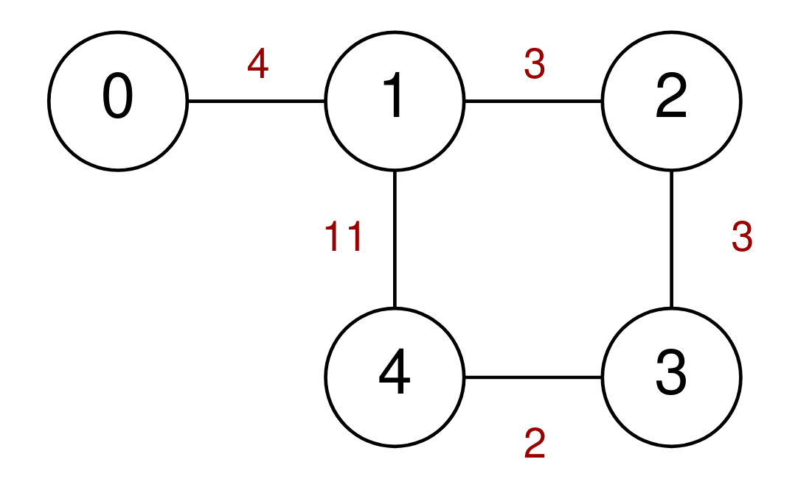
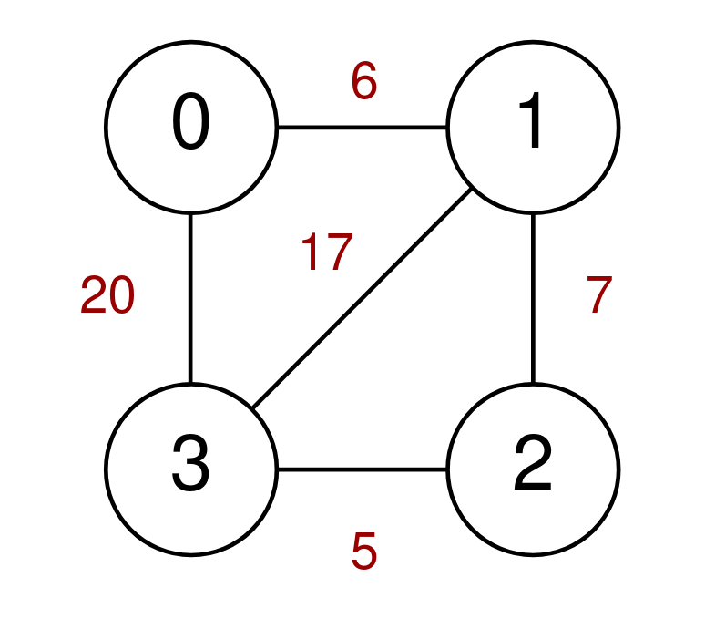
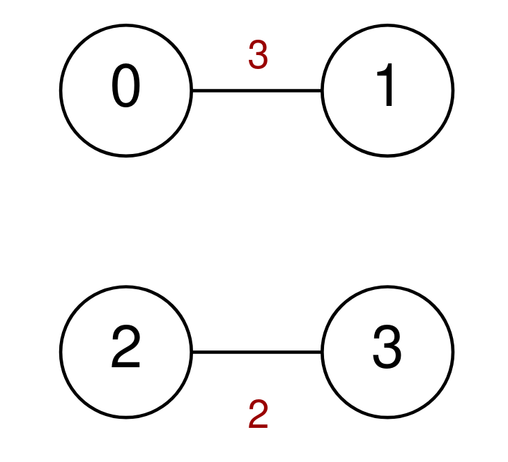

### 1. Description

A series of highways connect `n` cities numbered from `0` to $n - 1$. You are given a 2D integer array `highways` where $\text{highways}[i] = [\text{city1}_{i}, \text{city2}_{i}, \text{toll}_{i}]$ indicates that there is a highway that connects $\text{city1}_{i}$ and $\text{city2}_{i}$, allowing a car to go from $\text{city1}_{i}$ to $\text{city2}_{i}$ **and vice versa** for a cost of $\text{toll}_{i}$.

You are also given an integer `discounts` which represents the number of discounts you have. You can use a discount to travel across the $i^{\text{th}}$ highway for a cost of $\text{toll}_{i} / 2$ (**integer** **division**). Each discount may only be used **once**, and you can only use at most **one** discount per highway.

Return *the **minimum total cost** to go from city *`0`* to city *$n - 1$*, or *`-1`* if it is not possible to go from city *`0`* to city *$n - 1$*.*

### 2. Function Contract

- Refer to method signature.

### 3. Examples

#### Example 1

- **Input:** $n = 5, highways = [[0,1,4],[2,1,3],[1,4,11],[3,2,3],[3,4,2]], discounts = 1$
- **Output:** `9`
- **Explanation:** Go from 0 to 1 for a cost of 4.
Go from 1 to 4 and use a discount for a cost of 11 / 2 = 5.
The minimum cost to go from 0 to 4 is 4 + 5 = 9.

#### Example 2

- **Input:** $n = 4, highways = [[1,3,17],[1,2,7],[3,2,5],[0,1,6],[3,0,20]], discounts = 20$
- **Output:** `8`
- **Explanation:** Go from 0 to 1 and use a discount for a cost of 6 / 2 = 3.
Go from 1 to 2 and use a discount for a cost of 7 / 2 = 3.
Go from 2 to 3 and use a discount for a cost of 5 / 2 = 2.
The minimum cost to go from 0 to 3 is 3 + 3 + 2 = 8.

#### Example 3

- **Input:** $n = 4, highways = [[0,1,3],[2,3,2]], discounts = 0$
- **Output:** `-1`
- **Explanation:** It is impossible to go from 0 to 3 so return -1.

### 4. Constraints

- $2 \le n \le 1000$

- $1 \le \text{highways.length} \le 1000$

- $\text{highways}[i].length = 3$

- $0 \le \text{city1}_{i}, \text{city2}_{i} \le n - 1$

- $\text{city1}_{i} \neq \text{city2}_{i}$

- $0 \le \text{toll}_{i} \le 10^{5}$

- $0 \le discounts \le 500$

- There are no duplicate highways.
