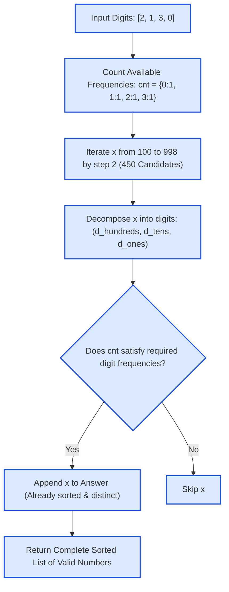

# Guided Example: Finding 3-Digit Even Numbers

We trace the inverse search space reduction, digit multiset frequency verification, and automatic ascending deduplication on a representative digits array:

- **Digits Available:** `[2, 1, 3, 0]`
- **Array Length $n$:** `4`
- **Expected Output:** `[102, 120, 130, 132, 210, 230, 302, 310, 312, 320]`

---

## 1. Problem Overview & Representative Instance

We are given an integer array `digits` where each element is an integer from $0$ to $9$.
We wish to find all unique integers that satisfy three simultaneous conditions:
1. The integer is formed by selecting three elements from `digits` and arranging them in any order. Each selected element can only be used as many times as it appears in `digits`.
2. The integer does not have a leading zero (it must be a valid 3-digit number, i.e., in the range $[100, 999]$).
3. The integer is even (its least significant digit must be in $\{0, 2, 4, 6, 8\}$).

The final answer must be returned as a list of integers sorted in ascending order.

### Forward Permutation Generation vs. Inverse Candidate Verification
- A forward approach generates all permutations of 3 chosen elements from `digits`. For arrays of length $n = 100$, generating $\binom{100}{3} \times 6 \approx 970{,}200$ permutations leads to substantial overhead, duplicate collisions, and an explicit sorting step.
- Instead, notice that the total number of 3-digit even numbers in mathematics is strictly bounded and tiny:
  $$x \in [100, 998] \text{ with step } 2 \implies \frac{998 - 100}{2} + 1 = 450 \text{ numbers}$$
- By inverting the problem—iterating through the $450$ candidate numbers in ascending order and checking whether their required digits can be formed from the multiset of available digits—we guarantee:
  1. Exactly $450$ constant-time checks regardless of array size.
  2. Automatic ascending ordering without an explicit sort.
  3. Automatic uniqueness without hash set deduplication.

---

## 2. Theoretical Invariants & Multiset Inclusion

### Invariant 1: Fixed Candidate Domain
Every valid number $x$ must satisfy:
$$x \in \{100, 102, 104, \dots, 998\}$$
The cardinality of this domain is precisely $450$. Any integer outside this set either has fewer than 3 digits ($< 100$), has a leading zero, has more than 3 digits ($> 999$), or is odd ($x \pmod 2 \neq 0$).

### Invariant 2: Multiset Sub-Frequency Condition
Let $D$ be the multiset of available digits with multiplicity function $f_{\text{available}}(d)$ for $d \in \{0, \dots, 9\}$.
For candidate number $x = 100 \cdot d_2 + 10 \cdot d_1 + d_0$:
$$f_x(d) = \sum_{k=0}^2 [\![d_k == d]\!]$$
The integer $x$ can be formed if and only if the required multiset is a sub-multiset of the available multiset:
$$f_x(d) \le f_{\text{available}}(d) \quad \forall d \in \{0, \dots, 9\}$$

| Metric / Parameter | Value Range | Invariant Property |
|---|---|---|
| Candidate Space | $[100, 998]$ step 2 | Exactly $450$ fixed candidates |
| Available Frequencies | $0 \le f_{\text{available}}(d) \le n$ | Precomputed once in $\mathcal{O}(n)$ time |
| Required Frequencies | $\sum_{d=0}^9 f_x(d) = 3$ | Constrained by 3 digits of candidate $x$ |
| Feasibility Predicate | $\bigwedge_{d=0}^9 (f_x(d) \le f_{\text{available}}(d))$ | Necessary and sufficient test for inclusion |

---

## 3. Step-by-Step Worked Execution

We trace `digits = [2, 1, 3, 0]`.

### Step 1: Precompute Available Digit Histogram
Count occurrences in `[2, 1, 3, 0]`:
- $f(0) = 1$
- $f(1) = 1$
- $f(2) = 1$
- $f(3) = 1$
- $f(4 \dots 9) = 0$

---

### Step 2: Sample Candidate Verifications Across Search Domain

1. **Candidate $x = 100$:**
   - Digits: `1, 0, 0`. Required: $f_{100}(1) = 1, f_{100}(0) = 2$.
   - Available $0$s: $f(0) = 1 < 2 \implies$ **Rejected** (insufficient zeroes).
2. **Candidate $x = 102$:**
   - Digits: `1, 0, 2`. Required: $f(1)=1, f(0)=1, f(2)=1$.
   - Availability: $1 \le 1, 1 \le 1, 1 \le 1 \implies$ **Accepted!** Append `102`.
3. **Candidate $x = 104$:**
   - Required: digit $4$. Available: $f(4) = 0 \implies$ **Rejected**.
4. **Candidate $x = 120$:**
   - Digits: `1, 2, 0`. Required: $1$ each of $\{0, 1, 2\}$.
   - Availability: All present $\implies$ **Accepted!** Append `120`.
5. **Candidate $x = 130$:**
   - Digits: `1, 3, 0`. Required: $1$ each of $\{0, 1, 3\}$.
   - Availability: All present $\implies$ **Accepted!** Append `130`.
6. **Candidate $x = 132$:**
   - Digits: `1, 3, 2`. Required: $1$ each of $\{1, 2, 3\}$.
   - Availability: All present $\implies$ **Accepted!** Append `132`.
7. **Candidate $x = 210$:**
   - Digits: `2, 1, 0`. Required: $1$ each of $\{0, 1, 2\}$.
   - Availability: All present $\implies$ **Accepted!** Append `210`.
8. **Candidate $x = 220$:**
   - Digits: `2, 2, 0`. Required: two $2$s. Available: only one $2 \implies$ **Rejected**.
9. **Candidate $x = 230$:**
   - Digits: `2, 3, 0`. Available: All present $\implies$ **Accepted!** Append `230`.
10. **Candidate $x = 302$:**
    - Digits: `3, 0, 2`. Available: All present $\implies$ **Accepted!** Append `302`.
11. **Candidate $x = 310$:**
    - Digits: `3, 1, 0`. Available: All present $\implies$ **Accepted!** Append `310`.
12. **Candidate $x = 312$:**
    - Digits: `3, 1, 2`. Available: All present $\implies$ **Accepted!** Append `312`.
13. **Candidate $x = 320$:**
    - Digits: `3, 2, 0`. Available: All present $\implies$ **Accepted!** Append `320`.

All other candidates in $[100, 998]$ require digits outside $\{0, 1, 2, 3\}$ or require repeated copies that exceed availability.

Final list of accepted integers:
$$[102, 120, 130, 132, 210, 230, 302, 310, 312, 320]$$

---

## 4. Complete Execution Trace

Below is the verification trace for a representative cross-section of candidate evaluations:

| Candidate $x$ | Hundreds $d_2$ | Tens $d_1$ | Ones $d_0$ | Required Counts ($d: f_x(d)$) | Availability Test | Accepted? | Emitted Output Stream |
|---|---|---|---|---|---|---|---|
| $100$ | $1$ | $0$ | $0$ | $1:1, 0:2$ | $f(0) = 1 < 2$ (Fail) | No | $[\,]$ |
| **$102$** | $1$ | $0$ | $2$ | $1:1, 0:1, 2:1$ | $1 \le 1, 1 \le 1, 1 \le 1$ | **Yes** | `[102]` |
| $104 \dots 118$ | $1$ | $0/1$ | Even | Requires $4, 6, 8$ or two $1$s | Disqualified | No | `[102]` |
| **$120$** | $1$ | $2$ | $0$ | $1:1, 2:1, 0:1$ | $1 \le 1, 1 \le 1, 1 \le 1$ | **Yes** | `[102, 120]` |
| **$130$** | $1$ | $3$ | $0$ | $1:1, 3:1, 0:1$ | $1 \le 1, 1 \le 1, 1 \le 1$ | **Yes** | `[102, 120, 130]` |
| **$132$** | $1$ | $3$ | $2$ | $1:1, 3:1, 2:1$ | $1 \le 1, 1 \le 1, 1 \le 1$ | **Yes** | `[102, 120, 130, 132]` |
| **$210$** | $2$ | $1$ | $0$ | $2:1, 1:1, 0:1$ | $1 \le 1, 1 \le 1, 1 \le 1$ | **Yes** | `[..., 210]` |
| $220$ | $2$ | $2$ | $0$ | $2:2, 0:1$ | $f(2) = 1 < 2$ (Fail) | No | `[..., 210]` |
| **$230$** | $2$ | $3$ | $0$ | $2:1, 3:1, 0:1$ | All available | **Yes** | `[..., 230]` |
| **$302$** | $3$ | $0$ | $2$ | $3:1, 0:1, 2:1$ | All available | **Yes** | `[..., 302]` |
| **$310$** | $3$ | $1$ | $0$ | $3:1, 1:1, 0:1$ | All available | **Yes** | `[..., 310]` |
| **$312$** | $3$ | $1$ | $2$ | $3:1, 1:1, 2:1$ | All available | **Yes** | `[..., 312]` |
| **$320$** | $3$ | $2$ | $0$ | $3:1, 2:1, 0:1$ | All available | **Yes** | `[..., 320]` |

---

## 5. Algorithmic Correctness & Soundness

1. **Completeness of Domain:**
   Because any valid 3-digit even number without leading zero must fall in $[100, 998]$ and have an even ones digit, the loop $x \in [100, 998]$ step 2 examines every conceivable valid integer. No candidate is omitted.
2. **Soundness of Multiset Check:**
   Checking that $f_x(d) \le f_{\text{available}}(d)$ for all $d \in \{0, \dots, 9\}$ guarantees that $x$ can be formed by picking three distinct indices from `digits`.
3. **Inherent Uniqueness and Sorting:**
   Because $x$ strictly increases on each loop iteration ($100, 102, 104, \dots$), all qualifying numbers are naturally discovered in strictly ascending order. No deduplication step or sorting pass is needed.

---

## 6. Edge Cases, Pitfalls & Structural Traps

- **Multiplicity Accounting:**
  A candidate requiring repeated digits (like $222$ requiring three $2$s) must verify that `digits` contains at least three $2$s. Checking set membership (`2 in digits`) rather than multiset count allows false positives.
- **Leading Zero Suppression:**
  Starting the search at $100$ automatically prevents leading-zero formations (e.g., $012$ or $024$).
- **No Even Digits Present:**
  If `digits` contains only odd numbers (e.g. `[3, 7, 5]`), no candidate will ever satisfy the ones-place condition. The loop terminates cleanly and returns `[]`.

---

## 7. Complexity Analysis

- **Time Complexity:**
  - Counting digit frequencies of `digits` of length $n$ takes $\mathcal{O}(n)$ time.
  - The candidate search iterates over exactly $450$ fixed integers.
  - For each candidate, decomposing into 3 digits and checking 10 bucket frequencies takes $\mathcal{O}(1)$ time.
  - Total time complexity: $\mathcal{O}(n + 450) = \mathcal{O}(n)$ linear time.
- **Auxiliary Space Complexity:**
  - The frequency table for the 10 decimal digits requires $\mathcal{O}(1)$ space.
  - The answer array contains at most $450$ integers.
  - Total auxiliary space: $\mathcal{O}(1)$ constant memory beyond the output list.
