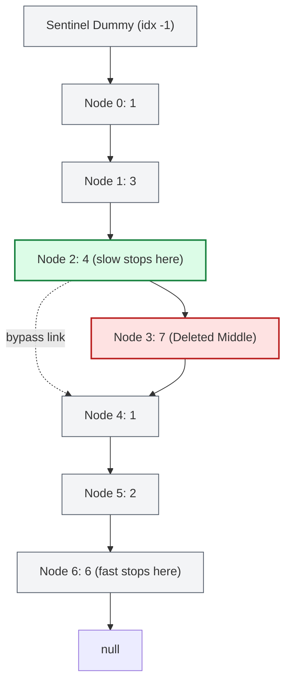

# Guided Example: Delete the Middle Node of a Linked List

We trace the single-pass two-pointer stride synchronization and in-place bypass pointer deletion on a representative singly linked list:

- **Input Head:** `[1, 3, 4, 7, 1, 2, 6]`
- **List Length $n$:** `7`
- **Target Middle Node Index:** $\lfloor 7 / 2 \rfloor = 3$ (Value: `7`)
- **Expected Modified List:** `[1, 3, 4, 1, 2, 6]`

---

## 1. Problem Overview & Representative Instance

We are given the `head` of a singly linked list containing $n$ nodes indexed from $0$ to $n - 1$.
The objective is to delete the middle node, located at index $\lfloor n / 2 \rfloor$, and return the `head` of the modified linked list.

### Challenge: Locating the Preceding Node in a Single Pass
To delete a target node $u$ from a singly linked list in $\mathcal{O}(1)$ pointer operations, one cannot simply hold a reference to $u$; one must hold a reference to its immediate predecessor $p$ (at index $\lfloor n / 2 \rfloor - 1$) in order to rewire $p.\text{next} \leftarrow u.\text{next}$.
- A two-pass approach traverses the list to count $n$, computes $k = \lfloor n / 2 \rfloor - 1$, and traverses a second time to index $k$.
- A single-pass approach uses two synchronized pointers (`slow` and `fast`) with a ratio of stride velocities ($1:2$). By introducing a sentinel dummy node before `head`, `slow` begins one step behind `head` while `fast` begins at `head`. When `fast` reaches the end of the list, `slow` halts precisely at index $\lfloor n / 2 \rfloor - 1$.

---

## 2. Invariants & Two-Pointer Synchronization Mathematics

Let the list nodes be indexed $0, 1, \dots, n - 1$. We prepend a sentinel node $\text{dummy}$ at index $-1$ such that $\text{dummy}.\text{next} = \text{head}$.

### Invariant 1: Stride Velocity Synchronization
- Pointer $\text{slow}$ is initialized to $\text{dummy}$ (index $p_{\text{slow}} = -1$).
- Pointer $\text{fast}$ is initialized to $\text{head}$ (index $p_{\text{fast}} = 0$).
- At each iteration $t \ge 1$, $\text{slow}$ advances by $1$ step while $\text{fast}$ advances by $2$ steps:
  $$p_{\text{slow}}(t) = t - 1$$
  $$p_{\text{fast}}(t) = 2t$$

### Invariant 2: Termination Position Parity
The loop terminates as soon as $\text{fast}$ cannot take two steps, i.e., when $\text{fast}$ is null or $\text{fast}.\text{next}$ is null:

1. **Odd Length ($n = 2m + 1$):**
   - The loop runs for $t = m$ iterations.
   - At step $m$, $p_{\text{fast}}(m) = 2m = n - 1$ (the last node). Because $\text{fast}.\text{next} = \text{null}$, the loop terminates.
   - Position of $\text{slow}$: $p_{\text{slow}}(m) = m - 1$.
   - Since $\lfloor n / 2 \rfloor = \lfloor (2m + 1) / 2 \rfloor = m$, index $m - 1$ is exactly the predecessor of the middle node.

2. **Even Length ($n = 2m$):**
   - At step $m - 1$, $p_{\text{fast}}(m - 1) = 2m - 2 = n - 2$.
   - Since $\text{fast}.\text{next}$ is node $n - 1$ (not null), step $m$ executes.
   - At step $m$, $p_{\text{fast}}(m) = 2m = n$ ($\text{null}$). The loop terminates.
   - Position of $\text{slow}$: $p_{\text{slow}}(m) = m - 1$.
   - Since $\lfloor n / 2 \rfloor = \lfloor 2m / 2 \rfloor = m$, index $m - 1$ is again exactly the predecessor of the middle node.

In both parities, $\text{slow}$ halts unconditionally at index $\lfloor n / 2 \rfloor - 1$.

| Parameter / Pointer | Initial State ($t = 0$) | Advancement Rate | Final Position ($t = \lfloor n / 2 \rfloor$) |
|---|---|---|---|
| Sentinel $\text{dummy}$ | Prepended before $\text{head}$ | Static anchor (index $-1$) | $\text{dummy}.\text{next}$ yields modified list head |
| $\text{slow}$ Pointer | Positioned at $\text{dummy}$ | $+1$ node per step | Exactly at index $\lfloor n / 2 \rfloor - 1$ |
| $\text{fast}$ Pointer | Positioned at $\text{head}$ | $+2$ nodes per step | Lands on node $n - 1$ (odd $n$) or $\text{null}$ (even $n$) |
| Target Deletion Node | Precomputed index $\lfloor n / 2 \rfloor$ | Static relative to list | Located at $\text{slow}.\text{next}$ |

---

## 3. Step-by-Step Worked Execution

We trace the representative instance `head = [1, 3, 4, 7, 1, 2, 6]` ($n = 7$).
Target middle node is index $\lfloor 7 / 2 \rfloor = 3$ (value `7`).

### Step 0: Initialization
- Prepend sentinel: $\text{dummy} \to 1 \to 3 \to 4 \to 7 \to 1 \to 2 \to 6 \to \text{null}$.
- $\text{slow} \leftarrow \text{dummy}$ (index $-1$).
- $\text{fast} \leftarrow \text{head}$ (index $0$, value `1`).

### Step 1: First Stride
- Advance $\text{slow}$ by $1$: $\text{slow} \leftarrow \text{slow}.\text{next}$ (index $0$, value `1`).
- Advance $\text{fast}$ by $2$: $\text{fast} \leftarrow \text{fast}.\text{next}.\text{next}$ (index $2$, value `4`).
- Check: $\text{fast}$ is valid and $\text{fast}.\text{next}$ (value `7`) is not null. Continue.

### Step 2: Second Stride
- Advance $\text{slow}$ by $1$: $\text{slow} \leftarrow \text{slow}.\text{next}$ (index $1$, value `3`).
- Advance $\text{fast}$ by $2$: $\text{fast} \leftarrow \text{fast}.\text{next}.\text{next}$ (index $4$, value `1`).
- Check: $\text{fast}$ is valid and $\text{fast}.\text{next}$ (value `2`) is not null. Continue.

### Step 3: Third Stride & Loop Termination
- Advance $\text{slow}$ by $1$: $\text{slow} \leftarrow \text{slow}.\text{next}$ (index $2$, value `4`).
- Advance $\text{fast}$ by $2$: $\text{fast} \leftarrow \text{fast}.\text{next}.\text{next}$ (index $6$, value `6`).
- Check: $\text{fast}$ is at index $6$ (the last node). Its successor $\text{fast}.\text{next}$ is $\text{null}$.
- Loop terminates immediately!

### Step 4: In-Place Bypass Deletion
- $\text{slow}$ resides at node index $2$ (value `4`).
- The middle node to delete is $\text{slow}.\text{next}$ (index $3$, value `7`).
- Reassign the pointer: $\text{slow}.\text{next} \leftarrow \text{slow}.\text{next}.\text{next}$.
- Node `4` now points directly to node `1` at index $4$, cleanly bypassing and decoupling node `7`.
- Return $\text{dummy}.\text{next}$, which is the node `1` at original index $0$.

---

## 4. Complete Execution Trace & State Progression

| Iteration $t$ | $\text{slow}$ Index | $\text{slow}$ Value | $\text{fast}$ Index | $\text{fast}$ Value | Condition Evaluation | Action Taken |
|---|---|---|---|---|---|---|
| $0$ (Init) | $-1$ | $\text{dummy}$ | $0$ | $1$ | $\text{fast} \neq \text{null} \land \text{fast}.\text{next} \neq \text{null}$ | Enter loop |
| $1$ | $0$ | $1$ | $2$ | $4$ | $\text{fast}.\text{next} = 7 \neq \text{null}$ | Advance both pointers |
| $2$ | $1$ | $3$ | $4$ | $1$ | $\text{fast}.\text{next} = 2 \neq \text{null}$ | Advance both pointers |
| $3$ | $2$ | $4$ | $6$ | $6$ | $\text{fast}.\text{next} = \text{null}$ | Terminate loop |
| Final (Bypass) | $2$ | $4$ | $6$ | $6$ | Reassign pointer | $\text{slow}.\text{next} \leftarrow \text{node } 4$ |

### Structural Modification Summary
- Before: $\text{dummy} \to 1 \to 3 \to \mathbf{4} \to \mathbf{7} \to \mathbf{1} \to 2 \to 6 \to \text{null}$
- After bypass: $\text{dummy} \to 1 \to 3 \to \mathbf{4} \longrightarrow \mathbf{1} \to 2 \to 6 \to \text{null}$
- Result list: `[1, 3, 4, 1, 2, 6]`.

---

## 5. Algorithmic Correctness & Soundness

### Mathematical Proof of Index Invariant
Let $n \ge 1$ be the number of nodes in the linked list.
1. The target node to delete is at index $k = \lfloor n / 2 \rfloor$.
2. To remove node $k$, the predecessor pointer must rest at index $k - 1 = \lfloor n / 2 \rfloor - 1$.
3. When initialized at index $-1$ ($\text{dummy}$) and index $0$ ($\text{head}$), after $m$ loop steps:
   $$p_{\text{slow}} = m - 1$$
   $$p_{\text{fast}} = 2m$$
4. The loop guard requires that both $\text{fast}$ and $\text{fast}.\text{next}$ exist:
   - For $n = 2m + 1$: $\text{fast}$ reaches $2m = n - 1$. $\text{fast}.\text{next}$ is $\text{null}$, so loop executes exactly $m = \lfloor (2m + 1) / 2 \rfloor$ times. $\text{slow}$ stops at $m - 1$.
   - For $n = 2m$: $\text{fast}$ advances from $2m - 2$ to $2m = n$ ($\text{null}$). The loop executes exactly $m = \lfloor 2m / 2 \rfloor$ times. $\text{slow}$ stops at $m - 1$.
5. Therefore, $\text{slow}$ invariably stops at index $\lfloor n / 2 \rfloor - 1$.
6. The single pointer assignment $\text{slow}.\text{next} = \text{slow}.\text{next}.\text{next}$ unlinks the node at index $\lfloor n / 2 \rfloor$ without affecting any preceding or subsequent elements.

---

## 6. Traps & Edge Case Analysis

| Edge Case Scenario | Input List | Behavior Under Sentinel Synchronization | Output |
|---|---|---|---|
| Single Element ($n = 1$) | `[1]` | $\text{fast}.\text{next} = \text{null}$ immediately. $\text{slow}$ remains at $\text{dummy}$. Bypass sets $\text{dummy}.\text{next} \leftarrow \text{head}.\text{next} = \text{null}$. | `[]` (null) |
| Two Elements ($n = 2$) | `[1, 2]` | Step 1 executes: $\text{slow} \to 1$ (index $0$), $\text{fast} \to \text{null}$ (index $2$). Loop stops. $\text{slow}.\text{next} \leftarrow \text{node } 1.\text{next}.\text{next} = \text{null}$. | `[1]` |
| Even Parity ($n = 4$) | `[1, 2, 3, 4]` | $\lfloor 4 / 2 \rfloor = 2$. Node `3` deleted. $\text{slow}$ stops at index $1$ (node `2`). | `[1, 2, 4]` |
| Missing Sentinel Trap | Direct $\text{slow} \leftarrow \text{head}$ | When $n = 1$, predecessor does not exist; dereferencing crashes or requires special branching. | Prevented by $\text{dummy}$ |

---

## 7. Complexity Analysis

- **Time Complexity:** $\mathcal{O}(n)$. The fast pointer advances by $2$ nodes per iteration, executing $\lfloor n / 2 \rfloor$ iterations. The list is traversed in a single pass, performing $\mathcal{O}(1)$ work per step and a constant-time pointer reassignment at termination.
- **Auxiliary Space Complexity:** $\mathcal{O}(1)$. Only two traversal pointer handles (`slow`, `fast`) and one sentinel dummy node are allocated. No dynamic arrays, hash tables, or recursive call stacks are created.