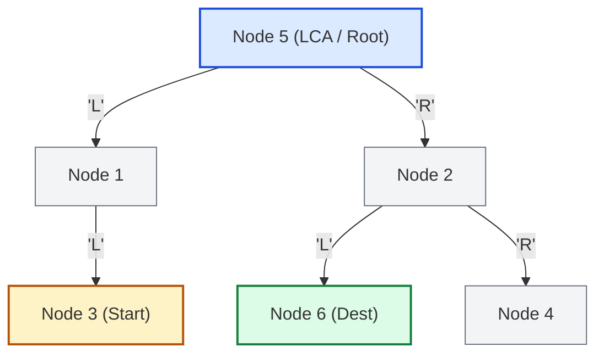

# Guided Example: Step-By-Step Directions From a Binary Tree Node to Another

We trace the DFS root-to-node path discovery, Lowest Common Ancestor (LCA) prefix cancellation, and upward/downward direction synthesis on a representative binary tree:

- **Tree Hierarchy:** `root = [5, 1, 2, 3, null, 6, 4]`
- **Start Node Value:** `3`
- **Destination Node Value:** `6`
- **Expected Shortest Path Directions:** `"UURL"`

---

## 1. Problem Overview & Representative Instance

We are given the root of a binary tree with $n$ nodes, where each node possesses a unique integer value from $1$ to $n$.
We are also given two distinct integers: `startValue` (the start node $s$) and `destValue` (the destination node $d$).
The objective is to produce the step-by-step string of directions for the shortest path from $s$ to $d$:
- `'U'`: move from the current node to its parent node.
- `'L'`: move from the current node to its left child node.
- `'R'`: move from the current node to its right child node.

### Challenge: Navigating Upwards Without Parent Pointers
In standard binary tree nodes, edges are directed from parent to child (`left` and `right`), lacking native backward parent pointers.
- Constructing an explicit bidirectional adjacency graph incurs extra overhead and auxiliary memory.
- However, in any tree, the unique simple path between two nodes $s$ and $d$ passes through their Lowest Common Ancestor, $\text{LCA}(s, d)$.
- Because the root has directed paths to all vertices, finding the paths $P_s = \text{root} \rightsquigarrow s$ and $P_d = \text{root} \rightsquigarrow d$ allows us to immediately identify the LCA as their longest common prefix. Slicing off this common prefix yields the exact upward and downward segments.

---

## 2. Invariants & Path Decomposition Mathematics

### Invariant 1: Uniqueness of Simple Paths in Trees
In any undirected tree $T = (V, E)$, there exists a unique simple path between any pair of vertices $u, v \in V$.
Let $r$ denote the root of the tree. The unique path from $r$ to any node $x$ can be represented as a word over the alphabet $\Sigma = \{\text{'L'}, \text{'R'}\}$:
$$P_x = \sigma_1 \sigma_2 \dots \sigma_{|P_x|}, \quad \sigma_i \in \{\text{'L'}, \text{'R'}\}$$

### Invariant 2: LCA Prefix Factorization
Let $P_s$ and $P_d$ be the paths from the root to $s$ and $d$ respectively.
Because $T$ is a tree, the paths from $r$ to $s$ and from $r$ to $d$ coincide from $r$ down to $\text{LCA}(s, d)$ and diverge strictly thereafter.
Let $k \ge 0$ be the length of the longest common prefix:
$$k = \max \{i \in [0, \min(|P_s|, |P_d|)] \mid P_s[0 \dots i-1] = P_d[0 \dots i-1]\}$$
The common prefix of length $k$ encodes the path from $r$ to $\text{LCA}(s, d)$.

### Invariant 3: Direction Synthesis
1. **Upward Ascent ($s \rightsquigarrow \text{LCA}(s, d)$):**
   The subpath from $s$ up to $\text{LCA}(s, d)$ has length $|P_s| - k$. Every step must ascend to a parent node, meaning every step is unconditionally represented by character `'U'`:
   $$\text{Ascent} = \underbrace{\text{'U'}\dots\text{'U'}}_{|P_s| - k \text{ times}}$$
2. **Downward Descent ($\text{LCA}(s, d) \rightsquigarrow d$):**
   The subpath from $\text{LCA}(s, d)$ down to $d$ corresponds exactly to the unshared suffix of $P_d$:
   $$\text{Descent} = P_d[k \dots |P_d|-1]$$
3. **Shortest Path String:**
   $$\text{Path}(s \to d) = \text{Ascent} + \text{Descent} = \text{'U'}^{|P_s| - k} + P_d[k:]$$

| Component | Path String / Symbol | Semantics in Representative Tree |
|---|---|---|
| Root to Start ($P_s$) | `"LL"` | $5 \xrightarrow{\text{'L'}} 1 \xrightarrow{\text{'L'}} 3$ |
| Root to Dest ($P_d$) | `"RL"` | $5 \xrightarrow{\text{'R'}} 2 \xrightarrow{\text{'L'}} 6$ |
| Common Prefix ($k$) | $\varepsilon$ (empty, length $0$) | $\text{LCA}(3, 6) = 5$ (diverge at root) |
| Ascent Suffix | `"UU"` ($\lvert P_s \rvert - 0 = 2$ steps) | $3 \xrightarrow{\text{'U'}} 1 \xrightarrow{\text{'U'}} 5$ |
| Descent Suffix | `"RL"` ($P_d[0:]$) | $5 \xrightarrow{\text{'R'}} 2 \xrightarrow{\text{'L'}} 6$ |
| Concatenated Result | `"UURL"` | Shortest simple path from node `3` to node `6` |

---

## 3. Step-by-Step Worked Execution

We trace `root = [5, 1, 2, 3, null, 6, 4]`, `startValue = 3`, `destValue = 6`.

### Step 1: DFS Search for Root-to-Start Path ($P_s$)
We traverse from root `5` seeking value `3`:
1. At node `5`: target $3 \neq 5$.
   - Branch Left to node `1` with direction `'L'`.
2. At node `1`: target $3 \neq 1$.
   - Branch Left to node `3` with direction `'L'`.
3. At node `3`: target $3 == 3$ found!
   - Terminate search and backtrack.
   - Root-to-start path string: $P_s = \text{"LL"}$.

### Step 2: DFS Search for Root-to-Destination Path ($P_d$)
We traverse from root `5` seeking value `6`:
1. At node `5`: target $6 \neq 5$.
   - Branch Left to node `1`. Node `1` subtrees contain $\{3\}$ only; `6` not found. Backtrack.
   - Branch Right to node `2` with direction `'R'`.
2. At node `2`: target $6 \neq 2$.
   - Branch Left to node `6` with direction `'L'`.
3. At node `6`: target $6 == 6$ found!
   - Terminate search and backtrack.
   - Root-to-destination path string: $P_d = \text{"RL"}$.

### Step 3: Prefix Cancellation (LCA Determination)
We compare strings $P_s$ and $P_d$ index by index:
- Index $i = 0$: $P_s[0] = \text{'L'}$, $P_d[0] = \text{'R'}$.
  - $P_s[0] \neq P_d[0] \implies$ mismatch at index $0$.
  - Common prefix length $k = 0$.
  - Both paths diverge immediately at the root node `5`.
  - Therefore, $\text{LCA}(3, 6) = 5$.

### Step 4: Direction Synthesis
- Upward segment: $|P_s| - k = 2 - 0 = 2$ upward steps $\implies \text{"UU"}$.
- Downward segment: $P_d[0:] = \text{"RL"}$.
- Concatenation: $\text{"UU"} + \text{"RL"} = \text{"UURL"}$.

---

## 4. Execution Trace & State Progression

| Phase / Action | Current Node / State | Path Accumulator | Event Description | Resulting Value |
|---|---|---|---|---|
| DFS $1$ (Start) | `5` $\to$ `1` $\to$ `3` | `['L', 'L']` | Target `3` identified at depth 2 | $P_s = \text{"LL"}$ |
| DFS $2$ (Dest) | `5` $\to$ `2` $\to$ `6` | `['R', 'L']` | Target `6` identified at depth 2 | $P_d = \text{"RL"}$ |
| Prefix Scan | Index $0$ | Compare $P_s[0]$ vs $P_d[0]$ | `'L'` vs `'R'` (Mismatch) | $k = 0$ |
| Upward Synthesis | $s \to \text{LCA}$ | Repeats `'U'` $\lvert P_s \rvert - k$ times | $2 - 0 = 2$ | `"UU"` |
| Downward Suffix | $\text{LCA} \to d$ | Slices $P_d$ from index $k$ | $P_d[0:]$ | `"RL"` |
| Final Output | Synthesis | String concatenation | `"UU" + "RL"` | `"UURL"` |

---

## 5. Algorithmic Correctness & Soundness

### Proof of Soundness & Path Minimality
1. **Tree Graph Connectivity:** A binary tree is a connected acyclic graph. For any pair of distinct vertices $u, v$, there is exactly one path without repeated vertices (simple path).
2. **Shortest Path Property:** Because all edge weights are positive and uniform ($1$), the unique simple path is unconditionally the shortest path.
3. **LCA Intersection:** The simple path between $u$ and $v$ consists of the simple path from $u$ to $\text{LCA}(u, v)$ followed by the simple path from $\text{LCA}(u, v)$ to $v$.
4. **Orientation Correctness:**
   - Every edge on the path from $u$ up to an ancestor moves against the tree's directed edge orientation, which is uniquely valid as `'U'`.
   - Every edge on the path from an ancestor down to $v$ follows the tree's directed edge orientation, which is uniquely `'L'` or `'R'`.
5. **Divergence of Suffixes:** Slicing off the prefix $0 \dots k-1$ removes the common ancestor path from the root. Since the paths diverge at index $k$, no cycle is introduced, and no superfluous moves are made.

---

## 6. Boundary Cases & Structural Configurations

| Scenario | Example Tree & Inputs | Path Characteristics | Synthesized Direction |
|---|---|---|---|
| Ancestor to Descendant | Root `2`, Start `2`, Dest `1` (left child) | $P_s = \text{""}$, $P_d = \text{"L"}$, $k = 0$ | Up: $0 \times \text{'U'}$, Down: `"L"` $\implies \text{"L"}$ |
| Descendant to Ancestor | Root `2`, Start `1` (left child), Dest `2` | $P_s = \text{"L"}$, $P_d = \text{""}$, $k = 0$ | Up: $1 \times \text{'U'}$, Down: `""` $\implies \text{"U"}$ |
| Sibling to Sibling | Root `1`, Left `2`, Right `3`, Start `2`, Dest `3` | $P_s = \text{"L"}$, $P_d = \text{"R"}$, $k = 0$ | Up: $1 \times \text{'U'}$, Down: `"R"` $\implies \text{"UR"}$ |
| Deep Common Ancestor | Shared parent at depth $4$ | $P_s = \text{"LLLR"}$, $P_d = \text{"LLLL"}$, $k = 3$ | Up: $1 \times \text{'U'}$, Down: `"L"` $\implies \text{"UL"}$ |

---

## 7. Complexity Analysis

- **Time Complexity:** $\mathcal{O}(n)$.
  - Finding the path from root to `startValue` takes $\mathcal{O}(n)$ time via DFS, visiting each tree node at most once.
  - Finding the path from root to `destValue` takes $\mathcal{O}(n)$ time via DFS.
  - Comparing strings $P_s$ and $P_d$ of lengths at most $h \le n$ takes $\mathcal{O}(h)$ time.
  - Synthesizing the final string takes $\mathcal{O}(h)$ time.
  - Overall runtime is bounded by $\mathcal{O}(n)$, optimal for tree search.
- **Auxiliary Space Complexity:** $\mathcal{O}(h) \le \mathcal{O}(n)$, where $h$ is the height of the tree.
  - The recursion stack for DFS requires $\mathcal{O}(h)$ frames.
  - The character arrays recording paths $P_s$ and $P_d$ each store at most $h$ characters.
  - No auxiliary adjacency graph or hash table of parent pointers is required.