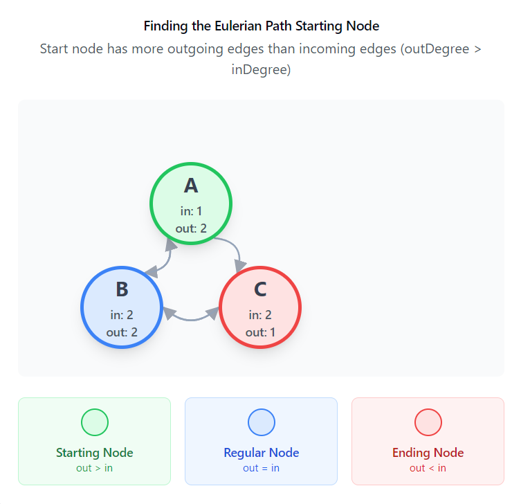

[TOC]

## Solution

---

### Overview

We're given a list of pairs, each represented as `[start, end]`, and our task is to arrange these pairs in a specific order. For this order to be valid, the `end` of each pair has to match the `start` of the next one in line. Thankfully, we know that a valid arrangement is guaranteed to exist.

To put it more technically:
- For every pair in the sequence, the `end` of the pair at index `i-1` has to equal the `start` of the pair at index `i`.
- If there’s more than one possible arrangement, we only need to return one of them.

To solve this, we can borrow ideas from Eulerian paths. If you’re not familiar with them, the basic idea is that an Eulerian path in a graph visits every edge exactly once, and it turns out that this is pretty similar to our goal where each pair’s `end` needs to connect smoothly($end_{i-1} = start_i$) to the `start` of the next pair.

###### The Rules of Eulerian Path

Eulerian paths have a couple of conditions:

1. In an undirected graph, either all nodes have an even degree, or exactly two have an odd degree.
2. In a directed graph (which is what we have here), we need to check if:
   - Each node’s `outDegree` matches its `inDegree`.
   - Or, exactly one node has one more outgoing edge ($outDegree = inDegree + 1$), which indicates our starting point.

> A diagram illustrating the starting condition ($outDegree = inDegree + 1$) is shown below.



</br>

With the problem's guarantee of a valid arrangement, we can rely on these properties. So, all we need to do is find that starting node, then follow the edges to build our path.

---

### Approach 1: Eulerian Path (Recursive)

#### Intuition

Before finding the starting node, we treat each pair as a directed edge between two nodes, where the `start` is the beginning node and the `end` is the destination. Using this setup, we can create a graph representation with an adjacency list, where each node points to the nodes it connects to directly. This list of neighbors for each node will help us keep track of the possible paths we can take as we form the sequence of pairs.

The next step is finding the right starting node for our traversal. We’re looking for a node where the outgoing edges (or `outDegree`) exceed the incoming edges (or `inDegree`) by one. Such a node, if it exists, serves as a natural starting point because it has one extra outgoing connection that begins the path. If there’s no node like this (meaning all nodes have equal in and out degrees), then any node can be chosen as the start, as this suggests a closed Eulerian path.

With our starting node identified, we can traverse the graph using Depth-First Search (Postorder DFS). Starting from our chosen node, we follow each edge, moving to neighboring nodes and adding each visited node to our path. This way, we ensure that every edge is visited exactly once, creating a continuous sequence that meets the required conditions. As we explore each edge, we add nodes to the path in the reverse order (because of DFS), which means we’ll need to reverse the recorded path at the end to obtain the correct order.

At this point, you might wonder why we need to use postorder DFS. The intuitive approach is to use a DFS with backtracking, which would also work but would likely lead to a Time Limit Exceeded (TLE) issue. The time complexity of a basic DFS with backtracking is $O(N * E)$, where N is the number of nodes and E is the number of edges. This approach is too slow because we may end up revisiting nodes or edges multiple times.

The key to optimizing this is to use postorder DFS, which runs in $O(N + E)$ time. The reason postorder DFS works well for this problem is that:

1. We need to perform a DFS traversal to visit every edge exactly once, and since we are guaranteed an Eulerian path, we know that all edges/pairs will be visited starting from the correct start node.
2. The crucial part is that we need to ensure that all edges starting from a given node are visited before we append that node to the path. In postorder DFS, we first explore all the neighbors (edges) of a node and only append the node to the path after all its edges have been processed. This guarantees that we follow the correct sequence, ensuring that the traversal respects the rule of visiting all edges from the current node before moving on.

> Another way to explain why we use postorder DFS is that when we are at a node `u` with multiple unvisited outgoing edges, we know we will need to return to `u` later in the tour to complete the Eulerian path. However, not all outgoing edges will lead back to `u`, as demonstrated in Example 3 of the problem description. To handle this, we perform a postorder traversal instead of a preorder traversal, ensuring that we visit all outgoing edges before returning to the node.

Thus, postorder DFS effectively reduces unnecessary work, avoids TLE, and provides the optimal solution. If you're still unsure about the approach, We highly recommend looking at problem [332. Reconstruct Itinerary](https://leetcode.com/problems/reconstruct-itinerary/description/), which involves a similar solution and approach.

Finally, with our ordered path in hand, we construct the final result by pairing each consecutive node in the path as `[start, end]` pairs.

#### Algorithm

- Initialize `adjacencyMatrix` as an unordered map of deques to represent the graph (adjacency list).
- Initialize `inDegree` and `outDegree` to track the in-degrees and out-degrees of each node.

- For each pair in `pairs`:
  - Extract the `start` and `end` values from the pair.
  - Add `end` to the adjacency list of `start` in `adjacencyMatrix`.
  - Increment $\text{outDegree}[start]$ and $\text{inDegree}[end]$.

- Define a helper function `visit(int node)` for DFS traversal:
  - While there are outgoing edges from the current node (`node`):
- Pop the next node from the adjacency list and recursively call `visit` on it.
  - After visiting all outgoing nodes, add the current node to `result`.

- Find the starting node for the DFS:
  - Search for a node `startNode` where the out-degree is exactly one greater than the in-degree ($\text{outDegree}[node] = \text{inDegree}[node] + 1$).
  - If no such node exists, use the first element of the first pair as the starting node.

- Perform DFS starting from `startNode`:
  - Call `visit(startNode)` to perform the traversal and fill the `result` array with the nodes in reverse order.

- Reverse the `result` array to restore the correct order of nodes.

- Construct the result pairs:
  - For each consecutive pair of nodes in `result`, add a pair `[result[i-1], result[i]]` to `pairedResult`.

- Return `pairedResult`, which represents the valid arrangement of the input pairs.

#### Implementation

```python
class Solution:
    def validArrangement(self, pairs):
        from collections import defaultdict, deque

        adjacencyMatrix = defaultdict(deque)
        inDegree, outDegree = defaultdict(int), defaultdict(int)

        # Build the adjacency list and track in-degrees and out-degrees
        for pair in pairs:
            start, end = pair
            adjacencyMatrix[start].append(end)
            outDegree[start] += 1
            inDegree[end] += 1

        result = []

        def visit(node):
            while adjacencyMatrix[node]:
                nextNode = adjacencyMatrix[node].popleft()
                visit(nextNode)
            result.append(node)

        # Find the start node (outDegree == 1 + inDegree )
        startNode = -1
        for node in outDegree:
            if outDegree[node] == inDegree[node] + 1:
                startNode = node
                break

        # If no such node exists, start from the first pair's first element
        if startNode == -1:
            startNode = pairs[0][0]

        # Start DFS traversal
        visit(startNode)

        # Reverse the result since DFS gives us the path in reverse
        result.reverse()

        # Construct the result pairs
        pairedResult = [
            [result[i - 1], result[i]] for i in range(1, len(result))
        ]

        return pairedResult
```

#### Complexity Analysis

Let $n$ be the number of pairs in the input `pairs`, $V$ be the number of unique vertices in the graph formed by these pairs, and $E$ be the number of edges in the graph, which equals $n$ since each pair represents an edge.

- Time Complexity: $O(V + E)$

    Building the adjacency list and tracking degrees involves iterating through each pair once. For each pair, we perform constant-time operations to update the adjacency list and degree maps. This step takes $O(n)$ time.

    To find the start node, we iterate through the `outDegree` map, which has at most $V$ entries. For each entry, we perform constant-time operations. This step takes $O(V)$ time.

    In the DFS traversal, we visit each edge exactly once. Since there are $E$ edges, the DFS traversal itself takes $O(E)$ time. During the traversal, we perform constant-time operations per edge, like popping from the deque and pushing to the result array.

    Reversing the result array takes $O(V)$ time because it contains $V$ vertices. Finally, constructing the result pairs requires iterating through the result array once, performing constant-time operations for each vertex. This step also takes $O(V)$ time.

    Overall, the dominant term in the time complexity is $O(V + E)$. Given that $E = n$, the time complexity can be expressed as $O(V + n)$.

- Space Complexity: $O(V + E)$

    The adjacency list stores $E$ edges, with each edge stored in a deque associated with a vertex. Thus, the total space used by the adjacency list is $O(V + E)$.

    The degree maps, both `inDegree` and `outDegree`, store one entry per unique vertex. Therefore, they take $O(V)$ space.

    The result array stores $V$ vertices, requiring $O(V)$ space.

    The maximum depth of the recursive stack during DFS is $V$, so the recursive stack requires $O(V)$ space.

    Overall, the space complexity is dominated by the adjacency list, resulting in $O(V + E)$. Given that $E = n$, the space complexity can be expressed as $O(V + n)$.

---

### Approach 2: Hierholzer's Algorithm (Iterative)

#### Intuition

To solve the problem iteratively, we follow the same core logic used in the recursive solution but avoid recursion by using a stack for DFS. The key concept stays the same. Start by creating an adjacency list, then find the starting node, and after that, we proceed with iterative DFS.

The idea is to use a stack to manage our current position in the graph. Starting from the identified starting node, we push the node onto the stack. At each step, we check if the current node has any outgoing edges left (i.e., if the adjacency list for that node is non-empty). If it does, we push the next node (taken from the front of the adjacency list) onto the stack. This continues until there are no more outgoing edges to visit from the current node.

If a node has no more outgoing edges, it means we’ve fully explored all edges from that node, so we pop it off the stack and add it to the result list. Since we’re collecting the nodes in reverse order (because we process the last node of each pair first), we need to reverse the result list at the end to get the correct order for the Eulerian path.

Finally, we construct the solution by pairing consecutive nodes in the reversed path. This gives us the correct sequence of pairs where each pair’s `end` connects to the next pair’s `start`.

> This algorithm is famously known as Hierholzer's algorithm, named after the German mathematician Carl Hierholzer.

#### Algorithm

- Initialize `adjacencyMatrix` as an unordered map of deques to represent the graph (adjacency list).
- Initialize `inDegree` and `outDegree` to track the in-degrees and out-degrees of each node.

- For each `pair` in `pairs`:
  - Add the edge to the adjacency list ($\text{adjacencyMatrix}[start]$).
  - Increment the `outDegree` of the `start` node.
  - Increment the `inDegree` of the `end` node.

- Initialize `startNode` to -1 to store the node from where the traversal should begin.

- For each node in `outDegree`:
  - Check if the `outDegree` is one greater than the `inDegree` (i.e., $\text{outDegree}[node] = \text{inDegree}[node] + 1$):
- If so, set `startNode` to this node and break the loop.

- If no such `startNode` is found (i.e., no node with `outDegree` greater than `inDegree` by 1), set `startNode` to the first element of the first pair in `pairs`.

- Initialize `nodeStack` and push `startNode` onto the stack for DFS traversal.

- Perform an iterative DFS using the stack:
  - While `nodeStack` is not empty:
- Get the `top` node from the stack.
- If the `top` node has outgoing edges in `adjacencyMatrix`, push the next node onto the stack.
- If there are no outgoing edges left for the `top` node, add it to the result list and pop it from the stack.

- Reverse the `result` since nodes were added in reverse order during DFS.

- Construct `pairedResult` from the reversed `result`:
  - For each consecutive pair of nodes in `result`, create a new pair ($result[i-1], \text{result}[i]$) and add it to `pairedResult`.

- Return `pairedResult` as the final answer, representing the valid arrangement of pairs.

#### Implementation

```python
class Solution:
    def validArrangement(self, pairs):
        adjacencyMatrix = collections.defaultdict(list)
        inDegree, outDegree = collections.defaultdict(
            int
        ), collections.defaultdict(int)

        # Build the adjacency list and track in-degrees and out-degrees
        for pair in pairs:
            start, end = pair[0], pair[1]
            adjacencyMatrix[start].append(end)
            outDegree[start] += 1
            inDegree[end] += 1

        result = []

        # Find the start node (outDegree == inDegree + 1)
        startNode = -1
        for node in outDegree:
            if outDegree[node] == inDegree[node] + 1:
                startNode = node
                break

        # If no such node exists, start from the first pair's first element
        if startNode == -1:
            startNode = pairs[0][0]

        nodeStack = [startNode]

        # Iterative DFS using stack
        while nodeStack:
            node = nodeStack[-1]
            if adjacencyMatrix[node]:
                # Visit the next node
                nextNode = adjacencyMatrix[node].pop(0)
                nodeStack.append(nextNode)
            else:
                # No more neighbors to visit, add node to result
                result.append(node)
                nodeStack.pop()

        # Reverse the result since we collected nodes in reverse order
        result.reverse()

        # Construct the result pairs
        pairedResult = []
        for i in range(1, len(result)):
            pairedResult.append([result[i - 1], result[i]])

        return pairedResult
```

#### Complexity Analysis

Let $n$ be the number of pairs in the input `pairs`, $V$ be the number of unique vertices in the graph formed by these pairs, and $E$ be the number of edges in the graph, which equals $n$ since each pair represents an edge.

- Time Complexity: $O(V + E)$

    Building the adjacency list and tracking in-degrees and out-degrees requires iterating through each pair once. For each pair, we perform constant-time operations to update the adjacency list and the degree maps. This step takes $O(n)$ time.

    To find the start node, we iterate through the `outDegree` map, which has at most $V$ entries. For each entry, we perform constant-time operations. This step takes $O(V)$ time.

    The DFS traversal (implemented iteratively with a stack) visits each edge exactly once. Since there are $E$ edges, the DFS traversal itself takes $O(E)$ time. During the traversal, we perform constant-time operations for each edge, such as popping from the deque and pushing to the result array.

    Reversing the result array takes $O(V)$ time, as it contains $V$ vertices. Constructing the result pairs involves iterating through the result array once, performing constant-time operations for each vertex. This step also takes $O(V)$ time.

    Overall, the dominant term in the time complexity is $O(V + E)$. Since $E = n$, the time complexity can also be expressed as $O(V + n)$.

- Space Complexity: $O(V + E)$

    The adjacency matrix stores $E$ edges, with each edge stored in a deque associated with a vertex. The total space used by the adjacency matrix is $O(V + E)$.

    The `inDegree` and `outDegree` maps store one entry per unique vertex. Thus, both maps together take $O(V)$ space.

    The `result` array stores $V$ vertices, which require $O(V)$ space.

    The maximum depth of the stack during the DFS traversal is $V$, as it corresponds to the number of vertices. Thus, the stack uses $O(V)$ space.

    Overall, the space complexity is dominated by the adjacency matrix, resulting in $O(V + E)$. Since $E = n$, the space complexity can be expressed as $O(V + n)$.

---