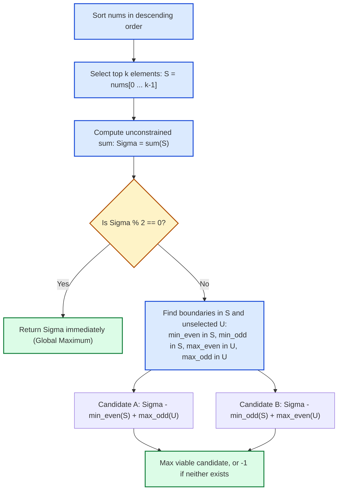

# Guided Example: Subsequence of Size K With the Largest Even Sum

We trace the unconstrained greedy top-$k$ selection, parity checking, and minimal-loss boundary exchange theorem on a representative integer array:

- **Input Array:** `nums = [4, 1, 5, 3, 1]`
- **Subsequence Size $k$:** `3`
- **Expected Maximum Even Sum:** `12`

---

## 1. Problem Overview & Representative Instance

We are given an integer array `nums` and an integer $k$.
The objective is to find the largest **even sum** attainable by choosing any subsequence of `nums` of length exactly $k$.
If no subsequence of length $k$ produces an even sum, we must return `-1`.

### Greedy Baseline & The Parity Exchange Theorem
Subsequences allow choosing any subset of indices; order does not affect the sum.
- If we ignore the even-sum constraint, the unconstrained maximum sum of size $k$ is obtained greedily by selecting the $k$ largest elements in `nums`.
- If the sum of these top $k$ elements is already even, it is unconditionally the optimal answer. No even-sum subsequence can exceed the unconstrained global maximum.
- If the sum is odd, we must modify the chosen subset by replacing at least one element to flip the overall sum's parity from odd to even.
- Because the top-$k$ elements are already maximal, any element exchange incurs a non-negative penalty (sum decrease). Minimizing this penalty requires exchanging exactly one element across the boundary between selected and unselected elements.

---

## 2. Invariants & The Parity Exchange Theorem

Let `nums` be sorted in descending order: $x_0 \ge x_1 \ge \dots \ge x_{n-1}$.
Partition `nums` into:
- Selected set $S = \{x_0, x_1, \dots, x_{k-1}\}$.
- Unselected set $U = \{x_k, x_{k+1}, \dots, x_{n-1}\}$.

Let $\Sigma = \sum_{x \in S} x$ be the unconstrained top-$k$ sum.

### Invariant 1: Unconstrained Maximality
For any size-$k$ subset $S' \subseteq \text{nums}$, $\sum_{x \in S'} x \le \Sigma$.
If $\Sigma \equiv 0 \pmod 2$, then $\Sigma$ is the maximum even sum.

### Invariant 2: Minimal Parity Flip
If $\Sigma \equiv 1 \pmod 2$, to change the parity of the sum to even, the number of parity flips must be odd (at least $1$).
Replacing an element $u \in S$ with an element $v \in U$ changes the sum to $\Sigma - u + v$.
The parity flips if and only if $u$ and $v$ have different parities:
- **Swap Option A:** Remove an even element from $S$ and add an odd element from $U$.
  $$\Delta_A = u_{\text{even}} - v_{\text{odd}} \ge 0$$
  To minimize penalty $\Delta_A$, choose the smallest even element in $S$ ($\min_{\text{even}}(S)$) and the largest odd element in $U$ ($\max_{\text{odd}}(U)$):
  $$\Sigma_A = \Sigma - \min_{x \in S, x \text{ even}}(x) + \max_{y \in U, y \text{ odd}}(y)$$
- **Swap Option B:** Remove an odd element from $S$ and add an even element from $U$.
  $$\Delta_B = u_{\text{odd}} - v_{\text{even}} \ge 0$$
  To minimize penalty $\Delta_B$, choose the smallest odd element in $S$ ($\min_{\text{odd}}(S)$) and the largest even element in $U$ ($\max_{\text{even}}(U)$):
  $$\Sigma_B = \Sigma - \min_{x \in S, x \text{ odd}}(x) + \max_{y \in U, y \text{ even}}(y)$$

Because $u \ge v$ for all $u \in S$ and $v \in U$, performing 2 or more swaps would incur $\ge 2$ non-negative penalties, which cannot yield a strictly larger sum than the optimal single swap. Thus, evaluating $\max(\Sigma_A, \Sigma_B)$ is both necessary and sufficient.

| Exchange Strategy | Element Evicted from $S$ | Element Admitted from $U$ | Net Parity Change | Sum Formula |
|---|---|---|---|---|
| Unconstrained (No Swap) | None | None | Identity ($\Sigma$ already even) | $\Sigma$ |
| Swap Candidate A | $\min_{\text{even}}(S)$ (Smallest even) | $\max_{\text{odd}}(U)$ (Largest odd) | $\text{Odd} - \text{Even} + \text{Odd} \equiv 0 \pmod 2$ | $\Sigma - \min_{\text{even}}(S) + \max_{\text{odd}}(U)$ |
| Swap Candidate B | $\min_{\text{odd}}(S)$ (Smallest odd) | $\max_{\text{even}}(U)$ (Largest even) | $\text{Odd} - \text{Odd} + \text{Even} \equiv 0 \pmod 2$ | $\Sigma - \min_{\text{odd}}(S) + \max_{\text{even}}(U)$ |

---

## 3. Step-by-Step Worked Execution

### Instance Trace: `nums = [4, 1, 5, 3, 1]`, $k = 3$

#### Step 1: Descending Sort & Top-$k$ Extraction
Sort `nums` descending:
$$\text{sorted} = [5, 4, 3, 1, 1]$$
Partition at $k = 3$:
- Selected top $3$: $S = [5, 4, 3]$
- Unselected remainder: $U = [1, 1]$

#### Step 2: Sum & Parity Evaluation
$$\Sigma = 5 + 4 + 3 = 12$$
Check parity:
$$12 \pmod 2 = 0 \quad (\text{Even})$$
Since the unconstrained maximum sum of $k$ elements is even, no exchange is needed.
Return $12$ directly!

---

### Comparative Contrast Instance (Odd Baseline): `nums = [5, 4, 2, 2, 1]`, $k = 3$

To illustrate the non-trivial parity exchange mechanism, consider `[5, 4, 2, 2, 1]` with $k = 3$:
1. Sorted descending: $[5, 4, 2 \mid 2, 1]$.
2. Selected $S = [5, 4, 2]$, Unselected $U = [2, 1]$.
3. Top-$k$ sum: $\Sigma = 5 + 4 + 2 = 11$ (Odd!).
4. Identify extreme parity candidates:
   - In $S = [5, 4, 2]$:
     - Evens: $\{4, 2\} \implies \min_{\text{even}}(S) = 2$.
     - Odds: $\{5\} \implies \min_{\text{odd}}(S) = 5$.
   - In $U = [2, 1]$:
     - Evens: $\{2\} \implies \max_{\text{even}}(U) = 2$.
     - Odds: $\{1\} \implies \max_{\text{odd}}(U) = 1$.
5. Evaluate Swap Candidates:
   - **Candidate A:** Remove $\min_{\text{even}}(S) = 2$, add $\max_{\text{odd}}(U) = 1$:
     $$\Sigma_A = 11 - 2 + 1 = 10$$
   - **Candidate B:** Remove $\min_{\text{odd}}(S) = 5$, add $\max_{\text{even}}(U) = 2$:
     $$\Sigma_B = 11 - 5 + 2 = 8$$
6. Optimal Choice:
   $$\max(\Sigma_A, \Sigma_B) = \max(10, 8) = 10$$
   Feasible subset: $\{5, 4, 1\}$, sum $10$.

---

## 4. Complete Execution Trace & State Progression

| Instance | Sorted `nums` | Top-$k$ Set $S$ | Sum $\Sigma$ | Parity | Boundary Values Identified | Exchange Evaluated | Result |
|---|---|---|---|---|---|---|---|
| Sample 1 | `[5, 4, 3, 1, 1]` | `[5, 4, 3]` | $12$ | Even | None required | None (Already maximum) | $12$ |
| Contrast | `[5, 4, 2, 2, 1]` | `[5, 4, 2]` | $11$ | Odd | $\min_e(S)=2, \max_o(U)=1$ | $\Sigma_A = 11 - 2 + 1 = 10$ | $10$ |
| Sample 2 | `[6, 4, 2]`, $k=3$ | `[6, 4, 2]` | $12$ | Even | None required | None (All elements chosen) | $12$ |
| Impossible | `[5, 3, 1]`, $k=1$ | `[5]` | $5$ | Odd | No evens exist anywhere | Neither swap viable | $-1$ |

---

## 5. Algorithmic Correctness & Soundness

### Mathematical Proof of Single-Swap Sufficiency
1. **Upper Bound:** Any subset $A \subset \text{nums}$ with $|A| = k$ satisfies $\sum_{x \in A} x \le \sum_{x \in S} x = \Sigma$.
2. **Odd Parity Transition:** If $\Sigma$ is odd, any valid even sum subset $A$ must differ from $S$ by an odd number of parity changes.
3. **Monotonicity of Replacement Penalties:**
   Let $u \in S$ and $v \in U$. Because `nums` is sorted descending, $u \ge v$, meaning every replacement $u \to v$ incurs a non-negative penalty $u - v \ge 0$.
4. **Suboptimality of Multiple Swaps:**
   Suppose a solution performs $m \ge 3$ swaps with total penalty $\sum_{i=1}^m (u_i - v_i)$.
   Because each $u_i - v_i \ge 0$, the total penalty satisfies:
   $$\sum_{i=1}^m (u_i - v_i) \ge \min_{i} (u_i - v_i)$$
   At least one of the $m$ swaps must change parity (since $m$ is odd). That single swap alone yields an even sum with penalty less than or equal to the total $m$-swap penalty.
5. **Completeness of Dual Search:**
   Candidate A checks the minimum penalty among all even-to-odd swaps. Candidate B checks the minimum penalty among all odd-to-even swaps. Together, they exhaust all possible single-swap parity transitions.
   Thus, $\max(\Sigma_A, \Sigma_B)$ is guaranteed to attain the optimal even sum if one exists.

---

## 6. Boundary Cases & Impossibility Criteria

| Boundary Condition | Concrete Scenario | Diagnostic Reason | Handled Output |
|---|---|---|---|
| All Elements Odd, $k$ Odd | `nums = [1, 3, 5]`, $k = 1$ | Sum of any odd number of odd integers is always odd; no even numbers exist to swap | `-1` |
| All Elements Odd, $k$ Even | `nums = [1, 3, 5]`, $k = 2$ | Sum of even number of odds is even; top $2$ gives $5 + 3 = 8$ | $8$ |
| All Elements Even | `nums = [2, 4, 6]`, $k = 2$ | Any sum of evens is even; unconstrained top $k$ returns immediately | $10$ |
| Full Array Selection ($k = n$) | $k = \text{len}(nums)$ | $U = \emptyset$; no unselected elements exist to perform swaps | Return $\Sigma$ if even, else `-1` |

---

## 7. Complexity Analysis

- **Time Complexity:** $\mathcal{O}(n \log n)$.
  - Sorting `nums` takes $\mathcal{O}(n \log n)$ time.
  - Summing the first $k$ elements takes $\mathcal{O}(k) \le \mathcal{O}(n)$ time.
  - Finding the extreme parity elements ($\min_{\text{even}}, \min_{\text{odd}}$ in $S$ and $\max_{\text{even}}, \max_{\text{odd}}$ in $U$) takes a single linear scan of $\mathcal{O}(n)$ time.
  - Computing the candidate sums takes $\mathcal{O}(1)$ time.
  - Overall time complexity is dominated by sorting: $\mathcal{O}(n \log n)$. (Alternatively, $\mathcal{O}(n)$ using linear-time selection/partitioning).
- **Auxiliary Space Complexity:** $\mathcal{O}(1)$.
  - In-place sorting and scalar tracking variables require only constant extra space $\mathcal{O}(1)$.
