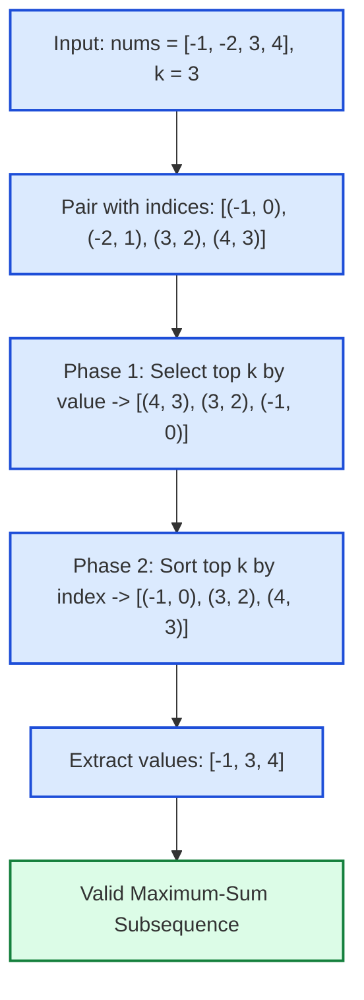

# Guided Example: Find Subsequence of Length K With the Largest Sum

We trace the two-phase decoupled selection—top-$k$ value maximization followed by index-based positional restoration—on a representative mixed-sign array:

- **Input Array:** `nums = [-1, -2, 3, 4]`
- **Subsequence Length $k$:** `3`
- **Expected Subsequence:** `[-1, 3, 4]`

---

## 1. Problem Overview & Representative Instance

We are given an integer array `nums` and an integer $k$.
The objective is to find a subsequence of `nums` of length $k$ that has the **largest possible sum**.
A **subsequence** is defined as an ordered sequence derived from `nums` by deleting zero or more elements without changing the relative order of the remaining elements.

### The Subsequence Preservation Dilemma
- If we simply sort `nums` in descending order, the top $k$ values are $[4, 3, -1]$. However, $[4, 3, -1]$ is **not** a valid subsequence of `[-1, -2, 3, 4]`, because element $-1$ appears *before* $3$ and $4$ in the original array.
- This creates an apparent tension between value maximization (which cares only about numeric magnitudes) and subsequence ordering (which cares only about original index order).
- The key algorithmic insight is that these two requirements decouple completely:
  1. **Phase 1 (Value Selection):** Greedily pick the indices corresponding to the $k$ largest values in the array.
  2. **Phase 2 (Positional Restoration):** Sort those $k$ chosen indices in ascending order and emit the corresponding elements, guaranteeing both sum maximality and valid subsequence ordering.

---

## 2. Invariants & Decoupled Selection Theory

Let the input array be $A = [a_0, a_1, \dots, a_{n-1}]$.
Each element is modeled as a tuple $(a_i, i)$ where $a_i \in \mathbb{Z}$ is the value and $i \in \{0, \dots, n-1\}$ is its immutable positional index.

### Invariant 1: Multiset Value Maximality
The sum of any subsequence of length $k$ is given by $\sum_{j=1}^k a_{i_j}$.
Because addition is commutative, the maximum possible sum of any $k$ elements chosen from $A$ is identical to the sum of the $k$ largest elements of $A$, regardless of their positions.
Therefore, any optimal subsequence must choose an index subset $I^* = \{i_1, i_2, \dots, i_k\} \subset \{0, \dots, n-1\}$ such that:
$$\{a_i \mid i \in I^*\} \text{ contains the } k \text{ largest values in } A$$

### Invariant 2: Subsequence Index Monotonicity
A sequence of elements $(a_{i_1}, a_{i_2}, \dots, a_{i_k})$ is a valid subsequence of $A$ if and only if their original indices are strictly increasing:
$$i_1 < i_2 < \dots < i_k$$
Once the set of optimal indices $I^*$ is identified, sorting $I^*$ numerically uniquely defines the valid subsequence order.

| Phase | Sorting Key | Objective | Invariant Established |
|---|---|---|---|
| Phase 1: Selection | Primary: Value $a_i$ descending | Identify top $k$ largest magnitudes | Maximizes sum $\sum_{x \in S} x$ |
| Phase 2: Ordering | Primary: Original index $i$ ascending | Re-establish relative array sequence | Preserves subsequence definition $i_1 < i_2 < \dots < i_k$ |

---

## 3. Step-by-Step Worked Execution

We trace `nums = [-1, -2, 3, 4]` with $k = 3$.

### Step 1: Augment Elements with Positional Coordinates
Associate each entry with its original index $i$:
- Element $0$: value $-1$, index $0 \implies (-1, 0)$
- Element $1$: value $-2$, index $1 \implies (-2, 1)$
- Element $2$: value $3$, index $2 \implies (3, 2)$
- Element $3$: value $4$, index $3 \implies (4, 3)$

### Step 2: Phase 1 — Select Top $k$ Elements by Value
Sort or select the $k = 3$ largest elements by value:
- Ranked by value:
  1. $(4, 3)$ (value $4$)
  2. $(3, 2)$ (value $3$)
  3. $(-1, 0)$ (value $-1$)
  4. $(-2, 1)$ (value $-2$) — discarded
- Selected top $3$ pairs:
  $$S = [\,(4, 3),\, (3, 2),\, (-1, 0)\,]$$
- Sum of selected values: $4 + 3 + (-1) = 6$. This is the global unconstrained maximum sum.

### Step 3: Phase 2 — Restore Original Positional Order
Sort the chosen pairs in $S$ by their index coordinate $i$ in ascending order:
- Inspect indices:
  - $(-1, 0)$ has index $0$
  - $(3, 2)$ has index $2$
  - $(4, 3)$ has index $3$
- Ordered pairs by index:
  $$S_{\text{ordered}} = [\,(-1, 0),\, (3, 2),\, (4, 3)\,]$$
- Notice that index order $0 < 2 < 3$ is strictly monotonically increasing.

### Step 4: Value Extraction
Extract the value component from each ordered pair:
$$\text{result} = [-1, 3, 4]$$
This array has length $3$, sum $6$, and represents a true subsequence of `nums`.

---

## 4. Complete Execution Trace & State Progression

| Original Index $i$ | Value $\text{nums}[i]$ | Augmented Tuple | Value Rank | Selected in Top $k$? | Restored Index Rank | Emitted Output Order |
|---|---|---|---|---|---|---|
| $0$ | $-1$ | $(-1, 0)$ | 3rd largest | Yes | 1st ($i = 0$) | $\text{result}[0] = -1$ |
| $1$ | $-2$ | $(-2, 1)$ | 4th largest | No | N/A | Excluded |
| $2$ | $3$ | $(3, 2)$ | 2nd largest | Yes | 2nd ($i = 2$) | $\text{result}[1] = 3$ |
| $3$ | $4$ | $(4, 3)$ | 1st largest | Yes | 3rd ($i = 3$) | $\text{result}[2] = 4$ |

### Contrast: Duplicate Values Instance
Consider `nums = [2, 1, 3, 3]`, $k = 2$:
1. Augmented tuples: $[(2, 0), (1, 1), (3, 2), (3, 3)]$.
2. Top $2$ by value: $[(3, 2), (3, 3)]$.
3. Indices are $2$ and $3$. Already sorted: $2 < 3$.
4. Output: `[3, 3]`. Both duplicates are captured at their exact respective positions.

---

## 5. Algorithmic Correctness & Soundness

### Proof of Optimality and Subsequence Invariant
1. **Sum Maximality:**
   Let $M$ be the maximum sum of any subsequence of length $k$.
   Because any subsequence is a subset of size $k$, $M \le \sum_{x \in \text{top-}k} x$.
   By selecting the $k$ elements with the largest values, the sum of our chosen subset equals $\sum_{x \in \text{top-}k} x$, achieving the theoretical upper bound.
2. **Subsequence Validity:**
   Let $I = \{i_1, i_2, \dots, i_k\}$ be the set of original indices of the chosen elements.
   By sorting $I$ such that $i_1 < i_2 < \dots < i_k$, the sequence $(a_{i_1}, a_{i_2}, \dots, a_{i_k})$ preserves the relative order of appearance in `nums`. By definition, this sequence is a valid subsequence.
3. **Boundary Ties Arbitrariness:**
   If multiple elements share the threshold value (e.g., duplicate values at the $k$-th position), choosing any of those duplicate instances yields the exact same sum. Any selection of $k$ top indices, once sorted by index, produces a valid maximum-sum subsequence.

---

## 6. Implementation Strategies & Trade-Offs

| Approach | Selection Mechanism | Ordering Mechanism | Time Complexity | Auxiliary Space |
|---|---|---|---|---|
| Index Sorting | Sort indices by `nums[i]`, take last $k$ | Sort chosen $k$ indices ascending | $\mathcal{O}(n \log n)$ | $\mathcal{O}(n)$ |
| Min-Heap (Size $k$) | Push $(a_i, i)$ into min-heap of size $k$ | Extract all $k$ items and sort by index | $\mathcal{O}(n \log k)$ | $\mathcal{O}(k)$ |
| Quickselect | Linear-time selection of $k$-th order statistic | Filter elements $\ge \text{threshold}$, sort $k$ indices | $\mathcal{O}(n + k \log k)$ | $\mathcal{O}(n)$ |

---

## 7. Complexity Analysis

- **Time Complexity:** $\mathcal{O}(n \log n)$ (or $\mathcal{O}(n \log k)$).
  - Pairing indices with values takes $\mathcal{O}(n)$ time.
  - Sorting all $n$ items by value takes $\mathcal{O}(n \log n)$ time (or maintaining a min-heap of size $k$ takes $\mathcal{O}(n \log k)$ time).
  - Sorting the $k$ chosen items by their original index takes $\mathcal{O}(k \log k)$ time.
  - Slicing and extracting values takes $\mathcal{O}(k)$ time.
  - Because $k \le n$, the total running time is bounded by $\mathcal{O}(n \log n)$ (or $\mathcal{O}(n \log k)$ with a priority queue).
- **Auxiliary Space Complexity:** $\mathcal{O}(n)$ (or $\mathcal{O}(k)$).
  - Storing the augmented index-value pairs requires $\mathcal{O}(n)$ memory.
  - The final output subsequence requires $\mathcal{O}(k)$ memory.
