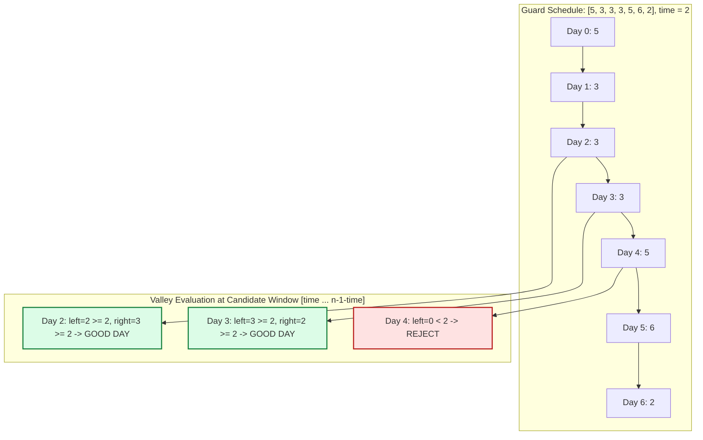

# Guided Example: Find Good Days to Rob the Bank

We trace the two-pass prefix and suffix monotonic run-length dynamic programming and valley intersection verification on a representative security schedule:

- **Security Array:** `security = [5, 3, 3, 3, 5, 6, 2]`
- **Window Parameter $\text{time}$:** `2`
- **Schedule Length $n$:** `7`
- **Expected Good Days:** `[2, 3]`

---

## 1. Problem Overview & Representative Instance

We are given a 0-indexed integer array `security` of length $n$, where `security[i]` denotes the number of guards on day $i$, and an integer `time`.
Day $i$ is defined as a **good day to rob the bank** if and only if:
1. There are at least `time` days before and after day $i$:
   $$\text{time} \le i \le n - 1 - \text{time}$$
2. The guard count is non-increasing for the `time` days immediately preceding day $i$:
   $$\text{security}[i - \text{time}] \ge \text{security}[i - \text{time} + 1] \ge \dots \ge \text{security}[i]$$
3. The guard count is non-decreasing for the `time` days immediately following day $i$:
   $$\text{security}[i] \le \text{security}[i + 1] \le \dots \le \text{security}[i + \text{time}]$$

### Challenge: Avoiding Redundant Window Scans
A direct check for each candidate day $i$ examines $2 \times \text{time}$ adjacent elements, resulting in $\mathcal{O}(n \cdot \text{time})$ time complexity (up to $\mathcal{O}(n^2)$ for $\text{time} = \mathcal{O}(n)$).
- Instead, notice that non-increasing and non-decreasing conditions are contiguous streak lengths.
- By computing the length of the non-increasing streak ending at each day in a single forward pass ($\text{left}[i]$) and the length of the non-decreasing streak starting at each day in a single backward pass ($\text{right}[i]$), any day $i$ is validated in $\mathcal{O}(1)$ time by testing $\text{left}[i] \ge \text{time} \land \text{right}[i] \ge \text{time}$.

---

## 2. Invariants & Monotonic Run-Length Mathematics

Let $n$ be the length of `security`.
We define two auxiliary arrays $\text{left}$ and $\text{right}$ of length $n$:

### Invariant 1: Leftward Non-Increasing Run Recurrence
$\text{left}[i]$ stores the number of consecutive non-increasing steps ending at index $i$:
$$\text{left}[0] = 0$$
$$\text{left}[i] = \begin{cases} \text{left}[i-1] + 1 & \text{if } \text{security}[i] \le \text{security}[i-1] \\ 0 & \text{if } \text{security}[i] > \text{security}[i-1] \end{cases} \quad \forall i \in \{1, \dots, n-1\}$$
Property: $\text{left}[i] \ge \text{time} \iff \text{security}[j-1] \ge \text{security}[j]$ for all $j \in [i - \text{time} + 1, i]$.

### Invariant 2: Rightward Non-Decreasing Run Recurrence
$\text{right}[i]$ stores the number of consecutive non-decreasing steps starting at index $i$:
$$\text{right}[n-1] = 0$$
$$\text{right}[i] = \begin{cases} \text{right}[i+1] + 1 & \text{if } \text{security}[i] \le \text{security}[i+1] \\ 0 & \text{if } \text{security}[i] > \text{security}[i+1] \end{cases} \quad \forall i \in \{n-2, \dots, 0\}$$
Property: $\text{right}[i] \ge \text{time} \iff \text{security}[j] \le \text{security}[j+1]$ for all $j \in [i, i + \text{time} - 1]$.

### Invariant 3: Dual Inequality Conjunction
Day $i$ is a valid good day if and only if all three boundary and monotonic invariants hold simultaneously:
$$i \in [\text{time}, n - 1 - \text{time}] \quad \land \quad \text{left}[i] \ge \text{time} \quad \land \quad \text{right}[i] \ge \text{time}$$

| Metric / Table | Recurrence / Transition Rule | Boundary Condition | Semantic Meaning |
|---|---|---|---|
| Forward Streak $\text{left}[i]$ | $\text{left}[i-1] + 1$ if $\text{security}[i] \le \text{security}[i-1]$ else $0$ | $\text{left}[0] = 0$ | Count of consecutive non-increasing prior steps |
| Backward Streak $\text{right}[i]$ | $\text{right}[i+1] + 1$ if $\text{security}[i] \le \text{security}[i+1]$ else $0$ | $\text{right}[n-1] = 0$ | Count of consecutive non-decreasing future steps |
| Good Day Predicate | $\text{left}[i] \ge \text{time} \land \text{right}[i] \ge \text{time}$ | Checked for $i \in [\text{time}, n - 1 - \text{time}]$ | Necessary and sufficient test for local valley |

---

## 3. Step-by-Step Worked Execution

We trace `security = [5, 3, 3, 3, 5, 6, 2]`, $\text{time} = 2$, $n = 7$.
The viable candidate index range is $[\text{time}, n - 1 - \text{time}] = [2, 7 - 1 - 2] = [2, 4]$.

### Step 1: Forward Pass (Compute $\text{left}$)
- Day $0$ ($5$): $\text{left}[0] = 0$.
- Day $1$ ($3$): $3 \le 5 \implies \text{left}[1] = \text{left}[0] + 1 = 1$.
- Day $2$ ($3$): $3 \le 3 \implies \text{left}[2] = \text{left}[1] + 1 = 2$.
- Day $3$ ($3$): $3 \le 3 \implies \text{left}[3] = \text{left}[2] + 1 = 3$.
- Day $4$ ($5$): $5 > 3 \implies \text{left}[4] = 0$ (streak broken).
- Day $5$ ($6$): $6 > 5 \implies \text{left}[5] = 0$ (streak broken).
- Day $6$ ($2$): $2 \le 6 \implies \text{left}[6] = \text{left}[5] + 1 = 1$.
- Resulting array: $\text{left} = [0, 1, 2, 3, 0, 0, 1]$.

### Step 2: Backward Pass (Compute $\text{right}$)
- Day $6$ ($2$): $\text{right}[6] = 0$.
- Day $5$ ($6$): $6 > 2 \implies \text{right}[5] = 0$ (streak broken).
- Day $4$ ($5$): $5 \le 6 \implies \text{right}[4] = \text{right}[5] + 1 = 1$.
- Day $3$ ($3$): $3 \le 5 \implies \text{right}[3] = \text{right}[4] + 1 = 2$.
- Day $2$ ($3$): $3 \le 3 \implies \text{right}[2] = \text{right}[3] + 1 = 3$.
- Day $1$ ($3$): $3 \le 3 \implies \text{right}[1] = \text{right}[2] + 1 = 4$.
- Day $0$ ($5$): $5 > 3 \implies \text{right}[0] = 0$ (streak broken).
- Resulting array: $\text{right} = [0, 4, 3, 2, 1, 0, 0]$.

### Step 3: Valley Conjunction Evaluation
Evaluate candidate indices $i \in [2, 4]$ against threshold $\text{time} = 2$:
1. **Day $i = 2$:**
   - $\text{left}[2] = 2 \ge 2$ (Holds: preceding window $[5, 3, 3]$ is non-increasing).
   - $\text{right}[2] = 3 \ge 2$ (Holds: succeeding window $[3, 3, 5]$ is non-decreasing).
   - Both hold $\implies$ **Day $2$ is a Good Day!**
2. **Day $i = 3$:**
   - $\text{left}[3] = 3 \ge 2$ (Holds: preceding window $[3, 3, 3]$ is non-increasing).
   - $\text{right}[3] = 2 \ge 2$ (Holds: succeeding window $[3, 5, 6]$ is non-decreasing).
   - Both hold $\implies$ **Day $3$ is a Good Day!**
3. **Day $i = 4$:**
   - $\text{left}[4] = 0 < 2$ (Fails: security increased from day $3$ to day $4$).
   - Reject day $4$.

Collected good days: `[2, 3]`.

---

## 4. Complete Execution Trace & State Progression

| Day $i$ | $\text{security}[i]$ | $\text{left}[i]$ | $\text{right}[i]$ | In Range $[2, 4]$? | Condition: $\text{left} \ge 2 \land \text{right} \ge 2$ | Final Status |
|---|---|---|---|---|---|---|
| $0$ | $5$ | $0$ | $0$ | No ($i < \text{time}$) | Not evaluated | Excluded |
| $1$ | $3$ | $1$ | $4$ | No ($i < \text{time}$) | Not evaluated | Excluded |
| $2$ | $3$ | $2$ | $3$ | Yes | $2 \ge 2 \land 3 \ge 2 \implies \text{True}$ | **Accepted (Good Day)** |
| $3$ | $3$ | $3$ | $2$ | Yes | $3 \ge 2 \land 2 \ge 2 \implies \text{True}$ | **Accepted (Good Day)** |
| $4$ | $5$ | $0$ | $1$ | Yes | $0 \ge 2 \land 1 \ge 2 \implies \text{False}$ | Rejected |
| $5$ | $6$ | $0$ | $0$ | No ($i > n - 1 - \text{time}$) | Not evaluated | Excluded |
| $6$ | $2$ | $1$ | $0$ | No ($i > n - 1 - \text{time}$) | Not evaluated | Excluded |

---

## 5. Algorithmic Correctness & Soundness

### Mathematical Proof of Equivalence
1. **Definition of Non-Increasing Window:**
   The guard counts satisfy $\text{security}[i - \text{time}] \ge \dots \ge \text{security}[i]$ if and only if for all $k \in \{1, \dots, \text{time}\}$, $\text{security}[i - k + 1] \le \text{security}[i - k]$.
2. **Induction on Streak Length:**
   By the recurrence definition, $\text{left}[i] = m$ means that the last $m$ pairwise adjacent comparisons $\text{security}[j] \le \text{security}[j - 1]$ held true without interruption, and the comparison at step $m + 1$ (if it exists) failed.
   Therefore, $\text{left}[i] \ge \text{time}$ is true if and only if the last $\text{time}$ pairwise comparisons all hold true, which is mathematically identical to the non-increasing window condition.
3. **Symmetric Rightward Property:**
   Similarly, $\text{right}[i] = k$ implies that the next $k$ pairwise comparisons $\text{security}[j] \le \text{security}[j + 1]$ hold true without interruption. Hence, $\text{right}[i] \ge \text{time}$ is mathematically identical to the non-decreasing window condition.
4. **Conclusion:**
   The predicate $\text{time} \le i \le n - 1 - \text{time} \land \text{left}[i] \ge \text{time} \land \text{right}[i] \ge \text{time}$ is an exact logical equivalence to the problem statement criteria.

---

## 6. Structural Edge Cases & Boundary Behaviors

| Edge Scenario | Parameter Values | Mathematical Behavior | Handled Output |
|---|---|---|---|
| Zero Time Window | $\text{time} = 0$ | $i \in [0, n-1]$; $\text{left}[i] \ge 0$ and $\text{right}[i] \ge 0$ hold for all days | `[0, 1, ..., n-1]` |
| Insufficient Length | $2 \cdot \text{time} > n$ | $\text{time} > n - 1 - \text{time}$; valid search range is empty | `[]` (empty list) |
| Strictly Increasing | `[1, 2, 3, 4, 5]`, $\text{time} = 1$ | $\text{left}[i] = 0$ for all $i \ge 1$; non-increasing condition never holds | `[]` |
| Flat Plateau | `[2, 2, 2, 2, 2]`, $\text{time} = 2$ | Both $\le$ and $\ge$ hold on equal values; streaks never reset | `[2]` |

---

## 7. Complexity Analysis

- **Time Complexity:** $\mathcal{O}(n)$.
  - The forward pass computing $\text{left}$ traverses $n$ elements in $\mathcal{O}(n)$ time.
  - The backward pass computing $\text{right}$ traverses $n$ elements in $\mathcal{O}(n)$ time.
  - The conjunction filter scans indices $[\text{time}, n - 1 - \text{time}]$, performing $\mathcal{O}(1)$ comparisons per day.
  - Overall time complexity is strictly linear: $\mathcal{O}(n)$.
- **Auxiliary Space Complexity:** $\mathcal{O}(n)$.
  - Arrays $\text{left}$ and $\text{right}$ each require $\mathcal{O}(n)$ memory.
  - (Alternatively, this can be reduced to $\mathcal{O}(n)$ space for a single array by computing the backward streak on the fly and filtering simultaneously).
