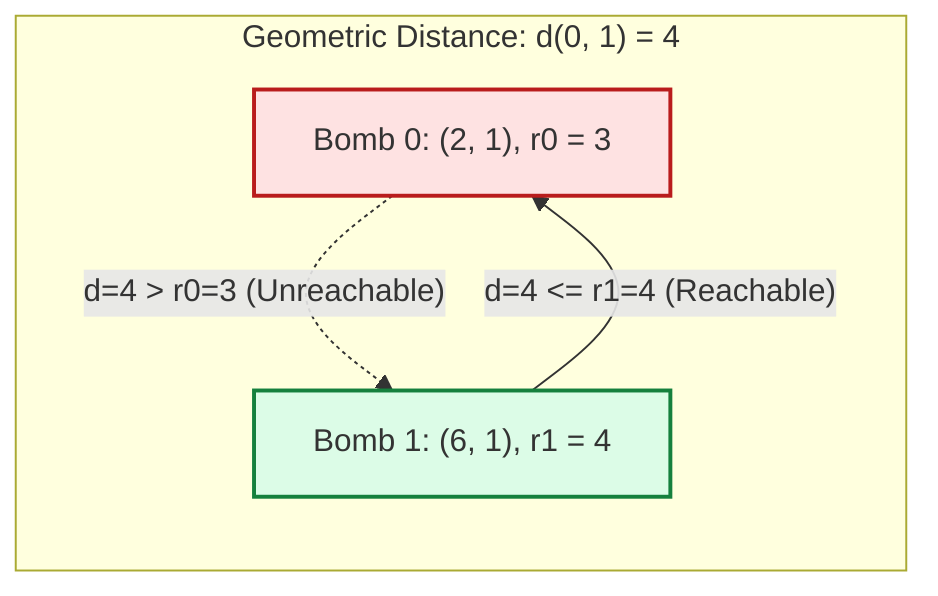

# Guided Example: Detonate the Maximum Bombs

We trace the pairwise geometric radius inequality, asymmetric directed graph construction, and exhaustive multi-source BFS cascade reachability on a representative collection of bombs:

- **Input Bombs:** `[[2, 1, 3], [6, 1, 4]]`
  - Bomb $0$: Center $(2, 1)$, Radius $r_0 = 3$
  - Bomb $1$: Center $(6, 1)$, Radius $r_1 = 4$
- **Total Bombs $n$:** `2`
- **Expected Maximum Detonation Count:** `2`

---

## 1. Problem Overview & Representative Instance

We are given a list of $n$ bombs where each element $\text{bombs}[i] = [x_i, y_i, r_i]$ specifies the 2D Cartesian center $(x_i, y_i)$ and circular blast radius $r_i$ of bomb $i$.
Detonating a bomb causes its blast circle to cover all points within distance $\le r_i$. Any other bomb whose center falls inside this circle will detonate in a cascading chain reaction.
We may choose exactly **one** initial bomb to detonate manually. The objective is to find the maximum number of bombs that will detonate.

### The Asymmetry of Blast Reachability
Unlike standard geometric proximity graphs where connection is mutual, blast reachability is strictly **asymmetric**:
- Bomb $i$ can detonate bomb $j$ if and only if the distance $d(i, j) \le r_i$.
- If $r_i \neq r_j$, bomb $i$ may reach bomb $j$ without bomb $j$ being able to reach bomb $i$.
- Therefore, the problem cannot be solved with undirected Connected Components or Disjoint Set Union (DSU). Instead, it must be formulated as **directed graph reachability**, finding a source vertex $s$ that maximizes the cardinality of its reachable set $|\text{Reach}(s)|$.

---

## 2. Invariants & Geometric Graph Reachability Theory

Let $V = \{0, 1, \dots, n - 1\}$ represent the set of bombs.
For any pair of bombs $i, j \in V$, the squared Euclidean distance between their centers is:
$$\text{dist}^2(i, j) = (x_i - x_j)^2 + (y_i - y_j)^2$$

### Invariant 1: Exact Integer Directed Edge Criterion
A directed edge $i \to j$ exists in graph $G = (V, E)$ if and only if:
$$\text{dist}^2(i, j) \le r_i^2 \quad (i \neq j)$$
Comparing squared distances entirely over integers prevents floating-point precision loss and roundoff errors associated with $\sqrt{\cdot}$.

### Invariant 2: Transitive Detonation Cascade
Because each newly detonated bomb explodes and activates its own blast zone, the set of bombs detonated when bomb $s$ is ignited is precisely the transitive reachability set:
$$\text{Reach}(s) = \{u \in V \mid s \rightsquigarrow u \text{ via directed path in } G\}$$

### Invariant 3: Global Exhaustive Maximization
Because $n \le 100$, running a separate Breadth-First Search (BFS) or Depth-First Search (DFS) from every possible initial bomb $s \in V$ guarantees finding:
$$\text{ans} = \max_{s \in V} |\text{Reach}(s)|$$

| Bomb Pair $(i, j)$ | Squared Distance $\text{dist}^2$ | Radius Threshold $r_i^2$ | Inequality Check | Directed Edge Generated |
|---|---|---|---|---|
| $(0, 1)$ | $(2 - 6)^2 + (1 - 1)^2 = 16$ | $r_0^2 = 3^2 = 9$ | $16 \le 9 \implies \text{False}$ | No edge $0 \to 1$ |
| $(1, 0)$ | $(6 - 2)^2 + (1 - 1)^2 = 16$ | $r_1^2 = 4^2 = 16$ | $16 \le 16 \implies \text{True}$ | Edge $1 \to 0$ added |

---

## 3. Step-by-Step Worked Execution

We trace `bombs = [[2, 1, 3], [6, 1, 4]]` with $n = 2$.

### Step 1: Pairwise Geometric Evaluation & Graph Construction
We compute squared distances between distinct indices:
- Pair $(0, 1)$:
  $$\Delta x = 2 - 6 = -4, \quad \Delta y = 1 - 1 = 0$$
  $$\text{dist}^2 = (-4)^2 + 0^2 = 16$$
- Check $0 \to 1$:
  $r_0^2 = 9$. Since $16 > 9$, bomb $0$ cannot detonate bomb $1$.
- Check $1 \to 0$:
  $r_1^2 = 16$. Since $16 \le 16$, bomb $1$ detonates bomb $0$!
- Resulting Adjacency Lists:
  - $\text{adj}[0] = []$
  - $\text{adj}[1] = [0]$

### Step 2: BFS Traversal from Candidate $s = 0$
- Initialize $\text{vis} = \{0\}$, $\text{queue} = [0]$.
- Dequeue $0$:
  - Examine neighbors in $\text{adj}[0]$: list is empty.
- Traversal halts.
- Reachable set: $\text{Reach}(0) = \{0\}$.
- Count: $|\text{Reach}(0)| = 1$.

### Step 3: BFS Traversal from Candidate $s = 1$
- Initialize $\text{vis} = \{1\}$, $\text{queue} = [1]$.
- Dequeue $1$:
  - Examine neighbors in $\text{adj}[1]$: neighbor $0$.
  - Node $0 \notin \text{vis}$: mark $\text{vis} = \{1, 0\}$, enqueue $0$.
- Dequeue $0$:
  - Examine neighbors in $\text{adj}[0]$: list is empty.
- Traversal halts.
- Reachable set: $\text{Reach}(1) = \{1, 0\}$.
- Count: $|\text{Reach}(1)| = 2$.

### Step 4: Maximize Across All Sources
$$\text{ans} = \max(|\text{Reach}(0)|, |\text{Reach}(1)|) = \max(1, 2) = 2$$
Choosing bomb $1$ as the starting detonator activates all $2$ bombs.

---

## 4. Complete Execution Trace & State Progression

| Candidate Start $s$ | Initial Blast Coordinates | Radius $r_s$ | Initial Queue | Visited Set $\text{Reach}(s)$ | Reached Count | Running Maximum |
|---|---|---|---|---|---|---|
| $0$ | $(2, 1)$ | $3$ | $[0]$ | $\{0\}$ | $1$ | $1$ |
| $1$ | $(6, 1)$ | $4$ | $[1]$ | $\{1, 0\}$ | $2$ | $2$ |

### Three-Node Chain Reaction Contrast Instance
To observe a multi-step transitive cascade, consider:
`bombs = [[1, 2, 3], [2, 3, 1], [3, 4, 2], [4, 5, 3], [5, 6, 4]]`
- If each bomb $i$ reaches only bomb $i + 1$, starting at $s = 0$ propagates through queue $[0] \to [1] \to [2] \to [3] \to [4]$, detonating all $5$ bombs sequentially.
- If $s = 2$ were chosen instead, it would reach only $\{2, 3, 4\}$ (count $3$).
- Testing all $n$ potential triggers ensures the optimal ancestor with maximal downstream reach is selected.

---

## 5. Algorithmic Correctness & Soundness

### Proof of Equivalence Between Directed Graph Paths and Physical Cascades
1. **Direct Trigger Correctness:**
   A bomb $j$ is detonated by the blast of bomb $i$ if and only if $j$ is within distance $r_i$ from $i$, which is exactly encoded by the directed edge $i \to j$.
2. **Chain Reaction by Path Reachability:**
   By induction on the cascade sequence length $k$:
   - For $k = 1$, bomb $s$ detonates directly.
   - For $k > 1$, bomb $v_k$ detonates if and only if some previously detonated bomb $v_{k-1}$ triggers it ($v_{k-1} \to v_k$).
   - Hence, bomb $u$ detonates if and only if there exists a sequence of direct triggers $s = v_1 \to v_2 \to \dots \to v_k = u$, which is the formal definition of a directed path $s \rightsquigarrow u$.
3. **Optimality of Search:**
   Because any one bomb can be chosen as the initial detonation trigger, the global maximum is $\max_{s \in V} |\text{Reach}(s)|$. Evaluating every $s \in V$ guarantees finding the true global optimum.

---

## 6. Structural Edge Cases & Graph Topologies

| Topological Scenario | Structural Property | Consequence for Reachability | Handled Behavior |
|---|---|---|---|
| Mutually Disconnected | $\text{dist}^2(i, j) > r_i^2 \land \text{dist}^2(i, j) > r_j^2$ | No directed edges exist | Each bomb reaches only itself; returns $1$ |
| Concentric Centers | Center $(x_i, y_i) = (x_j, y_j)$ | Distance is $0 \le r_i^2, r_j^2$ | Bidirectional edges; triggering either triggers both |
| Directed Cycle | $A \to B \to C \to A$ | Visited set prevents infinite loops | All cycle members detonated regardless of entry |
| Boundary Inclusion | $\text{dist}^2(i, j) == r_i^2$ | Exact equality on circle boundary | Condition $\le$ correctly includes tangent bombs |

---

## 7. Complexity Analysis

- **Time Complexity:** $\mathcal{O}(n^3)$.
  - Computing pairwise squared distances and constructing adjacency lists evaluates $\binom{n}{2}$ pairs, taking $\mathcal{O}(n^2)$ time.
  - Running BFS/DFS from a single source traverses at most $n$ vertices and $n(n - 1) = \mathcal{O}(n^2)$ directed edges, taking $\mathcal{O}(n^2)$ time.
  - Performing BFS from all $n$ vertices takes $n \times \mathcal{O}(n^2) = \mathcal{O}(n^3)$ time.
  - For the problem constraint $n \le 100$, $n^3 \approx 10^6$ basic operations, executing in under $0.05$ seconds.
- **Auxiliary Space Complexity:** $\mathcal{O}(n^2)$.
  - The adjacency list stores at most $n(n - 1) = \mathcal{O}(n^2)$ directed edges.
  - The visited set and BFS queue per traversal require $\mathcal{O}(n)$ memory.
