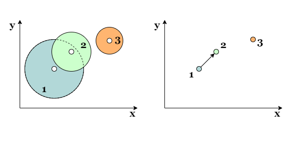
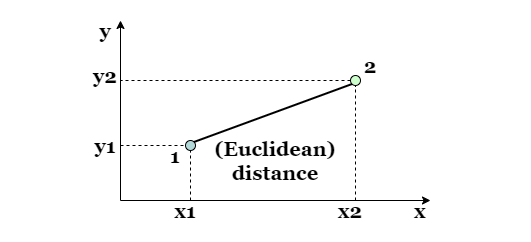
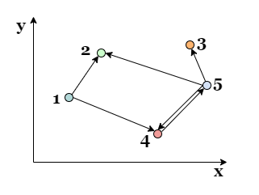
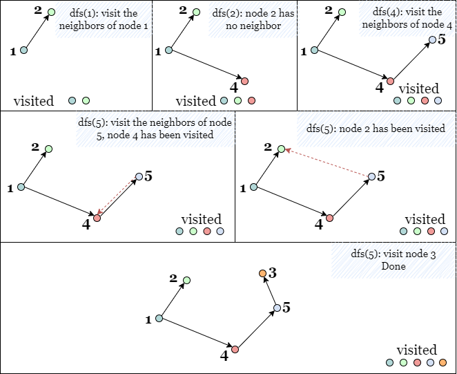
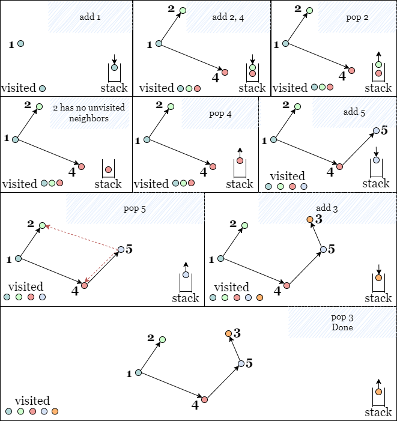
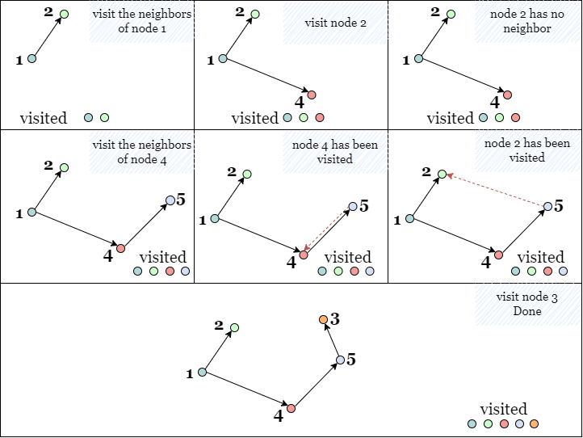

[TOC]

## Solution

---

### Overview

We can transform the map of bombs into a graph by representing each bomb `i` as a node `i` in the same location. The equivalent of bomb 1 detonating bomb 2 is a directed edge from node 1 to node 2.



To determine whether bomb 1 detonates bomb 2, we can compare the Euclidean distance between their centers and the radius of bomb 1. If the distance is less than or equal to the radius of bomb 1, then bomb 1 can detonate bomb 2. Note that this relationship is not commutative: **bomb 1 detonating bomb 2 does not necessarily imply the converse is also true**.



$\text{distance}^2 = (x_1 - x_2)^2 + (y_1 - y_2)^2$

Therefore, the original problem can be transformed into a graph traversal problem where we calculate the total number of reachable nodes from each node `i`.

Starting with building the graph, we need to traverse each pair of two distinct bombs `(i, j)` to check if bomb `i` detonates bomb `j`. If so, we create a directed edge from node `i` to node `j`. We consider all different pairs of nodes, and note that **two pairs of the same bombs in different orders are considered to be different**. In short, we consider both `(i, j)` and `(j, i)`.



Each of the following methods begins with the building process above.

---

### Approach 1: Depth-First Search, Recursive

#### Intuition

> If you are not familiar with depth-first (DFS) search, please refer to our explore cards [Depth-First Search Explore Card](https://leetcode.com/explore/learn/card/graph/619/depth-first-search-in-graph/). We will focus on the usage in this article and not the implementation details.

In DFS, we explore nodes as far as possible along each branch. Upon reaching the end of the current branch, we backtrack to the next possible branch and continue exploring. Once we encounter an unvisited node, we take one of its neighbor nodes (if it exists) as the next node on this branch. Recursively call the function to the next node and solve the subproblem. If we reach the end of this branch, we backtrack to the previous node and visit the next neighbor node (if it exists), and repeat the process.

We can use a hash set `visited` to keep track of all the visited nodes. Initially, `visited` is empty. When we find an unvisited neighbor node, we can add it to `visited` so it won't be visited anymore.

At the end of the DFS, we can return the size of `visited` as the number of visited nodes (detonated bombs).



We will perform the DFS from each node and update `answer` as the maximum number of reachable nodes starting from each node.

<br>

#### Algorithm

1) Initialize `answer` as 0.

2) Create hash map `graph` containing all directed edges corresponding to the detonation relationships between all bombs.

3) Create an empty hash set `visited`.

4) Define a recursive function `dfs(cur)` to recursively find all reachable nodes from node `cur`:

- Add `cur` to `visited`.

- Recursively call `dfs(neib)` on each unvisited neighbor of `cur`.

5) Repeat from step 3 for each node `i` and update `answer` as the maximum size of `visited` after each DFS.

6) Return `answer` when all DFS operations are complete.

#### Implementation

```python
class Solution:
    def maximumDetonation(self, bombs: List[List[int]]) -> int:
        graph = collections.defaultdict(list)
        n = len(bombs)

        # Build the graph
        for i in range(n):
            for j in range(n):
                if i == j:
                    continue
                xi, yi, ri = bombs[i]
                xj, yj, _ = bombs[j]

                # Create a path from node i to node j, if bomb i detonates bomb j.
                if ri ** 2 >= (xi - xj) ** 2 + (yi - yj) ** 2:
                    graph[i].append(j)

        # DFS to get the number of nodes reachable from a given node cur
        def dfs(cur, visited):
            visited.add(cur)
            for neib in graph[cur]:
                if neib not in visited:
                    dfs(neib, visited)
            return len(visited)

        answer = 0
        for i in range(n):
            visited = set()
            answer = max(answer, dfs(i, visited))

        return answer
```

#### Complexity Analysis

Let $n$ be the number of bombs, so there are $n$ nodes and at most $n^2$ edges in the equivalence graph.

* Time complexity: $O(n^3)$

- Building the graph takes $O(n^2)$ time.

- The time complexity of a typical DFS is $O(V + E)$ where $V$ represents the number of nodes, and $E$ represents the number of edges. More specifically, there are $n$ nodes and $n^2$ edges in this problem.

- Each node is only visited once, which takes $O(n)$ time.

- For each node, we may need to explore up to $n - 1$ edges to find all its neighbors. Since there are $n$ nodes, the total number of edges we explore is at most $n(n - 1) = O(n^2)$.

- We need to perform $n$ depth-first searches.

* Space complexity: $O(n^2)$

- The space complexity of DFS is $(n^2)$:

- There are $O(n^2)$ edges stored in `graph`.

- We need to maintain a hash set that contains at most $n$ visited nodes

- The call stack of `dfs` contains also takes $n$ space.

<br/>

---

### Approach 2: Depth-First Search, Iterative

#### Intuition

We can also implement DFS iteratively using a stack to replicate recursive self-calls to `dfs`. Since the operations on a stack are performed in First In, Last Out (FILO) order. Therefore, the top node on the stack always leads to the next branch: whenever we reach the end of the current branch, we can get the node on the top of the stack and move along the branch that starts from it.

A hash set `visited` is used to store all the visited nodes, so we don't need to take them into account. Once we add an unvisited node to the stack, we immediately add it to `visited` to prevent it from being revisited later.



Similarly, we will perform the DFS from each node `i`, and update `answer` as the maximum number of reachable nodes starting from each node.

<br>

#### Algorithm

1) Initialize `answer` as 0.

2) Create a hash map `graph` containing all directed edges corresponding to the detonation relationships between all bombs.

3) Define a function `dfs(i)` that iteratively finds all reachable nodes from node `i`.

- Initialize an empty stack `stack` and an empty hash set `visited`.

- Add `i` to `stack` and `visited`.

- While `stack` is not empty, pop up the top element `cur`.

- Check if `cur` has any unvisited neighbor nodes, and if so, add them to `visited` and `stack` and repeat the previous step.

- When the iteration is complete, return the size of `visited`.

4) Call `dfs` on every node `i` and update `answer` as the maximum size of `visited`.

5) Return `answer` when all DFS operations are complete.

#### Implementation

```python
class Solution:
    def maximumDetonation(self, bombs: List[List[int]]) -> int:
        graph = collections.defaultdict(list)
        n = len(bombs)

        # Build the graph
        for i in range(n):
            for j in range(n):
                xi, yi, ri = bombs[i]
                xj, yj, _ = bombs[j]

                # Create a path from i to j, if bomb i detonates bomb j.
                if ri ** 2 >= (xi - xj) ** 2 + (yi - yj) ** 2:
                    graph[i].append(j)

        def dfs(i):
            stack = [i]
            visited = set([i])
            while stack:
                cur = stack.pop()
                for neib in graph[cur]:
                    if neib not in visited:
                        visited.add(neib)
                        stack.append(neib)
            return len(visited)

        answer = 0
        for i in range(n):
            answer = max(answer, dfs(i))

        return answer
```

#### Complexity Analysis

Let $n$ be the number of bombs, so there are $n$ nodes and at most $n^2$ edges in the equivalence graph.

* Time complexity: $O(n^3)$

- The time complexity of a typical DFS is $O(V + E)$ where $V$ represents the number of nodes, and $E$ represents the number of edges. More specifically, there are $n$ nodes and $n^2$ edges in this problem.

- Building `graph` takes $O(n^2)$ time.

- For each node, we may need to explore up to $n - 1$ edges to find all its neighbors. Since there are $n$ nodes, the total number of edges we explore is at most $n(n - 1) = O(n^2)$.

- We need to perform $n$ breadth-first searches.

* Space complexity: $O(n^2)$

- We use a hash map to store all edges, which requires $O(n^2)$ space.

- We use a hash set `visited` to record all visited nodes, which takes $O(n)$ space.

- We use a stack `stack` to store all the nodes to be visited, and in the worst-case scenario, there may be $O(n)$ nodes in `stack`.

- To sum up, the space complexity is $O(n^2)$.

<br/>

---

### Approach 3: Breadth-First Search

#### Intuition

> If you are not familiar with breadth-first search, please refer to our explore cards [Breadth-First Search Explore Card](https://leetcode.com/explore/learn/card/graph/620/breadth-first-search-in-graph/). We will focus on the usage in this article and not the implementation details.

In BFS, we explore the nodes in the order of their depth. Assuming that the starting node has a depth of `0`, we will explore all nodes at the present depth (`d`) before moving on to all nodes at the next depth ($d + 1$).

Back to this problem, we start with node `i` with $depth = 0$, then we mark all its unvisited neighbor nodes with $depth = 1$ to be visited soon, once we visit a node with $depth = 1$, we mark all its unvisited neighbor nodes with $depth = 2$ as well.

We can use a queue as a container to store all nodes to be visited without mixing the order, and a hash set `visited` to store all visited nodes. When we enqueue a node, we immediately add it to `visited`, which prevents it from being enqueued again by other nodes later.

Once the BFS is complete, the number of visited nodes (denoted bombs) is the size of `visited`.



We will perform BFS from each node `i` and update `answer` as the maximum number of reachable nodes starting from each node.

<br>

#### Algorithm

1) Initialize `answer` as 0.

2) Create hash map `graph` containing all directed edges corresponding to the detonation relationships between all bombs.

3) Define a function `bfs(i)` that finds all the reachable nodes from node `i`.

- Initialize an empty queue `queue` and an empty hash set `visited`.

- Add `i` to both `queue` and `visited`.

- While the queue is not empty, dequeue the first node `cur`.

- Check if `cur` has any unvisited neighbor nodes, if so, enqueue them into `queue`, add them to `visited`, and repeat the previous step.

- Return the size of `visited` when the iteration is complete.

4) Call `bfs` on every node `i` and update `answer` as the maximum size of `visited` after each BFS.

5) Return `answer` when the all BFS operations are complete.

#### Implementation

```python
class Solution:
    def maximumDetonation(self, bombs: List[List[int]]) -> int:
        graph = collections.defaultdict(list)
        n = len(bombs)

        # Build the graph
        for i in range(n):
            for j in range(n):
                if i == j:
                    continue
                xi, yi, ri = bombs[i]
                xj, yj, _ = bombs[j]

                # Create a path from node i to node j, if bomb i detonates bomb j.
                if ri ** 2 >= (xi - xj) ** 2 + (yi - yj) ** 2:
                    graph[i].append(j)

        def bfs(i):
            queue = collections.deque([i])
            visited = set([i])
            while queue:
                cur = queue.popleft()
                for neib in graph[cur]:
                    if neib not in visited:
                        visited.add(neib)
                        queue.append(neib)
            return len(visited)

        answer = 0
        for i in range(n):
            answer = max(answer, bfs(i))

        return answer
```

#### Complexity Analysis

Let $n$ be the number of bombs.

* Time complexity: $O(n^3)$

- In a typical BFS search, the time complexity is $O(V + E)$ where $V$ is the number of nodes and $E$ is the number of edges. There are $n$ nodes and at most $n^2$ edges in this problem.

- Building `graph` takes $O(n^2)$ time.

- Each node is enqueued and dequeued once, it takes $O(n)$ to handle all nodes.

- For each node, we may need to explore up to $n - 1$ edges to find all its neighbors. Since there are $n$ nodes, the total number of edges we explore is at most $n(n - 1) = O(n^2)$.

- We need to perform $n$ breadth-first searches.

* Space complexity: $O(n^2)$

- There are at $O(n^2)$ edges stored in `graph`.

- `queue` can store up to $n$ nodes.

<br/>